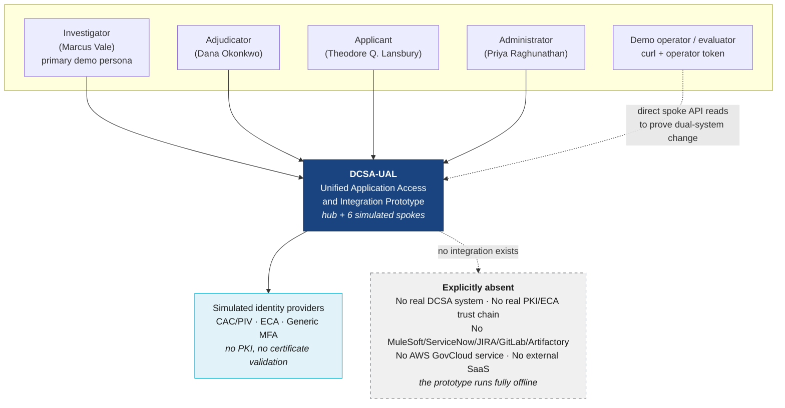
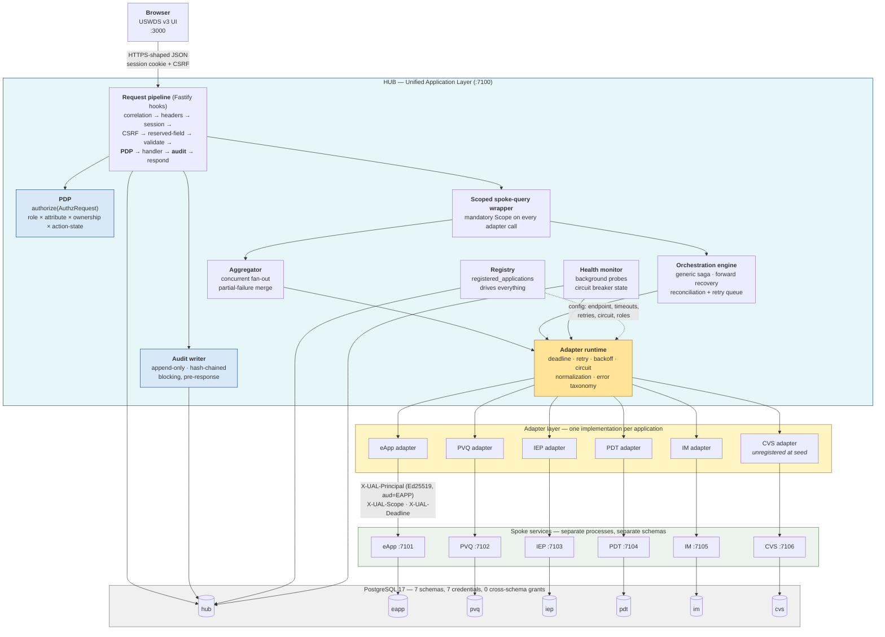
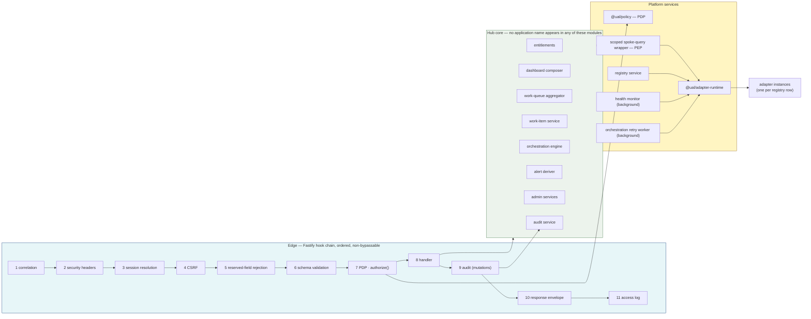
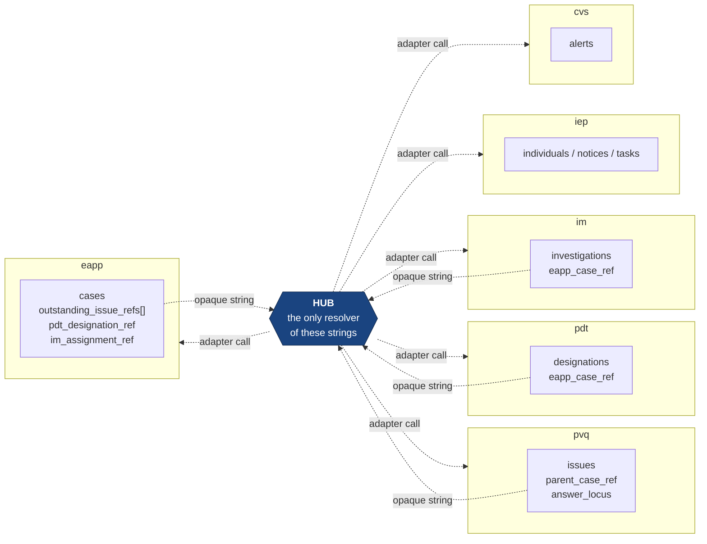
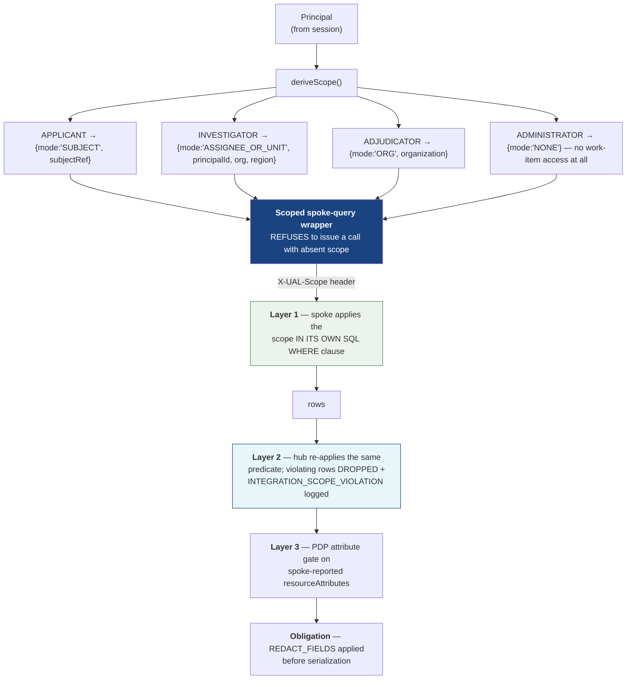
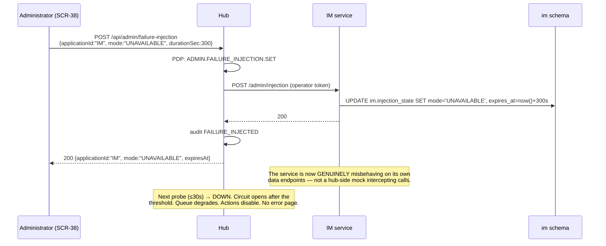
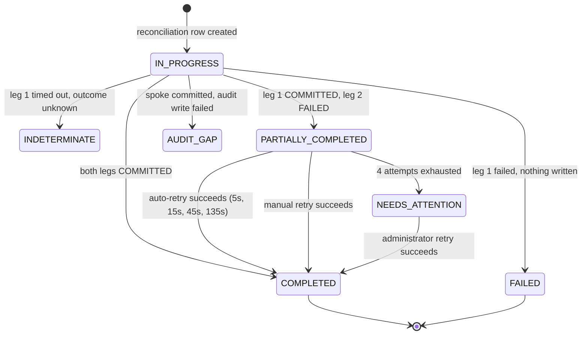
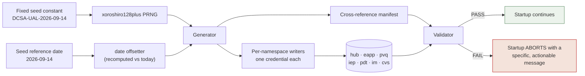
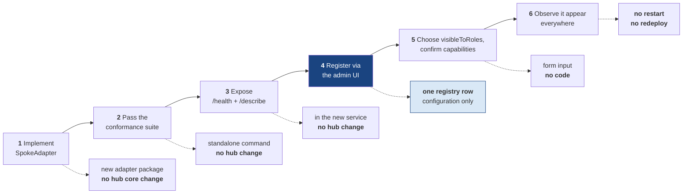

# Technical Architecture — DCSA Unified Application Access and Integration Prototype

**Project Acronym:** DCSA-UAL
**Document Type:** Technical Architecture (TechArch)
**Status:** Draft v1.0
**Date:** 2026-09-14
**Derived From:** `project_specs/PRD-DCSA-UAL.md`, `project_specs/FRD-DCSA-UAL.md` (chunks `00-header`, `F01`–`F19`, `Y0a`, `Y0b`, `Y1a`, `Y1b`, `Y2`, `Y3`), `.planning/PROJECT.md`

> **DEMO — SYNTHETIC DATA ONLY.** This document specifies a demonstration prototype. No real DCSA data, no real PII, no connection to any real government system. Authentication is simulated; no certificate is parsed or validated.

---

## 0.1 Purpose and Authority of This Document

The PRD says *what* to build and *why*. The FRD says *how it must behave*, field by field, message by message. This document says *how it is constructed*: the runtime topology, the technology selections with versions, the physical schema and its isolation guarantees, the adapter seam, the security decision points, the resilience machinery, the frontend architecture, and the single command that makes all of it run on an evaluator's laptop.

**This document is authoritative for:** technology and version selection, process and container topology, port assignments, physical schema and grants, module boundaries, the adapter TypeScript contract, middleware ordering, state management, build and run tooling, and test tooling.

**The FRD remains authoritative for:** behavior, user-facing copy, validation rules, error codes, acceptance criteria, and requirement IDs. Where this document appears to contradict the FRD, the FRD wins — except in the two places where a deviation is recorded explicitly as an Architecture Decision Record (§16, ADR-012 frame headers and ADR-013 web UI port). Those two deviations are deliberate, bounded, and justified by demo-environment constraints.

**Consumers:** implementation planners and engineers. Every section is written to be built from without a follow-up conversation.

---

## 0.2 The Architectural Mandate

One sentence, because everything else in this document derives from it:

> **The hub owns identity, navigation, aggregation, orchestration, authorization, and audit. Five separate spoke services own their own data in their own namespaces and are reachable only through a per-spoke adapter implementing one common interface. The adapter seam is the deliverable.**

Four non-negotiable structural properties follow, and each one is enforced by a mechanism rather than by convention:

| # | Property | Enforcement mechanism | Requirement |
|---|---|---|---|
| 1 | **No shared tables between spokes.** Seven PostgreSQL schemas, seven database roles, no cross-schema `GRANT`, no cross-schema foreign key. | Database grants + schema-introspection test asserting every FK's referenced table is in the same schema | `Y0b` checklist, `FR-F19-03` item 8 |
| 2 | **No direct cross-spoke access.** A spoke never calls another spoke and never calls the hub. Cross-system references are opaque strings resolved only by the hub. | Compose network policy + `FR-F19-03` item 8 traffic assertion + column inspection (no FK on `subject_ref`, `parent_case_ref`, `eapp_case_ref`) | `FR-F09-01`, `Y3 §3` |
| 3 | **No hard-coded application list in hub core.** Navigation, fan-out, search, health, and admin inventory all read `hub.registered_applications`. | CI grep for the literals `EAPP`, `IEP`, `PVQ`, `PDT`, `IM` in hub core source outside seed, tests, and adapter packages | `FR-F08b-02` rule 1 |
| 4 | **No path from hub to spoke except an adapter.** Hub core imports the `SpokeAdapter` interface, never an HTTP client aimed at a spoke. | Static check: zero `fetch`/`undici` call sites targeting a spoke base endpoint outside `packages/adapter-*` | `FR-F08a-01` AC-2 |

If a reviewer suspects any of these four is cosmetic, the demonstration loses its argument. They are therefore all mechanically verified in CI, not asserted in prose (§12).

---

## 0.3 System Context



**Offline by construction.** There is no outbound network dependency at runtime. Fonts, USWDS assets, icons, and images are vendored into the image at build time. This is a deliverability requirement, not a preference: a demo that needs a CDN fails in the room where it matters (`NFR-18`, `FR-F18-01`).

---

## 0.4 Container Diagram



**Read the diagram for what it prohibits, not only what it permits.** There is no arrow from any spoke to any other spoke. There is no arrow from a spoke to the hub. There is no arrow from the browser to a spoke. There is no arrow from `hub` schema to any spoke schema. Those absences are the architecture.

---

## 0.5 Deployment Topology and Port Map

Nine containers, one Docker Compose project, one network, one command.

| # | Container | Image / build | Host port | Internal port | Depends on | Purpose |
|---|---|---|---|---|---|---|
| 1 | `ual-db` | `postgres:17.2-alpine` | 7199 | 5432 | — | All seven schemas, seven roles |
| 2 | `ual-migrate` | built (`@ual/migrate`) | — | — | `ual-db` healthy | Applies DDL + grants, then exits 0 |
| 3 | `ual-seed` | built (`@ual/seed`) | — | — | `ual-migrate` exit 0 | Deterministic seed + validation, then exits 0 |
| 4 | `ual-eapp` | built (`@ual/spoke-eapp`) | 7101 | 7101 | `ual-seed` exit 0 | eApp service, `eapp` schema |
| 5 | `ual-pvq` | built (`@ual/spoke-pvq`) | 7102 | 7102 | `ual-seed` exit 0 | PVQ service, `pvq` schema |
| 6 | `ual-iep` | built (`@ual/spoke-iep`) | 7103 | 7103 | `ual-seed` exit 0 | IEP service, `iep` schema |
| 7 | `ual-pdt` | built (`@ual/spoke-pdt`) | 7104 | 7104 | `ual-seed` exit 0 | PDT service, `pdt` schema |
| 8 | `ual-im` | built (`@ual/spoke-im`) | 7105 | 7105 | `ual-seed` exit 0 | IM service, `im` schema |
| 9 | `ual-cvs` | built (`@ual/spoke-cvs`) | 7106 | 7106 | `ual-seed` exit 0 | **Sixth app: running, unregistered** |
| 10 | `ual-hub` | built (`@ual/hub`) | 7100 | 7100 | `ual-seed` exit 0 | Hub BFF; does **not** wait on spoke health |
| 11 | `ual-web` | built (`@ual/web`) | **3000** | 3000 | `ual-hub` healthy | Next.js UI, bound `0.0.0.0` |

**Rules that make the topology honest:**

1. **Spoke ports are published to the host.** An evaluator must be able to `curl http://localhost:7102/issues/ISS-2207` and see PVQ's own answer. That direct-read capability is how `SM-03` — "both systems actually changed" — is proved rather than asserted (`FR-F09-08`, `FR-F18-05` step 12). Spoke data endpoints still require a signed principal assertion or a short-lived operator token; publishing the port does not publish the data.
2. **The hub starts even when every spoke is down.** `ual-hub` depends only on the seed job. A spoke that fails to start registers as `DOWN` and the product enters exactly the degraded mode it was designed for (`FR-F18-01` rule 3, `FR-F08b-06` AC-2).
3. **Each spoke is independently stoppable.** `docker compose stop ual-im` is a real outage, not a simulation of one (`FR-F18-02`).
4. **One database container, seven credentials.** See §3 of the data-model chunk for why this is isolation rather than a shortcut.
5. **All ports come from one `.env` file.** A port clash is resolved without editing code (`FR-F18-01` rule 6).

### 0.5.1 Port deviation from `Y1b`

`Y1b` assigns the web UI port **7000**. This document assigns **3000**. The demo is presented through an embedded preview harness that expects a conventional development port, and the Next.js dev server must bind `0.0.0.0:3000` deterministically for that harness to reach it. Every other port in `Y1b` is adopted unchanged. Recorded as **ADR-013**.

### 0.5.2 Environment file (`.env`, checked in with demo-safe values)

```dotenv
# Ports — the only place ports are defined
UAL_WEB_PORT=3000
UAL_HUB_PORT=7100
UAL_EAPP_PORT=7101
UAL_PVQ_PORT=7102
UAL_IEP_PORT=7103
UAL_PDT_PORT=7104
UAL_IM_PORT=7105
UAL_CVS_PORT=7106
UAL_DB_PORT=7199

# Binding — must be 0.0.0.0 so the preview harness can reach the UI
UAL_BIND_HOST=0.0.0.0

# Deterministic demo values. Not secrets: this environment holds no real data.
UAL_SEED_CONSTANT=DCSA-UAL-2026-09-14
UAL_SEED_REFERENCE_DATE=2026-09-14
UAL_SESSION_COOKIE_SECRET=demo-only-session-secret-change-for-any-real-use
UAL_ASSERTION_KEY_SEED=demo-only-ed25519-seed-change-for-any-real-use
UAL_DEMO_OTP=482913           # deterministic generic-MFA code (FR-F00-04)

# Session policy
UAL_SESSION_IDLE_MINUTES=30
UAL_SESSION_ABSOLUTE_HOURS=8

# Postgres
POSTGRES_DB=ual
POSTGRES_USER=ual_owner
POSTGRES_PASSWORD=demo-only-password
```

---

## 0.6 Repository Layout

A single npm-workspaces monorepo. One `npm install` at the root resolves every package; one lockfile pins every transitive dependency.

```
dcsa-ual/
├─ .env                         # every port and demo constant (§5.2)
├─ compose.yaml                 # the nine containers
├─ run.sh                       # the single documented command (§13)
├─ package.json                 # npm workspaces root
├─ package-lock.json            # committed; the determinism guarantee
├─ tsconfig.base.json           # strict: true, noUncheckedIndexedAccess: true
├─ eslint.config.js             # flat config, incl. the no-spoke-name rule
├─ stylelint.config.cjs         # the no-hard-coded-visual-values rule (NFR-03)
├─ apps/
│  ├─ web/                      # @ual/web        — Next.js 15 UI          :3000
│  └─ hub/                      # @ual/hub        — Fastify BFF            :7100
├─ services/
│  ├─ eapp/  pvq/  iep/  pdt/  im/  cvs/          # six Fastify spokes  :7101–7106
├─ packages/
│  ├─ contracts/                # @ual/contracts  — TypeBox schemas: the single
│  │                            #   source of TS types, ajv validators, OpenAPI
│  ├─ adapter-contract/         # @ual/adapter-contract — SpokeAdapter interface
│  ├─ adapter-runtime/          # deadline, retry, backoff, circuit, error taxonomy
│  ├─ adapter-rest-json-v1/     # the one adapterType all six spokes use
│  ├─ policy/                   # PDP: authorize(), scope derivation, rule engine
│  ├─ audit/                    # append-only writer, hash chain, interceptor
│  ├─ orchestration/            # generic saga engine + retry worker
│  ├─ spoke-kit/                # shared spoke server: assertion verify, scope,
│  │                            #   idempotency, injection, /health, /describe
│  ├─ db/                       # pg pool factory, per-role credentials, SQL helpers
│  ├─ migrate/                  # numbered .sql runner
│  ├─ seed/                     # deterministic generator + validator
│  ├─ conformance/              # standalone adapter conformance suite
│  └─ theme/                    # USWDS settings + compiled stylesheet + tokens
├─ tests/
│  ├─ e2e/                      # Playwright: flagship, RBAC, degraded, registration
│  └─ a11y/                     # axe-core sweep over every route × every role
└─ docs/
   ├─ README.md                 # FR-F18-04
   ├─ DEMO-SCRIPTS.md           # FR-F18-05, FR-F18-06
   ├─ SEED-DATA.md              # FR-F17-09
   └─ ONBOARDING-A-NEW-APP.md   # FR-F12 / §17 extensibility walkthrough
```

**Why `packages/contracts` exists.** Request schemas, response schemas, TypeScript types, runtime validators, and the published OpenAPI document are all generated from one TypeBox declaration per endpoint. Hand-maintaining any two of those five guarantees they diverge, and `FR-F10-06` rule 1 forbids hand-maintained documentation for exactly that reason.

---

## 0.7 Chunk Map for This Document

| Chunk | Contents | Mandate item |
|---|---|---|
| `00-overview.md` | This chunk: mandate, context and container diagrams, topology, ports, repo layout | 1 |
| `01-components.md` | Hub component architecture, spoke service template, module boundaries | — |
| `02-tech-stack.md` | Every technology with version and rationale; the four hard constraints | 2 |
| `03-data-model-hub.md` | Complete hub DDL, grants, indexes | 3 |
| `04-data-model-spokes.md` | Complete per-spoke DDL, isolation proof | 3 |
| `05-adapter-seam.md` | `SpokeAdapter` TypeScript interface, PVQ implementation sketch, registry record | 4 |
| `06-api-hub-bff.md` | Hub BFF endpoints with TypeScript request/response interfaces | 5 |
| `07-api-spokes.md` | Spoke mock API surfaces and the common spoke contract | 5 |
| `08-security.md` | AuthN/AuthZ, PDP/PEP placement, SSO propagation, applicant data scoping, zero trust | 6, 14 |
| `09-audit.md` | Append-only store, structural write-on-mutation guarantee, hash chain | 7 |
| `10-resilience.md` | Probes, circuit breaker, timeouts, degraded contract, partial-failure aggregation, injection | 8 |
| `11-orchestration.md` | The distributed write: saga, forward recovery, reconciliation, partial-failure UX | 9 |
| `12-frontend.md` | Routing, state, USWDS tokens, accessibility architecture, uniform state pattern | 10 |
| `13-seeding.md` | Idempotent deterministic seed and validator | 11 |
| `14-testing.md` | Unit, integration, conformance, E2E, axe, RBAC negative paths | 12 |
| `15-deployment.md` | One command, ports, health endpoints, how an evaluator drives the demo | 13 |
| `16-adrs.md` | Architecture Decision Records ADR-001 … ADR-016 | 15 |
| `17-extensibility.md` | Onboarding the sixth application, step by step | 16 |

---
## 1. Component Architecture

This chunk decomposes the hub and the spokes into modules with stated responsibilities, stated dependencies, and — importantly — stated prohibitions. A module's prohibitions are what keep the architecture from eroding under schedule pressure.

---

### 1.1 Hub Component Map



---

### 1.2 Hub Modules

| Module | Package / path | Responsibility | Depends on | **Must not** |
|---|---|---|---|---|
| **Edge pipeline** | `apps/hub/src/pipeline/` | The eleven ordered hooks of `FR-F10-01`. Registered once as a Fastify plugin at the root scope so no route can opt out. | policy, audit, contracts | Allow a route to skip a hook; reorder hooks per route |
| **Session service** | `apps/hub/src/session/` | Issue, resolve, extend, terminate `hub.sessions`. Rebuilds the `Principal` from the database on **every** request. | db | Cache a principal across requests; store roles in the cookie |
| **PDP** | `packages/policy/` | `authorize(req: AuthzRequest): Decision`. The single allow/deny function. Loads the role matrix and attribute rules from `hub.role_permissions` / `hub.attribute_rules`. | db | Contain an `if (role === 'ADMINISTRATOR')` branch; be called from anywhere except the pipeline and the action-list computer |
| **Scoped spoke-query wrapper (PEP)** | `apps/hub/src/spoke-gateway/` | The **only** function in the hub that may invoke an adapter. Derives a mandatory `Scope` from the principal, attaches it, re-applies the ownership predicate to the result, and reports scope violations. | policy, adapter-runtime, registry | Issue an adapter call with an absent `Scope`; return unfiltered rows |
| **Registry service** | `apps/hub/src/registry/` | CRUD over `hub.registered_applications`, `registryVersion` bump, startup validation, adapter instantiation by `adapterType`. | db, adapter-rest-json-v1 | Hold a hard-coded application list; special-case `CVS` |
| **Work-queue aggregator** | `apps/hub/src/queue/` | Concurrent fan-out over registry rows visible to the active role; merge, normalize-validate, sort, filter, paginate; emit `sourceStatus[]`. | spoke-gateway, registry | Fail the whole request because one source failed |
| **Work-item service** | `apps/hub/src/work-item/` | Detail, server-computed `ActionDescriptor[]`, related-ref resolution, merged activity history. | spoke-gateway, policy, audit | Trust the spoke's `availableActions` as an authorization decision |
| **Orchestration engine** | `packages/orchestration/` | Generic saga executor driven by `hub.orchestration_definitions`. Reconciliation rows, forward recovery, retry enqueue. | spoke-gateway, audit, db | Reference `PVQ` or `EAPP` by name (`FR-F07b-07` AC-2) |
| **Audit service** | `packages/audit/` | Append-only writer, hash chain, closed action vocabulary, chain and integrity queries. | db | Expose an update or delete path |
| **Health monitor** | `apps/hub/src/health/` | Background probe loop per enabled registry row; circuit state machine; `application_health` upsert; issue rows on transition. | adapter-runtime, registry, db | Block a user request; be blocked by an open circuit |
| **Retry worker** | `packages/orchestration/worker.ts` | Drains `hub.orchestration_retry_queue` on the configured backoff schedule. | spoke-gateway, audit | Replay a mutation the user did not authorize |
| **Alert deriver** | `apps/hub/src/notifications/` | Computes alerts from aggregated spoke data at read time. Persists only read state. | queue | Store a derived alert (`Y0a` note 5) |
| **Admin services** | `apps/hub/src/admin/` | Applications, health, integration issues, users, announcements, failure injection, status, reset. | registry, health, db | Exempt an administrator from authorization or audit |
| **Adapter runtime** | `packages/adapter-runtime/` | Deadline enforcement, retry/backoff policy, circuit breaker, `AdapterError` taxonomy, integration-issue emission, structured adapter logs. | db (issues), registry (config) | Retry a mutating call after a timeout (`FR-F08a-05` rule 1) |

---

### 1.3 Two Structural Choke Points

The design concentrates its guarantees at exactly two places. Everything else is ordinary application code.

**Choke point 1 — the edge pipeline** is where *authorize* and *audit* happen. It is registered on the root Fastify instance, before any route plugin:

```ts
// apps/hub/src/server.ts — the only place these are wired
const app = Fastify({ genReqId: () => ulid(), logger: pinoConfig });

await app.register(correlationHook);        // 1
await app.register(securityHeadersHook);    // 2  (see ADR-012 on frame headers)
await app.register(sessionHook);            // 3
await app.register(csrfHook);               // 4
await app.register(reservedFieldHook);      // 5
// 6 schema validation is Fastify-native, driven by the TypeBox schema on each route
await app.register(authorizationHook);      // 7  → packages/policy
// 8 handler
await app.register(auditHook);              // 9  → packages/audit (onSend, mutations)
await app.register(envelopeHook);           // 10
await app.register(accessLogHook);          // 11

await app.register(routes, { prefix: '/api' });
```

Fastify's plugin encapsulation makes this enforceable: hooks registered at the root scope run for every route in every child plugin, and a child plugin cannot remove a parent hook. A route declared without an `action` string, request schema, or response schema fails the boot-time contract check and the process exits non-zero (`FR-F10-01` validation rule). Starting is not permitted with a route that could bypass the PDP.

**Choke point 2 — the scoped spoke-query wrapper** is where *data isolation* happens. It is the single call site for every adapter operation:

```ts
// apps/hub/src/spoke-gateway/gateway.ts
export async function callSpoke<Op extends AdapterOperation>(
  principal: Principal,
  applicationId: string,
  operation: Op,
  args: AdapterArgs<Op>,
  ctx: RequestContext,
): Promise<AdapterResult<Op>> {
  const scope = deriveScope(principal);                 // FR-F02-04 rule 1
  if (!scope) throw new InternalError('SCOPE_ABSENT');  // fail closed, never permissive
  const adapter = registry.instanceFor(applicationId);  // throws if disabled/unregistered
  const result = await adapterRuntime.invoke(adapter, operation, args, {
    principal, scope, correlationId: ctx.correlationId, requestId: ulid(),
    deadlineAt: ctx.deadlineFor(applicationId, operation),
    idempotencyKey: isMutating(operation) ? args.idempotencyKey : undefined,
  });
  return enforceScopeOnResult(scope, applicationId, result, ctx); // defense in depth
}
```

Hub core modules import `callSpoke`. They do not import adapters, and they do not import an HTTP client. An ESLint `no-restricted-imports` rule enforces this: `packages/adapter-*` may only be imported by `apps/hub/src/registry/` and `packages/adapter-runtime/`.

---

### 1.4 Spoke Service Template

Every spoke is the same Fastify application with a different domain module. The shared parts live in `@ual/spoke-kit`, so "a spoke behaves correctly" is one implementation verified once, not six implementations verified six times.

```
services/<spoke>/
├─ src/
│  ├─ server.ts            # 15 lines: create kit server, register domain routes
│  ├─ domain/              # the only spoke-specific code
│  │  ├─ repository.ts     # SQL against this spoke's schema, with the supplied scope
│  │  ├─ actions.ts        # state machine: which action is valid from which state
│  │  └─ mapping.ts        # native → API shapes; statusMap lives in describe()
│  ├─ describe.ts          # the capability declaration (FR-F08a-02)
│  └─ sql/                 # this spoke's queries
```

`@ual/spoke-kit` supplies, identically for all six services:

| Concern | Behavior | Requirement |
|---|---|---|
| Principal assertion verification | Ed25519 signature check, `aud === self`, `exp > now`. Reject → `401 PRINCIPAL_REJECTED`. | `FR-F01-02` rule 6 |
| Scope enforcement | `X-UAL-Scope` parsed and **required** on reads; absent → `400 SCOPE_REQUIRED`. The scope is converted into SQL predicates by the repository, not applied post-fetch. | `FR-F09-07` rule 2 |
| Deadline | `X-UAL-Deadline` bound to an `AbortController`; the request aborts at the deadline. | `FR-F08a-05` rule 7 |
| Idempotency | `X-UAL-Idempotency-Key` recorded in `<ns>.idempotency_records` with a request hash; replay returns the stored response; same key + different payload → `409 IDEMPOTENCY_KEY_REUSED`. 24-hour retention. | `FR-F09-07` rule 3 |
| `stateVersion` | Recomputed as a content hash of user-visible fields on every write. | `FR-F09-07` rule 4 |
| Own activity history | Every mutation inserts a row in this spoke's own `*_activity` table, independent of hub audit. | `FR-F09-07` rule 5 |
| `/health` | **No assertion required** — a spoke with a broken auth path must still be probeable. Reports injected state honestly. | `FR-F09-07` rule 6 |
| `/describe` | Static capability metadata, no assertion required. | `FR-F08a-02` |
| Failure injection | `/admin/injection` guarded by operator token; `NORMAL`/`UNAVAILABLE`/`SLOW`/`ERROR` with auto-expiry. | `FR-F16-11` |
| Correlation echo | `X-UAL-Correlation-Id` echoed on the response and stored in the activity row. | `Y3 §5` |
| Synthetic markers | `_synthetic: true` on every body; `syntheticMarker` on every record. | `FR-F17-08` |
| Error shape | `{ code, message, detail }` from the closed common set in `Y1b`. | `Y1b` |

**Prohibitions, enforced by the kit and by test:** a spoke has no outbound HTTP client at all. `@ual/spoke-kit` does not export one, the spoke packages do not depend on `undici` or any HTTP client, and `FR-F19-03` item 8 asserts zero spoke-to-spoke traffic during the test run. A spoke cannot call another spoke because it has nothing to call with.

---

### 1.5 Frontend Component Layers

| Layer | Path | Responsibility | Must not |
|---|---|---|---|
| Shell | `apps/web/app/(shell)/layout.tsx` | Demo banner, USWDS government banner, header, primary nav, breadcrumb, `<main>`, footer, skip link. Server-rendered. | Render conditionally on any flag |
| Route segments | `apps/web/app/(shell)/**/page.tsx` | One segment per `SCR-nn`. Server component fetches; client component interacts. | Invent a route not in the screen inventory |
| Page templates | `apps/web/components/templates/` | The four permitted layouts: `ListPage`, `DetailPage`, `FormPage`, `ConsolePage`. Each defines loading / empty / error / degraded presentations. | Let a screen hand-roll its own layout |
| USWDS primitives | `apps/web/components/uswds/` | Thin typed wrappers over USWDS markup — `Button`, `Table`, `Alert`, `SiteAlert`, `Pagination`, `Modal`, `ErrorSummary`, `Tag`, `Breadcrumb`. | Introduce a component USWDS already provides |
| Domain components | `apps/web/components/domain/` | `WorkItemTable`, `RelatedItemsPanel`, `ActionPanel`, `DualSystemResultTable`, `HealthTable`, `AuditChain`. Composed from USWDS primitives only. | Contain a visual literal |
| Data layer | `apps/web/lib/api/` | Typed client generated from `@ual/contracts`; TanStack Query hooks; polling for `registry-version` and `health/summary`. | Hold authorization logic |
| Session context | `apps/web/lib/session/` | `Principal` + `entitlements` from the server, refreshed on role switch and registry change. | Be treated as a security boundary |

**The one-sentence rule the frontend lives by:** the client renders what the server says it may see, and the server independently re-decides on every request. Hiding a control is a courtesy to the user, never a control (`FR-F02-06` rule 4).

---

### 1.6 Cross-Cutting Concerns and Where They Live

| Concern | Single implementation | Applied by |
|---|---|---|
| Correlation ID | `packages/contracts/correlation.ts` | Pipeline hook 1; propagated into every adapter header, audit row, issue row, error envelope |
| Authorization | `packages/policy` | Pipeline hook 7; plus action-list computation in the work-item service |
| Data scoping | `deriveScope()` + `enforceScopeOnResult()` | `spoke-gateway` only |
| Audit | `packages/audit` | Pipeline hook 9 (`onSend`, mutations) — see chunk 09 for why this is structural |
| Error envelope | `packages/contracts/errors.ts` + `Y2` catalog | Pipeline hook 10; validated against the catalog at boot |
| Resilience policy | `packages/adapter-runtime` | Every adapter invocation; configured per registry row |
| Validation | TypeBox schemas in `@ual/contracts` | Fastify (server) and react-hook-form (client) — the same schema object |
| Theming | `packages/theme/_uswds-theme.scss` | Compiled once; the only file containing a color value |

Seven of these eight have exactly one implementation site. That is the point: each guarantee this prototype makes is a single function that a test can call, not a discipline that a reviewer must trust.

---
## 2. Technology Stack

Every selection below is pinned to a specific version, carries one line of rationale, and was filtered through four hard constraints stated first. Where a popular alternative was rejected, the rejection is recorded in an ADR (chunk 16) rather than left implicit.

---

### 2.1 The Four Hard Constraints

| # | Constraint | What it eliminates | What it forces |
|---|---|---|---|
| **C1** | **USWDS v3 must be consumed cleanly**, components and design tokens, with theming by token override only (`FR-F14-01`, `NFR-03`). | Any framework whose styling model fights Sass — CSS-in-JS, utility-first frameworks with their own scale (Tailwind), and component libraries that duplicate USWDS (MUI, Chakra, Ant). | A Sass build pipeline using `@uswds/compile`, and a component layer that is a thin wrapper over USWDS markup rather than a parallel design system. |
| **C2** | **One documented command builds and runs everything** on an evaluator's machine (`FR-F18-01`, `NFR-18`). | Multi-repo layouts, per-service manual bootstrapping, cloud-only dependencies, anything requiring a managed database. | Docker Compose with a single `run.sh up`, a single npm workspaces lockfile, and a containerized Postgres. |
| **C3** | **Offline / air-gapped-ish.** No external SaaS, no CDN, no license server, no telemetry endpoint at runtime (`Y3 §1`, PRD §9). | Auth0/Okta/Cognito, hosted Postgres, Sentry/Datadog, Google Fonts, CDN-hosted USWDS assets, any AI/API service. | Vendored fonts and assets, a local simulated IdP, file/stdout logging, and a `postinstall` that touches nothing on the network at run time. |
| **C4** | **Boring and deterministic.** A demo that behaves differently on the third run is worse than one that is plain (`SM-22`, `FR-F19-10`). | Bleeding-edge releases, alpha/canary/RC versions, packages with fewer than two stable years, anything with nondeterministic ordering. | Exact-version pins, a committed lockfile, a fixed seed constant, and a fixed seed reference date. |

---

### 2.2 Runtime and Language

| Layer | Selection | Version | Rationale |
|---|---|---|---|
| Runtime | Node.js LTS | `22.11.0` (pinned in `.nvmrc` and `node:22.11-bookworm-slim`) | Active LTS through 2027; native `fetch` with `AbortSignal.timeout` gives adapter deadlines without an HTTP-client dependency; one runtime for hub, spokes, UI, and tests. |
| Language | TypeScript | `5.6.3` | `strict`, `noUncheckedIndexedAccess`, and `exactOptionalPropertyTypes` on. The adapter contract is the primary deliverable; it must be a compiler-checked interface, not documentation. |
| Package manager | npm workspaces | npm `10.9.x` (bundled with Node 22) | Already present with Node — no extra tool for an evaluator to install (C2). One `package-lock.json` is the determinism guarantee (C4). |
| Build | `tsc` (services) + `next build` (UI) | — | No bundler for server code. Fewer moving parts, readable stack traces, faster to diagnose at 9:58 before a 10:00 demo. |
| Process orchestration (non-Docker fallback) | `concurrently` | `9.1.0` | `npm run dev:all` for engineers who prefer not to containerize; Compose remains the documented path. |

---

### 2.3 Frontend

| Layer | Selection | Version | Rationale |
|---|---|---|---|
| Framework | **Next.js (App Router)** | `15.1.3` | Server-rendered shell is required: the demo banner must be in the initial document with no state path to hide it (`FR-F03-03` rule 1), page titles must be server-set and unique, and route-level `error.tsx`/`not-found.tsx` map exactly onto SCR-32/SCR-31. Version **≥ 15** is mandatory because we use `next.config.ts` — see §2.9. |
| UI library | React | `19.0.0` | Stable pairing with Next 15.1; Server Components let the shell render without shipping session logic to the browser. |
| Design system | **`@uswds/uswds`** | `3.11.0` | The federal standard and a hard requirement. Adopted wholesale: no bespoke component library (`FR-F14-01` rule 1). |
| USWDS build | `@uswds/compile` | `1.2.1` | Official Sass pipeline. Compiles `packages/theme/_uswds-theme.scss` (token overrides only) plus USWDS sources into one stylesheet, and copies fonts/images into `apps/web/public/assets` — so nothing is fetched from a CDN (C3). |
| Sass | `sass` (dart-sass) | `1.83.0` | Required by `@uswds/compile`; the only CSS preprocessor in the stack. |
| Server state | **TanStack Query** | `5.62.x` | Nearly all client state is server state. Gives per-widget loading/error states (`FR-F16-06` granularity), 30-second polling for `registry-version` and `health/summary`, refetch-on-focus, and cache invalidation after a mutation — all behaviors the FRD requires and that a hand-rolled fetcher gets subtly wrong. |
| Client state | React Context + **URL search params** | — | Queue filters, sort, and page live in the URL. That makes "return to queue with your filters, sort, and page intact" (`FR-F05-01`, `FR-F06-01`) a property of the address bar rather than a synchronization problem. No Redux — see ADR-006. |
| Forms | `react-hook-form` | `7.54.x` | Field-level validation with programmatic `setFocus`, which is how `FR-F14-03` rule 5 ("focus moves to the error summary, summary links focus their fields") is implemented rather than approximated. |
| Validation | `@sinclair/typebox` + `ajv` | `0.34.x` / `8.17.x` | The **same schema object** validates on the client and on the server, satisfying `FR-F14-03` rule 9 ("client validation never blocks a submission the server would accept") structurally instead of by review. |
| Icons | USWDS sprite (`@uswds/uswds`) | 3.11.0 | Vendored SVG sprite; no icon package, no network fetch. |
| Typography | Public Sans, self-hosted | shipped with USWDS 3.11 | Required by the assumed theme; self-hosting is a C3 requirement. |

---

### 2.4 Hub and Spoke Services

| Layer | Selection | Version | Rationale |
|---|---|---|---|
| HTTP framework | **Fastify** | `5.2.0` | Chosen over Express for three specific reasons: (a) its hook lifecycle gives a genuinely ordered, non-bypassable pipeline matching `FR-F10-01`'s eleven steps; (b) plugin encapsulation means a child route cannot drop a parent hook, which is how "every endpoint invokes the PDP" becomes structural; (c) route schemas are JSON Schema, so OpenAPI is *generated from the implementation* as `FR-F10-06` rule 1 demands. See ADR-003. |
| Schema / types | `@sinclair/typebox` | `0.34.x` | One declaration yields the TS type, the ajv validator, and the OpenAPI schema. Three artifacts that must agree, derived from one source. |
| OpenAPI | `@fastify/swagger` + `@fastify/swagger-ui` | `9.4.x` / `5.2.x` | Serves `/api/docs` and `/api/docs/openapi.json`, and writes the spec to a file at build time for the repository (`FR-F10-06` rule 2). |
| Cookies / CSRF | `@fastify/cookie`, `@fastify/csrf-protection` | `11.0.x` / `7.0.x` | Signed `HttpOnly` session cookie carrying only a `sessionId`; double-submit CSRF token as a separate readable cookie plus `X-CSRF-Token` header (`FR-F01-01` rules 2 and 4). |
| Rate limiting | `@fastify/rate-limit` | `10.2.x` | Demo-grade, per-session and per-IP limits from `FR-F10-07`, set generously enough that no scripted demo path can trip them. |
| Principal assertion | **`jose`** (EdDSA / Ed25519 JWT) | `5.9.x` | Zero-dependency, standards-based, works offline. The `aud` claim maps directly onto `FR-F01-02`'s audience binding, so "replaying a PVQ assertion at eApp is rejected" is a library guarantee rather than custom crypto. |
| IDs | `ulid` | `2.3.0` | ULIDs are lexicographically sortable and match the `^[0-9A-HJKMNP-TV-Z]{26}$` validation the FRD already specifies for correlation IDs. |
| Logging | `pino` | `9.5.x` | Structured JSON with declarative `redact` paths, which is how `FR-F08b-05` rule 4 ("logs never contain the assertion, cookie, one-time codes, or action payloads") is enforced at the logger rather than at each call site. |
| HTTP client (adapters only) | Node 22 built-in `fetch` | — | Native `AbortSignal.timeout()` implements the absolute deadline; no dependency; available only inside `packages/adapter-*`. |
| Circuit breaker | **hand-written**, `packages/adapter-runtime/circuit.ts` | ~140 lines | Rejected `opossum`: the required semantics are unusual — health probes must *bypass* the open circuit (`FR-F08a-05` rule 5), `performAction` timeouts must *never* auto-retry (rule 1), and every transition must write an `integration_issues` row (rule 6). Bending a general library into those shapes costs more code than writing the state machine. See ADR-007. |

---

### 2.5 Persistence

| Layer | Selection | Version | Rationale |
|---|---|---|---|
| Database | **PostgreSQL** | `17.2` (`postgres:17.2-alpine`) | Selected specifically because schema-level `GRANT`/`REVOKE` is the enforcement mechanism the FRD requires: seven schemas with seven roles and no cross-schema grants (`Y0a` isolation statement), plus `INSERT, SELECT` only on `hub.audit_events` (`FR-F13-03` rule 2). SQLite cannot express either, which would reduce both guarantees to convention — precisely what the mandate forbids. See ADR-004. |
| Driver | `pg` (node-postgres) | `8.13.x` | Mature, no ORM. Each service constructs its pool with **its own role's credentials**, so isolation is exercised on every query rather than asserted once. |
| Query style | **Hand-written SQL**, no ORM | — | The DDL in the FRD is normative, and the applicant-scoping predicate must be visibly injected into the SQL at the data layer (`FR-F02-04` rule 1). An ORM would hide exactly the thing a reviewer needs to see. See ADR-005. |
| Migrations | Numbered `.sql` files + `@ual/migrate` runner | ~80-line runner | Applied in filename order inside one transaction per file, tracked in `hub.schema_migrations`. No migration DSL to learn, no framework version to reconcile — the files *are* the schema in this document. |
| Session store | `hub.sessions` table | — | Server-side sessions with no client-held claims. An in-memory store would lose sessions on a hub restart mid-demo. |

---

### 2.6 Testing and Quality

| Layer | Selection | Version | Rationale |
|---|---|---|---|
| Unit / integration | **Vitest** | `2.1.8` | Native TypeScript and ESM, fast watch loop, compatible assertion API. Used with `fastify.inject()` so API tests exercise the full hook chain — including the PDP and the audit write — without binding a port. |
| E2E | **Playwright** | `1.49.x` | Drives the real browser against the real stack for the flagship workflow, the keyboard-only pass (`FR-F19-07`), and the degraded/registration scripts. Deterministic waiting removes the flake class that `FR-F19-10` rule 4 refuses to tolerate. |
| Accessibility | **`@axe-core/playwright`** | `4.10.x` | The CI gate: build fails on any serious or critical violation across every route × every role, including error, empty, degraded, loading, and open-modal states (`FR-F19-06`, `FR-F14-12`). |
| Adapter conformance | `@ual/conformance` (Vitest programmatic API) | — | The ten-item suite of `FR-F08a-08`, runnable standalone against an arbitrary adapter with one command — which is what makes onboarding a sixth application a bounded task. |
| Lint (code) | **ESLint** flat config | `9.17.x` | Plus two project rules that enforce architecture: `no-restricted-imports` (hub core may not import adapters or an HTTP client) and a custom rule failing on spoke name literals in hub core (`FR-F08b-02` rule 1). |
| Lint (styles) | **Stylelint** | `16.12.x` | Fails the build on any hex, `rgb()`, `hsl()`, named color, `font-family` literal, or raw `px`/`rem` outside the USWDS token scale — the mechanical form of `NFR-03` / `FR-F14-01` rule 3. |
| Formatting | Prettier | `3.4.x` | Zero-argument formatting; no style debates in review. |
| CI | GitHub Actions (or any runner) | — | Workflow is plain `npm` scripts, so it runs identically on a laptop. Nothing in the pipeline requires a hosted service. |

---

### 2.7 Container and Run Tooling

| Layer | Selection | Version | Rationale |
|---|---|---|---|
| Containers | Docker Engine | ≥ `24.0` | Pre-flight checks the version and reports what to install if it is absent (`FR-F18-01` error table). |
| Orchestration | **Docker Compose v2** (`compose.yaml`) | ≥ `2.24` | Nine services, one file, `depends_on: condition: service_completed_successfully` for the migrate/seed jobs. Kubernetes is rejected as demo-hostile (ADR-002). |
| Entry point | `./run.sh` | — | One script wrapping `up`, `down`, `reset`, `logs`, `stop <service>`, `start <service>`, `token`, `test`. Pre-flight runs first and reports actionable failures rather than exit codes. |
| Base images | `node:22.11-bookworm-slim`, `postgres:17.2-alpine` | pinned by digest | Digest pinning means the image an evaluator pulls is the image that was rehearsed against. |

---

### 2.8 What Was Deliberately Not Used

| Rejected | Why | ADR |
|---|---|---|
| Tailwind CSS | Its spacing/color scale competes with USWDS tokens and invites literal values, which the `NFR-03` lint rule forbids anyway. | ADR-008 |
| MUI / Chakra / Ant Design | Reimplements components USWDS provides; `FR-F14-01` rule 1 prohibits a second component library. | ADR-008 |
| Prisma / TypeORM / Drizzle | Obscures the scoping predicate and the grant model, both of which must be inspectable. | ADR-005 |
| Redux / Zustand / Jotai | Almost all state is server state or URL state; a global store would duplicate both. | ADR-006 |
| Kubernetes / Helm | Cannot be started reliably on an evaluator's laptop in under ten minutes. | ADR-002 |
| Auth0 / Okta / Keycloak | External dependency, and the requirement is a *simulated* multi-IdP selector, not real federation. | ADR-009 |
| Kafka / RabbitMQ / Redis | The retry queue is a database table with a `next_attempt_at` column; a broker adds a container and a failure mode for no behavioral gain. | ADR-010 |
| SQLite / in-memory store | Cannot express per-schema grants or an INSERT-only audit table — isolation would become convention. | ADR-004 |
| `opossum` circuit breaker | Cannot express "health bypasses the open circuit" or "never retry a mutating timeout" without fighting it. | ADR-007 |
| GraphQL | The BFF is screen-shaped by design; a flexible query surface would move authorization decisions into resolvers and dilute the single choke point. | ADR-003 |

---

### 2.9 Next.js Configuration Constraints (mandatory, verified at boot)

These four rules are specific, load-bearing, and each has a known failure mode that produces a blank screen or an unreachable app — the two outcomes `NFR-09` and `FR-F18-01` exist to prevent.

**1. `next.config.ts` requires Next ≥ 15.** We pin `next@15.1.3`, so a TypeScript config file is valid. If the project is ever downgraded to Next 14, the config **must** be renamed to `next.config.mjs` — Next 14 does not load a TypeScript config and will silently run with defaults, which loses the `output: 'standalone'` build and the rewrite to the hub.

**2. Bind `0.0.0.0` on a deterministic port 3000.** The dev script is `next dev --hostname 0.0.0.0 --port 3000` and the production entry is `HOSTNAME=0.0.0.0 PORT=3000 node .next/standalone/server.js`. Binding to `localhost` inside a container makes the UI unreachable from the host and from the preview harness.

**3. Never emit a frame-blocking header.** The application is presented inside an embedded preview iframe. `X-Frame-Options: DENY`/`SAMEORIGIN` or CSP `frame-ancestors 'none'`/`'self'` renders the preview blank, which is indistinguishable from a broken build. The hub and the UI therefore emit **no** `X-Frame-Options` header and a CSP with **no** `frame-ancestors` directive. This deliberately supersedes `FR-F10-01` step 2; see **ADR-012**.

**4. No experimental or canary flags.** `reactStrictMode: true`, `output: 'standalone'`, nothing from `experimental` except what is required to compile. Canary features are a C4 violation.

```ts
// apps/web/next.config.ts   (valid only because next >= 15 — see rule 1)
import type { NextConfig } from 'next';

const config: NextConfig = {
  reactStrictMode: true,
  output: 'standalone',            // small runtime image; deterministic start
  poweredByHeader: false,
  async headers() {
    return [{
      source: '/:path*',
      headers: [
        { key: 'X-Content-Type-Options', value: 'nosniff' },
        { key: 'Referrer-Policy',        value: 'same-origin' },
        // Intentionally absent: X-Frame-Options and CSP frame-ancestors.
        // See ADR-012. A frame block renders the preview iframe blank.
        { key: 'Content-Security-Policy',
          value: [
            "default-src 'self'",
            "img-src 'self' data:",
            "font-src 'self'",
            "style-src 'self' 'unsafe-inline'",   // USWDS init writes inline styles
            "script-src 'self'",
            "connect-src 'self'",
          ].join('; ') },
      ],
    }];
  },
  async rewrites() {
    // Same-origin API so the session cookie needs no CORS and no SameSite relaxation.
    return [{ source: '/api/:path*', destination: `${process.env.UAL_HUB_INTERNAL_URL}/api/:path*` }];
  },
};
export default config;
```

A boot-time assertion in `apps/web/instrumentation.ts` fails fast if `process.env.HOSTNAME !== '0.0.0.0'` or if the configured port is not 3000, so a misconfiguration surfaces as a clear startup error rather than as an app nobody can reach.

---

### 2.10 Version Pinning Policy

1. Every dependency is pinned to an **exact** version in `package.json` (no `^`, no `~`). `package-lock.json` is committed.
2. Base images are pinned by tag **and** digest in `compose.yaml`.
3. `npm ci` — never `npm install` — in CI and in the Docker build, so the lockfile is authoritative.
4. No alpha, beta, canary, RC, or `next` dist-tag anywhere in the tree. A pre-release dependency in a demo is an unforced error.
5. The stack is re-verified on a clean machine before the demo, and the verification date is recorded in the README (`FR-F18-04` rules).

---
## 3. Data Model — Isolation Strategy and Hub Schema

---

### 3.1 Isolation Decision: Schema-per-Service with Role-per-Service

**Decision.** One PostgreSQL 17 instance. **Seven schemas** — `hub`, `eapp`, `pvq`, `iep`, `pdt`, `im`, `cvs` — and **seven database roles**, one per service. Each service connects with only its own role. No role holds any privilege on any other service's schema. No foreign key crosses a schema boundary anywhere in the system.

**Why schema-per-service rather than database-per-service.** Both enforce isolation equally in PostgreSQL, because the enforcement is the `GRANT`, not the container boundary. Seven databases would mean seven connection pools to seven `postgres` databases, seven migration targets, and a heavier startup — cost paid against constraint **C2** (one command, under ten minutes on a clean machine) for no additional guarantee. Seven schemas with seven roles gives identical enforcement, and the enforcement is *easier to demonstrate*: a reviewer can open one `psql` session and watch `SET ROLE pvq_service; SELECT * FROM eapp.cases;` fail with `permission denied for schema eapp`. That demonstration is the point.

**Why not database-per-service-in-its-own-container.** It would be more theatrical but no more true, and it would add five containers and roughly 400 MB of images to a demo whose deliverability is itself a scored criterion.

**What makes the isolation real rather than cosmetic** — five mechanisms, each independently verifiable:

| # | Mechanism | Verified by |
|---|---|---|
| 1 | Seven roles, each with `USAGE` on exactly one schema; explicit `REVOKE` of every other schema from every other role. | Runtime probe: each service credential attempts a read of all six foreign schemas; all six must fail (`FR-F19-03` item 8) |
| 2 | Zero cross-schema foreign keys. | `information_schema` introspection: for every FK, constrained table schema == referenced table schema (`Y0b` checklist) |
| 3 | Cross-system references are plain `VARCHAR` with no constraint: `subject_ref`, `parent_case_ref`, `eapp_case_ref`, `outstanding_issue_refs`, `pdt_designation_ref`, `im_assignment_ref`. | Column inspection — these columns appear in no `pg_constraint` row |
| 4 | Services hold no HTTP client, so a spoke cannot reach another spoke over the network either. | Package dependency inspection + traffic assertion during test |
| 5 | The hub holds **no** grant on any spoke schema. The hub reaches spoke data only through adapters over HTTP. | Grant inspection (`Y0b` checklist row 5) |

Mechanism 5 deserves emphasis, because it is the one most often quietly abandoned: the hub's own credential cannot read `eapp.cases`. The hub aggregates a work queue by making six concurrent HTTP calls, not by running one `UNION`. That is slower and it is correct, and if it were not true the hub-and-spoke claim would be decoration.

---

### 3.2 Roles, Schemas, and Grants (applied by migration `000_bootstrap.sql`)

```sql
-- ============================================================================
-- 000_bootstrap.sql — namespaces, roles, and the grants that ARE the isolation
-- Run once, as the database owner, before any table is created.
-- ============================================================================

CREATE SCHEMA IF NOT EXISTS hub;
CREATE SCHEMA IF NOT EXISTS eapp;
CREATE SCHEMA IF NOT EXISTS pvq;
CREATE SCHEMA IF NOT EXISTS iep;
CREATE SCHEMA IF NOT EXISTS pdt;
CREATE SCHEMA IF NOT EXISTS im;
CREATE SCHEMA IF NOT EXISTS cvs;

CREATE ROLE hub_service  LOGIN PASSWORD :'hub_pw'  NOINHERIT;
CREATE ROLE eapp_service LOGIN PASSWORD :'eapp_pw' NOINHERIT;
CREATE ROLE pvq_service  LOGIN PASSWORD :'pvq_pw'  NOINHERIT;
CREATE ROLE iep_service  LOGIN PASSWORD :'iep_pw'  NOINHERIT;
CREATE ROLE pdt_service  LOGIN PASSWORD :'pdt_pw'  NOINHERIT;
CREATE ROLE im_service   LOGIN PASSWORD :'im_pw'   NOINHERIT;
CREATE ROLE cvs_service  LOGIN PASSWORD :'cvs_pw'  NOINHERIT;

-- Nobody gets anything by default.
REVOKE ALL ON SCHEMA hub, eapp, pvq, iep, pdt, im, cvs FROM PUBLIC;
REVOKE ALL ON DATABASE ual FROM PUBLIC;
GRANT CONNECT ON DATABASE ual TO
  hub_service, eapp_service, pvq_service, iep_service, pdt_service, im_service, cvs_service;

-- Exactly one schema per role. This loop is the whole isolation model.
GRANT USAGE ON SCHEMA hub  TO hub_service;
GRANT USAGE ON SCHEMA eapp TO eapp_service;
GRANT USAGE ON SCHEMA pvq  TO pvq_service;
GRANT USAGE ON SCHEMA iep  TO iep_service;
GRANT USAGE ON SCHEMA pdt  TO pdt_service;
GRANT USAGE ON SCHEMA im   TO im_service;
GRANT USAGE ON SCHEMA cvs  TO cvs_service;

-- Table privileges follow, applied per schema after its tables exist:
--   GRANT SELECT, INSERT, UPDATE, DELETE ON ALL TABLES IN SCHEMA <ns> TO <ns>_service;
--   GRANT USAGE, SELECT ON ALL SEQUENCES IN SCHEMA <ns> TO <ns>_service;
-- with the single, deliberate exception of hub.audit_events (see 999_grants.sql).

-- Explicit denial, stated rather than implied, so a reviewer can read the intent:
REVOKE ALL ON SCHEMA hub  FROM eapp_service, pvq_service, iep_service,
                               pdt_service, im_service, cvs_service;
REVOKE ALL ON SCHEMA eapp FROM hub_service, pvq_service, iep_service,
                               pdt_service, im_service, cvs_service;
REVOKE ALL ON SCHEMA pvq  FROM hub_service, eapp_service, iep_service,
                               pdt_service, im_service, cvs_service;
REVOKE ALL ON SCHEMA iep  FROM hub_service, eapp_service, pvq_service,
                               pdt_service, im_service, cvs_service;
REVOKE ALL ON SCHEMA pdt  FROM hub_service, eapp_service, pvq_service,
                               iep_service, im_service, cvs_service;
REVOKE ALL ON SCHEMA im   FROM hub_service, eapp_service, pvq_service,
                               iep_service, pdt_service, cvs_service;
REVOKE ALL ON SCHEMA cvs  FROM hub_service, eapp_service, pvq_service,
                               iep_service, pdt_service, im_service;

-- Migration bookkeeping (owner-only).
CREATE TABLE hub.schema_migrations (
  filename    VARCHAR(160) PRIMARY KEY,
  checksum    VARCHAR(64)  NOT NULL,
  applied_at  TIMESTAMPTZ  NOT NULL DEFAULT now()
);
```

---

### 3.3 Hub Entity Relationship Overview

```mermaid
erDiagram
    users ||--o{ user_roles : holds
    users ||--o{ user_case_assignments : assigned
    users ||--o{ user_auth_methods : "signs in via"
    users ||--o{ sessions : opens
    roles ||--o{ user_roles : grants
    roles ||--o{ role_permissions : permits
    roles ||--o{ attribute_rules : narrows
    roles ||--o{ queue_default_views : defaults
    roles ||--o{ dashboard_compositions : composes
    permissions ||--o{ role_permissions : referenced
    sessions ||--o{ spoke_contexts : holds
    sessions ||--o{ application_registration_drafts : drafts
    registered_applications ||--|| application_health : "current state"
    registered_applications ||--o{ application_health_checks : history
    orchestration_definitions ||--o{ orchestration_transactions : instantiates
    orchestration_transactions ||--o{ orchestration_retry_queue : "forward recovery"
    users ||--o{ announcements : authors
    announcements ||--o{ announcement_dismissals : "dismissed per user"
    users ||--o{ alert_read_state : reads
    users ||--o{ user_view_preferences : prefers
    users ||--o{ work_item_counts_cache : "counted per app"
    users ||--o{ operator_tokens : issued
    audit_events }o--|| users : "actor snapshot"
    integration_issues }o--|| registered_applications : "denormalized name"
```



**Two deliberate non-relationships.** `audit_events` and `integration_issues` carry *denormalized* display names (`target_system_display_name`, `application_display_name`) rather than foreign keys to `registered_applications`, so history stays legible after an application is de-registered (`FR-F12-07` rule 6). And `user_case_assignments.native_case_id` has no foreign key to anything, because the case lives in another service's schema — the whole point.

---

### 3.4 Hub DDL — Identity, Session, and Authorization

```sql
-- ============================================================================
-- 010_hub_identity.sql
-- ============================================================================

CREATE TABLE hub.users (
  principal_id        VARCHAR(26)  PRIMARY KEY,                 -- ULID
  display_name        VARCHAR(120) NOT NULL,
  subject_ref         VARCHAR(32)  NULL,                        -- non-null only for APPLICANT
  organization        VARCHAR(64)  NOT NULL,
  clearance_tier      VARCHAR(4)   NOT NULL CHECK (clearance_tier IN ('T1','T3','T5')),
  assigned_region     VARCHAR(32)  NOT NULL,
  enabled             BOOLEAN      NOT NULL DEFAULT TRUE,
  synthetic_marker    VARCHAR(16)  NOT NULL DEFAULT 'DEMO-SYNTHETIC',
  created_at          TIMESTAMPTZ  NOT NULL DEFAULT now(),
  last_activity_at    TIMESTAMPTZ  NULL
);
CREATE INDEX ix_users_subject ON hub.users(subject_ref) WHERE subject_ref IS NOT NULL;

CREATE TABLE hub.roles (
  role_id     VARCHAR(16)  PRIMARY KEY,   -- INVESTIGATOR|ADJUDICATOR|APPLICANT|ADMINISTRATOR
  label       VARCHAR(64)  NOT NULL,
  description VARCHAR(500) NOT NULL
);

CREATE TABLE hub.user_roles (
  principal_id VARCHAR(26) NOT NULL REFERENCES hub.users(principal_id),
  role_id      VARCHAR(16) NOT NULL REFERENCES hub.roles(role_id),
  assigned_at  TIMESTAMPTZ NOT NULL DEFAULT now(),
  assigned_by  VARCHAR(26) NULL,
  PRIMARY KEY (principal_id, role_id)
);
CREATE INDEX ix_user_roles_role ON hub.user_roles(role_id);

-- ABAC input. native_case_id deliberately has NO foreign key: the case lives in
-- another service's schema and the hub must not be able to join to it.
CREATE TABLE hub.user_case_assignments (
  principal_id   VARCHAR(26) NOT NULL REFERENCES hub.users(principal_id),
  source_system  VARCHAR(16) NOT NULL,
  native_case_id VARCHAR(64) NOT NULL,
  assigned_at    TIMESTAMPTZ NOT NULL DEFAULT now(),
  PRIMARY KEY (principal_id, source_system, native_case_id)
);

CREATE TABLE hub.user_auth_methods (
  principal_id     VARCHAR(26)  NOT NULL REFERENCES hub.users(principal_id),
  method_id        VARCHAR(16)  NOT NULL CHECK (method_id IN ('CAC_PIV','ECA','GENERIC_MFA')),
  username         VARCHAR(128) NULL,                    -- GENERIC_MFA only
  cert_subject_cn  VARCHAR(160) NULL,                    -- synthetic; never parsed
  cert_subject_org VARCHAR(160) NULL,
  cert_issuer      VARCHAR(160) NULL,                    -- 'DEMO-DOD-CA-59 (synthetic)'
  cert_serial      VARCHAR(64)  NULL,                    -- '00:DEMO:...'
  cert_valid_from  DATE NULL,
  cert_valid_to    DATE NULL,
  PRIMARY KEY (principal_id, method_id),
  UNIQUE (method_id, username)
);

CREATE TABLE hub.auth_transactions (
  transaction_id     VARCHAR(26)  PRIMARY KEY,
  method_id          VARCHAR(16)  NOT NULL,
  state              VARCHAR(24)  NOT NULL CHECK (state IN
                       ('AWAITING_SELECTION','AWAITING_OTP','CONSUMED','LOCKED','EXPIRED')),
  bound_principal_id VARCHAR(26)  NULL,
  otp_hash           VARCHAR(128) NULL,
  attempt_count      SMALLINT     NOT NULL DEFAULT 0,
  attempted_username VARCHAR(128) NULL,
  created_at         TIMESTAMPTZ  NOT NULL DEFAULT now(),
  expires_at         TIMESTAMPTZ  NOT NULL
);
CREATE INDEX ix_auth_tx_expiry ON hub.auth_transactions(expires_at) WHERE state <> 'CONSUMED';

CREATE TABLE hub.sessions (
  session_id          VARCHAR(26)  PRIMARY KEY,
  principal_id        VARCHAR(26)  NOT NULL REFERENCES hub.users(principal_id),
  identity_method     VARCHAR(16)  NOT NULL,
  active_role         VARCHAR(16)  NOT NULL REFERENCES hub.roles(role_id),
  status              VARCHAR(16)  NOT NULL CHECK (status IN ('ACTIVE','TERMINATED','EXPIRED')),
  auth_event_count    SMALLINT     NOT NULL DEFAULT 1,   -- asserted == 1 by SM-02
  created_at          TIMESTAMPTZ  NOT NULL DEFAULT now(),
  last_activity_at    TIMESTAMPTZ  NOT NULL DEFAULT now(),
  idle_expires_at     TIMESTAMPTZ  NOT NULL,
  absolute_expires_at TIMESTAMPTZ  NOT NULL,
  user_agent_hash     VARCHAR(64)  NOT NULL,
  ip_hash             VARCHAR(64)  NOT NULL,
  csrf_token_hash     VARCHAR(64)  NOT NULL
);
CREATE INDEX ix_sessions_principal ON hub.sessions(principal_id, status);
CREATE INDEX ix_sessions_expiry    ON hub.sessions(idle_expires_at) WHERE status = 'ACTIVE';

CREATE TABLE hub.spoke_contexts (
  session_id     VARCHAR(26)  NOT NULL REFERENCES hub.sessions(session_id) ON DELETE CASCADE,
  application_id VARCHAR(16)  NOT NULL,
  context_handle VARCHAR(256) NOT NULL,
  established_at TIMESTAMPTZ  NOT NULL DEFAULT now(),
  last_used_at   TIMESTAMPTZ  NOT NULL DEFAULT now(),
  PRIMARY KEY (session_id, application_id)
);

-- ============================================================================
-- 020_hub_policy.sql — the authorization matrix held as DATA, not code branches
-- ============================================================================

CREATE TABLE hub.permissions (
  action        VARCHAR(48)  PRIMARY KEY,        -- e.g. 'WORK_ITEM.ACT'
  resource_type VARCHAR(24)  NOT NULL,
  description   VARCHAR(500) NOT NULL
);

CREATE TABLE hub.role_permissions (
  role_id VARCHAR(16) NOT NULL REFERENCES hub.roles(role_id),
  action  VARCHAR(48) NOT NULL REFERENCES hub.permissions(action),
  PRIMARY KEY (role_id, action)
);

CREATE TABLE hub.attribute_rules (
  rule_id                   VARCHAR(24)  PRIMARY KEY,   -- 'ATTR-INV-01'; surfaced in denials
  role_id                   VARCHAR(16)  NOT NULL REFERENCES hub.roles(role_id),
  resource_type             VARCHAR(24)  NOT NULL,
  applies_to_action_pattern VARCHAR(48)  NOT NULL,      -- 'WORK_ITEM.*'
  expression                TEXT         NOT NULL,      -- declarative predicate (see chunk 08)
  description               VARCHAR(500) NOT NULL,
  enabled                   BOOLEAN      NOT NULL DEFAULT TRUE
);
CREATE INDEX ix_attr_rules_role ON hub.attribute_rules(role_id, resource_type) WHERE enabled;
```

---

### 3.5 Hub DDL — Application Registry

```sql
-- ============================================================================
-- 030_hub_registry.sql — the table that makes a sixth application configuration
-- ============================================================================

CREATE TABLE hub.registered_applications (
  application_id             VARCHAR(16)  PRIMARY KEY
                               CHECK (application_id ~ '^[A-Z][A-Z0-9_]{1,15}$'),
  display_name               VARCHAR(60)  NOT NULL UNIQUE,
  description                VARCHAR(500) NULL,
  adapter_type               VARCHAR(32)  NOT NULL,          -- 'REST_JSON_V1'
  base_endpoint              VARCHAR(512) NOT NULL,
  health_endpoint            VARCHAR(512) NOT NULL,
  contract_version           VARCHAR(16)  NOT NULL,
  work_item_types            JSONB        NOT NULL,
  supported_actions          JSONB        NOT NULL,
  capabilities               JSONB        NOT NULL,
  visible_to_roles           JSONB        NOT NULL,
  relationship_types_emitted JSONB        NOT NULL DEFAULT '[]',
  icon_token                 VARCHAR(64)  NOT NULL,          -- token name, never a color/URL
  timeout_ms                 INTEGER      NOT NULL DEFAULT 5000
                               CHECK (timeout_ms BETWEEN 500 AND 30000),
  action_timeout_ms          INTEGER      NOT NULL DEFAULT 10000
                               CHECK (action_timeout_ms BETWEEN 1000 AND 30000),
  health_timeout_ms          INTEGER      NOT NULL DEFAULT 2000
                               CHECK (health_timeout_ms BETWEEN 500 AND 10000),
  max_retries                SMALLINT     NOT NULL DEFAULT 2
                               CHECK (max_retries BETWEEN 0 AND 5),
  backoff_initial_ms         INTEGER      NOT NULL DEFAULT 200
                               CHECK (backoff_initial_ms BETWEEN 50 AND 5000),
  backoff_multiplier         NUMERIC(3,1) NOT NULL DEFAULT 2.0
                               CHECK (backoff_multiplier BETWEEN 1.0 AND 4.0),
  backoff_jitter_pct         SMALLINT     NOT NULL DEFAULT 20
                               CHECK (backoff_jitter_pct BETWEEN 0 AND 50),
  circuit_failure_threshold  SMALLINT     NOT NULL DEFAULT 5
                               CHECK (circuit_failure_threshold BETWEEN 2 AND 50),
  circuit_open_ms            INTEGER      NOT NULL DEFAULT 30000
                               CHECK (circuit_open_ms BETWEEN 5000 AND 300000),
  circuit_half_open_probes   SMALLINT     NOT NULL DEFAULT 1
                               CHECK (circuit_half_open_probes BETWEEN 1 AND 5),
  health_probe_interval_sec  INTEGER      NOT NULL DEFAULT 30
                               CHECK (health_probe_interval_sec BETWEEN 10 AND 600),
  degraded_latency_ms        INTEGER      NOT NULL DEFAULT 1500,
  enabled                    BOOLEAN      NOT NULL DEFAULT TRUE,
  config_state               VARCHAR(16)  NOT NULL DEFAULT 'VALID'
                               CHECK (config_state IN ('VALID','INVALID','INCOMPATIBLE')),
  config_problem             VARCHAR(500) NULL,
  is_demo_sixth_app          BOOLEAN      NOT NULL DEFAULT FALSE,
  last_describe_at           TIMESTAMPTZ  NULL,
  last_describe_payload      JSONB        NULL,
  registered_at              TIMESTAMPTZ  NOT NULL DEFAULT now(),
  registered_by              VARCHAR(26)  NOT NULL REFERENCES hub.users(principal_id),
  updated_at                 TIMESTAMPTZ  NULL,
  updated_by                 VARCHAR(26)  NULL,
  CHECK (jsonb_typeof(visible_to_roles) = 'array' AND jsonb_array_length(visible_to_roles) >= 1)
);
CREATE INDEX ix_reg_apps_enabled ON hub.registered_applications(enabled, config_state);
CREATE INDEX ix_reg_apps_roles   ON hub.registered_applications USING GIN (visible_to_roles);

-- IDs are never reused: audit records and workItemIds refer to them forever.
CREATE TABLE hub.retired_application_ids (
  application_id VARCHAR(16) PRIMARY KEY,
  display_name   VARCHAR(60) NOT NULL,
  retired_at     TIMESTAMPTZ NOT NULL DEFAULT now(),
  retired_by     VARCHAR(26) NOT NULL
);

-- Single row by construction, so a client polls one value instead of diffing a list.
CREATE TABLE hub.registry_version (
  id         SMALLINT    PRIMARY KEY DEFAULT 1 CHECK (id = 1),
  version    BIGINT      NOT NULL,
  updated_at TIMESTAMPTZ NOT NULL DEFAULT now()
);

CREATE TABLE hub.application_registration_drafts (
  draft_id       VARCHAR(26) PRIMARY KEY,
  session_id     VARCHAR(26) NOT NULL REFERENCES hub.sessions(session_id) ON DELETE CASCADE,
  payload        JSONB       NOT NULL,
  test_result    JSONB       NULL,
  test_result_at TIMESTAMPTZ NULL,
  created_at     TIMESTAMPTZ NOT NULL DEFAULT now(),
  expires_at     TIMESTAMPTZ NOT NULL
);
```

---

### 3.6 Hub DDL — Health, Integration Issues, and Audit

```sql
-- ============================================================================
-- 040_hub_health.sql
-- ============================================================================

CREATE TABLE hub.application_health (
  application_id       VARCHAR(16) PRIMARY KEY
                         REFERENCES hub.registered_applications(application_id) ON DELETE CASCADE,
  status               VARCHAR(12) NOT NULL CHECK (status IN ('HEALTHY','DEGRADED','DOWN')),
  latency_ms           INTEGER     NULL,
  last_checked_at      TIMESTAMPTZ NULL,
  last_success_at      TIMESTAMPTZ NULL,
  consecutive_failures SMALLINT    NOT NULL DEFAULT 0,
  circuit_state        VARCHAR(12) NOT NULL DEFAULT 'CLOSED'
                         CHECK (circuit_state IN ('CLOSED','OPEN','HALF_OPEN')),
  circuit_opened_at    TIMESTAMPTZ NULL,
  injected_mode        VARCHAR(16) NULL CHECK (injected_mode IN ('UNAVAILABLE','SLOW','ERROR')),
  injected_params      JSONB       NULL,
  injected_until       TIMESTAMPTZ NULL
);

CREATE TABLE hub.application_health_checks (     -- rolling history, last 500 per application
  check_id       BIGINT       GENERATED ALWAYS AS IDENTITY PRIMARY KEY,
  application_id VARCHAR(16)  NOT NULL,
  checked_at     TIMESTAMPTZ  NOT NULL DEFAULT now(),
  status         VARCHAR(12)  NOT NULL,
  latency_ms     INTEGER      NULL,
  error_class    VARCHAR(40)  NULL,
  detail         VARCHAR(500) NULL
);
CREATE INDEX ix_health_checks_app_time ON hub.application_health_checks(application_id, checked_at DESC);

CREATE TABLE hub.integration_issues (            -- append-only operational log
  issue_id                 VARCHAR(26)   PRIMARY KEY,
  occurred_at              TIMESTAMPTZ   NOT NULL DEFAULT now(),
  application_id           VARCHAR(16)   NOT NULL,
  application_display_name VARCHAR(60)   NOT NULL,   -- denormalized on purpose
  operation                VARCHAR(40)   NOT NULL,
  error_class              VARCHAR(40)   NOT NULL,
  spoke_http_status        SMALLINT      NULL,
  response_excerpt         VARCHAR(1000) NULL,       -- escaped; administrator-only surface
  attempt                  SMALLINT      NOT NULL DEFAULT 1,
  circuit_state_at_failure VARCHAR(12)   NULL,
  principal_id             VARCHAR(26)   NULL,
  correlation_id           VARCHAR(26)   NOT NULL,
  adapter_request_id       VARCHAR(26)   NULL,
  orchestration_tx_id      VARCHAR(26)   NULL
);
CREATE INDEX ix_issues_time  ON hub.integration_issues(occurred_at DESC);
CREATE INDEX ix_issues_app   ON hub.integration_issues(application_id, occurred_at DESC);
CREATE INDEX ix_issues_corr  ON hub.integration_issues(correlation_id);
CREATE INDEX ix_issues_class ON hub.integration_issues(error_class, occurred_at DESC);

-- ============================================================================
-- 050_hub_audit.sql — append-only, hash-chained
-- ============================================================================

CREATE TABLE hub.audit_events (
  audit_id                    VARCHAR(26)  PRIMARY KEY,
  sequence_number             BIGINT       GENERATED ALWAYS AS IDENTITY UNIQUE,
  occurred_at                 TIMESTAMPTZ  NOT NULL DEFAULT now(),
  actor_principal_id          VARCHAR(26)  NULL,          -- null only for pre-auth failures
  actor_display_name          VARCHAR(120) NULL,
  actor_roles_at_action       JSONB        NULL,
  actor_active_role_at_action VARCHAR(16)  NULL,
  actor_attributes_at_action  JSONB        NULL,          -- snapshot: history is not rewritable
  action_type                 VARCHAR(48)  NOT NULL
                                REFERENCES hub.audit_action_types(action_type),
  target_system               VARCHAR(16)  NOT NULL,      -- 'HUB' or applicationId
  target_system_display_name  VARCHAR(60)  NOT NULL,      -- denormalized: survives de-registration
  target_resource_type        VARCHAR(24)  NULL,
  target_resource_id          VARCHAR(96)  NULL,
  outcome                     VARCHAR(10)  NOT NULL
                                CHECK (outcome IN ('SUCCESS','FAILURE','DENIED','PARTIAL')),
  reason_code                 VARCHAR(48)  NULL,
  policy_rule_id              VARCHAR(24)  NULL,
  before_summary              VARCHAR(500) NULL,
  after_summary               VARCHAR(500) NULL,
  correlation_id              VARCHAR(26)  NOT NULL,
  request_id                  VARCHAR(26)  NOT NULL,
  adapter_request_id          VARCHAR(26)  NULL,
  session_id                  VARCHAR(26)  NULL,
  identity_method             VARCHAR(16)  NULL,
  client_ip_hash              VARCHAR(64)  NULL,
  client_user_agent_hash      VARCHAR(64)  NULL,
  previous_record_hash        VARCHAR(64)  NOT NULL,
  record_hash                 VARCHAR(64)  NOT NULL
);
CREATE INDEX ix_audit_time   ON hub.audit_events(occurred_at DESC);
CREATE INDEX ix_audit_actor  ON hub.audit_events(actor_principal_id, occurred_at DESC);
CREATE INDEX ix_audit_corr   ON hub.audit_events(correlation_id, sequence_number);
CREATE INDEX ix_audit_target ON hub.audit_events(target_system, target_resource_id);
CREATE INDEX ix_audit_action ON hub.audit_events(action_type, occurred_at DESC);

CREATE TABLE hub.audit_action_types (            -- closed vocabulary, validated at boot
  action_type VARCHAR(48)  PRIMARY KEY,
  category    VARCHAR(24)  NOT NULL,
  description VARCHAR(500) NOT NULL,
  is_mutation BOOLEAN      NOT NULL
);
```

> **DDL notes.** (1) `hub.audit_action_types` is created **before** `hub.audit_events` in migration file order so the `action_type` foreign key resolves; it is presented second above only for readability. (2) Identity columns are used rather than `SERIAL` so that `sequence_number` cannot be overridden by an `INSERT` supplying its own value — `GENERATED ALWAYS` rejects that outright, which matters for a gap-free, hash-chained sequence.

---

### 3.7 Hub DDL — Orchestration, Notifications, and View State

```sql
-- ============================================================================
-- 060_hub_orchestration.sql — workflows are configuration, not code
-- ============================================================================

CREATE TABLE hub.orchestration_definitions (
  workflow_id        VARCHAR(48)  PRIMARY KEY,     -- 'RESOLVE_PVQ_ISSUE'
  display_name       VARCHAR(120) NOT NULL,
  legs               JSONB        NOT NULL,        -- [{applicationId,operation,payloadMapping,required,order}]
  preconditions      JSONB        NOT NULL,
  on_leg_failure     VARCHAR(20)  NOT NULL CHECK (on_leg_failure IN ('ABORT','FORWARD_RECOVER')),
  retry_schedule_sec JSONB        NOT NULL DEFAULT '[5,15,45,135]',
  enabled            BOOLEAN      NOT NULL DEFAULT TRUE
);

CREATE TABLE hub.orchestration_transactions (      -- the reconciliation record
  transaction_id  VARCHAR(26)  PRIMARY KEY,
  workflow_id     VARCHAR(48)  NOT NULL REFERENCES hub.orchestration_definitions(workflow_id),
  correlation_id  VARCHAR(26)  NOT NULL,
  principal_id    VARCHAR(26)  NOT NULL REFERENCES hub.users(principal_id),
  idempotency_key VARCHAR(26)  NOT NULL UNIQUE,    -- the exactly-once guarantee
  state           VARCHAR(24)  NOT NULL CHECK (state IN
                    ('IN_PROGRESS','COMPLETED','PARTIALLY_COMPLETED','FAILED',
                     'INDETERMINATE','NEEDS_ATTENTION','AUDIT_GAP')),
  legs            JSONB        NOT NULL,
  request_payload JSONB        NOT NULL,
  result_payload  JSONB        NULL,
  created_at      TIMESTAMPTZ  NOT NULL DEFAULT now(),
  completed_at    TIMESTAMPTZ  NULL
);
CREATE INDEX ix_orch_state ON hub.orchestration_transactions(state, created_at);
CREATE INDEX ix_orch_corr  ON hub.orchestration_transactions(correlation_id);
CREATE INDEX ix_orch_owner ON hub.orchestration_transactions(principal_id, created_at DESC);

CREATE TABLE hub.orchestration_retry_queue (       -- forward recovery; see chunk 11
  retry_id         VARCHAR(26) PRIMARY KEY,
  transaction_id   VARCHAR(26) NOT NULL REFERENCES hub.orchestration_transactions(transaction_id),
  application_id   VARCHAR(16) NOT NULL,
  operation        VARCHAR(40) NOT NULL,
  payload          JSONB       NOT NULL,
  idempotency_key  VARCHAR(26) NOT NULL,           -- same key as the original leg
  attempts         SMALLINT    NOT NULL DEFAULT 0,
  max_attempts     SMALLINT    NOT NULL DEFAULT 4,
  next_attempt_at  TIMESTAMPTZ NOT NULL,
  last_error_class VARCHAR(40) NULL,
  state            VARCHAR(16) NOT NULL DEFAULT 'PENDING'
                     CHECK (state IN ('PENDING','SUCCEEDED','EXHAUSTED'))
);
CREATE INDEX ix_retry_due ON hub.orchestration_retry_queue(state, next_attempt_at)
  WHERE state = 'PENDING';

CREATE TABLE hub.idempotency_records (             -- single-system action replay protection
  idempotency_key VARCHAR(26)  PRIMARY KEY,
  principal_id    VARCHAR(26)  NOT NULL,
  endpoint        VARCHAR(160) NOT NULL,
  request_hash    VARCHAR(64)  NOT NULL,
  response_status SMALLINT     NOT NULL,
  response_body   JSONB        NOT NULL,
  created_at      TIMESTAMPTZ  NOT NULL DEFAULT now(),
  expires_at      TIMESTAMPTZ  NOT NULL
);
CREATE INDEX ix_idem_expiry ON hub.idempotency_records(expires_at);

-- ============================================================================
-- 070_hub_notifications_viewstate.sql
-- ============================================================================

CREATE TABLE hub.announcements (
  announcement_id VARCHAR(26)   PRIMARY KEY,
  title           VARCHAR(120)  NOT NULL,
  body            VARCHAR(2000) NOT NULL,          -- plain text; escaped on render
  severity        VARCHAR(12)   NOT NULL CHECK (severity IN ('INFO','WARNING','EMERGENCY')),
  target_roles    JSONB         NOT NULL,
  dismissible     BOOLEAN       NOT NULL DEFAULT TRUE,
  action_href     VARCHAR(512)  NULL,
  action_label    VARCHAR(60)   NULL,
  effective_from  TIMESTAMPTZ   NOT NULL,
  expires_at      TIMESTAMPTZ   NOT NULL,
  created_at      TIMESTAMPTZ   NOT NULL DEFAULT now(),
  created_by      VARCHAR(26)   NOT NULL REFERENCES hub.users(principal_id),
  updated_at      TIMESTAMPTZ   NULL,
  updated_by      VARCHAR(26)   NULL,
  CHECK (effective_from < expires_at),
  CHECK (severity <> 'EMERGENCY' OR dismissible = FALSE),
  CHECK (jsonb_array_length(target_roles) >= 1)
);
CREATE INDEX ix_ann_window ON hub.announcements(effective_from, expires_at);

CREATE TABLE hub.announcement_dismissals (
  announcement_id VARCHAR(26) NOT NULL REFERENCES hub.announcements(announcement_id),
  principal_id    VARCHAR(26) NOT NULL REFERENCES hub.users(principal_id),
  dismissed_at    TIMESTAMPTZ NOT NULL DEFAULT now(),
  PRIMARY KEY (announcement_id, principal_id)
);

-- Alerts themselves are DERIVED at read time and never stored; only read state persists,
-- so a stored alert can never disagree with the queue it was derived from.
CREATE TABLE hub.alert_read_state (
  principal_id VARCHAR(26) NOT NULL REFERENCES hub.users(principal_id),
  alert_id     VARCHAR(64) NOT NULL,       -- deterministic hash of ruleId + workItemId
  read_at      TIMESTAMPTZ NOT NULL DEFAULT now(),
  PRIMARY KEY (principal_id, alert_id)
);

CREATE TABLE hub.queue_default_views (
  role_id    VARCHAR(16) PRIMARY KEY REFERENCES hub.roles(role_id),
  filters    JSONB       NOT NULL,
  sort_field VARCHAR(24) NOT NULL,
  sort_dir   VARCHAR(4)  NOT NULL CHECK (sort_dir IN ('asc','desc')),
  page_size  SMALLINT    NOT NULL DEFAULT 25
);

CREATE TABLE hub.user_view_preferences (
  principal_id VARCHAR(26) NOT NULL REFERENCES hub.users(principal_id),
  view_key     VARCHAR(32) NOT NULL,        -- 'WORK_QUEUE' | 'AUDIT' | ...
  filters      JSONB       NOT NULL,
  sort_field   VARCHAR(24) NOT NULL,
  sort_dir     VARCHAR(4)  NOT NULL,
  page_size    SMALLINT    NOT NULL,
  updated_at   TIMESTAMPTZ NOT NULL DEFAULT now(),
  PRIMARY KEY (principal_id, view_key)
);

CREATE TABLE hub.dashboard_compositions (    -- widget sets are configuration
  role_id     VARCHAR(16)  NOT NULL REFERENCES hub.roles(role_id),
  widget_id   VARCHAR(40)  NOT NULL,
  title       VARCHAR(80)  NOT NULL,
  data_source VARCHAR(40)  NOT NULL,
  href        VARCHAR(160) NOT NULL,
  sort_order  SMALLINT     NOT NULL,
  PRIMARY KEY (role_id, widget_id)
);

-- Lets the degraded warning say "12 items are not shown" rather than "some items".
CREATE TABLE hub.work_item_counts_cache (
  principal_id   VARCHAR(26) NOT NULL REFERENCES hub.users(principal_id),
  application_id VARCHAR(16) NOT NULL,
  item_count     INTEGER     NOT NULL,
  counted_at     TIMESTAMPTZ NOT NULL DEFAULT now(),
  PRIMARY KEY (principal_id, application_id)
);

CREATE TABLE hub.operator_tokens (           -- short-lived assertions for direct spoke reads
  token_id   VARCHAR(26) PRIMARY KEY,
  issued_to  VARCHAR(26) NOT NULL REFERENCES hub.users(principal_id),
  audience   VARCHAR(16) NOT NULL,
  issued_at  TIMESTAMPTZ NOT NULL DEFAULT now(),
  expires_at TIMESTAMPTZ NOT NULL,
  revoked_at TIMESTAMPTZ NULL
);
```

---

### 3.8 Final Grants — Where Immutability Actually Lives

```sql
-- ============================================================================
-- 999_grants.sql — applied last, after every table exists
-- ============================================================================

GRANT SELECT, INSERT, UPDATE, DELETE ON ALL TABLES    IN SCHEMA hub TO hub_service;
GRANT USAGE, SELECT                  ON ALL SEQUENCES IN SCHEMA hub TO hub_service;

-- The audit exception. This, not application discipline, is what makes the trail
-- append-only: there is no UPDATE or DELETE privilege to exercise, so no code path
-- and no future refactor can create one. (FR-F13-03 rule 2, NFR-07)
REVOKE ALL            ON hub.audit_events FROM hub_service;
GRANT  INSERT, SELECT ON hub.audit_events TO   hub_service;
GRANT  USAGE, SELECT  ON SEQUENCE hub.audit_events_sequence_number_seq TO hub_service;

-- Integration issues are append-only too, for the same reason at lower stakes.
REVOKE UPDATE, DELETE ON hub.integration_issues FROM hub_service;

-- Symmetric per-spoke grants, one schema per role, no exceptions.
GRANT SELECT, INSERT, UPDATE, DELETE ON ALL TABLES    IN SCHEMA eapp TO eapp_service;
GRANT USAGE, SELECT                  ON ALL SEQUENCES IN SCHEMA eapp TO eapp_service;
-- ... repeated verbatim for pvq, iep, pdt, im, cvs ...
```

A test asserts this directly: connect as `hub_service`, attempt `UPDATE hub.audit_events SET outcome='SUCCESS'`, and require `42501 permission denied`. That single failing statement is the strongest available evidence for the immutability claim, and it costs four lines.

---
## 4. Data Model — Spoke Namespaces (Isolated)

Six namespaces: `eapp`, `pvq`, `iep`, `pdt`, `im`, `cvs`. Each is owned by exactly one service with exactly one credential. **No table is shared. No foreign key crosses a schema boundary anywhere in this document.**

Cross-system relationships exist only as opaque strings — `subject_ref`, `parent_case_ref`, `eapp_case_ref`, `outstanding_issue_refs`, `pdt_designation_ref`, `im_assignment_ref` — stored by the owning service and **resolved exclusively by the hub, through adapters**. A spoke stores such a string and returns it. It never dereferences it, because it has neither the grant nor an HTTP client with which to try.

---

### 4.1 Conventions Applied to Every Spoke

Every domain table carries these four columns unless explicitly noted:

```sql
  synthetic_marker VARCHAR(16) NOT NULL DEFAULT 'DEMO-SYNTHETIC',  -- FR-F17-08
  state_version    VARCHAR(32) NOT NULL,   -- content hash of user-visible fields
  created_at       TIMESTAMPTZ NOT NULL DEFAULT now(),
  updated_at       TIMESTAMPTZ NOT NULL DEFAULT now()
```

`state_version` is recomputed by `@ual/spoke-kit` on every write as `sha256(json(user_visible_fields)).slice(0,32)`. It backs optimistic concurrency (`FR-F02-05` rule 5) and is asserted by the conformance suite to change after a mutation and to remain stable otherwise.

Every spoke also carries two operational tables, created identically from a shared migration template:

```sql
-- <ns> ∈ {eapp, pvq, iep, pdt, im, cvs}

CREATE TABLE <ns>.idempotency_records (          -- FR-F09-07 rule 3
  idempotency_key VARCHAR(26)  PRIMARY KEY,
  request_hash    VARCHAR(64)  NOT NULL,
  response_status SMALLINT     NOT NULL,
  response_body   JSONB        NOT NULL,
  created_at      TIMESTAMPTZ  NOT NULL DEFAULT now(),
  expires_at      TIMESTAMPTZ  NOT NULL          -- created_at + 24h
);
CREATE INDEX ix_<ns>_idem_expiry ON <ns>.idempotency_records(expires_at);

CREATE TABLE <ns>.injection_state (              -- FR-F16-11, demo failure injection
  id             SMALLINT    PRIMARY KEY DEFAULT 1 CHECK (id = 1),
  mode           VARCHAR(16) NOT NULL DEFAULT 'NORMAL'
                   CHECK (mode IN ('NORMAL','UNAVAILABLE','SLOW','ERROR')),
  slow_ms        INTEGER     NULL CHECK (slow_ms BETWEEN 100 AND 30000),
  error_rate_pct SMALLINT    NULL CHECK (error_rate_pct BETWEEN 1 AND 100),
  expires_at     TIMESTAMPTZ NULL
);
INSERT INTO <ns>.injection_state (id, mode) VALUES (1, 'NORMAL');
```

Injection state living **inside the spoke's own schema** is deliberate: the failure is genuinely inside the service being demonstrated, not a hub-side mock that intercepts calls. A reviewer who inspects the spoke sees a service that is actually misbehaving.

---

### 4.2 Cross-Namespace Reference Map



`subject_ref` (`SUBJ-#####`) identifies the same synthetic person in all six namespaces. That coherence is a property of the **seed generator**, not of the schema — there is no shared `subjects` table and there cannot be one. `FR-F17-04` rule 5 requires the generator to emit a manifest of every cross-namespace reference, and seed validation asserts each one resolves in its target namespace. One reference is a deliberate orphan (`FR-F17-04` rule 6) so that `INTEGRATION_REFERENCE_MISMATCH` handling is demonstrable rather than theoretical.

**Relationship ownership.** PVQ owns the eApp↔PVQ relationship: it stores `parent_system`, `parent_case_ref`, `answer_locus`, `answer_section_label`, `answer_snapshot`, and `subject_ref`. eApp stores only a count and a list of opaque strings and knows nothing about issue content. The hub cross-checks `subject_ref` agreement between the two systems before rendering the relationship; a mismatch renders as unconfirmable with an issue logged, never as a silently dropped or silently displayed link (`Y3 §3`).

---

### 4.3 `eapp` — Electronic Application

```sql
-- ============================================================================
-- 110_eapp.sql   credential: eapp_service
-- ============================================================================

CREATE TABLE eapp.subjects (
  subject_ref      VARCHAR(32)  PRIMARY KEY,      -- 'SUBJ-00418'; opaque, no FK anywhere
  display_name     VARCHAR(120) NOT NULL,
  date_of_birth    DATE         NOT NULL,         -- fabricated
  synthetic_ssn    VARCHAR(11)  NOT NULL,         -- '900-00-####', never-issued range
  email            VARCHAR(160) NOT NULL,         -- '@example.invalid'
  phone            VARCHAR(20)  NOT NULL,         -- '555-01##'
  address_line     VARCHAR(160) NOT NULL,
  postal_code      VARCHAR(10)  NOT NULL,         -- '000##', invalid by construction
  synthetic_marker VARCHAR(16)  NOT NULL DEFAULT 'DEMO-SYNTHETIC'
);

CREATE TABLE eapp.cases (
  case_id                 VARCHAR(32)  PRIMARY KEY,    -- 'CASE-A-1042'
  subject_ref             VARCHAR(32)  NOT NULL REFERENCES eapp.subjects(subject_ref),
  case_state              VARCHAR(40)  NOT NULL CHECK (case_state IN
                            ('DRAFT','SUBMITTED','UNDER_REVIEW','INFORMATION_REQUESTED',
                             'REVIEW_COMPLETE_PENDING_ADJUDICATION','ADJUDICATED','CLOSED')),
  sensitivity_tier        VARCHAR(4)   NOT NULL CHECK (sensitivity_tier IN ('T1','T3','T5')),
  organization            VARCHAR(64)  NOT NULL,       -- ABAC input, returned to the hub
  region                  VARCHAR(32)  NOT NULL,       -- ABAC input
  assigned_principal_id   VARCHAR(26)  NULL,           -- hub principal id; opaque to eApp
  assigned_display_name   VARCHAR(120) NULL,
  priority                VARCHAR(12)  NOT NULL DEFAULT 'ROUTINE'
                            CHECK (priority IN ('ROUTINE','ELEVATED','URGENT')),
  submitted_at            TIMESTAMPTZ  NULL,
  due_date                DATE         NULL,
  outstanding_issue_count SMALLINT     NOT NULL DEFAULT 0 CHECK (outstanding_issue_count >= 0),
  outstanding_issue_refs  JSONB        NOT NULL DEFAULT '[]',   -- ["ISS-2207"] OPAQUE PVQ refs
  pdt_designation_ref     VARCHAR(32)  NULL,           -- opaque PDT ref, never dereferenced here
  im_assignment_ref       VARCHAR(32)  NULL,           -- opaque IM ref, never dereferenced here
  last_activity_at        TIMESTAMPTZ  NOT NULL DEFAULT now(),
  synthetic_marker        VARCHAR(16)  NOT NULL DEFAULT 'DEMO-SYNTHETIC',
  state_version           VARCHAR(32)  NOT NULL,
  created_at              TIMESTAMPTZ  NOT NULL DEFAULT now(),
  updated_at              TIMESTAMPTZ  NOT NULL DEFAULT now()
);
CREATE INDEX ix_eapp_cases_subject  ON eapp.cases(subject_ref);
CREATE INDEX ix_eapp_cases_assignee ON eapp.cases(assigned_principal_id);
CREATE INDEX ix_eapp_cases_org      ON eapp.cases(organization, region);
CREATE INDEX ix_eapp_cases_state    ON eapp.cases(case_state, due_date);

CREATE TABLE eapp.questionnaire_sections (
  section_id    VARCHAR(48)  PRIMARY KEY,         -- 'CASE-A-1042#SECTION_13A'
  case_id       VARCHAR(32)  NOT NULL REFERENCES eapp.cases(case_id) ON DELETE CASCADE,
  section_code  VARCHAR(24)  NOT NULL,            -- 'SECTION_13A' — the anchorable locus
  section_label VARCHAR(120) NOT NULL,            -- 'Section 13A — Employment history'
  sort_order    SMALLINT     NOT NULL,
  completed     BOOLEAN      NOT NULL DEFAULT TRUE,
  UNIQUE (case_id, section_code)
);

CREATE TABLE eapp.answers (
  answer_id     VARCHAR(48)   PRIMARY KEY,
  section_id    VARCHAR(48)   NOT NULL REFERENCES eapp.questionnaire_sections(section_id)
                                ON DELETE CASCADE,
  answer_path   VARCHAR(120)  NOT NULL,           -- 'employer[0].endDate' — PVQ's answer_locus target
  question_text VARCHAR(500)  NOT NULL,
  answer_text   VARCHAR(2000) NOT NULL,
  UNIQUE (section_id, answer_path)
);

CREATE TABLE eapp.case_activity (                 -- eApp's OWN history, independent of hub audit
  activity_id        VARCHAR(26)  PRIMARY KEY,
  case_id            VARCHAR(32)  NOT NULL REFERENCES eapp.cases(case_id) ON DELETE CASCADE,
  occurred_at        TIMESTAMPTZ  NOT NULL DEFAULT now(),
  actor_display_name VARCHAR(120) NOT NULL,
  actor_principal_id VARCHAR(26)  NULL,
  action             VARCHAR(48)  NOT NULL,
  summary            VARCHAR(500) NOT NULL,
  correlation_id     VARCHAR(26)  NULL             -- echoed from the hub; enables cross-referencing
);
CREATE INDEX ix_eapp_activity      ON eapp.case_activity(case_id, occurred_at DESC);
CREATE INDEX ix_eapp_activity_corr ON eapp.case_activity(correlation_id);
```

**The behavior that makes the flagship retry safe.** `CLEAR_OUTSTANDING_ISSUE(issue_ref)` removes `issue_ref` from `outstanding_issue_refs` if present and decrements the count; if the reference is **absent it is a no-op returning success**. That idempotency, combined with a stable idempotency key, is precisely why the orchestration engine can retry the eApp leg without risking a double decrement (`FR-F07b-03` rule 4). When the count transitions from non-zero to zero, `case_state` moves `UNDER_REVIEW → REVIEW_COMPLETE_PENDING_ADJUDICATION`.

---

### 4.4 `pvq` — Personnel Vetting Questionnaire

```sql
-- ============================================================================
-- 120_pvq.sql   credential: pvq_service
-- ============================================================================

CREATE TABLE pvq.questionnaires (
  questionnaire_id     VARCHAR(32)  PRIMARY KEY,
  subject_ref          VARCHAR(32)  NOT NULL,     -- same string as eapp.subjects — NO FK
  subject_display_name VARCHAR(120) NOT NULL,
  form_type            VARCHAR(40)  NOT NULL,
  submitted_at         TIMESTAMPTZ  NULL,
  status               VARCHAR(24)  NOT NULL,
  synthetic_marker     VARCHAR(16)  NOT NULL DEFAULT 'DEMO-SYNTHETIC',
  state_version        VARCHAR(32)  NOT NULL,
  created_at           TIMESTAMPTZ  NOT NULL DEFAULT now(),
  updated_at           TIMESTAMPTZ  NOT NULL DEFAULT now()
);
CREATE INDEX ix_pvq_q_subject ON pvq.questionnaires(subject_ref);

-- PVQ OWNS the eApp↔PVQ relationship. This table is the flagship workflow.
CREATE TABLE pvq.issues (
  issue_id                 VARCHAR(32)   PRIMARY KEY,     -- 'ISS-2207'
  questionnaire_id         VARCHAR(32)   NULL REFERENCES pvq.questionnaires(questionnaire_id),
  subject_ref              VARCHAR(32)   NOT NULL,        -- hub cross-checks against eApp's subject
  subject_display_name     VARCHAR(120)  NOT NULL,
  parent_system            VARCHAR(16)   NOT NULL DEFAULT 'EAPP',
  parent_case_ref          VARCHAR(32)   NOT NULL,        -- 'CASE-A-1042' — OPAQUE, never queried
  answer_locus             VARCHAR(160)  NOT NULL,        -- 'SECTION_13A.employer[0].endDate'
  answer_section_label     VARCHAR(120)  NOT NULL,        -- 'Section 13A — Employment history'
  answer_snapshot          VARCHAR(2000) NOT NULL,        -- the answer as it stood when raised
  title                    VARCHAR(160)  NOT NULL,
  description              VARCHAR(2000) NOT NULL,
  status                   VARCHAR(32)   NOT NULL CHECK (status IN
                             ('OPEN','IN_REVIEW','RESOLVED_SUBSTANTIATED','RESOLVED_UNSUBSTANTIATED',
                              'RESOLVED_WITH_CLARIFICATION','REFERRED')),
  priority                 VARCHAR(12)   NOT NULL DEFAULT 'ELEVATED'
                             CHECK (priority IN ('ROUTINE','ELEVATED','URGENT')),
  organization             VARCHAR(64)   NOT NULL,
  region                   VARCHAR(32)   NOT NULL,
  assigned_principal_id    VARCHAR(26)   NULL,
  assigned_display_name    VARCHAR(120)  NULL,
  raised_at                TIMESTAMPTZ   NOT NULL,
  due_date                 DATE          NULL,
  disposition              VARCHAR(32)   NULL CHECK (disposition IN
                             ('SUBSTANTIATED','UNSUBSTANTIATED','RESOLVED_WITH_CLARIFICATION',
                              'REFERRED_FOR_FURTHER_REVIEW')),
  resolution_narrative     VARCHAR(4000) NULL,
  resolved_by              VARCHAR(120)  NULL,
  resolved_by_principal_id VARCHAR(26)   NULL,
  resolved_at              TIMESTAMPTZ   NULL,
  last_activity_at         TIMESTAMPTZ   NOT NULL DEFAULT now(),
  synthetic_marker         VARCHAR(16)   NOT NULL DEFAULT 'DEMO-SYNTHETIC',
  state_version            VARCHAR(32)   NOT NULL,
  created_at               TIMESTAMPTZ   NOT NULL DEFAULT now(),
  updated_at               TIMESTAMPTZ   NOT NULL DEFAULT now(),
  -- A resolved issue must carry its disposition and its resolver.
  CHECK (status NOT LIKE 'RESOLVED%' OR (disposition IS NOT NULL AND resolved_at IS NOT NULL))
);
CREATE INDEX ix_pvq_issues_parent  ON pvq.issues(parent_system, parent_case_ref);
CREATE INDEX ix_pvq_issues_subject ON pvq.issues(subject_ref);
CREATE INDEX ix_pvq_issues_status  ON pvq.issues(status, due_date);
CREATE INDEX ix_pvq_issues_org     ON pvq.issues(organization, region);

CREATE TABLE pvq.issue_activity (
  activity_id        VARCHAR(26)  PRIMARY KEY,
  issue_id           VARCHAR(32)  NOT NULL REFERENCES pvq.issues(issue_id) ON DELETE CASCADE,
  occurred_at        TIMESTAMPTZ  NOT NULL DEFAULT now(),
  actor_display_name VARCHAR(120) NOT NULL,
  actor_principal_id VARCHAR(26)  NULL,
  action             VARCHAR(48)  NOT NULL,
  summary            VARCHAR(500) NOT NULL,
  correlation_id     VARCHAR(26)  NULL
);
CREATE INDEX ix_pvq_activity      ON pvq.issue_activity(issue_id, occurred_at DESC);
CREATE INDEX ix_pvq_activity_corr ON pvq.issue_activity(correlation_id);
```

**Behavior.** `RESOLVE_ISSUE` is permitted only from `OPEN` or `IN_REVIEW`; from any resolved state it returns `422 ACTION_REJECTED` with the user-safe message *"This issue has already been resolved."* It is idempotent on `X-UAL-Idempotency-Key`. `parent_case_ref` is stored and returned, and never dereferenced — PVQ does not know what an eApp case is.

---

### 4.5 `iep` — Individual Engagement Portal

```sql
-- ============================================================================
-- 130_iep.sql   credential: iep_service
-- ============================================================================

CREATE TABLE iep.individuals (
  subject_ref      VARCHAR(32)  PRIMARY KEY,      -- same string as eApp/PVQ — NO FK
  display_name     VARCHAR(120) NOT NULL,
  email            VARCHAR(160) NOT NULL,         -- '@example.invalid'
  synthetic_marker VARCHAR(16)  NOT NULL DEFAULT 'DEMO-SYNTHETIC'
);

CREATE TABLE iep.status_records (
  status_record_id  VARCHAR(32)  PRIMARY KEY,
  subject_ref       VARCHAR(32)  NOT NULL REFERENCES iep.individuals(subject_ref),
  stage             VARCHAR(32)  NOT NULL CHECK (stage IN
                      ('SUBMITTED','UNDER_REVIEW','INFORMATION_REQUESTED','COMPLETE')),
  stage_explanation VARCHAR(500) NOT NULL,        -- plain-language copy stored as DATA, not code
  updated_at        TIMESTAMPTZ  NOT NULL DEFAULT now(),
  state_version     VARCHAR(32)  NOT NULL,
  synthetic_marker  VARCHAR(16)  NOT NULL DEFAULT 'DEMO-SYNTHETIC'
);
CREATE INDEX ix_iep_status_subject ON iep.status_records(subject_ref);

CREATE TABLE iep.notices (
  notice_id        VARCHAR(32)   PRIMARY KEY,
  subject_ref      VARCHAR(32)   NOT NULL REFERENCES iep.individuals(subject_ref),
  title            VARCHAR(160)  NOT NULL,
  body             VARCHAR(4000) NOT NULL,
  severity         VARCHAR(12)   NOT NULL CHECK (severity IN ('INFO','ACTION_REQUIRED','URGENT')),
  issued_at        TIMESTAMPTZ   NOT NULL,
  read_at          TIMESTAMPTZ   NULL,            -- IEP owns read state for ITS notices
  state_version    VARCHAR(32)   NOT NULL,
  synthetic_marker VARCHAR(16)   NOT NULL DEFAULT 'DEMO-SYNTHETIC'
);
CREATE INDEX ix_iep_notices_subject ON iep.notices(subject_ref, issued_at DESC);

CREATE TABLE iep.tasks (
  task_id          VARCHAR(32)   PRIMARY KEY,
  subject_ref      VARCHAR(32)   NOT NULL REFERENCES iep.individuals(subject_ref),
  title            VARCHAR(160)  NOT NULL,
  description      VARCHAR(2000) NOT NULL,
  consequence_text VARCHAR(500)  NOT NULL,        -- "what happens if you don't act", plain language
  status           VARCHAR(16)   NOT NULL CHECK (status IN ('OPEN','COMPLETE')),
  due_date         DATE          NULL,
  response_schema  JSONB         NULL,            -- drives the completion form
  response_payload JSONB         NULL,
  completed_at     TIMESTAMPTZ   NULL,
  last_activity_at TIMESTAMPTZ   NOT NULL DEFAULT now(),
  state_version    VARCHAR(32)   NOT NULL,
  synthetic_marker VARCHAR(16)   NOT NULL DEFAULT 'DEMO-SYNTHETIC',
  CHECK (status <> 'COMPLETE' OR completed_at IS NOT NULL)
);
CREATE INDEX ix_iep_tasks_subject ON iep.tasks(subject_ref, status, due_date);

CREATE TABLE iep.iep_activity (
  activity_id        VARCHAR(26)  PRIMARY KEY,
  target_type        VARCHAR(16)  NOT NULL CHECK (target_type IN ('NOTICE','TASK','STATUS')),
  target_id          VARCHAR(32)  NOT NULL,
  occurred_at        TIMESTAMPTZ  NOT NULL DEFAULT now(),
  actor_display_name VARCHAR(120) NOT NULL,
  action             VARCHAR(48)  NOT NULL,
  summary            VARCHAR(500) NOT NULL,
  correlation_id     VARCHAR(26)  NULL
);
CREATE INDEX ix_iep_activity ON iep.iep_activity(target_type, target_id, occurred_at DESC);
```

**Scope note.** IEP accepts `mode: SUBJECT` only. A request arriving with `mode: ASSIGNEE_OR_UNIT` or `ORG` returns `400 SCOPE_REQUIRED` with detail *"This service serves individual-scoped requests only."* IEP is registered `visibleToRoles: ["APPLICANT"]`. This makes IEP the demonstration that `visibleToRoles` is a restriction rather than a grant.

---

### 4.6 `pdt` — Position Designation Tool

```sql
-- ============================================================================
-- 140_pdt.sql   credential: pdt_service
-- tier_rules is created FIRST: designations carries a FK to it.
-- ============================================================================

CREATE TABLE pdt.tier_rules (                     -- the rule is DATA so the UI can display it
  rule_id            VARCHAR(24)  PRIMARY KEY,
  sensitivity_level  VARCHAR(32)  NOT NULL,
  risk_level         VARCHAR(12)  NOT NULL,
  investigation_tier VARCHAR(4)   NOT NULL CHECK (investigation_tier IN ('T1','T3','T5')),
  rule_text          VARCHAR(500) NOT NULL,
  UNIQUE (sensitivity_level, risk_level)
);

CREATE TABLE pdt.positions (
  position_id      VARCHAR(32)  PRIMARY KEY,
  title            VARCHAR(160) NOT NULL,
  organization     VARCHAR(64)  NOT NULL,
  region           VARCHAR(32)  NOT NULL,
  synthetic_marker VARCHAR(16)  NOT NULL DEFAULT 'DEMO-SYNTHETIC'
);

CREATE TABLE pdt.designations (
  designation_id     VARCHAR(32)   PRIMARY KEY,   -- 'DSG-0431'
  position_id        VARCHAR(32)   NOT NULL REFERENCES pdt.positions(position_id),
  subject_ref        VARCHAR(32)   NULL,          -- opaque
  eapp_case_ref      VARCHAR(32)   NULL,          -- opaque eApp ref; PDT never queries eApp
  sensitivity_level  VARCHAR(32)   NOT NULL CHECK (sensitivity_level IN
                       ('NON_SENSITIVE','NONCRITICAL_SENSITIVE','CRITICAL_SENSITIVE','SPECIAL_SENSITIVE')),
  risk_level         VARCHAR(12)   NOT NULL CHECK (risk_level IN ('LOW','MODERATE','HIGH')),
  investigation_tier VARCHAR(4)    NOT NULL CHECK (investigation_tier IN ('T1','T3','T5')),
  tier_rule_id       VARCHAR(24)   NOT NULL REFERENCES pdt.tier_rules(rule_id),
  status             VARCHAR(20)   NOT NULL CHECK (status IN
                       ('DRAFT','PENDING_REVIEW','APPROVED','RETURNED')),
  organization       VARCHAR(64)   NOT NULL,
  region             VARCHAR(32)   NOT NULL,
  reviewed_by        VARCHAR(120)  NULL,
  reviewed_at        TIMESTAMPTZ   NULL,
  return_reason      VARCHAR(1000) NULL,
  last_activity_at   TIMESTAMPTZ   NOT NULL DEFAULT now(),
  -- DELIBERATE OMISSION: no due_date column and no priority column. PDT declares
  -- priorityNative:false and emits no dueDate, which exercises the hub's normalization
  -- rules and the "Priority not provided by PDT" / nulls-last sorting affordances.
  synthetic_marker   VARCHAR(16)   NOT NULL DEFAULT 'DEMO-SYNTHETIC',
  state_version      VARCHAR(32)   NOT NULL,
  created_at         TIMESTAMPTZ   NOT NULL DEFAULT now(),
  updated_at         TIMESTAMPTZ   NOT NULL DEFAULT now(),
  CHECK (status <> 'RETURNED' OR return_reason IS NOT NULL)
);
CREATE INDEX ix_pdt_desig_status  ON pdt.designations(status);
CREATE INDEX ix_pdt_desig_org     ON pdt.designations(organization, region);
CREATE INDEX ix_pdt_desig_case    ON pdt.designations(eapp_case_ref);

CREATE TABLE pdt.risk_factors (
  factor_id      VARCHAR(32)  PRIMARY KEY,
  designation_id VARCHAR(32)  NOT NULL REFERENCES pdt.designations(designation_id)
                                ON DELETE CASCADE,
  factor_code    VARCHAR(32)  NOT NULL,
  factor_label   VARCHAR(160) NOT NULL,
  weight         VARCHAR(12)  NOT NULL
);

CREATE TABLE pdt.designation_activity (
  activity_id        VARCHAR(26)  PRIMARY KEY,
  designation_id     VARCHAR(32)  NOT NULL REFERENCES pdt.designations(designation_id)
                                    ON DELETE CASCADE,
  occurred_at        TIMESTAMPTZ  NOT NULL DEFAULT now(),
  actor_display_name VARCHAR(120) NOT NULL,
  action             VARCHAR(48)  NOT NULL,
  summary            VARCHAR(500) NOT NULL,
  correlation_id     VARCHAR(26)  NULL
);
CREATE INDEX ix_pdt_activity ON pdt.designation_activity(designation_id, occurred_at DESC);
```

PDT is the schema that proves the normalization layer is real. A system that provides neither priority nor due dates must still produce sortable, filterable rows in a unified queue alongside four systems that do. If the hub had a hidden assumption that every source supplies both, PDT would break it — which is exactly why PDT is built this way.

---

### 4.7 `im` — Investigation Management

```sql
-- ============================================================================
-- 150_im.sql   credential: im_service
-- IM is the designated outage-demonstration spoke (FR-F09-06 rule 6).
-- ============================================================================

CREATE TABLE im.investigations (
  investigation_id     VARCHAR(32)  PRIMARY KEY,  -- 'INV-7741'
  subject_ref          VARCHAR(32)  NOT NULL,     -- opaque
  subject_display_name VARCHAR(120) NOT NULL,
  eapp_case_ref        VARCHAR(32)  NULL,         -- opaque
  title                VARCHAR(160) NOT NULL,
  status               VARCHAR(24)  NOT NULL CHECK (status IN
                         ('OPEN','IN_PROGRESS','PENDING_INFORMATION','COMPLETE','CLOSED')),
  priority             VARCHAR(12)  NOT NULL CHECK (priority IN ('ROUTINE','ELEVATED','URGENT')),
  sensitivity_tier     VARCHAR(4)   NOT NULL CHECK (sensitivity_tier IN ('T1','T3','T5')),
  organization         VARCHAR(64)  NOT NULL,
  region               VARCHAR(32)  NOT NULL,
  opened_at            TIMESTAMPTZ  NOT NULL,
  due_date             DATE         NULL,
  last_activity_at     TIMESTAMPTZ  NOT NULL DEFAULT now(),
  synthetic_marker     VARCHAR(16)  NOT NULL DEFAULT 'DEMO-SYNTHETIC',
  state_version        VARCHAR(32)  NOT NULL,
  created_at           TIMESTAMPTZ  NOT NULL DEFAULT now(),
  updated_at           TIMESTAMPTZ  NOT NULL DEFAULT now()
);
CREATE INDEX ix_im_inv_status  ON im.investigations(status, priority, due_date);
CREATE INDEX ix_im_inv_org     ON im.investigations(organization, region);
CREATE INDEX ix_im_inv_subject ON im.investigations(subject_ref);

CREATE TABLE im.assignments (
  assignment_id         VARCHAR(32)  PRIMARY KEY,
  investigation_id      VARCHAR(32)  NOT NULL REFERENCES im.investigations(investigation_id)
                                       ON DELETE CASCADE,
  assigned_principal_id VARCHAR(26)  NULL,        -- NULL = unassigned (a seeded edge state)
  assigned_native_user  VARCHAR(120) NULL,        -- set with NULL principal_id = unresolvable assignee
  assigned_display_name VARCHAR(120) NULL,
  assigned_at           TIMESTAMPTZ  NULL,
  accepted_at           TIMESTAMPTZ  NULL,
  due_date              DATE         NULL,
  state_version         VARCHAR(32)  NOT NULL
);
CREATE INDEX ix_im_assign_principal ON im.assignments(assigned_principal_id);
CREATE INDEX ix_im_assign_inv       ON im.assignments(investigation_id);

CREATE TABLE im.leads (
  lead_id          VARCHAR(32)   PRIMARY KEY,
  investigation_id VARCHAR(32)   NOT NULL REFERENCES im.investigations(investigation_id)
                                   ON DELETE CASCADE,
  title            VARCHAR(160)  NOT NULL,
  status           VARCHAR(20)   NOT NULL,
  due_date         DATE          NULL,
  notes            VARCHAR(4000) NULL,
  state_version    VARCHAR(32)   NOT NULL
);
CREATE INDEX ix_im_leads_inv ON im.leads(investigation_id);

CREATE TABLE im.investigator_workload (           -- derived; refreshed on assignment change
  principal_id  VARCHAR(26) PRIMARY KEY,
  open_count    INTEGER     NOT NULL DEFAULT 0,
  overdue_count INTEGER     NOT NULL DEFAULT 0,
  computed_at   TIMESTAMPTZ NOT NULL DEFAULT now()
);

CREATE TABLE im.im_activity (
  activity_id        VARCHAR(26)  PRIMARY KEY,
  investigation_id   VARCHAR(32)  NOT NULL REFERENCES im.investigations(investigation_id)
                                    ON DELETE CASCADE,
  occurred_at        TIMESTAMPTZ  NOT NULL DEFAULT now(),
  actor_display_name VARCHAR(120) NOT NULL,
  action             VARCHAR(48)  NOT NULL,
  summary            VARCHAR(500) NOT NULL,
  correlation_id     VARCHAR(26)  NULL
);
CREATE INDEX ix_im_activity ON im.im_activity(investigation_id, occurred_at DESC);
```

The `assigned_native_user IS NOT NULL AND assigned_principal_id IS NULL` combination is seeded deliberately: it produces an assignee the hub cannot resolve to a principal, so the UI must distinguish *"assigned to someone we can't resolve"* from *"unassigned."* Real integrations produce that state constantly; a prototype that cannot represent it is not modelling integration.

---

### 4.8 `cvs` — Continuous Vetting Service (the demo sixth application)

```sql
-- ============================================================================
-- 160_cvs.sql   credential: cvs_service
-- Data exists from first startup. NO hub.registered_applications row exists
-- until an administrator registers it live. Its invisibility is the demonstration.
-- ============================================================================

CREATE TABLE cvs.alerts (
  alert_id              VARCHAR(32)   PRIMARY KEY,   -- 'CVA-0091'
  subject_ref           VARCHAR(32)   NOT NULL,      -- opaque; coherent with other namespaces
  subject_display_name  VARCHAR(120)  NOT NULL,
  alert_type            VARCHAR(40)   NOT NULL,
  title                 VARCHAR(160)  NOT NULL,
  description           VARCHAR(2000) NOT NULL,
  status                VARCHAR(20)   NOT NULL CHECK (status IN
                          ('NEW','UNDER_REVIEW','CLEARED','ESCALATED')),
  priority              VARCHAR(12)   NOT NULL CHECK (priority IN ('ROUTINE','ELEVATED','URGENT')),
  organization          VARCHAR(64)   NOT NULL,
  region                VARCHAR(32)   NOT NULL,
  assigned_principal_id VARCHAR(26)   NULL,
  assigned_display_name VARCHAR(120)  NULL,
  raised_at             TIMESTAMPTZ   NOT NULL,
  due_date              DATE          NULL,
  clear_reason          VARCHAR(1000) NULL,
  last_activity_at      TIMESTAMPTZ   NOT NULL DEFAULT now(),
  synthetic_marker      VARCHAR(16)   NOT NULL DEFAULT 'DEMO-SYNTHETIC',
  state_version         VARCHAR(32)   NOT NULL,
  created_at            TIMESTAMPTZ   NOT NULL DEFAULT now(),
  updated_at            TIMESTAMPTZ   NOT NULL DEFAULT now(),
  CHECK (status <> 'CLEARED' OR clear_reason IS NOT NULL)
);
CREATE INDEX ix_cvs_alerts_status    ON cvs.alerts(status, priority);
CREATE INDEX ix_cvs_alerts_assignee  ON cvs.alerts(assigned_principal_id);
CREATE INDEX ix_cvs_alerts_org       ON cvs.alerts(organization, region);

CREATE TABLE cvs.alert_activity (
  activity_id        VARCHAR(26)  PRIMARY KEY,
  alert_id           VARCHAR(32)  NOT NULL REFERENCES cvs.alerts(alert_id) ON DELETE CASCADE,
  occurred_at        TIMESTAMPTZ  NOT NULL DEFAULT now(),
  actor_display_name VARCHAR(120) NOT NULL,
  action             VARCHAR(48)  NOT NULL,
  summary            VARCHAR(500) NOT NULL,
  correlation_id     VARCHAR(26)  NULL
);
CREATE INDEX ix_cvs_activity ON cvs.alert_activity(alert_id, occurred_at DESC);
```

**CVS is architecturally unremarkable, and that is the entire argument.** It is the same Fastify service built from the same `@ual/spoke-kit`, with the same eight-operation adapter, the same `/health`, the same `/describe`, and the same error taxonomy. Nothing anywhere in the hub mentions it. It is invisible to every user until an administrator inserts a row in `hub.registered_applications`, and visible to the right users within one 30-second `registryVersion` poll afterwards.

---

### 4.9 Isolation Verification Checklist

Each row is an automated assertion in `tests/integration/isolation.spec.ts`, executed in CI and re-runnable by an evaluator with `./run.sh test isolation`.

| # | Assertion | Method | Requirement |
|---|---|---|---|
| 1 | No cross-schema foreign key exists | `information_schema.table_constraints` join `key_column_usage`: for every FK, `constraint_schema == referenced schema` | `Y0b` checklist |
| 2 | No table name appears in two schemas holding shared data | Schema inventory diff over `information_schema.tables` | `Y0b` checklist |
| 3 | Each service credential can read only its own schema | For each of 7 roles × 6 foreign schemas, attempt a `SELECT`; require `42501` on all 42 | `FR-F19-03` item 8 |
| 4 | The hub holds no grant on any spoke schema | `has_schema_privilege('hub_service', <ns>, 'USAGE')` false for all six | `Y0b` checklist row 5 |
| 5 | No spoke calls another spoke | No HTTP client in any spoke package's dependency tree; zero spoke→spoke connections observed during the E2E run | `FR-F09-01` rule 4 |
| 6 | Cross-system references are unconstrained strings | Named columns appear in zero `pg_constraint` rows of type `'f'` | `Y0b` checklist row 6 |
| 7 | `hub.audit_events` denies UPDATE and DELETE | `UPDATE` as `hub_service` raises `42501` | `FR-F13-03` rule 2 |
| 8 | Every record carries a synthetic marker | `SELECT count(*) FROM <every domain table> WHERE synthetic_marker IS DISTINCT FROM 'DEMO-SYNTHETIC'` returns 0 | `FR-F17-08` AC-2 |

---
## 5. The Adapter Seam

This is the primary architectural deliverable. Everything else in this prototype could be rebuilt in a different framework; the claim that survives is *"onboarding the sixth application is a configuration change, not a code change,"* and the adapter seam is the only thing that makes that claim true.

The seam has three parts, and all three must hold:

1. **A compiler-checked interface** every adapter implements identically (`packages/adapter-contract`).
2. **A shared runtime** that applies deadline, retry, backoff, circuit-breaking, normalization validation, and error classification *outside* every adapter, so those behaviors cannot be implemented differently six times (`packages/adapter-runtime`).
3. **A registry record** that supplies each adapter's endpoint, policy, capabilities, and role visibility as data, so adding an application inserts a row rather than editing a file (`hub.registered_applications`).

---

### 5.1 `packages/adapter-contract` — The Interface

```ts
// packages/adapter-contract/src/types.ts
// The complete vocabulary of the hub↔spoke boundary. Nothing else crosses it.

export type StatusCategory = 'OPEN' | 'IN_PROGRESS' | 'BLOCKED' | 'CLOSED';
export type Priority       = 'ROUTINE' | 'ELEVATED' | 'URGENT';
export type HealthStatus   = 'HEALTHY' | 'DEGRADED' | 'DOWN';
export type RoleId = 'INVESTIGATOR' | 'ADJUDICATOR' | 'APPLICANT' | 'ADMINISTRATOR';

/** Resolved server-side from the session. Never constructed from client input. */
export interface Principal {
  principalId: string;                 // ULID
  displayName: string;
  identityMethod: 'CAC_PIV' | 'ECA' | 'GENERIC_MFA';
  roles: RoleId[];
  activeRole: RoleId;
  attributes: {
    organization: string;
    clearanceTier: 'T1' | 'T3' | 'T5';
    assignedRegion: string;
    caseAssignments: string[];         // hub-side only; NEVER sent to a spoke
    subjectRef: string | null;         // non-null only for APPLICANT
  };
  sessionId: string;
  issuedAt: string;                    // ISO-8601 UTC
  expiresAt: string;
}

/** Mandatory on every read. Absence is a programming error, never a permissive default. */
export type Scope =
  | { mode: 'SUBJECT';            subjectRef: string }
  | { mode: 'ASSIGNEE_OR_UNIT';   principalId: string; organization: string; assignedRegion: string }
  | { mode: 'ORG';                organization: string }
  | { mode: 'NONE' };               // ADMINISTRATOR: platform resources only, no work items

/** Passed to every operation. Constructed only by the scoped spoke-query wrapper. */
export interface AdapterContext {
  principal: Principal;
  scope: Scope;
  correlationId: string;               // ULID, one per user action
  requestId: string;                   // ULID, unique per adapter call
  deadlineAt: string;                  // absolute ISO-8601; the adapter MUST abort at it
  idempotencyKey?: string;             // present on every mutating call
  contextHandle?: string;              // when the spoke declares supportsContext
}

export interface RelatedRef {
  relationshipType:
    | 'HAS_ISSUE' | 'ISSUE_AGAINST' | 'HAS_DESIGNATION' | 'DESIGNATION_FOR'
    | 'ASSIGNED_CASE' | 'CASE_ASSIGNMENT_FOR' | 'HAS_NOTICE' | 'NOTICE_FOR';
  targetSystem: string;                // registry applicationId
  targetNativeId: string;              // OPAQUE. The adapter never resolves this.
  label: string;                       // "Issue raised against Section 13A employment history"
  contextHint: string | null;          // "SECTION_13A.employer[0].endDate"
  resolvable: boolean;                 // set by the HUB after lookup, not by the adapter
}

export interface WorkItem {
  workItemId: string;                  // `${sourceSystem}:${nativeId}` — composed by the adapter
  nativeId: string;
  sourceSystem: string;
  sourceSystemLabel: string;
  subjectRef: string;
  subjectDisplayName: string;
  type: string;                        // registry-declared work-item type
  typeLabel: string;
  title: string;                       // <= 120 chars
  status: string;                      // spoke-native status, preserved verbatim
  statusLabel: string;
  statusCategory: StatusCategory;      // via describe().workItemTypes[].statusMap
  priority: Priority;                  // normalized; ROUTINE when priorityNative is false
  priorityProvided: boolean;           // false lets the UI say "not provided by {System}"
  assigneeId: string | null;
  assigneeDisplayName: string | null;
  assigneeResolvable: boolean;         // false => "assigned to someone we can't resolve"
  createdAt: string;
  dueDate: string | null;
  lastActivityAt: string;
  overdue: boolean;                    // computed hub-side from dueDate + statusCategory
  relatedRefs: RelatedRef[];
  sourceHealth: HealthStatus;          // stamped by the runtime, not the adapter
}

export interface ActionFormField {
  fieldId: string;
  label: string;
  control: 'text' | 'textarea' | 'radio' | 'select' | 'checkbox' | 'date';
  required: boolean;
  hint?: string;
  options?: Array<{ value: string; label: string; hint?: string }>;
  minLength?: number;
  maxLength?: number;
  requiredMessage: string;             // exact copy from Y2; client and server use the same string
}

export interface ActionDescriptor {
  actionId: string;                    // 'RESOLVE_ISSUE'
  label: string;
  description: string;
  enabled: boolean;
  disabledReason: string | null;       // plain language, shown next to the disabled control
  confirmationRequired: boolean;
  formSchema: { fields: ActionFormField[] } | null;
  targetSystems: string[];             // length > 1 means orchestrated
}

export interface ActivityEvent {
  eventId: string;
  occurredAt: string;
  origin: 'HUB' | 'SPOKE';
  sourceSystem: string;
  actorDisplayName: string;
  actorRole: string | null;
  action: string;
  summary: string;
  correlationId: string | null;
}
```

```ts
// packages/adapter-contract/src/describe.ts

export interface WorkItemTypeDescriptor {
  type: string;
  label: string;
  contentProfile: string;                     // drives detail rendering; e.g. 'ISSUE_DETAIL'
  statusMap: Record<string, StatusCategory>;  // MUST map EVERY native status the spoke can emit
  priorityNative: boolean;
}

export interface ActionDescriptorDeclaration {
  actionId: string;
  label: string;
  appliesToTypes: string[];
  requiredPermission: string;                 // MUST exist in hub.permissions
  formSchema: { fields: ActionFormField[] } | null;
  targetSystems: string[];
  idempotent: boolean;
}

export interface Capabilities {
  supportsSearch: boolean;
  supportsFilter: string[];
  supportsContext: boolean;
  supportsSummary: boolean;
  supportsActivityHistory: boolean;
  maxPageSize: number;
}

export interface DescribeResult {
  applicationId: string;                      // ^[A-Z][A-Z0-9_]{1,15}$
  displayName: string;
  adapterVersion: string;
  contractVersion: string;                    // checked against the hub's supported set
  workItemTypes: WorkItemTypeDescriptor[];
  actions: ActionDescriptorDeclaration[];
  capabilities: Capabilities;
  relationshipTypesEmitted: RelatedRef['relationshipType'][];
  iconToken: string;                          // a token NAME — never a color, never a URL
}

export interface HealthResult {
  status: HealthStatus;
  latencyMs: number;
  checkedAt: string;
  version: string;
  detail?: string;
}
```

```ts
// packages/adapter-contract/src/errors.ts
// The CLOSED error taxonomy. Every hub-side handling decision keys off `class`.

export type AdapterErrorClass =
  | 'ADAPTER_UNREACHABLE'           // refused / DNS / TLS — retryable
  | 'ADAPTER_TIMEOUT'               // deadline exceeded — retryable for reads ONLY
  | 'ADAPTER_CIRCUIT_OPEN'          // hub declined to call a failing spoke — auto-recovers
  | 'ADAPTER_INDETERMINATE'         // mutating call may or may not have applied — user decides
  | 'ADAPTER_REJECTED'              // business rejection; plainMessage is user-safe
  | 'ADAPTER_NOT_FOUND'             // unknown native id — becomes a 403, non-enumerable
  | 'ADAPTER_FORBIDDEN'             // spoke denied this principal
  | 'ADAPTER_PRINCIPAL_REJECTED'    // assertion invalid / wrong audience / expired
  | 'ADAPTER_CONTRACT_ERROR'        // response failed schema validation
  | 'ADAPTER_SCOPE_VIOLATION'       // spoke returned out-of-scope data
  | 'ADAPTER_RATE_LIMITED'
  | 'ADAPTER_CONTRACT_UNSUPPORTED'
  | 'ADAPTER_INTERNAL';

export class AdapterError extends Error {
  constructor(readonly detail: {
    class: AdapterErrorClass;
    applicationId: string;
    operation: AdapterOperation;
    correlationId: string;
    requestId: string;
    retryable: boolean;
    httpStatusFromSpoke?: number;
    /** The ONLY spoke-supplied text ever shown to a user, and only for ADAPTER_REJECTED.
     *  Capped at 200 chars, HTML-escaped, stripped of identifier/stack patterns. */
    plainMessage?: string;
    retryAfterSeconds?: number;
    internalDetail?: string;          // goes to integration_issues, never to the UI
  }) { super(detail.class); }
}
```

```ts
// packages/adapter-contract/src/adapter.ts
// THE CONTRACT. Eight operations. Nothing else may be called on an adapter.

export type AdapterOperation =
  | 'describe' | 'healthCheck' | 'listWorkItems' | 'getWorkItem'
  | 'getWorkItemSummary' | 'performAction' | 'getActivityHistory' | 'context';

export interface ListFilters {
  statusCategory?: StatusCategory[];
  priority?: Priority[];
  type?: string[];
  assignee?: string;                   // 'me' | 'unassigned' | principalId
  dueFrom?: string;
  dueTo?: string;
  q?: string;
}
export interface Paging { limit: number; cursor?: string }

export interface ListResult {
  items: WorkItem[];
  nextCursor: string | null;
  totalKnown: number | null;           // null => UI says "Showing n items", not "n of N"
  truncated: boolean;
}

export interface GetResult {
  item: WorkItem;
  typeSpecificDetail: Record<string, unknown>;
  availableActions: ActionDescriptor[];   // the SPOKE's view of STATE validity only
  relatedRefs: RelatedRef[];
  stateVersion: string;
  activitySupported: boolean;
}

export interface SummaryResult {
  nativeId: string; title: string; status: string; statusLabel: string;
  statusCategory: StatusCategory; subjectRef: string; lastActivityAt: string;
}

export interface ActionResult {
  outcome: 'APPLIED' | 'REJECTED';
  newState: WorkItem;                  // the spoke's POST-WRITE state, re-read if necessary
  stateVersion: string;
  appliedAt: string;
  rejectionReason?: { code: string; plainMessage: string };
}

export interface HistoryResult { events: ActivityEvent[]; nextCursor: string | null }

/**
 * Every spoke integration implements this interface, identically.
 *
 * Invariants enforced by the conformance suite (FR-F08a-08):
 *  - Every method returns a typed result or throws AdapterError. Never an untyped throw.
 *  - Every method honours ctx.deadlineAt and aborts its in-flight call at it.
 *  - Non-mutating methods are side-effect free in the spoke.
 *  - performAction passes ctx.idempotencyKey as X-UAL-Idempotency-Key.
 *  - An adapter NEVER calls another adapter, reads another spoke, or touches the hub database.
 *  - Optional methods are present iff declared in describe().capabilities.
 */
export interface SpokeAdapter {
  readonly applicationId: string;
  readonly adapterType: string;        // 'REST_JSON_V1'

  describe(): Promise<DescribeResult>;
  healthCheck(): Promise<HealthResult>;

  listWorkItems(ctx: AdapterContext, filters: ListFilters, paging: Paging): Promise<ListResult>;
  getWorkItem(ctx: AdapterContext, nativeId: string): Promise<GetResult>;

  /** Optional — capabilities.supportsSummary. Hub falls back to getWorkItem when absent. */
  getWorkItemSummary?(ctx: AdapterContext, nativeId: string): Promise<SummaryResult>;

  /** The only mutating operation. */
  performAction(
    ctx: AdapterContext, nativeId: string, actionId: string, payload: Record<string, unknown>,
  ): Promise<ActionResult>;

  /** Optional — capabilities.supportsActivityHistory. */
  getActivityHistory?(ctx: AdapterContext, nativeId: string, paging: Paging): Promise<HistoryResult>;

  /** Optional pair — capabilities.supportsContext. */
  establishContext?(ctx: AdapterContext): Promise<{ contextHandle: string }>;
  revokeContext?(ctx: AdapterContext, handle: string): Promise<void>;
}
```

**The two subtle rules worth restating, because getting either wrong collapses the design:**

- **`availableActions` from the spoke is about *state*, never about *authorization*.** The spoke says "this issue is open, so it can be resolved." The hub then intersects that with the role matrix, the attribute rules, and the ownership predicate. The spoke never has the last word on who may act (`FR-F08a-03` rule 1).
- **A business rejection is a `Promise` that resolves, not one that throws.** `ActionResult.outcome === 'REJECTED'` carries a user-safe `plainMessage`; a transport failure throws `AdapterError`. Conflating those two is what produces error messages like *"Request failed"* in place of *"This issue has already been resolved."* The contract keeps them apart at the type level (`FR-F08a-04` rule 1).

---

### 5.2 `packages/adapter-runtime` — Policy Applied Outside Every Adapter

Resilience is implemented **once**, around the adapter, rather than six times inside adapters. An adapter that forgets to retry cannot exist, because adapters do not retry.

```ts
// packages/adapter-runtime/src/invoke.ts

export async function invoke<Op extends AdapterOperation>(
  adapter: SpokeAdapter, operation: Op, args: AdapterArgs<Op>, ctx: AdapterContext,
): Promise<AdapterResult<Op>> {
  const cfg = registry.policyFor(adapter.applicationId);   // all bounds from the registry row
  const mutating = operation === 'performAction';

  // 1. Circuit gate — healthCheck is exempt, so recovery stays detectable (FR-F08a-05 rule 5).
  if (operation !== 'healthCheck' && circuit.isOpen(adapter.applicationId)) {
    throw adapterError('ADAPTER_CIRCUIT_OPEN', { retryable: false, ...ctx });
  }

  const maxAttempts = mutating ? 1 : cfg.maxRetries + 1;   // performAction is never auto-retried
  let attempt = 0;

  while (true) {
    attempt++;
    const budgetMs = Date.parse(ctx.deadlineAt) - Date.now();
    if (budgetMs <= 0) throw adapterError('ADAPTER_TIMEOUT', { retryable: false, ...ctx });

    try {
      const started = performance.now();
      const result = await (adapter[operation] as Fn)(ctx, ...argsOf(args));
      const latencyMs = performance.now() - started;

      validateAgainstSchema(operation, result, adapter.applicationId);  // → ADAPTER_CONTRACT_ERROR
      circuit.recordSuccess(adapter.applicationId);
      adapterLog.info({ ...ctx, operation, outcome: 'SUCCESS', latencyMs, attempt });
      return result;

    } catch (err) {
      const ae = classify(err, adapter.applicationId, operation, ctx, mutating);

      // A mutating timeout becomes INDETERMINATE: outcome unknown, decision passes to
      // the orchestration engine or the user. Auto-retry here would risk double-applying.
      if (mutating && ae.detail.class === 'ADAPTER_TIMEOUT') {
        ae.detail.class = 'ADAPTER_INDETERMINATE';
        ae.detail.retryable = false;
      }

      circuit.recordFailure(adapter.applicationId, ae);
      if (shouldRecordIssue(ae)) integrationIssues.record(ae, ctx);  // not for NOT_FOUND/REJECTED

      const retryable = ae.detail.retryable && attempt < maxAttempts;
      const delay = backoffDelay(cfg, attempt);                       // ± jitterPct
      const fitsInBudget = Date.now() + delay < Date.parse(ctx.deadlineAt);
      if (!retryable || !fitsInBudget) throw ae;                      // never retry past the deadline
      await sleep(delay);
    }
  }
}
```

**Circuit state machine** (`packages/adapter-runtime/src/circuit.ts`), one instance per `applicationId`, state persisted in `hub.application_health`:

```
                 consecutiveFailures >= circuitFailureThreshold
   ┌────────┐ ───────────────────────────────────────────────▶ ┌──────┐
   │ CLOSED │                                                   │ OPEN │
   └────────┘ ◀─────────────────────────────────────────────── └──────┘
        ▲            probe success (circuitHalfOpenProbes)          │
        │                                                           │ after circuitOpenMs
        │            ┌───────────┐                                  │
        └─────────── │ HALF_OPEN │ ◀────────────────────────────────┘
          success    └───────────┘   admits circuitHalfOpenProbes calls
                           │
                           └─── failure ──▶ OPEN, timer reset

   healthCheck() BYPASSES this machine entirely in every state.
   Every transition writes an integration_issues row and is visible in the admin console.
```

Defaults from the registry: threshold 5, open 30 000 ms, half-open probes 1. Each is per-application and adjustable without a deployment.

---

### 5.3 Concrete Implementation Sketch: the PVQ Adapter

All six demo adapters are instances of one `adapterType`, `REST_JSON_V1`, configured by their registry row. A genuinely different backend (SOAP, a file drop, a message queue) would add a second `adapterType` implementing the same interface; the hub instantiates by type and knows nothing else about it.

```ts
// packages/adapter-rest-json-v1/src/adapter.ts  (abridged to the flagship path)

export class RestJsonV1Adapter implements SpokeAdapter {
  constructor(
    readonly applicationId: string,
    private readonly cfg: RegistryRow,
    private readonly assertions: AssertionMinter,   // Ed25519, audience-bound
  ) {}
  readonly adapterType = 'REST_JSON_V1';

  // ---- transport: the ONE place this package speaks HTTP -------------------
  private async call<T>(
    ctx: AdapterContext, method: 'GET' | 'POST', path: string,
    opts: { body?: unknown; scoped?: boolean } = {},
  ): Promise<T> {
    const headers: Record<string, string> = {
      'X-UAL-Principal':      await this.assertions.mint(ctx.principal, this.applicationId, ctx),
      'X-UAL-Correlation-Id': ctx.correlationId,
      'X-UAL-Request-Id':     ctx.requestId,
      'X-UAL-Deadline':       ctx.deadlineAt,
      'X-UAL-Adapter-Version': ADAPTER_VERSION,
    };
    // Scope is MANDATORY on reads. The hub refuses to issue an unscoped call, and the
    // spoke refuses to serve one. Two independent refusals, deliberately redundant.
    if (opts.scoped) headers['X-UAL-Scope'] = JSON.stringify(ctx.scope);
    if (ctx.idempotencyKey) headers['X-UAL-Idempotency-Key'] = ctx.idempotencyKey;
    if (opts.body) headers['Content-Type'] = 'application/json';

    const res = await fetch(new URL(path, this.cfg.baseEndpoint), {
      method, headers,
      body: opts.body ? JSON.stringify(opts.body) : undefined,
      // Absolute deadline, enforced at the socket. An adapter that ignored its deadline
      // would still be cut off by the runtime's own budget check.
      signal: AbortSignal.timeout(Math.max(0, Date.parse(ctx.deadlineAt) - Date.now())),
    });
    if (!res.ok) throw await this.toAdapterError(res, ctx);
    return res.json() as Promise<T>;
  }

  // ---- metadata -----------------------------------------------------------
  describe    = () => fetchJson<DescribeResult>(new URL('/describe', this.cfg.baseEndpoint));
  healthCheck = () => fetchJson<HealthResult>(this.cfg.healthEndpoint,
                                              { timeoutMs: this.cfg.healthTimeoutMs });

  // ---- reads --------------------------------------------------------------
  async listWorkItems(ctx: AdapterContext, f: ListFilters, p: Paging): Promise<ListResult> {
    const qs = this.pushDownFilters(f, p);      // advisory only; the hub re-applies (FR-F05-03)
    const raw = await this.call<PvqIssueListDto>(ctx, 'GET', `/issues?${qs}`, { scoped: true });

    const items: WorkItem[] = [];
    for (const dto of raw.items) {
      // Malformed rows are dropped INDIVIDUALLY. One bad record must not empty a queue.
      const mapped = this.normalizeIssue(dto);
      if (mapped.ok) items.push(mapped.value);
      else integrationIssues.record(contractError(mapped.reason, ctx, this.applicationId), ctx);
    }
    return { items, nextCursor: raw.nextCursor, totalKnown: raw.totalKnown, truncated: raw.truncated };
  }

  async getWorkItem(ctx: AdapterContext, nativeId: string): Promise<GetResult> {
    const dto = await this.call<PvqIssueDto>(ctx, 'GET', `/issues/${enc(nativeId)}`, { scoped: true });
    const mapped = this.normalizeIssue(dto);
    if (!mapped.ok) throw contractError(mapped.reason, ctx, this.applicationId);

    return {
      item: mapped.value,
      typeSpecificDetail: {
        answerLocus: dto.answerLocus,
        answerSectionLabel: dto.answerSectionLabel,
        answerSnapshot: dto.answerSnapshot,      // the quoted answer the investigator reviews
        description: dto.description,
      },
      // STATE validity only. The hub intersects this with role/attribute policy.
      availableActions: this.stateValidActions(dto),
      relatedRefs: [{
        relationshipType: 'ISSUE_AGAINST',
        targetSystem: dto.parentSystem,          // 'EAPP' — an OPAQUE string from PVQ's row
        targetNativeId: dto.parentCaseRef,       // 'CASE-A-1042' — never dereferenced here
        label: `Issue raised against ${dto.answerSectionLabel}`,
        contextHint: dto.answerLocus,
        resolvable: false,                       // only the HUB may set this true
      }],
      stateVersion: dto.stateVersion,
      activitySupported: true,
    };
  }

  // ---- the flagship write -------------------------------------------------
  async performAction(
    ctx: AdapterContext, nativeId: string, actionId: string, payload: Record<string, unknown>,
  ): Promise<ActionResult> {
    // Never invoke an action the spoke did not declare (FR-F08a-04 rule 4).
    if (!this.cfg.supportedActions.some(a => a.actionId === actionId)) {
      throw adapterError('ADAPTER_REJECTED', { ...ctx, plainMessage: undefined });
    }
    try {
      const res = await this.call<PvqActionDto>(
        ctx, 'POST', `/issues/${enc(nativeId)}/actions/${enc(actionId)}`,
        { body: payload },                      // idempotency key already on the header
      );
      const mapped = this.normalizeIssue(res.issue);
      if (!mapped.ok) throw contractError(mapped.reason, ctx, this.applicationId);
      return {
        outcome: 'APPLIED',
        newState: mapped.value,                 // the spoke's post-write state, not our projection
        stateVersion: res.stateVersion,
        appliedAt: res.appliedAt,
      };
    } catch (e) {
      // 422 is a BUSINESS rejection: it resolves with a user-safe message.
      // Everything else is a transport/availability failure and throws.
      if (isSpoke422(e)) {
        return {
          outcome: 'REJECTED',
          newState: await this.getWorkItem(ctx, nativeId).then(r => r.item),
          stateVersion: e.stateVersion,
          appliedAt: new Date().toISOString(),
          rejectionReason: { code: e.code, plainMessage: sanitize(e.message) },  // ≤200 chars, escaped
        };
      }
      throw e;
    }
  }

  // ---- normalization: the statusMap comes from describe(), never from code ----
  private normalizeIssue(dto: PvqIssueDto): Result<WorkItem> {
    const typeDesc = this.cfg.workItemTypes.find(t => t.type === 'PVQ_ISSUE')!;
    const category = typeDesc.statusMap[dto.status];
    // An unmapped native status is a CONFORMANCE FAILURE, not a silent default. Defaulting
    // here is how a queue quietly starts mis-filtering months later.
    if (!category) return err(`Unmapped status '${dto.status}' for PVQ_ISSUE`);

    return ok({
      workItemId: `${this.applicationId}:${dto.issueId}`,
      nativeId: dto.issueId,
      sourceSystem: this.applicationId,
      sourceSystemLabel: this.cfg.displayName,   // from the registry: renaming propagates everywhere
      subjectRef: dto.subjectRef,
      subjectDisplayName: dto.subjectDisplayName,
      type: 'PVQ_ISSUE',
      typeLabel: typeDesc.label,
      title: truncate(dto.title, 120),
      status: dto.status,
      statusLabel: humanize(dto.status),
      statusCategory: category,
      priority: typeDesc.priorityNative ? normalizePriority(dto.priority) : 'ROUTINE',
      priorityProvided: typeDesc.priorityNative,
      assigneeId: dto.assignedPrincipalId,
      assigneeDisplayName: dto.assignedDisplayName,
      assigneeResolvable: dto.assignedPrincipalId !== null,
      createdAt: dto.raisedAt,
      dueDate: dto.dueDate,
      lastActivityAt: dto.lastActivityAt,
      overdue: false,                            // computed hub-side against the seed reference date
      relatedRefs: [],
      sourceHealth: 'HEALTHY',                   // stamped by the runtime at fetch time
    });
  }
}
```

**What is not in this file, and must never be:** any call to another spoke, any database access, any retry loop, any circuit logic, any authorization decision, any hard-coded status default, and any user-facing string other than a sanitized `plainMessage` forwarded from the spoke.

---

### 5.4 The Registry Record — What Drives Dynamic Registration

This is the shape an administrator produces through SCR-28. Inserting it is the whole act of onboarding.

```ts
// packages/contracts/src/registry.ts

export interface RegistryRecord {
  // Identity — applicationId is IMMUTABLE after creation: workItemIds and audit
  // records already refer to it, and retired IDs are never reused.
  applicationId: string;               // ^[A-Z][A-Z0-9_]{1,15}$
  displayName: string;                 // 3–60 chars; appears on every badge, breadcrumb, error
  description?: string;
  iconToken: string;                   // token NAME, validated against the theme token set

  // Connection
  adapterType: 'REST_JSON_V1';         // resolvable implementation key
  baseEndpoint: string;
  healthEndpoint: string;
  contractVersion: string;             // populated from describe(); must be hub-supported

  // Capabilities — pre-populated from describe(), confirmed by the administrator
  workItemTypes: WorkItemTypeDescriptor[];
  supportedActions: ActionDescriptorDeclaration[];
  capabilities: Capabilities;
  relationshipTypesEmitted: string[];

  // Access — a RESTRICTION, never a grant. Role-matrix permissions still apply.
  visibleToRoles: RoleId[];            // length >= 1; nothing pre-checked on the form

  // Resilience policy — per application, never hard-coded per spoke
  timeoutMs: number;                   // 5000   [500, 30000]
  actionTimeoutMs: number;             // 10000  [1000, 30000]
  healthTimeoutMs: number;             // 2000   [500, 10000]
  maxRetries: number;                  // 2      [0, 5]
  backoffInitialMs: number;            // 200    [50, 5000]
  backoffMultiplier: number;           // 2.0    [1.0, 4.0]
  backoffJitterPct: number;            // 20     [0, 50]
  circuitFailureThreshold: number;     // 5      [2, 50]
  circuitOpenMs: number;               // 30000  [5000, 300000]
  circuitHalfOpenProbes: number;       // 1      [1, 5]
  healthProbeIntervalSec: number;      // 30     [10, 600]
  degradedLatencyMs: number;           // 1500

  // Lifecycle
  enabled: boolean;
  configState: 'VALID' | 'INVALID' | 'INCOMPATIBLE';
  configProblem?: string;
  isDemoSixthApp: boolean;
}
```

The CVS row an administrator creates live during the demo:

```jsonc
{
  "applicationId": "CVS",
  "displayName": "Continuous Vetting Service",
  "description": "Continuous evaluation alerts raised against cleared personnel.",
  "iconToken": "icon-shield-check",
  "adapterType": "REST_JSON_V1",
  "baseEndpoint": "http://ual-cvs:7106",
  "healthEndpoint": "http://ual-cvs:7106/health",
  "contractVersion": "1.0",                      // discovered by the live connection test
  "workItemTypes": [{                            // pre-filled from describe()
    "type": "CVS_ALERT", "label": "Continuous vetting alert",
    "contentProfile": "ALERT_DETAIL", "priorityNative": true,
    "statusMap": { "NEW": "OPEN", "UNDER_REVIEW": "IN_PROGRESS",
                   "CLEARED": "CLOSED", "ESCALATED": "BLOCKED" }
  }],
  "supportedActions": [
    { "actionId": "ACKNOWLEDGE_ALERT", "label": "Acknowledge alert",
      "appliesToTypes": ["CVS_ALERT"], "requiredPermission": "WORK_ITEM.ACT",
      "formSchema": null, "targetSystems": ["CVS"], "idempotent": true },
    { "actionId": "CLEAR_ALERT", "label": "Clear alert",
      "appliesToTypes": ["CVS_ALERT"], "requiredPermission": "WORK_ITEM.ACT",
      "formSchema": { "fields": [{ "fieldId": "reason", "label": "Reason for clearing",
                                   "control": "textarea", "required": true,
                                   "minLength": 10, "maxLength": 1000,
                                   "requiredMessage": "Enter a reason for clearing." }] },
      "targetSystems": ["CVS"], "idempotent": true }
  ],
  "capabilities": { "supportsSearch": true, "supportsFilter": ["status","priority"],
                    "supportsContext": false, "supportsSummary": true,
                    "supportsActivityHistory": true, "maxPageSize": 200 },
  "relationshipTypesEmitted": [],
  "visibleToRoles": ["INVESTIGATOR", "ADJUDICATOR"],
  "timeoutMs": 5000, "actionTimeoutMs": 10000, "healthTimeoutMs": 2000,
  "maxRetries": 2, "backoffInitialMs": 200, "backoffMultiplier": 2.0, "backoffJitterPct": 20,
  "circuitFailureThreshold": 5, "circuitOpenMs": 30000, "circuitHalfOpenProbes": 1,
  "healthProbeIntervalSec": 30, "degradedLatencyMs": 1500,
  "enabled": true, "configState": "VALID", "isDemoSixthApp": true
}
```

**Everything the hub does with CVS is derived from that row.** Work-queue fan-out reads `enabled` and `visibleToRoles`. Navigation reads `visibleToRoles` intersected with the role matrix. Badges read `displayName` and `iconToken`. Error messages substitute `displayName` for `{System}`. Timeouts, retries, and circuit thresholds read the policy fields. Available actions read `supportedActions` intersected with the role matrix and spoke state. Health probing reads `healthEndpoint` and `healthProbeIntervalSec`. Search fan-out reads `capabilities.supportsSearch`.

Not one of those behaviors consults a list in code, and a CI grep proves it: the literals `EAPP`, `IEP`, `PVQ`, `PDT`, `IM` appear nowhere in hub core outside seed data, tests, and adapter packages (`FR-F08b-02` rule 1).

---

### 5.5 Capability Negotiation

An application that supports less loses affordances, not usability. The hub degrades and *explains*; it never renders an empty region or a disabled control without a reason.

| Declared | Hub behavior | Copy shown |
|---|---|---|
| `supportsSearch: false` | Excluded from search fan-out | "{System} doesn't support search. Its items aren't included in these results." |
| `supportsActivityHistory: false` | Detail page renders hub audit records only | "Detailed history isn't available from {System}." |
| `supportsSummary: false` | Related-items panel calls `getWorkItem` with a larger timeout budget | — (invisible to the user) |
| `supportsContext: false` | Context establishment skipped entirely | — (invisible to the user) |
| No `actions` for a type | Read-only detail page with an explanatory note | "No actions are available for this item." |
| `priorityNative: false` | Priority normalizes to `ROUTINE`, `priorityProvided: false` | "Priority not provided by {System}" |
| No `dueDate` emitted | Nulls sort last regardless of direction | "No due date" |

Declared-but-unimplemented capabilities are caught by the conformance suite **before registration is permitted** (`FR-F08a-07` rule 6), so the negotiation cannot be quietly wrong.

---

### 5.6 Conformance Suite

`packages/conformance` is a standalone Vitest suite runnable against any adapter with one command:

```bash
./run.sh conformance --adapter=CVS --endpoint=http://localhost:7106
```

It asserts the ten items of `FR-F08a-08`: interface completeness, `describe()` schema validity with complete status maps and known permissions, normalization correctness, scope enforcement (subject A's scope returns zero of subject B's rows), deadline honouring (a 100 ms deadline aborts within 150 ms), the full error taxonomy under induced faults, idempotency, `stateVersion` progression, no cross-spoke outbound calls, and health semantics across stop/start.

Items 1, 2, and 6 additionally run **live during registration** (`FR-F12-04`), so a non-conformant application cannot be registered in the first place. That is what converts "onboarding is bounded" from an aspiration into a gate.

---
## 6. API Design — Hub BFF

**Base:** `/api` · **Format:** `application/json; charset=utf-8` · **Auth:** server-side session cookie; mutations require `X-CSRF-Token` · **Origin:** same-origin as the UI via the Next.js rewrite, so no CORS and no `SameSite` relaxation is needed.

Every endpoint traverses the eleven-step pipeline. Every endpoint is authorized by the PDP. Every mutating endpoint writes audit before its success response is composed. None of that is per-endpoint code — it is the pipeline, and a route cannot opt out of it.

---

### 6.1 How Endpoints Are Declared

One TypeBox declaration per route yields four artifacts that must agree: the TypeScript request/response types, the runtime ajv validator, the OpenAPI schema, and the client-side form validator. Declaring them separately guarantees drift; `FR-F10-06` rule 1 forbids hand-maintained documentation for that reason.

```ts
// apps/hub/src/routes/orchestration.ts

const ResolvePvqIssueRequest = Type.Object({
  issueId:                 Type.String({ pattern: '^[A-Z][A-Z0-9_]{1,15}:.+$' }),
  parentCaseId:            Type.String({ pattern: '^[A-Z][A-Z0-9_]{1,15}:.+$' }),
  disposition:             Type.Union([
                             Type.Literal('SUBSTANTIATED'),
                             Type.Literal('UNSUBSTANTIATED'),
                             Type.Literal('RESOLVED_WITH_CLARIFICATION'),
                             Type.Literal('REFERRED_FOR_FURTHER_REVIEW')]),
  resolutionNarrative:     Type.String({ minLength: 20, maxLength: 4000 }),
  reviewedAnswerConfirmed: Type.Literal(true),
  stateVersion:            Type.String(),
  idempotencyKey:          Type.String({ pattern: ULID }),
}, { additionalProperties: false });   // unknown fields are REJECTED, never ignored

app.post('/api/orchestration/resolve-pvq-issue', {
  schema: {
    body: ResolvePvqIssueRequest,
    response: { 200: OrchestrationResult, 207: OrchestrationResult, ...errorResponses },
  },
  config: {
    action: 'ISSUE.RESOLVE',            // read by pipeline step 7 (the PDP)
    resourceType: 'ISSUE',
    auditActionType: 'ORCHESTRATION_STARTED',   // read by pipeline step 9
    mutating: true,
  },
}, resolvePvqIssueHandler);
```

A route registered without `config.action`, a request schema, and a response schema **fails the boot-time contract check and the process exits non-zero**. The hub will not start with an endpoint that could bypass the PDP or the audit writer.

---

### 6.2 Common Types

```ts
// packages/contracts/src/common.ts

/** Every non-2xx response body. No stack traces, no hostnames, no SQL, no spoke exception text. */
export interface ErrorEnvelope {
  error: {
    code: string;                      // from the closed Y2 catalog; validated at boot
    message: string;                   // exact user-facing copy from Y2
    detail: string | null;
    correlationId: string;             // always present; the user can quote it
    fieldErrors: Array<{ fieldId: string; message: string }>;
    retryable: boolean;                // server-driven: the UI does not guess
    retryAfterSeconds: number | null;
  };
}

/** Every list response. Uniform so every list screen behaves identically. */
export interface ListEnvelope<T> {
  items: T[];
  page: number; pageSize: number;      // 10 | 25 | 50 | 100, default 25
  totalCount: number; totalPages: number;
  hasNext: boolean;
  truncated: boolean;                  // a source capped its result set
  correlationId: string;
}

/** Per-source status. Present on every fan-out response — this is partial failure made visible. */
export interface SourceStatus {
  applicationId: string;
  label: string;                       // registry displayName; substituted for {System}
  status: 'HEALTHY' | 'DEGRADED' | 'DOWN';
  itemCount: number | null;
  latencyMs: number | null;
  omittedItemEstimate: number | null;  // from work_item_counts_cache; null => "some items"
  message: string | null;              // exact degraded copy from Y2 §8
}

export interface Breadcrumb { label: string; href: string; sourceSystem: string | null }
```

**Response headers on every response:** `X-Correlation-Id`, `X-UAL-Session-Expires`, `Cache-Control: no-store`, `X-Content-Type-Options: nosniff`, `Referrer-Policy: same-origin`. **Deliberately absent:** `X-Frame-Options` and any CSP `frame-ancestors` directive (ADR-012).

---

### 6.3 Auth and Session

| Method | Path | Permission | Audit |
|---|---|---|---|
| GET | `/api/auth/methods` | — | No |
| POST | `/api/auth/initiate` | — | No |
| POST | `/api/auth/complete` | — | Yes (`AUTH_SUCCESS` / `AUTH_FAILURE`) |
| POST | `/api/auth/logout` | session | Yes (`LOGOUT`) |
| GET | `/api/session` | session | No |
| POST | `/api/session/extend` | session | No |
| POST | `/api/session/active-role` | session | Yes (`ROLE_CONTEXT_SWITCHED`) |

```ts
export interface AuthMethodsResponse {
  methods: Array<{
    methodId: 'CAC_PIV' | 'ECA' | 'GENERIC_MFA';
    label: string; description: string; iconToken: string;
    enabled: boolean; disabledReason: string | null;
    simulationNotice: string;          // on-screen proof that sign-in is SIMULATED
  }>;
}

export interface AuthInitiateRequest {
  methodId: 'CAC_PIV' | 'ECA' | 'GENERIC_MFA';
  username?: string;                   // required for GENERIC_MFA, 3–128 chars
}
export interface AuthInitiateResponse {
  transactionId: string;
  state: 'AWAITING_SELECTION' | 'AWAITING_OTP';
  expiresAt: string;
  /** Cert paths only. Every field is fabricated; nothing is parsed or validated. */
  identities?: Array<{
    identityId: string; subjectCommonName: string; subjectOrganization: string;
    issuer: string;                    // 'DEMO-DOD-CA-59 (synthetic)'
    serialNumber: string;              // '00:DEMO:...'
    validFrom: string; validTo: string; roles: RoleId[];
  }>;
  demoCode?: string;                   // GENERIC_MFA only; deterministic and shown on screen
}

export interface AuthCompleteRequest { transactionId: string; identityId?: string; otp?: string }
export interface AuthCompleteResponse {
  principal: PrincipalView; entitlements: EntitlementsResponse;
  expiresAt: string; returnTo: string;   // honours the deep link that triggered sign-in
}
// + Set-Cookie: ual_session=<signed sessionId>; HttpOnly; Secure; SameSite=Lax; Path=/
// The cookie carries NOTHING but a signed sessionId. No roles. No attributes. No entitlements.

export interface PrincipalView {       // what the client may see — a strict subset of Principal
  principalId: string; displayName: string;
  roles: RoleId[]; activeRole: RoleId;
  identityMethod: 'CAC_PIV' | 'ECA' | 'GENERIC_MFA';
  attributes: { organization: string; clearanceTier: 'T1'|'T3'|'T5';
                assignedRegion: string; subjectRef: string | null };
  expiresAt: string;
  authEventCount: number;              // asserted === 1 across the flagship workflow (SM-02)
}

export interface ActiveRoleRequest { activeRole: RoleId }   // 403 ROLE_NOT_HELD if not held
```

Errors: `503 AUTH_CONFIG_UNAVAILABLE`, `400 AUTH_TX_EXPIRED`, `400 AUTH_TX_CONSUMED`, `400 VALIDATION_FAILED`, `401 AUTH_FAILED`, `403 IDENTITY_NOT_PROVISIONED`, `429 AUTH_ATTEMPTS_EXCEEDED`, `401 SESSION_INVALID`, `401 SESSION_EXPIRED`, `401 SESSION_MAX_LIFETIME`, `403 CSRF_REJECTED`.

---

### 6.4 Entitlements and Registry Version

| Method | Path | Permission | Audit |
|---|---|---|---|
| GET | `/api/entitlements` | `NAV.READ` | No |
| GET | `/api/registry-version` | session | No |

```ts
export interface EntitlementsResponse {
  activeRole: RoleId;
  roles: RoleId[];
  navigation: Array<{ id: string; label: string; href: string;
                      iconToken: string; order: number; badgeCount: number | null }>;
  permissions: string[];               // action strings, for rendering only
  defaultLanding: string;              // '/dashboard'
  registryVersion: number;
}

export interface RegistryVersionResponse { version: number; updatedAt: string }
```

`navigation` is computed from the role matrix intersected with the registry, so a disabled or de-registered application contributes no items. The client polls `/api/registry-version` every 30 seconds and on every navigation; a change triggers an entitlements refetch, which is how registering CVS makes it appear in a signed-in investigator's navigation **without a reload and without a restart**.

The client treats all of this as presentation input. `FR-F02-06` rule 4 is the load-bearing sentence: hiding a control is never the security boundary.

---

### 6.5 Dashboard, Work Queue, and Search

| Method | Path | Permission | Audit |
|---|---|---|---|
| GET | `/api/dashboard` | `DASHBOARD.READ` | No |
| GET | `/api/work-items` | `WORK_QUEUE.LIST` | No |
| GET | `/api/search` | `WORK_QUEUE.LIST` | No |

```ts
export interface DashboardResponse {
  role: RoleId;
  widgets: Array<{
    widgetId: string; title: string;
    state: 'READY' | 'EMPTY' | 'PARTIAL' | 'ERROR';   // per-widget, so one slow spoke
    data: unknown;                                    // cannot blank the whole page
    href: string; message: string | null;
  }>;
  sourceStatus: SourceStatus[];
  generatedAt: string; correlationId: string;
}

export interface WorkItemsQuery {
  q?: string;
  sourceSystem?: string[]; type?: string[];
  status?: StatusCategory[]; priority?: Priority[];
  assignee?: 'me' | 'unassigned' | string;
  dueFrom?: string; dueTo?: string; overdueOnly?: boolean;
  sort?: 'dueDate'|'priority'|'statusCategory'|'sourceSystem'|'lastActivityAt'|'title';
  dir?: 'asc' | 'desc';
  page?: number; pageSize?: 10|25|50|100;
}

export interface WorkItemsResponse extends ListEnvelope<WorkItem> {
  appliedFilters: Record<string, unknown>;   // drives the removable filter chips
  sourceStatus: SourceStatus[];
}

export interface SearchResponse {
  groups: Array<{ applicationId: string; label: string; items: WorkItem[] }>;
  totalCount: number;
  sourceStatus: SourceStatus[];
  exactMatch?: WorkItem;                     // identifier match is ranked first
  correlationId: string;
}
```

**The partial-failure contract, stated once and applied everywhere.** `GET /api/work-items` returns **200 whenever at least one source succeeded**. Failed sources appear in `sourceStatus[]` with `status: 'DOWN'` and the exact `Y2 §8` copy — *"Investigation Management is unavailable — 12 items are not shown. The rest of your work is up to date."* The omitted count comes from `hub.work_item_counts_cache`; when no prior count exists, the copy drops the number rather than guessing. Only when **every** source fails does the queue render the all-unavailable empty state — and even then it is a 200 with a designed state, never a 500 (`FR-F19-04` rule 3).

A dashboard responds 200 whenever the shell can be built; widget failures live in `widget.state`, not in the HTTP status.

---

### 6.6 Work Items

| Method | Path | Permission | Audit |
|---|---|---|---|
| GET | `/api/work-items/{workItemId}` | `WORK_ITEM.READ` | Yes (`WORK_ITEM_VIEWED`) |
| GET | `/api/work-items/{workItemId}/actions` | `WORK_ITEM.READ` | No |
| POST | `/api/work-items/{workItemId}/actions/{actionId}` | `WORK_ITEM.ACT` | Yes (action-specific) |
| GET | `/api/work-items/{workItemId}/activity` | `WORK_ITEM.READ` | No |
| GET | `/api/work-items/{workItemId}/related` | `WORK_ITEM.READ` | Yes (`RELATED_ITEMS_RESOLVED`) |

`workItemId` is `{sourceSystem}:{nativeId}` — e.g. `PVQ:ISS-2207`.

```ts
export interface WorkItemDetailResponse {
  item: WorkItem;
  typeSpecificDetail: Record<string, unknown>;   // rendered by workItemTypes[].contentProfile
  availableActions: ActionDescriptor[];          // SERVER-computed; spoke state ∩ role ∩ attributes
  relatedRefs: ResolvedRelatedRef[];
  breadcrumbTrail: Breadcrumb[];                 // server-provided; the client never invents labels
  stateVersion: string;
  sourceHealth: 'HEALTHY' | 'DEGRADED' | 'DOWN';
  syntheticMarker: 'DEMO-SYNTHETIC';
}

export interface ResolvedRelatedRef extends RelatedRef {
  targetSystemLabel: string;
  targetWorkItemId: string | null;              // null when the target system is unregistered
  summary?: { title: string; statusLabel: string; lastActivityAt: string };
  unresolvableReason?: string;                  // exact copy from Y2 §8
}

export interface PerformActionRequest {
  stateVersion: string;                         // optimistic concurrency → 409 STATE_CONFLICT
  idempotencyKey: string;                       // ULID
  payload: Record<string, unknown>;             // validated against ActionDescriptor.formSchema
}
export interface PerformActionResponse {
  item: WorkItem;                               // post-write state, re-read from the spoke
  stateVersion: string;
  message: string;                              // "Issue ISS-2207 marked Resolved — Substantiated in PVQ."
  targetSystems: string[];
  correlationId: string;
}

export interface ActivityResponse {
  events: ActivityEvent[];                      // hub audit records MERGED with spoke history
  page: number; pageSize: number; hasNext: boolean;
  spokeHistoryAvailable: boolean;               // false => "Detailed history isn't available from {System}."
  message?: string;
}
```

Errors: `403 AUTHZ_DENIED` (**also returned for a non-existent item** — byte-identical body, response time normalized to a 120 ms floor, so existence cannot be enumerated), `409 APPLICATION_DISABLED`, `409 ACTION_NOT_AVAILABLE`, `409 STATE_CONFLICT`, `422 UPSTREAM_REJECTED_ACTION`, `500 AUDIT_WRITE_FAILED`, `502 UPSTREAM_CONTRACT_ERROR`, `502 UPSTREAM_INDETERMINATE`, `503 UPSTREAM_UNAVAILABLE`.

---

### 6.7 Orchestration — the Flagship Endpoint

| Method | Path | Permission | Audit |
|---|---|---|---|
| POST | `/api/orchestration/resolve-pvq-issue` | `ISSUE.RESOLVE` | Yes (chain of ≥5 records) |
| GET | `/api/orchestration/{transactionId}` | owner or `ADMIN.*` | No |
| POST | `/api/orchestration/{transactionId}/retry` | owner or `ADMIN.*` | Yes (`ORCHESTRATION_RETRY_ATTEMPTED`) |

```ts
export interface ResolvePvqIssueRequest {
  issueId: string;                     // 'PVQ:ISS-2207'
  parentCaseId: string;                // 'EAPP:CASE-A-1042'
  disposition: 'SUBSTANTIATED' | 'UNSUBSTANTIATED'
             | 'RESOLVED_WITH_CLARIFICATION' | 'REFERRED_FOR_FURTHER_REVIEW';
  resolutionNarrative: string;         // 20–4000 chars
  reviewedAnswerConfirmed: true;       // an explicit affirmation, not a default
  stateVersion: string;
  idempotencyKey: string;
}

export interface OrchestrationResult {
  transactionId: string;
  correlationId: string;
  overallOutcome: 'COMPLETED' | 'PARTIALLY_COMPLETED' | 'FAILED'
                | 'INDETERMINATE' | 'NEEDS_ATTENTION';
  systems: Array<{
    applicationId: string;
    label: string;
    outcome: 'COMMITTED' | 'FAILED' | 'NOT_ATTEMPTED' | 'UNCONFIRMED';
    requested: string;                 // "Resolve issue as Substantiated"
    stateBefore: string;               // "Open"
    stateAfter: string;                // "Resolved — Substantiated"
    readBackAt: string | null;         // timestamp of the INDEPENDENT re-read
    message: string | null;
  }>;
  retry: { available: boolean; endpoint: string } | null;
}
```

**HTTP status carries the semantics.** `200` means both legs committed. **`207` means partial completion** — and the word "success" appears nowhere in a 207 response or in the page rendered from it, asserted by test (`Y2 §5` rule, `R-06`). `403` means at least one leg was unauthorized and therefore **nothing was written**. `503` means a pre-flight health check refused the orchestration before any write. `504` means the 15-second budget expired and the user is told to check current state rather than assume.

`systems[].stateAfter` is populated from a **fresh independent re-read of each spoke after finalization** — the confirmation screen reports observed state, not asserted state. That distinction is the difference between demonstrating a dual-system write and claiming one.

---

### 6.8 Notifications, Health, Admin, and Audit

| Method | Path | Permission | Audit |
|---|---|---|---|
| GET | `/api/notifications` | `DASHBOARD.READ` | No |
| POST | `/api/notifications/{alertId}/read` | `DASHBOARD.READ` | No |
| POST | `/api/notifications/read-all` | `DASHBOARD.READ` | No |
| POST | `/api/announcements/{id}/dismiss` | `DASHBOARD.READ` | No |
| GET | `/api/health/summary` | session | No |
| GET | `/api/admin/applications` | `ADMIN.APP.LIST` | No |
| GET | `/api/admin/applications/{id}` | `ADMIN.APP.READ` | No |
| POST | `/api/admin/applications` | `ADMIN.APP.REGISTER` | Yes (`APPLICATION_REGISTERED`) |
| PATCH | `/api/admin/applications/{id}` | `ADMIN.APP.EDIT` / `.DISABLE` | Yes |
| DELETE | `/api/admin/applications/{id}` | `ADMIN.APP.DEREGISTER` | Yes (`APPLICATION_DEREGISTERED`) |
| POST | `/api/admin/applications/test-connection` | `ADMIN.APP.REGISTER` | No |
| POST | `/api/admin/applications/{id}/probe` | `ADMIN.HEALTH.PROBE` | Yes (`APPLICATION_PROBED`) |
| GET | `/api/admin/health` | `ADMIN.HEALTH.READ` | No |
| GET | `/api/admin/integration-issues` | `ADMIN.ISSUES.READ` | No |
| GET | `/api/admin/users` · `/{id}` | `ADMIN.USER.READ` | Yes (`USER_VIEWED`) |
| GET | `/api/admin/status` | `ADMIN.HEALTH.READ` | No |
| POST | `/api/admin/failure-injection` | `ADMIN.FAILURE_INJECTION.SET` | Yes |
| POST | `/api/admin/operator-token` | `ADMIN.HEALTH.READ` | Yes (`OPERATOR_TOKEN_ISSUED`) |
| POST | `/api/admin/reset` | `ADMIN.HEALTH.PROBE` | Yes (`DEMO_RESET_PERFORMED`) |
| GET/POST/PATCH/DELETE | `/api/admin/announcements[/{id}]` | `ADMIN.ANNOUNCEMENT.*` | Yes |
| GET | `/api/audit` | `AUDIT.READ_OWN` / `.READ_ALL` | Yes (`AUDIT_VIEWED`) |
| GET | `/api/audit/{auditId}` | scoped | No |
| GET | `/api/audit/chain/{correlationId}` | scoped | No |
| GET | `/api/audit/export` | scoped | Yes (`AUDIT_EXPORTED`) |
| GET | `/api/audit/integrity` | `AUDIT.READ_ALL` | No |
| GET | `/api/docs` · `/api/docs/openapi.json` | `ADMIN.APP.LIST` | No |

**There is no `PUT`, `PATCH`, or `DELETE` anywhere under `/api/audit`.** Route enumeration asserts the absence, and the database grant makes the absence structural rather than merely observed (`FR-F13-03` rules 1–2).

```ts
export interface HealthSummaryResponse {
  applications: Array<{
    applicationId: string; displayName: string;
    status: 'HEALTHY' | 'DEGRADED' | 'DOWN';
    lastCheckedAt: string | null; latencyMs: number | null;
    message: string | null;
    circuitState?: 'CLOSED' | 'OPEN' | 'HALF_OPEN';   // ADMINISTRATORS ONLY
  }>;
  degradedCount: number; downCount: number; checkedAt: string;
}

/** Always HTTP 200. The outcome lives in `result`, because a failed connection test is a
 *  normal, expected, informative result — not an error the form should blow up on. */
export interface TestConnectionResponse {
  result: 'PASS' | 'WARNING' | 'FAIL';
  checks: Array<{ checkId: string; label: string;
                  status: 'PASS'|'WARNING'|'FAIL'; detail: string }>;
  describe?: DescribeResult;           // pre-populates the capabilities step of SCR-28
  durationMs: number;
}

export interface FailureInjectionRequest {
  applicationId: string;
  mode: 'NORMAL' | 'UNAVAILABLE' | 'SLOW' | 'ERROR';
  slowMs?: number;                     // 100–30000
  errorRatePct?: number;               // 1–100
  durationSec?: number;                // 10–1800, default 300; auto-clears
}

export interface AuditRecordView {
  auditId: string; sequenceNumber: number; occurredAt: string;
  actorPrincipalId: string | null; actorDisplayName: string | null;
  actorRolesAtAction: RoleId[] | null; actorActiveRoleAtAction: RoleId | null;
  actorAttributesAtAction: Record<string, unknown> | null;   // snapshot AT THE TIME OF ACTION
  actionType: string;
  targetSystem: string; targetSystemDisplayName: string;
  targetResourceType: string | null; targetResourceId: string | null;
  outcome: 'SUCCESS' | 'FAILURE' | 'DENIED' | 'PARTIAL';
  reasonCode: string | null; policyRuleId: string | null;    // e.g. 'ATTR-INV-03'
  beforeSummary: string | null; afterSummary: string | null;
  correlationId: string; requestId: string; adapterRequestId: string | null;
  sessionId: string | null; identityMethod: string | null;
  recordHash: string; previousRecordHash: string;
}

export interface AuditChainResponse {
  correlationId: string;
  summary: string;   // "Investigator Marcus Vale resolved PVQ issue ISS-2207 against
                     //  eApp case A-1042 on 14 Sep 2026. Both systems updated."
  records: AuditRecordView[];
  redactedCount: number;               // other actors' records shown as placeholders, not omitted
}

export interface AuditIntegrityResponse {
  verified: boolean; recordsChecked: number;
  firstBrokenSequence: number | null; checkedAt: string;
}
```

---

### 6.9 Cross-Cutting API Rules

| Rule | Implementation |
|---|---|
| Reserved fields rejected | `role`, `roles`, `activeRole`, `principalId`, `entitlements`, `scope` in body or query → `400 VALIDATION_FAILED`, no privilege effect. A latent bypass is prevented by refusing the input rather than by remembering to ignore it. |
| Unknown fields rejected | `additionalProperties: false` on every request schema. Ignoring unknown fields hides client/server drift. |
| Denials non-enumerable | Forbidden and non-existent resources return byte-identical bodies (modulo `correlationId`), with response time normalized to a 120 ms floor. |
| Correlation propagation | A client-supplied `X-Correlation-Id` matching `^[0-9A-HJKMNP-TV-Z]{26}$` is adopted; anything else is ignored and a fresh ULID generated. This is how the UI ties the multi-request flagship workflow into one audit chain. |
| Idempotency | Mutations carry `X-Idempotency-Key`; hub replays the stored response for a repeated key, and `409` on the same key with a different payload. |
| Rate limits | 20 auth attempts / IP / 5 min; 60 mutations / session / min; 600 reads / session / min. Set generously enough that no scripted demo path can trip them. |
| Never a framework error page | Any uncaught exception becomes `500 INTERNAL_ERROR` in the standard envelope; the stack is logged server-side only. |
| OpenAPI is generated | `@fastify/swagger` reads the same TypeBox schemas; CI fails if a route lacks documentation or documents a schema the implementation does not match. |

---
## 7. API Design — Spoke Mock Services

Six independent HTTP services on six ports, each backed by its own schema and its own credential. These APIs are **directly callable by an evaluator**, which is how the demo proves a dual-system write instead of asserting one: after resolving the issue in the unified UI, the reviewer curls PVQ and eApp separately and watches both report the change in their own words.

---

### 7.1 The Common Spoke Contract

Implemented once in `@ual/spoke-kit` and therefore identical across all six services. A seventh service written by someone else must satisfy this same contract, which is what makes the onboarding cost bounded.

**Required request headers on all data endpoints:**

| Header | Required | Notes |
|---|---|---|
| `X-UAL-Principal` | Yes | Ed25519-signed assertion; `aud` MUST equal this service or the request is rejected |
| `X-UAL-Correlation-Id` | Yes | ULID; echoed on the response and stored in the activity row |
| `X-UAL-Request-Id` | Yes | ULID, unique per call |
| `X-UAL-Scope` | Yes on reads | `{ mode, subjectRef?, principalId?, organization?, assignedRegion? }`; **absent scope is refused** |
| `X-UAL-Idempotency-Key` | Yes on mutations | ULID; honoured for 24 hours |
| `X-UAL-Deadline` | Yes | Absolute ISO-8601; the service aborts its own work at the deadline |

```ts
// packages/spoke-kit/src/assertion.ts — the verification every spoke performs, identically
export async function verifyPrincipal(header: string, selfId: string): Promise<Principal> {
  const { payload } = await jwtVerify(header, hubPublicKey, {
    algorithms: ['EdDSA'],
    audience: selfId,              // a PVQ-audience assertion replayed at eApp fails HERE
  });                              // expiry (5 min) is checked by jose
  if (!payload.principalId) throw new PrincipalRejected();
  return payload as unknown as Principal;
}
```

Four properties follow, and each is separately tested:

1. **A browser cannot call a spoke.** The browser holds a session cookie, not a signed assertion. A direct fetch from the page to `localhost:7102` is rejected `401 PRINCIPAL_REJECTED` (`FR-F01-02` AC-3).
2. **An assertion cannot be replayed sideways.** The `aud` claim binds it to one application (`FR-F01-02` AC-2).
3. **A spoke never authenticates a user.** It verifies the hub's attestation. The hub is the only session authority, which is what makes SSO propagation a one-way trust rather than six login integrations.
4. **`caseAssignments` is never sent to a spoke.** The hub evaluates assignment-based authorization itself, so a spoke cannot be induced to widen scope (`FR-F01-02` rule 5).

**Common response envelopes.** Success bodies carry `"_synthetic": true` and every record carries `syntheticMarker`. Error bodies are `{ code, message, detail }`, and `message` is safe to surface to a user **only** for `ACTION_REJECTED`.

**Common error codes and their hub mapping:**

| HTTP | Spoke code | Meaning | Adapter class | Hub → user |
|---|---|---|---|---|
| 400 | `SCOPE_REQUIRED` | Scope header missing or malformed | `ADAPTER_CONTRACT_ERROR` | 502 `UPSTREAM_CONTRACT_ERROR` |
| 400 | `VALIDATION_FAILED` | Payload invalid | `ADAPTER_REJECTED` | 400 `VALIDATION_FAILED` |
| 401 | `PRINCIPAL_REJECTED` | Assertion missing / unsigned / wrong audience / expired | `ADAPTER_PRINCIPAL_REJECTED` | 502 `UPSTREAM_REJECTED` + issue |
| 403 | `FORBIDDEN` | Spoke-side denial | `ADAPTER_FORBIDDEN` | 403 `AUTHZ_DENIED_UPSTREAM` |
| 404 | `NOT_FOUND` | Unknown entity | `ADAPTER_NOT_FOUND` | **403 `AUTHZ_DENIED`** (non-enumerable) |
| 409 | `IDEMPOTENCY_KEY_REUSED` | Same key, different payload | `ADAPTER_REJECTED` | 409 `STATE_CONFLICT` |
| 409 | `STATE_CONFLICT` | `stateVersion` stale | `ADAPTER_REJECTED` | 409 `STATE_CONFLICT` |
| 422 | `ACTION_REJECTED` | Business rejection; `message` is user-safe | `ADAPTER_REJECTED` | 422 `UPSTREAM_REJECTED_ACTION` |
| 429 | `RATE_LIMITED` | Throttled | `ADAPTER_RATE_LIMITED` | 503 `UPSTREAM_UNAVAILABLE` |
| 503 | `SERVICE_UNAVAILABLE` | Injected or genuine | `ADAPTER_UNREACHABLE` | 503 `UPSTREAM_UNAVAILABLE` |

Note the 404 → 403 conversion. A spoke honestly reports "no such issue"; the hub deliberately flattens that into the same denial a forbidden resource produces, so an attacker cannot enumerate identifiers by observing which ones exist.

**Common endpoints on every spoke:**

| Method | Path | Assertion? | Purpose |
|---|---|---|---|
| GET | `/health` | **No** | `{ status, latencyMs, version, checkedAt, detail? }` — deliberately unauthenticated so a spoke with a broken auth path is still probeable |
| GET | `/describe` | No | Capability metadata driving registration and the registry row |
| POST | `/admin/injection` | Operator token | `{ mode, slowMs?, errorRatePct?, durationSec? }` |
| GET | `/admin/injection` | Operator token | Current injection state |

---

### 7.2 Per-Spoke Surfaces

#### eApp — port 7101, namespace `eapp`

| Method | Path | Purpose |
|---|---|---|
| GET | `/cases` | Scoped list; `status`, `assignee`, `dueFrom`, `dueTo`, `q`, `limit`, `cursor` |
| GET | `/cases/{caseId}` | Full case: sections, answers, outstanding issue refs, related refs |
| GET | `/cases/{caseId}/activity` | eApp's own history |
| GET | `/cases/{caseId}/sections/{sectionCode}` | One questionnaire section with answers |
| POST | `/cases/{caseId}/actions/{actionId}` | Execute an action |
| GET | `/subjects/{subjectRef}` | Subject record (scope-checked) |

**Actions:** `ACKNOWLEDGE_ASSIGNMENT`, `REQUEST_CLARIFICATION`, `RECORD_FINDING`, `ADJUDICATE_CASE`, `RETURN_FOR_CLARIFICATION`, `SUBMIT_APPLICANT_RESPONSE`, `CLEAR_OUTSTANDING_ISSUE`.

```http
POST /cases/CASE-A-1042/actions/CLEAR_OUTSTANDING_ISSUE     ← the flagship's eApp leg
X-UAL-Principal: <Ed25519 JWT, aud=EAPP>
X-UAL-Idempotency-Key: 01JD7K2Q9X8V3MZ4R6TQ0000B

{ "issueRef": "ISS-2207", "resolvedDisposition": "SUBSTANTIATED", "stateVersion": "a91f…" }

200 { "outcome": "APPLIED", "case": { … }, "stateVersion": "c2b7…",
      "appliedAt": "2026-09-14T15:05:02Z", "_synthetic": true }
```

**Idempotent by design:** if `issueRef` is already absent from `outstanding_issue_refs`, the response is still `200 APPLIED` with no state change. Combined with a stable idempotency key, this is what makes forward-recovery retry of the flagship's second leg provably safe against double-decrementing `outstandingIssueCount` (`FR-F07b-03` rule 4).

#### PVQ — port 7102, namespace `pvq`

| Method | Path | Purpose |
|---|---|---|
| GET | `/issues` | Scoped list; `status`, `parentCaseRef`, `subjectRef`, `assignee`, `q`, `limit`, `cursor` |
| GET | `/issues/{issueId}` | Full issue incl. `parentCaseRef`, `answerLocus`, `answerSectionLabel`, `answerSnapshot` |
| GET | `/issues/{issueId}/summary` | Lightweight summary for related-item panels |
| GET | `/issues/{issueId}/activity` | PVQ's own history |
| POST | `/issues/{issueId}/actions/{actionId}` | Execute an action |
| GET | `/questionnaires/{id}` | Questionnaire record |

**Actions:** `RESOLVE_ISSUE`, `REQUEST_CLARIFICATION`, `ASSIGN_ISSUE`, `START_REVIEW`.

```http
POST /issues/ISS-2207/actions/RESOLVE_ISSUE                 ← the flagship's PVQ leg
{ "disposition": "SUBSTANTIATED", "narrative": "…", "stateVersion": "7f3c…" }

200 { "outcome": "APPLIED",
      "issue": { "status": "RESOLVED_SUBSTANTIATED", "disposition": "SUBSTANTIATED",
                 "resolutionNarrative": "…", "resolvedBy": "Marcus Vale",
                 "resolvedByPrincipalId": "01JD…", "resolvedAt": "2026-09-14T15:05:01Z" },
      "stateVersion": "e4a1…", "appliedAt": "2026-09-14T15:05:01Z", "_synthetic": true }
```

Permitted only from `OPEN` or `IN_REVIEW`; from a resolved state it returns `422 ACTION_REJECTED` with the user-safe message **"This issue has already been resolved."** Idempotent on `X-UAL-Idempotency-Key`.

#### IEP — port 7103, namespace `iep`

| Method | Path | Purpose |
|---|---|---|
| GET | `/individuals/{subjectRef}/status` | Status record with plain-language stage explanation |
| GET | `/notices` · `/notices/{noticeId}` | Scoped list and detail; `readState`, `severity` |
| GET | `/tasks` · `/tasks/{taskId}` | Scoped list and detail incl. `responseSchema` |
| POST | `/notices/{noticeId}/actions/ACKNOWLEDGE_NOTICE` | Sets `read_at` |
| POST | `/tasks/{taskId}/actions/COMPLETE_TASK` | Validates against `responseSchema` |
| GET | `/activity` | IEP's own history, scoped |

**Scope note.** IEP accepts `mode: SUBJECT` only. `ASSIGNEE_OR_UNIT` or `ORG` returns `400 SCOPE_REQUIRED`: *"This service serves individual-scoped requests only."* Registered `visibleToRoles: ["APPLICANT"]`.

#### PDT — port 7104, namespace `pdt`

| Method | Path | Purpose |
|---|---|---|
| GET | `/designations` | Scoped list; `status`, `sensitivityLevel`, `riskLevel`, `q` |
| GET | `/designations/{designationId}` | Full designation incl. risk factors and the tier rule text |
| GET | `/designations/{designationId}/activity` | PDT's own history |
| POST | `/designations/{designationId}/actions/{actionId}` | `APPROVE_DESIGNATION`, `RETURN_DESIGNATION` |
| GET | `/tier-rules` | The displayable rule table |

**Capability note.** PDT's `describe()` declares `priorityNative: false` and emits no `dueDate`, deliberately exercising normalization, nulls-last sorting, and the "Priority not provided by PDT" affordance. It is the negative control for the claim that the hub does not assume homogeneous sources.

#### IM — port 7105, namespace `im`

| Method | Path | Purpose |
|---|---|---|
| GET | `/investigations` | Scoped list; `status`, `priority`, `assignee`, `dueFrom`, `dueTo`, `q` |
| GET | `/investigations/{investigationId}` | Full investigation incl. leads and assignment |
| GET | `/investigations/{investigationId}/leads` · `/activity` | Leads; IM's own history |
| POST | `/investigations/{investigationId}/actions/{actionId}` | `ACCEPT_ASSIGNMENT`, `UPDATE_CASE_STATUS`, `ADD_LEAD_NOTE`, `REQUEST_EXTENSION` |
| GET | `/workload/{principalId}` | Investigator workload counts |

**IM is the designated outage-demonstration spoke.** Stopping this container, or injecting `UNAVAILABLE`, drives the degraded-state script.

#### CVS — port 7106, namespace `cvs` (the demo sixth application)

| Method | Path | Purpose |
|---|---|---|
| GET | `/alerts` · `/alerts/{alertId}` · `/alerts/{alertId}/summary` · `/alerts/{alertId}/activity` | Scoped list, detail, summary, history |
| POST | `/alerts/{alertId}/actions/{actionId}` | `ACKNOWLEDGE_ALERT`, `CLEAR_ALERT` (`{reason}`), `ESCALATE_ALERT` (`{reason}`) |

```jsonc
// GET /describe — what the registration wizard reads to pre-fill the capabilities step
{
  "applicationId": "CVS", "displayName": "Continuous Vetting Service",
  "adapterVersion": "1.0.0", "contractVersion": "1.0",
  "workItemTypes": [{ "type": "CVS_ALERT", "label": "Continuous vetting alert",
    "contentProfile": "ALERT_DETAIL", "priorityNative": true,
    "statusMap": { "NEW": "OPEN", "UNDER_REVIEW": "IN_PROGRESS",
                   "CLEARED": "CLOSED", "ESCALATED": "BLOCKED" } }],
  "actions": [ /* ACKNOWLEDGE_ALERT, CLEAR_ALERT, ESCALATE_ALERT */ ],
  "capabilities": { "supportsSearch": true, "supportsFilter": ["status","priority"],
                    "supportsContext": false, "supportsSummary": true,
                    "supportsActivityHistory": true, "maxPageSize": 200 },
  "relationshipTypesEmitted": [], "iconToken": "icon-shield-check"
}
```

CVS runs from first startup and has **no registry row** until an administrator registers it live. It is a fully ordinary conformant service; nothing in the hub special-cases it, which is the entire point of the extensibility demonstration.

---

### 7.3 Direct Verification: Proving the Dual-System Write

This is step 12 of the flagship demo script, and it is the moment a skeptical reviewer is either convinced or not. The evaluator leaves the unified UI entirely and asks each system directly.

```bash
# Issue a short-lived operator token (administrator-only, audited)
TOKEN=$(./run.sh token --audience=PVQ)

curl -s -H "X-UAL-Principal: $TOKEN" http://localhost:7102/issues/ISS-2207 | jq
# {
#   "issueId": "ISS-2207",
#   "status": "RESOLVED_SUBSTANTIATED",
#   "disposition": "SUBSTANTIATED",
#   "parentCaseRef": "CASE-A-1042",
#   "resolvedBy": "Marcus Vale",
#   "resolvedAt": "2026-09-14T15:05:01Z",
#   "_synthetic": true
# }

TOKEN=$(./run.sh token --audience=EAPP)
curl -s -H "X-UAL-Principal: $TOKEN" http://localhost:7101/cases/CASE-A-1042 | jq
# {
#   "caseId": "CASE-A-1042",
#   "caseState": "REVIEW_COMPLETE_PENDING_ADJUDICATION",
#   "outstandingIssueCount": 0,
#   "outstandingIssueRefs": [],
#   "_synthetic": true
# }
```

Two separate processes, two separate schemas, two separate credentials, two separate ports, two independent answers that agree. And the token minted for PVQ is rejected by eApp — the audience binding is demonstrable in the same breath:

```bash
curl -s -o /dev/null -w '%{http_code}\n' \
  -H "X-UAL-Principal: $(./run.sh token --audience=PVQ)" \
  http://localhost:7101/cases/CASE-A-1042
# 401
```

---

### 7.4 Port and Namespace Map

| Service | Host port | Namespace | Credential | Registered at seed |
|---|---|---|---|---|
| Web UI | **3000** | — | — | — |
| Hub API | 7100 | `hub` | `hub_service` | — |
| eApp | 7101 | `eapp` | `eapp_service` | Yes |
| PVQ | 7102 | `pvq` | `pvq_service` | Yes |
| IEP | 7103 | `iep` | `iep_service` | Yes |
| PDT | 7104 | `pdt` | `pdt_service` | Yes |
| IM | 7105 | `im` | `im_service` | Yes |
| CVS | 7106 | `cvs` | `cvs_service` | **No — registered live during the demo** |
| PostgreSQL | 7199 | all seven | `ual_owner` (migrations only) | — |

All ports come from `.env`. The web UI port deviates from `Y1b`'s 7000 per ADR-013.

---
## 8. Security Architecture

The zero-trust posture is an evaluated dimension, so it has to be visible rather than merely present. This chunk states where each decision is made, what it consumes, and — for each claim — the mechanism that makes the claim structurally true rather than conventionally true.

---

### 8.1 Authentication: Three Simulated Identity Providers

Authentication is **simulated**. No certificate is parsed, no signature is checked, no credential is validated against any authority. Every authentication screen says so, and the words "verified," "validated," "authenticated against," and "trusted certificate" are prohibited in user-facing copy and asserted absent by a content scan (`FR-F00-08`, `Y2 §12`).

The three paths are genuinely separate providers, not one provider with three skins:

| Path | Identity pool | Selection mechanism | Distinctness |
|---|---|---|---|
| **CAC/PIV** | `user_auth_methods` where `method_id='CAC_PIV'` | A simulated certificate picker listing synthetic subjects, issuers (`DEMO-DOD-CA-59 (synthetic)`), serials (`00:DEMO:…`), and validity dates | Its own issuer namespace |
| **ECA** | `method_id='ECA'` | A separate external-CA flow with its own identity set and its own issuer namespace (`DEMO-ECA-VENDOR-07 (synthetic)`) | **Partially disjoint pool** — Ingrid L. Vasterling exists only here, which is why this is multi-IdP support and not a skin |
| **Generic MFA** | `method_id='GENERIC_MFA'` | Username, then a deterministic six-digit demo code shown on screen | Its own credential shape entirely |

```mermaid
sequenceDiagram
    participant B as Browser
    participant H as Hub
    participant DB as hub schema

    B->>H: GET /api/auth/methods
    H-->>B: 3 methods, each with simulationNotice

    B->>H: POST /api/auth/initiate {methodId:"CAC_PIV"}
    H->>DB: INSERT auth_transactions (AWAITING_SELECTION, 5 min TTL)
    H-->>B: transactionId + synthetic identities (fabricated cert detail)

    B->>H: POST /api/auth/complete {transactionId, identityId}
    H->>DB: consume transaction (single-use), load user + roles + attributes
    H->>DB: INSERT sessions (idle 30m, absolute 8h, authEventCount = 1)
    H->>DB: INSERT audit_events (AUTH_SUCCESS)
    H-->>B: Set-Cookie ual_session=<signed sessionId>; HttpOnly; Secure; SameSite=Lax
    Note over B,H: The cookie carries a signed sessionId and NOTHING else.<br/>No roles. No attributes. No entitlements. Editing it<br/>invalidates the session rather than escalating anything.
```

**Where the simulation is confined.** The simulated portion is exactly one boundary: which row of `hub.users` this session belongs to. Session issuance, principal propagation, authorization, and audit are all real mechanisms operating on a real session. Replacing the three simulated paths with real IdP integrations would change the code behind `/api/auth/*` and nothing else — a property worth stating because it is what makes the prototype's security architecture meaningful despite its fake front door (`Y3 §4`).

---

### 8.2 Session and SSO Propagation

**The hub session.** One row in `hub.sessions`, keyed by a signed `HttpOnly; Secure; SameSite=Lax` cookie whose value is the `sessionId` alone. The principal — roles, attributes, active role — is **rebuilt from the database on every request**. A stale in-memory copy must not outlive a request, because the moment it does, a role change stops taking effect and the audit snapshot stops being trustworthy.

Session validation on every request: signature valid, `sessionId` exists, `status='ACTIVE'`, `now < idle_expires_at`, `now < absolute_expires_at`, and `user_agent_hash` matches. A mismatch terminates the session rather than escalating anything.

**CSRF.** A separate readable cookie plus a required `X-CSRF-Token` header on every mutation. Missing or mismatched → `403 CSRF_REJECTED`, audited as `AUTHZ_DENIED`.

**SSO to the spokes** is the interesting part. The user authenticates once; five other services must then act on that user's behalf without ever seeing the browser.

```mermaid
sequenceDiagram
    participant B as Browser
    participant H as Hub (PEP + PDP)
    participant A as PVQ adapter
    participant S as PVQ service

    B->>H: GET /api/work-items/PVQ:ISS-2207  (session cookie)
    H->>H: resolve Principal from hub.sessions (DB, every request)
    H->>H: PDP.authorize(READ, ISSUE, PVQ:ISS-2207)
    H->>H: deriveScope(principal) → {mode:'ASSIGNEE_OR_UNIT', ...}
    H->>A: callSpoke(...) with ctx
    A->>A: mint Ed25519 assertion, aud='PVQ', exp=now+5m
    A->>S: GET /issues/ISS-2207<br/>X-UAL-Principal, X-UAL-Scope, X-UAL-Deadline, X-UAL-Correlation-Id
    S->>S: verify signature + aud==='PVQ' + exp; parse scope
    S->>S: SELECT ... WHERE (scope predicate) — applied IN THE QUERY
    S-->>A: issue + resourceAttributes (org, region, subjectRef, assignee)
    A-->>H: normalized WorkItem
    H->>H: re-apply ownership predicate (defense in depth)
    H->>H: PDP attribute gate against the SPOKE-REPORTED attributes
    H->>H: audit WORK_ITEM_VIEWED
    H-->>B: 200 detail
```

Five properties fall out of that sequence, each separately tested:

1. **Exactly one authentication event per session.** `authEventCount` is exposed at `GET /api/session` and asserted `=== 1` across a traversal touching all five spokes (`SM-02`).
2. **The browser never talks to a spoke.** All spoke data arrives through hub BFF endpoints. The UI contains no link, iframe, or redirect whose origin is a spoke, asserted by a link crawl.
3. **A spoke-side failure never becomes a login prompt.** The hub emits no 401 to the browser while the hub session remains valid; a spoke denial surfaces as `AUTHZ_DENIED_UPSTREAM` — a permission message, not a credential challenge.
4. **Assertions are audience-bound and short-lived.** Five minutes, minted fresh per call, `aud` equal to one application. Replaying a PVQ assertion at eApp fails.
5. **Logout is complete.** Every held `spoke_contexts` handle is revoked, the rows are deleted, and the session row moves to `TERMINATED`. Revocation failures are logged as integration issues and do not block termination.

---

### 8.3 The Policy Decision Point

There is exactly one `authorize()` function. No endpoint hand-rolls a check, and a route that fails to declare its required `action` prevents the process from starting.

```ts
// packages/policy/src/authorize.ts

export interface AuthzRequest {
  principal: Principal;                    // FROM THE SESSION. Never from body, query, or header.
  action: string;                          // 'WORK_ITEM.ACT', 'ADMIN.APP.REGISTER', …
  resourceType: 'WORK_ITEM'|'CASE'|'ISSUE'|'APPLICATION'|'ANNOUNCEMENT'
              | 'AUDIT_RECORD'|'USER'|'DASHBOARD'|'NAV';
  resourceRef: { sourceSystem: string; nativeId: string } | null;
  /** From the OWNING SPOKE's response. Never from the client. */
  resourceAttributes: {
    assigneeId: string | null; subjectRef: string | null;
    organization: string | null; region: string | null;
    sensitivityTier: 'T1'|'T3'|'T5' | null; statusCategory: StatusCategory | null;
  } | null;
  context: { correlationId: string; requestId: string; method: string;
             path: string; now: Date; sourceHealth: HealthStatus };
}

export interface Decision {
  effect: 'ALLOW' | 'DENY';
  reasonCode: string;
  ruleId: string | null;                   // 'ATTR-INV-03' — surfaced in the audit record
  obligations: Array<{ kind: 'REDACT_FIELDS'; fields: string[] }>;
}

/** TOTAL by construction: every path returns. There is no default-allow branch. */
export function authorize(req: AuthzRequest): Decision {
  // 1 SESSION GATE
  if (!req.principal || !isActiveSession(req.principal)) return deny('SESSION_INVALID');

  // activeRole must still be one of roles — re-checked HERE, not trusted from the session blob
  if (!req.principal.roles.includes(req.principal.activeRole)) return deny('ROLE_NOT_HELD');

  // 2 ROLE GATE — the matrix is DATA (hub.role_permissions), not code branches
  if (!roleMatrix.permits(req.principal.activeRole, req.action)) return deny('AUTHZ_DENIED');

  // 3 ATTRIBUTE GATE — conjunctive; first failing rule's id is returned and audited
  for (const rule of attributeRules.for(req.principal.activeRole, req.resourceType, req.action)) {
    // Fail CLOSED: a rule needing an attribute the spoke did not supply is a DENY,
    // never an implicit pass. A missing input is not a permission.
    const outcome = evaluate(rule, req.principal, req.resourceAttributes);
    if (outcome !== 'PASS') {
      return deny(outcome === 'MISSING_INPUT' ? 'INSUFFICIENT_RESOURCE_ATTRIBUTES'
                                              : 'AUTHZ_DENIED', rule.ruleId);
    }
  }

  // 4 OWNERSHIP GATE — resource-scoped decisions only
  if (req.resourceRef && !ownershipPredicate(req.principal).permits(req.resourceAttributes)) {
    return deny('AUTHZ_DENIED');
  }

  // 5 ACTION-STATE GATE — for *.ACT, re-verified against FRESHLY FETCHED state
  if (req.action.endsWith('.ACT') &&
      !serverComputedActions(req.principal, req.resourceRef!).some(a => a.enabled)) {
    return deny('ACTION_NOT_AVAILABLE');
  }

  return { effect: 'ALLOW', reasonCode: 'OK', ruleId: null,
           obligations: redactionsFor(req.principal, req.resourceType) };
}
```

**Decisions are computed fresh per request.** Caching a decision beyond the request is prohibited. Entitlements may be cached for rendering for at most 60 seconds, and are never load-bearing.

#### The role permission matrix

Held in `hub.role_permissions` as data, rendered read-only in the admin console so a reviewer can read the policy rather than infer it. Adding a permission is an `INSERT`, never a deployment.

| Action | Investigator | Adjudicator | Applicant | Administrator |
|---|:--:|:--:|:--:|:--:|
| `NAV.READ`, `DASHBOARD.READ` | ✓ | ✓ | ✓ | ✓ |
| `WORK_QUEUE.LIST`, `WORK_ITEM.READ` | ✓ | ✓ | ✓ | — |
| `WORK_ITEM.ACT` | ✓ | ✓ | ✓ (own tasks) | — |
| `CASE.READ` | ✓ | ✓ | ✓ (own) | — |
| `ISSUE.READ` | ✓ | ✓ | — | — |
| **`ISSUE.RESOLVE`** | **✓** | — | — | — |
| `ISSUE.REQUEST_CLARIFICATION` | ✓ | ✓ | — | — |
| `CASE.ADJUDICATE` | — | ✓ | — | — |
| `DESIGNATION.READ` | ✓ | ✓ | — | ✓ |
| `DESIGNATION.APPROVE` | — | ✓ | — | — |
| `NOTICE.READ`, `NOTICE.ACKNOWLEDGE` | — | — | ✓ | — |
| `AUDIT.READ_OWN` | ✓ | ✓ | ✓ | ✓ |
| `AUDIT.READ_ALL` | — | — | — | ✓ |
| `ADMIN.*` | — | — | — | ✓ |

**Administrators hold no mission work-item access.** Operating the platform and doing mission work are separate concerns, and conflating them would gut the least-privilege demonstration. An administrator who opens a work-item URL receives `AUTHZ_DENIED` — the same denial anyone else would get.

#### Attribute rules

Stored in `hub.attribute_rules` with a declarative expression and a stable `rule_id` that appears in the denial's audit record, so a reviewer can see *which rule* denied.

| Rule | Effect |
|---|---|
| `ATTR-INV-01` | Read a work item only if `assigneeId == principalId` **or** (`organization` matches **and** `region == assignedRegion`) — "assigned to me or my unit" |
| `ATTR-INV-02` | **Act** only if `assigneeId == principalId`. Unit visibility grants read, not write. |
| `ATTR-INV-03` | Read a case only if `sensitivityTier <= clearanceTier`, using an ordinal map (`T1 < T3 < T5`). String comparison is prohibited — `'T5' < 'T3'` is false lexically and would silently invert the rule. |
| `ATTR-ADJ-01` | Read on organization match regardless of assignee; act only on items routed to adjudication in `OPEN`/`IN_PROGRESS` |
| `ATTR-ADJ-02` | Clearance-tier rule, as `ATTR-INV-03` |
| `ATTR-APP-01` | Read only where `subjectRef == principal.attributes.subjectRef`. No organization or region rule applies. |
| `ATTR-APP-02` | Act only on `IEP_TASK` or `EAPP_APPLICANT_RESPONSE` items whose `subjectRef` matches |
| `ATTR-ADM-01` | No attribute narrowing on **platform** resources; full estate visibility for applications, health, issues, audit, users |
| `ATTR-ALL-01` | A disabled application's resources are unreadable by anyone except via the admin configuration view |

---

### 8.4 Applicant Data Scoping — Enforced at the Data Layer

This is the requirement most often satisfied by filtering a fetched list, which is not a control at all. Here it is enforced at three independent layers, and the first two are both query-level.



**Layer 1 — the spoke filters in its own query.** A spoke receiving `mode: 'SUBJECT'` emits `WHERE subject_ref = $1`. It does **not** return a full set for the hub to filter. A conformance test calls each spoke API directly with subject A's scope and asserts zero rows belonging to subject B (`FR-F02-04` AC-1) — proving the filter is in the spoke, not in the hub's post-processing.

**Layer 2 — the hub re-applies the same predicate.** Any row violating it is dropped and an `INTEGRATION_SCOPE_VIOLATION` issue is recorded naming the offending application. A spoke leaking out-of-scope rows is treated as an operational defect that gets surfaced to an administrator — not silently tolerated, and not silently trusted.

**Layer 3 — the PDP attribute gate** runs against the attributes the owning spoke reported, never against anything the client sent.

**`getWorkItem` on a specific ID follows the identical path.** The scope accompanies the get, and the post-check re-verifies `subjectRef`/assignment before the response is composed. There is no code path anywhere that fetches a resource and then decides — because the decision needs `resourceAttributes`, and `resourceAttributes` only exist after a scoped fetch.

**Redaction obligations.** Applicant reads carry `REDACT_FIELDS: ['investigatorNotes', 'issueNarrativeInternal', 'adjudicationRationale']`, applied by the hub before serialization. A schema assertion verifies applicant responses never contain those field names — omission, not empty strings.

**Fail-closed invariants:** a null `subjectRef` on an applicant session fails with `IDENTITY_NOT_PROVISIONED`; the wrapper refuses to issue an adapter call with an absent scope and raises `INTERNAL_ERROR` rather than defaulting to unscoped.

---

### 8.5 Client-Side Hiding Is Presentation Only

The UI renders navigation, controls, and action buttons from `GET /api/entitlements` and from server-computed `ActionDescriptor[]`. This exists so the interface never advertises something the user cannot do — a usability property, not a security one.

The distinction is made concrete by test, not by assertion. `FR-F19-02` exercises, for every role, every action in the matrix by **direct API call with the UI bypassed entirely**:

| Negative path | Expected |
|---|---|
| Applicant → Investigator-only endpoint | `403`, audited, byte-identical to a fabricated-ID request |
| Investigator → another unit's resource | `403`, `ATTR-INV-01` in the audit record |
| `T3` investigator → `T5` case | `403`, `ATTR-INV-03` in the audit record |
| Applicant → another subject's item by ID | `403`, indistinguishable in body and timing from a non-existent ID |
| **Administrator → any work item** | `403` — administrators are not privileged users of mission data |
| Body or query carrying `role` / `activeRole` / `principalId` | `400 VALIDATION_FAILED`, zero privilege effect |
| Mutation without CSRF token | `403 CSRF_REJECTED`, audited |
| Edited session cookie | `401 SESSION_INVALID` — never an escalation |
| Action absent from the server-computed list | `403` |
| Stale `stateVersion` | `409 STATE_CONFLICT` — never a silent overwrite |

If any of those succeeded, the demonstration's central security claim would be false, which is why they are generated from the matrix rather than written by hand: adding a permission without adding its negative test is not possible.

---

### 8.6 Denial Handling and Non-Enumeration

1. A non-existent resource and a forbidden resource return the **same status, same code, same message, and same response shape**. Response time is normalized to a 120 ms floor so timing cannot be used to enumerate.
2. Every denial writes one audit record: `action='AUTHZ_DENIED'`, `outcome='DENIED'`, with `policy_rule_id`, `target_resource_type`, `target_resource_id` (hashed when the resource does not exist), and the correlation ID.
3. A denied page navigation renders SCR-30 **inside the shell**, with the demo banner, a copyable correlation ID, and two working exits. Never a blank page, never a stack trace.
4. Denials inside an embedded context — a dashboard widget, a related-items panel — render an inline USWDS alert rather than replacing the page.
5. Denial responses never include resource titles, subject names, or existence hints.

---

### 8.7 Zero-Trust Alignment

| Zero-trust tenet | How it is realized here | Mechanism, not intention |
|---|---|---|
| **Authorize every request** | PDP invoked at pipeline step 7 for every endpoint | A route without `config.action` fails the boot check; route enumeration finds zero PDP-less endpoints |
| **Never trust client claims** | Principal built from the DB session on every request; reserved field names rejected outright | The cookie contains only a signed `sessionId`; `role`/`principalId` in a payload → `400` |
| **Verify explicitly, per resource** | Resource-level decisions using attributes from the owning spoke | `getWorkItem` re-verifies before composing the response; no fetch-then-decide path exists |
| **Least privilege per role** | Four distinct matrices; administrators hold zero mission access; `visibleToRoles` restricts and never grants | Matrix-generated tests cover all 4 roles × every action |
| **Assume breach / limit blast radius** | Seven credentials, one schema each; a compromised spoke credential reaches exactly one namespace | 42 cross-schema read attempts all fail `42501` |
| **Micro-segmentation** | Spokes have no outbound HTTP client; hub has no spoke-schema grant | Dependency inspection + grant inspection |
| **Short-lived credentials** | 5-minute audience-bound assertions minted per call; operator tokens minted per audience with a short TTL | `jose` enforces `exp` and `aud` |
| **Log everything security-relevant** | Auth events, denials, mutations, adapter failures, registry changes, audit reads | Blocking audit write; hash chain; INSERT-only grant |
| **No real PII** | Synthetic markers on every record; invalid-by-construction SSN/phone/ZIP/email | `synthetic_marker` check across every domain table returns zero violations |

---

### 8.8 Data Protection and Secrets

| Concern | Decision |
|---|---|
| Data at rest | Synthetic only. No encryption-at-rest configured, and the README says so explicitly — claiming a protection this build does not implement would be worse than not implementing it. |
| Data in transit | Plain HTTP on a private Compose network for the demo. `Secure` cookie attributes and `Strict-Transport-Security` are documented as the production delta. |
| Secrets | `.env` contains demo-only values, is committed deliberately, and every value is labelled `demo-only-…`. There is nothing to leak: no real credential exists anywhere in the system. |
| Assertion key | Ed25519 keypair derived deterministically from `UAL_ASSERTION_KEY_SEED` at startup, so all services agree without a key-distribution step. A real deployment would use a managed key; the seam is one factory function. |
| Log hygiene | `pino` `redact` paths strip `X-UAL-Principal`, `cookie`, `otp`, and action-form payloads. Narrative text goes to the audit `afterSummary`, which is the appropriate place, not to adapter logs. Verified by scan. |
| Stored hashes | `user_agent_hash`, `ip_hash`, `client_ip_hash`, `client_user_agent_hash` are SHA-256 with a per-environment salt. Raw IPs and user agents are never persisted. |
| Response sanitization | The only spoke-supplied text ever shown to a user is `plainMessage` on `ADAPTER_REJECTED`, capped at 200 characters, HTML-escaped, and stripped of identifier and stack patterns. |

---

### 8.9 The Demo Banner as an Architectural Invariant

The non-dismissible "Demo — Synthetic Data Only" banner is treated as a security control, because honesty about what a system contains is one.

- **Server-rendered into the document** at the top of the root layout, above the USWDS government banner, on **every** route including login, access-denied, not-found, and unexpected-error.
- **No close control. No `hidden` path. No CSS class toggled by state. No feature flag.** It carries `data-permanent="true"`.
- Not `aria-hidden`; inside the `banner` landmark; meets AA contrast in default and forced-colors modes.
- It is not the announcement component. An `EMERGENCY` announcement is non-dismissible but must not overlay it.
- **If banner rendering fails, the page fails.** A page without the banner is not served.
- CI loads every route for every role, plus error routes, plus a route with a modal open and an `EMERGENCY` announcement active, and fails if the banner text is absent, a close control exists, or computed style yields `display:none`, `visibility:hidden`, or zero height.

Complemented at the record level: `syntheticMarker: 'DEMO-SYNTHETIC'` on every row, `"_synthetic": true` on every spoke response, "Synthetic record — demo data" in every detail summary header, and `# DEMO — SYNTHETIC DATA ONLY` as the first line of every audit export.

---
## 9. Audit Architecture

The audit trail is not instrumentation. **An action that cannot be audited does not complete.** That sentence is only credible if the guarantee is structural, so this chunk is mostly about mechanism: where the write happens, why it cannot be forgotten, why it cannot be deferred, and why it cannot be undone.

---

### 9.1 Three Layers of Enforcement

| Layer | What it prevents | Mechanism |
|---|---|---|
| **1. Database grant** | Any modification or deletion of a record, by any code, ever | `hub_service` holds `INSERT, SELECT` on `hub.audit_events` and nothing else. `UPDATE` raises `42501`. |
| **2. Pipeline interceptor** | A developer forgetting to write an audit record | The `onSend` hook refuses to emit a 2xx for a route declared `mutating: true` unless an audit record for that `requestId` exists |
| **3. Boot-time contract check** | A mutating route being added without declaring its audit action type | The process exits non-zero if any `POST`/`PATCH`/`PUT`/`DELETE` route lacks `config.auditActionType`, or names one absent from `hub.audit_action_types` |

Layer 2 is the one that makes the difference in practice. A rule like "remember to call `audit.write()`" is a convention that decays at the third sprint. A hook that will not let the response leave is not.

---

### 9.2 The Interceptor

```ts
// packages/audit/src/interceptor.ts
// Registered ONCE at the Fastify root. No route can remove it.

export const auditHook: FastifyPluginAsync = async (app) => {
  // A per-request ledger. The handler records intent; the hook enforces the guarantee.
  app.decorateRequest('auditIntents', null);

  app.addHook('onRequest', async (req) => { req.auditIntents = []; });

  app.addHook('onSend', async (req, reply, payload) => {
    const cfg = req.routeOptions.config as RouteConfig;

    // --- Denials are always audited, on any route, mutating or not ---------
    if (reply.statusCode === 403 || reply.statusCode === 401) {
      await auditStore.write(denialRecord(req, reply));
      return payload;
    }

    if (!cfg.mutating) return payload;
    if (reply.statusCode >= 400) return payload;   // failures audit their own outcome

    // --- THE GUARANTEE ----------------------------------------------------
    // A successful mutation with no recorded audit intent is a DEFECT, and the
    // correct response to a defect here is to refuse the success, not to log a
    // warning and carry on. Reporting an unaudited action as done is the one
    // outcome the trail exists to prevent.
    if (req.auditIntents.length === 0) {
      throw new AuditContractViolation(cfg.action, req.routeOptions.url);  // → 500, alerts in CI
    }

    try {
      // Written INSIDE the request, BEFORE the success body is emitted.
      // Not queued. Not batched. Not deferred to a worker. Deferral is what
      // turns a guarantee into a hope.
      for (const intent of req.auditIntents) await auditStore.write(intent);
    } catch (err) {
      if (spokeAlreadyCommitted(req)) {
        // Unavoidable in a distributed write: the spoke wrote, we cannot record it.
        // We say so, loudly and honestly, rather than hiding the gap.
        await markTransactionAuditGap(req);
        await integrationIssues.record({ errorClass: 'AUDIT_WRITE_FAILED', ...ctxOf(req) });
        return errorEnvelope('AUDIT_WRITE_FAILED', req);   // 500 — "It may have been applied…"
      }
      return errorEnvelope('AUDIT_UNAVAILABLE', req);      // 503 — "…this action wasn't completed."
    }
    return payload;
  });
};
```

The two failure messages are deliberately different, and the difference is the whole ethic of the design:

- **`AUDIT_UNAVAILABLE` (503)** — nothing was written anywhere. *"We can't record actions right now, so this action wasn't completed. Try again shortly."* Unambiguous: nothing changed.
- **`AUDIT_WRITE_FAILED` (500)** — the spoke committed but the audit did not. *"We couldn't record this action. It may have been applied in {System} — check the item's current status. An administrator has been notified."* The uncertainty is stated rather than concealed, the transaction is marked `AUDIT_GAP`, and an integration issue surfaces it to a human.

A system that reported the second case as success would have a trail that quietly disagrees with reality, which is worse than having no trail at all.

---

### 9.3 Record Structure and the Hash Chain

```ts
// packages/audit/src/record.ts

export interface AuditRecord {
  auditId: string;                        // ULID
  sequenceNumber: bigint;                 // GENERATED ALWAYS AS IDENTITY — cannot be supplied
  occurredAt: string;                     // server clock, UTC

  // Actor snapshot AT THE TIME OF ACTION. Later role changes cannot rewrite history.
  actorPrincipalId: string | null;        // null only for pre-authentication failures
  actorDisplayName: string | null;
  actorRolesAtAction: RoleId[] | null;
  actorActiveRoleAtAction: RoleId | null;
  actorAttributesAtAction: Record<string, unknown> | null;

  actionType: string;                     // closed vocabulary, FK to hub.audit_action_types
  targetSystem: string;                   // 'HUB' or applicationId
  targetSystemDisplayName: string;        // denormalized: survives de-registration
  targetResourceType: string | null;
  targetResourceId: string | null;

  outcome: 'SUCCESS' | 'FAILURE' | 'DENIED' | 'PARTIAL';
  reasonCode: string | null;
  policyRuleId: string | null;            // 'ATTR-INV-03' — which rule denied

  beforeSummary: string | null;           // "status: Open"
  afterSummary: string | null;            // "status: Resolved — Substantiated"

  correlationId: string; requestId: string; adapterRequestId: string | null;
  sessionId: string | null; identityMethod: string | null;
  clientIpHash: string | null; clientUserAgentHash: string | null;

  previousRecordHash: string; recordHash: string;
}

/** recordHash = SHA-256 over the fields that constitute the claim.
 *  The chain makes tampering DETECTABLE; the grant makes it IMPRACTICAL.
 *  Both are stated, because either alone is a weaker story. */
export function computeHash(r: AuditRecord, previousHash: string): string {
  return sha256([
    r.sequenceNumber, r.occurredAt, r.actorPrincipalId ?? '', r.actionType,
    r.targetSystem, r.targetResourceId ?? '', r.outcome,
    r.beforeSummary ?? '', r.afterSummary ?? '', r.correlationId, previousHash,
  ].join('\u001f'));
}
// The first record chains from a documented genesis constant.
```

`beforeSummary` and `afterSummary` are plain-language strings capped at 500 characters — *"outstanding issues: 1 → 0"*, not a record dump. The resolution narrative itself lives in PVQ, which is its system of record; duplicating it into the audit trail would create a second copy that could disagree with the first.

**Concurrency.** `sequenceNumber` is an identity column, so ordering is assigned by the database. Hash-chain linkage is computed inside a short `SERIALIZABLE` transaction that selects the current maximum and inserts, so two concurrent writes cannot both chain from the same predecessor. A retried serialization failure is transparent to the caller.

---

### 9.4 Coverage

**Every mutating endpoint** writes exactly one primary record. The registry of mutating endpoints and their expected action types is derived from the route table, so a new mutating endpoint without an audit assertion fails the build.

| Category | Action types |
|---|---|
| Authentication | `AUTH_SUCCESS`, `AUTH_FAILURE`, `LOGOUT`, `SESSION_EXPIRED`, `ROLE_CONTEXT_SWITCHED` |
| Authorization | `AUTHZ_DENIED` — **every** denial, including CSRF rejections |
| Work items | `WORK_ITEM_VIEWED`, `WORK_ITEM_ACTION_PERFORMED`, `RELATED_ITEMS_RESOLVED`, `RELATED_ITEM_TRAVERSED` |
| Spoke mutations | `ISSUE_RESOLVED`, `CASE_ISSUE_CLEARED`, `CASE_ADJUDICATED`, `DESIGNATION_APPROVED`, `DESIGNATION_RETURNED`, `NOTICE_ACKNOWLEDGED`, `TASK_COMPLETED`, `ASSIGNMENT_ACCEPTED`, `CASE_STATUS_UPDATED`, `LEAD_NOTE_ADDED`, `ALERT_ACKNOWLEDGED`, `ALERT_CLEARED`, `ALERT_ESCALATED` |
| Orchestration | `ORCHESTRATION_STARTED`, `_COMPLETED`, `_PARTIAL`, `_FAILED`, `_RETRY_ATTEMPTED` |
| Administration | `APPLICATION_REGISTERED`, `_UPDATED`, `_ENABLED`, `_DISABLED`, `_DEREGISTERED`, `_PROBED`, `ANNOUNCEMENT_CREATED`, `_UPDATED`, `_EXPIRED`, `FAILURE_INJECTED`, `FAILURE_CLEARED`, `OPERATOR_TOKEN_ISSUED`, `DEMO_RESET_PERFORMED` |
| Identity | `USER_VIEWED`, `ROLE_ASSIGNED` |
| Integration | `ADAPTER_FAILURE` (when it accompanies a user action) |
| Audit | `AUDIT_VIEWED`, `AUDIT_EXPORTED` |

**Read auditing is deliberately limited** to work-item views, related-item resolution, identity views, and audit reads. Routine list reads are not audited, so the trail stays legible — and every exception is enumerated above rather than left to implementer discretion. The audit trail audits its own reading, which is both correct and, in a demo, satisfying to show.

---

### 9.5 Correlated Chains

One user action produces one correlation ID, adopted from a validated client header or generated at the edge, and attached to every hub operation, adapter call, audit record, integration issue, and error envelope belonging to it.

For the flagship workflow the UI generates the ID when the investigator opens the case, and sends it on every subsequent request. The chain reads as one narrative:

| # | Action | Target | Outcome | Summary |
|---|---|---|---|---|
| 1 | `WORK_ITEM_VIEWED` | EAPP | SUCCESS | Case A-1042 opened |
| 2 | `RELATED_ITEMS_RESOLVED` | HUB | SUCCESS | 3 relationships resolved |
| 3 | `RELATED_ITEM_TRAVERSED` | HUB | SUCCESS | Case A-1042 → Issue ISS-2207 |
| 4 | `WORK_ITEM_VIEWED` | PVQ | SUCCESS | Issue ISS-2207 opened |
| 5 | `ORCHESTRATION_STARTED` | HUB | SUCCESS | tx 01JD…, legs: PVQ then EAPP |
| 6 | `ISSUE_RESOLVED` | PVQ | SUCCESS | status: Open → Resolved — Substantiated |
| 7 | `CASE_ISSUE_CLEARED` | EAPP | SUCCESS | outstanding issues: 1 → 0 |
| 8 | `ORCHESTRATION_COMPLETED` | HUB | SUCCESS | Both legs COMMITTED |

Failure paths substitute `ORCHESTRATION_PARTIAL` or `ORCHESTRATION_FAILED` at record 8 and append one `ORCHESTRATION_RETRY_ATTEMPTED` per retry, **including the automatic background ones**. A partial completion's history is complete rather than tidied — the retries that happened are the story.

`GET /api/audit/chain/{correlationId}` returns the records in sequence order plus a computed one-line summary:

> *"Investigator Marcus Vale resolved PVQ issue ISS-2207 against eApp case A-1042 on 14 Sep 2026. Both systems updated."*

**An audit write missing a correlation ID fails the operation.** A record that cannot be placed in its chain is not a record of a cross-system action.

---

### 9.6 Role-Scoped Visibility

| Role | Scope | Applied where |
|---|---|---|
| Administrator (`AUDIT.READ_ALL`) | Every record | — |
| Everyone else (`AUDIT.READ_OWN`) | `actor_principal_id = principalId` | **In the SQL `WHERE` clause**, not after retrieval — the same data-layer discipline as applicant scoping |

Within a chain the user participated in, other actors' records appear as **redacted placeholders** — *"An action by another user — 14 Sep 2026, 15:05"* — rather than being omitted. The narrative's shape stays honest even when its detail is withheld; silently dropping rows would make a partial chain look complete.

Exports respect the identical scoping and filters: an export can never contain a record the user could not see on screen. Each export writes an `AUDIT_EXPORTED` record naming the filters and the count, is capped at 10 000 records, and carries `# DEMO — SYNTHETIC DATA ONLY` as its first line.

---

### 9.7 Integrity Verification

`GET /api/audit/integrity?fromSequence=&toSequence=` recomputes the chain over a range and returns `{ verified, recordsChecked, firstBrokenSequence, checkedAt }`. SCR-33 displays *"Integrity verified — 1,284 records checked at 15:07 UTC"* as text plus icon, never colour alone.

Three verification claims, each independently demonstrable to a reviewer in under a minute:

1. **No application path can modify a record.** Route enumeration finds no `PUT`/`PATCH`/`DELETE` under `/api/audit`; static analysis finds no `UPDATE`/`DELETE` statement against `audit_events`; and a direct attempt using the application credential is refused by the grant with `42501`.
2. **Tampering is detectable.** Altering a row *outside* the application — as the database owner, in `psql` — causes the integrity check to fail **at that sequence number**, which is exactly the story worth telling: the application cannot do it, and if someone bypasses the application, the chain says so.
3. **Sequence numbers are gap-free** across a full demo run.

**Retention.** Records are never purged. The reset command rebuilds the entire environment from scratch rather than deleting rows, so even reset is not a deletion path (`FR-F17-11` rule 2). Reset writes its own `DEMO_RESET_PERFORMED` record into the newly seeded baseline, so the reset itself is visible in the trail.

---

### 9.8 Audit vs. Integration Issues vs. Spoke Activity

Three logs exist deliberately, and confusing them is how audit trails become unusable.

| | **`hub.audit_events`** | **`hub.integration_issues`** | **`<ns>.*_activity`** |
|---|---|---|---|
| Answers | Who did what, to what, when | What broke between hub and spoke | What this system says happened to its own record |
| Audience | Everyone (scoped); administrators (all) | Administrators only | Surfaced to users as the spoke half of item history |
| Content | Plain language, no technical detail | Full technical detail, response excerpts, circuit state | Spoke-native actor and action |
| Mutability | **Append-only, grant-enforced, hash-chained** | Append-only | Append-only by convention |
| Blocking | **Yes** — failure fails the request | No — best-effort, never blocks the user | Yes, within the spoke's own transaction |
| Owner | Hub | Hub | The spoke |

They are joined by `correlationId`, which is what lets an administrator move audit chain → integration issue → application detail → spoke activity for one identifier without correlating logs by hand. Reconstructing a cross-system action from separate per-system logs is precisely the problem this prototype exists to eliminate; the correlation ID is how it eliminates it.

---
## 10. Resilience Architecture

The governing requirement is absolute: adapter failure degrades **visibly and gracefully**. Never a blank page, never an unhandled error, never a silent omission. The last of those three is the one most often violated — a queue that quietly renders four sources instead of five looks perfectly fine and is actively misleading.

---

### 10.1 Health Monitoring

A background monitor inside the hub process probes every **enabled** registry application on its configured interval (default 30 s).

```ts
// apps/hub/src/health/monitor.ts
export function startHealthMonitor(): void {
  setInterval(async () => {
    const apps = await registry.enabledApplications();
    // Concurrent across applications. A user request NEVER waits on a probe, and a
    // probe never waits on a user request.
    await Promise.allSettled(apps.map(async (app) => {
      const started = performance.now();
      try {
        // No retries by policy, short timeout, and — critically — BYPASSES the circuit
        // breaker. This is how recovery is detected while the circuit is open.
        const res = await adapterRuntime.invoke(
          registry.instanceFor(app.applicationId), 'healthCheck', {},
          { deadlineAt: iso(Date.now() + app.healthTimeoutMs), ...probeCtx() });
        await recordProbe(app, classify(res, performance.now() - started, app));
      } catch (err) {
        await recordProbe(app, { status: 'DOWN', errorClass: classOf(err) });
      }
    }));
  }, MIN_INTERVAL_MS);
}
```

**Definitions, stated precisely, because "degraded" means nothing if it is not defined:**

| State | Definition | UI consequence |
|---|---|---|
| `HEALTHY` | Probe succeeded within `healthTimeoutMs` **and** `latencyMs <= degradedLatencyMs` (1500) **and** the spoke self-reported `HEALTHY` | Normal operation; no notice |
| `DEGRADED` | Probe succeeded but latency exceeded the threshold, **or** the spoke self-reported `DEGRADED`, **or** the last 10 data calls show >20% errors while probes still pass | Data still loads; rows badged "Slow to respond"; a non-blocking notice names the system; actions stay enabled but warn |
| `DOWN` | Probe failed (timeout, refused, non-2xx, malformed) **or** the circuit is `OPEN` | Data omitted for that source; a named, quantified warning; actions targeting it disabled with a reason |

**Transitions are asymmetric on purpose.** `HEALTHY → DOWN` requires **two** consecutive failed probes; `DOWN → HEALTHY` requires **one** success. Cautious failure, fast recovery — a flapping banner is more damaging to a demo than a few extra seconds of stale-good state, and a false "back up" is cheaper to correct than a false alarm is to live with.

Probe results go to `hub.application_health_checks` (last 500 per application) and the current state upserts into `hub.application_health`. Probing starts immediately on registration or re-enable rather than waiting for the next interval — which is what makes CVS show `HEALTHY` seconds after being registered live. **If the monitor itself is not running, the console says so**; an absent monitor must never masquerade as all-healthy.

---

### 10.2 Timeout, Retry, and Circuit Policy

Every value is a per-application registry column. Nothing here is hard-coded per spoke, which is why tuning one application is an `UPDATE` rather than a deployment.

| Setting | Default | Bounds | Applies to |
|---|---|---|---|
| `timeoutMs` | 5 000 | 500–30 000 | list, get, summary, history |
| `actionTimeoutMs` | 10 000 | 1 000–30 000 | `performAction` |
| `healthTimeoutMs` | 2 000 | 500–10 000 | `healthCheck` |
| `maxRetries` | 2 | 0–5 | **idempotent operations only** |
| `backoffInitialMs` | 200 | 50–5 000 | retry spacing |
| `backoffMultiplier` | 2.0 | 1.0–4.0 | retry spacing |
| `backoffJitterPct` | 20 | 0–50 | retry spacing |
| `circuitFailureThreshold` | 5 | 2–50 | consecutive failures to open |
| `circuitOpenMs` | 30 000 | 5 000–300 000 | open duration before half-open |
| `circuitHalfOpenProbes` | 1 | 1–5 | probes admitted in half-open |

**The five rules that matter most:**

1. **Retries apply only to idempotent operations.** `listWorkItems`, `getWorkItem`, `getWorkItemSummary`, `getActivityHistory`, `describe` are retryable. `performAction` is retried **only** when the adapter can prove the request never reached the spoke — connection refused, DNS failure, TLS failure. **A timeout on `performAction` is never auto-retried.** It becomes `ADAPTER_INDETERMINATE` and the decision passes to the orchestration engine or to the user. Silently retrying a write whose outcome is unknown is how a system applies an action twice.
2. **Retries respect the absolute deadline.** Delay is `backoffInitialMs × multiplier^(attempt-1)` ± jitter, and a retry that cannot complete before `deadlineAt` is not attempted at all.
3. **Only worthwhile failures are retried.** `ADAPTER_UNREACHABLE`, read `ADAPTER_TIMEOUT`, and HTTP 502/503/504. Never 4xx, `ADAPTER_REJECTED`, `PRINCIPAL_REJECTED`, or `ADAPTER_CONTRACT_ERROR` — retrying those is guaranteed waste that spends the user's latency budget.
4. **The circuit protects the aggregate.** While `OPEN`, calls fail immediately with `ADAPTER_CIRCUIT_OPEN` without touching the spoke, so one slow spoke cannot stall the fan-out for the other five.
5. **The circuit never blocks `healthCheck()`.** Recovery is therefore always detectable and always automatic, with no operator action and no restart.

All timeouts are enforced hub-side as absolute deadlines, so an adapter that ignored its own deadline would still be cut off.

---

### 10.3 Partial-Failure Aggregation

This is the behavior that makes "one spoke down must not fail the whole queue" true rather than aspirational.

```ts
// apps/hub/src/queue/aggregate.ts

export async function aggregateWorkItems(
  principal: Principal, query: WorkItemsQuery, ctx: RequestContext,
): Promise<WorkItemsResponse> {
  const sources = await registry.visibleTo(principal.activeRole);   // enabled ∩ visibleToRoles

  // allSettled, never all: one rejection must not reject the batch.
  const settled = await Promise.allSettled(sources.map(async (src) => ({
    src,
    result: await callSpoke(principal, src.applicationId, 'listWorkItems',
                            { filters: pushDown(query), paging: { limit: src.maxPageSize } }, ctx),
  })));

  const items: WorkItem[] = [];
  const sourceStatus: SourceStatus[] = [];

  for (const [i, outcome] of settled.entries()) {
    const src = sources[i]!;
    if (outcome.status === 'fulfilled') {
      items.push(...outcome.value.result.items.map(it => stamp(it, health.of(src.applicationId))));
      sourceStatus.push(ok(src, outcome.value.result));
      // Remember the count, so the NEXT outage can say "12 items" instead of "some items".
      await countsCache.record(principal.principalId, src.applicationId,
                               outcome.value.result.items.length);
    } else {
      sourceStatus.push({
        applicationId: src.applicationId,
        label: src.displayName,
        status: 'DOWN',
        itemCount: null,
        latencyMs: null,
        omittedItemEstimate: await countsCache.lastKnown(principal.principalId, src.applicationId),
        message: degradedCopy(src.displayName,
                              await countsCache.lastKnown(principal.principalId, src.applicationId)),
      });
    }
  }

  // Filter, sort, and paginate over the MERGED set, hub-side. Per-source sorting
  // would produce an interleaving that is wrong the moment sources disagree.
  const filtered = applyFilters(items, query, principal);
  const sorted   = applySort(filtered, query);            // nulls last, in both directions
  const page     = paginate(sorted, query);

  return { ...page, appliedFilters: query, sourceStatus, correlationId: ctx.correlationId };
}
```

**The response-status contract:**

| Situation | HTTP | What the user sees |
|---|---|---|
| All sources succeeded | 200 | Full queue, no notice |
| ≥1 succeeded, ≥1 failed | **200** | Available items **plus** a named, quantified warning per failed source |
| All sources failed | **200** | The all-unavailable **empty state**, never a 500: *"We can't reach any connected systems right now. Your work will appear here automatically when they're back."* |
| Registry itself unreadable | 503 | `REGISTRY_UNAVAILABLE` |

There is no path from a spoke outage to an HTTP 5xx on the queue. That is the point.

---

### 10.4 The Degraded-Mode UX Contract

Applied uniformly by the four page templates, so a screen cannot invent its own version of degraded.

| Rule | Implementation |
|---|---|
| **Name the system** | Registry `displayName` substituted for `{System}` — never an internal identifier |
| **Quantify the gap** | From `work_item_counts_cache`: *"Investigation Management is unavailable — 12 items are not shown. The rest of your work is up to date."* |
| **Never guess a number** | With no prior count: *"…— some items are not shown."* An invented figure is worse than an honest vagueness |
| **List every affected system** | One alert naming and quantifying each — never a generic "some systems are unavailable" |
| **Contextual, not global** | The alert appears on the queue, dashboard, search, notifications, and related-items panels, so the user learns what is missing *here* |
| **Announce once** | `role="status"`, announced on first appearance, not re-announced on every 30-second poll |
| **Row-level badges** | Items from a `DEGRADED` source are badged "Slow to respond" |
| **Pre-emptively disable** | An action whose `targetSystems` includes a `DOWN` system returns `enabled: false` with a plain `disabledReason`. An **orchestrated** action is disabled if **any** target is down: *"eApp isn't responding right now, so this issue can't be resolved yet."* Half-performing a dual write we already know will fail is worse than declining it |
| **Degraded ≠ disabled** | A `DEGRADED` system does not disable actions; it warns: *"{System} is responding slowly. This may take longer than usual."* |
| **Recover politely** | On recovery the alert is replaced by a polite announcement with a refresh control — content is never silently reordered under the user's cursor |
| **Never conflate empty with broken** | *"You have no assigned work"* and *"We couldn't load your work"* are different statements. Conflating them tells a user they have nothing to do when the system is broken — the single most consequential empty-state error, and explicitly prohibited |

**Loading, empty, error, degraded** are defined once per page template (`ListPage`, `DetailPage`, `FormPage`, `ConsolePage`) so every screen inherits all four rather than re-litigating them. Loading regions carry `aria-busy="true"` with a visually hidden label, preserve layout dimensions to prevent content shift, and **transition to their error or degraded state at their timeout** — no spinner persists indefinitely.

**The global error boundary** catches any unhandled client condition and renders SCR-32 *inside the shell*, with the demo banner, a descriptive title, focus moved to the `<h1>`, `role="alert"`, a correlation ID, and two working exits. Server-side, any uncaught exception returns a 500 in the standard envelope; no framework default error page is ever served. Client-caught errors are reported to the server with their correlation ID so they appear in the integration log.

---

### 10.5 Failure Injection

Degradation must be reproducible on demand at 10:03 in front of a reviewer, not described.



| Mode | Behavior | Demonstrates |
|---|---|---|
| `UNAVAILABLE` | Connection refused or 503 on data endpoints; `/health` honestly reports `DOWN` | Degraded queue, disabled actions, circuit opening |
| `SLOW(slowMs)` | Artificial latency, 100–30 000 ms | Timeouts, `DEGRADED` state, per-widget loading states |
| `ERROR(errorRatePct)` | A proportion of calls return 500 | Retry behavior, error-rate-driven `DEGRADED` |
| `NORMAL` | Clears injection | Automatic recovery |

**`durationSec` auto-clears** (default 300, max 1800), so a forgotten injection cannot silently break a later demo — a failure mode worth designing against because it happens. Injection state is surfaced on SCR-24 and SCR-37 so no operator mistakes an injected outage for a real one, and is cleared by `reset`.

**Two genuinely different outage mechanisms are documented, and the demo script says which to use when:**

- **Stopping the container** (`./run.sh stop im`) is a real network-level outage — more convincing, because the process is gone and a reviewer can verify it.
- **Injection** is safer mid-demo, because it auto-clears and cannot leave the environment broken.

---

### 10.6 Automatic Recovery

```
t+0s    Spoke restarts / injection cleared
t+≤30s  Health monitor's next probe succeeds (probes bypass the open circuit)
        → circuit HALF_OPEN → probe success → CLOSED
        → hub.application_health.status = HEALTHY (one success is enough)
t+≤30s  Client's /api/health/summary poll observes the change
        → degraded alert replaced by a polite announcement with a refresh control
        → disabled actions re-enabled: "eApp is available again. You can now resolve this issue."
```

**No reload. No re-authentication. No administrator action.** That end-to-end automatic recovery is a named success metric, and it falls out of two decisions made earlier: the circuit never blocks health probes, and the client polls a cheap stored-state endpoint rather than triggering synchronous probes.

**In-flight requests that failed during the outage are not auto-replayed.** Replaying a failed mutation without the user's knowledge would be unsafe; reads may be refetched by the user's own refresh action. Partially completed orchestrations converge through their own retry queue, independently of health polling (chunk 11).

---

### 10.7 Integration Issue Recording

Every `AdapterError` except `ADAPTER_NOT_FOUND` and `ADAPTER_REJECTED` — both of which are normal business outcomes rather than integration failures — writes exactly one `hub.integration_issues` row. Health transitions, circuit transitions, scope violations, normalization errors, orchestration incompletions, and audit-write failures write rows with their own classes.

**Issue writing is best-effort and never blocks a user request**, with the single deliberate exception of audit writes, which are blocking. That asymmetry is intentional: an audit gap is a correctness problem, an unrecorded diagnostic is an inconvenience.

Issues correlate to audit records by `correlationId`, enabling an administrator to navigate audit chain → integration issue → application detail → health history for one identifier.

---

### 10.8 Resilience Test Matrix

| Scenario | Assertion | Requirement |
|---|---|---|
| Each of five spokes forced offline in turn | Queue and dashboard render partial results with a named, quantified warning; **no error page anywhere** | `FR-F19-04` rule 1 |
| Fault-injection crawl: every route × every role, one spoke down | HTTP 200 or a designed error screen; non-empty `<main>`; demo banner present; zero uncaught client errors | `FR-F19-04` rule 2 |
| All sources down | Queue returns 200 with the all-unavailable empty state, never a 500 | `FR-F19-04` rule 3 |
| Recovery | Warning clears and data returns within 30 s, no reload, no re-authentication | `FR-F19-04` rule 4 |
| Action pre-disabling | With a target system down the action is disabled with its reason; posting it anyway is refused server-side | `FR-F19-04` rule 5 |
| Global error boundary | An injected client exception renders SCR-32 inside the shell with working exits | `FR-F19-04` rule 6 |
| Slow spoke | Aggregate request returns within the configured timeout plus overhead | `FR-F08a-05` AC-1 |
| Circuit | 5 consecutive failures open it; data calls stop reaching the spoke; **health probing continues** | `FR-F08a-05` AC-2 |
| Circuit recovery | Restoring the spoke closes it automatically, without restart or user action | `FR-F08a-05` AC-3 |
| Mutating timeout | Never auto-retried; surfaces as `ADAPTER_INDETERMINATE` | `FR-F08a-05` AC-4 |
| Flap resistance | A single transient failure does not flip `HEALTHY → DOWN` | `FR-F16-03` AC-2 |
| Empty vs degraded | Verified distinct under a forced outage | `FR-F16-07` AC-2 |

---
## 11. Orchestration Architecture — The Distributed Write

This is the hardest problem in the product and the one the flagship workflow depends on. One user action mutates **two independent systems that share no database and support no distributed transaction**. There is no two-phase commit available, and pretending otherwise would be the most consequential dishonesty in the build.

The chosen design is a **forward-recovery saga with explicit partial-completion disclosure and an idempotent retry path**. Nothing here is hand-waved.

---

### 11.1 Why Forward Recovery and Not Compensating Rollback

The obvious alternative — if the eApp leg fails, undo the PVQ resolution — is rejected, and the reason is domain-level rather than technical.

PVQ is the **system of record** for an investigative disposition. The investigator reviewed a flagged answer and recorded a finding. Reversing that record because a *downstream derived state* failed to update would:

1. **Fabricate a false history** in the system of record. PVQ's `issue_activity` would show a resolution followed by an un-resolution that the investigator never performed and does not know about.
2. **Require an audited mutation nobody authorized.** The compensating write is itself a state change that must be audited, attributed, and explained — attributed to whom, and explained as what?
3. **Discard correct work.** PVQ's record is *right*. eApp's is merely *stale*. Destroying the correct record to match the stale one inverts which system is authoritative.

So: **PVQ's resolution stands. eApp converges forward.** The user is told immediately and precisely what happened, the hub retries automatically, and if retries are exhausted a human is notified. The system never claims convergence it has not achieved, and never fakes it in the UI.

---

### 11.2 The Execution Sequence

```mermaid
sequenceDiagram
    participant U as Investigator
    participant H as Hub orchestration engine
    participant DB as hub schema
    participant P as PVQ
    participant E as eApp

    U->>H: POST /api/orchestration/resolve-pvq-issue

    rect rgb(231, 246, 248)
    Note over H: PRECONDITIONS — none may be skipped, reordered,<br/>or made conditional on configuration
    H->>H: 1 AUTHORIZE BOTH LEGS<br/>ISSUE.RESOLVE on PVQ:ISS-2207<br/>CASE.UPDATE_ISSUE_STATE on EAPP:CASE-A-1042<br/>authorized for one but not the other ⇒ DENY OUTRIGHT
    H->>H: 2 VALIDATE payload
    H->>P: 3 read issue — verify parentCaseRef, subjectRef, resolvable state
    H->>E: 3 read case — verify it lists this issue in outstandingIssueRefs
    H->>DB: 4 PRE-FLIGHT HEALTH on BOTH applications<br/>either DOWN or circuit OPEN ⇒ refuse BEFORE any write
    end

    H->>DB: 5 INSERT orchestration_transactions<br/>{legs:[PVQ PENDING, EAPP PENDING], state:IN_PROGRESS}
    Note over DB: This row exists BEFORE any spoke is written,<br/>so a crash mid-orchestration is discoverable.
    H->>DB: audit ORCHESTRATION_STARTED

    rect rgb(236, 243, 236)
    Note over H,P: LEG 1 — PVQ first: it owns the authoritative outcome.<br/>eApp's state is DERIVED from it.
    H->>P: performAction RESOLVE_ISSUE {disposition, narrative}
    P-->>H: APPLIED, post-write state
    H->>DB: leg PVQ = COMMITTED; audit ISSUE_RESOLVED (before → after)
    end

    rect rgb(255, 245, 194)
    Note over H,E: LEG 2 — eApp: the derived state
    H->>E: performAction CLEAR_OUTSTANDING_ISSUE {issueRef, disposition}
    E-->>H: APPLIED (idempotent on issueRef)
    H->>DB: leg EAPP = COMMITTED; audit CASE_ISSUE_CLEARED
    end

    H->>DB: 8 state = COMPLETED
    H->>P: RE-READ issue
    H->>E: RE-READ case
    H->>DB: audit ORCHESTRATION_COMPLETED
    H-->>U: 200 — per-system outcomes FROM THE FRESH READS
```

**Why the pre-flight health check earns its place (step 4).** Discovering eApp is unavailable *after* PVQ has committed converts a clean refusal into a partial completion that must be explained, retried, and possibly escalated. Checking first turns the common case of a known-down system into *"nothing was changed, try again when it's back."* Refusing up front is strictly better than discovering halfway.

**Why PVQ goes first (step 6).** Leg order is not arbitrary. The system of record for the outcome writes first; the derived state follows. If the order were reversed, a failure would leave eApp claiming an issue is cleared while PVQ still shows it open — a state in which the derived value contradicts the authority, which is worse than a lag.

**Budget (step 11).** Each leg carries its registry-configured timeout. The eApp leg does **not** inherit time already spent on the PVQ leg. The overall request budget is 15 seconds, after which the response returns the current known state rather than hanging.

**Single-leg workflows.** `REFERRED_FOR_FURTHER_REVIEW` does not clear the case's outstanding issue, so the transaction has one leg and completes after step 6. The engine handles this without a special case — leg count comes from the definition.

---

### 11.3 Failure Branches

#### Leg 1 fails — clean abort

Nothing was written, so nothing needs undoing.

- Transaction → `FAILED`, leg PVQ → `FAILED` with its error class. **No eApp call is attempted.**
- One audit record: `ORCHESTRATION_FAILED`, `outcome: FAILURE`, `targetSystem: PVQ`.
- The user sees an error on SCR-16 — **not** SCR-20, because there is no dual outcome to confirm — and the message states unambiguously that **nothing changed**, with "Try again."

| Scenario | HTTP | Code | Message |
|---|---|---|---|
| PVQ rejected the action | 422 | `UPSTREAM_REJECTED_ACTION` | "PVQ couldn't resolve this issue: {plain reason}. Nothing was changed." |
| PVQ unavailable | 503 | `UPSTREAM_UNAVAILABLE` | "PVQ isn't responding right now, so nothing was changed. Try again in a moment." |
| PVQ timeout, outcome unknown | 502 | `UPSTREAM_INDETERMINATE` | "We're not sure whether PVQ recorded your resolution. Refresh this issue to check its status before trying again — reference {correlationId}." |

The third row is the honest one. The transaction is marked `INDETERMINATE` rather than `FAILED`, because we genuinely do not know. Retry from this state is still safe, because idempotency holds at both the hub and the spoke.

#### Leg 2 fails — partial completion and forward recovery

The hard case, and the one the design exists for.



1. **No rollback of leg 1 is attempted** (§11.1).
2. Transaction → `PARTIALLY_COMPLETED`; leg PVQ `COMMITTED`, leg EAPP `FAILED` with error class and attempt count.
3. A compensation task is enqueued in `hub.orchestration_retry_queue` and retried automatically on **5 s, 15 s, 45 s, 135 s** — four attempts maximum.
4. **Automatic retry reuses the same idempotency key**, and eApp's `CLEAR_OUTSTANDING_ISSUE` is independently idempotent on `issueRef` — clearing an already-cleared reference is a no-op returning success. Two independent guarantees, so a retry after an indeterminate first attempt cannot double-decrement `outstandingIssueCount`.
5. **The user is told immediately and precisely.** SCR-20 renders in partial state. The response **never** reports overall success, and the word "success" does not appear anywhere in a partial confirmation — asserted by test.
6. A **manual retry** control is offered at `POST /api/orchestration/{txId}/retry`, authorized to the original principal and to administrators, idempotent, returning fresh per-system outcomes.
7. If retries exhaust: transaction → `NEEDS_ATTENTION`, one `integration_issues` row of class `ORCHESTRATION_INCOMPLETE`, surfaced in the administrator's integration issues list with a direct link to the transaction and its manual retry. Surfaced to a human, never silently abandoned.
8. **Until the eApp leg commits, the eApp case continues to display "1 outstanding issue" — which is correct, because that is genuinely eApp's state.** The UI never fakes convergence. SCR-15 additionally shows an advisory: *"A resolution was recorded in PVQ on {date} but hasn't been applied to this case yet. We're retrying automatically."*
9. Every retry attempt, successful or not, writes its own audit record sharing the original correlation ID, so the chain reads as one continuing narrative.

| Scenario | HTTP | Code | Message |
|---|---|---|---|
| eApp failed after PVQ committed | **207** | `ORCHESTRATION_PARTIAL` | "Partly completed. PVQ recorded your resolution. eApp hasn't been updated yet — we're retrying automatically. You can also retry now. Reference {correlationId}." |
| Manual retry failed again | 207 | `ORCHESTRATION_PARTIAL` | "eApp still isn't responding. PVQ's record is unchanged and correct. We'll keep retrying — reference {correlationId}." |
| Retries exhausted | 207 | `ORCHESTRATION_NEEDS_ATTENTION` | "eApp couldn't be updated after several attempts. PVQ's record is correct. An administrator has been notified — reference {correlationId}." |
| Retry on a completed transaction | 200 | — | "This was already completed. Both systems are up to date." |

---

### 11.4 The Reconciliation Record

```ts
// hub.orchestration_transactions — the row that makes a partial completion
// RECOVERABLE rather than LOST.
{
  transactionId:  "01JD7K2Q9X8V3MZ4R6TQ0000A",
  workflowId:     "RESOLVE_PVQ_ISSUE",
  correlationId:  "01JD7K2Q9X8V3MZ4R6T",       // shared with all 8 audit records
  principalId:    "01JD5B...",
  idempotencyKey: "01JD7K2Q9X8V3MZ4R6TQ0000B", // UNIQUE constraint = exactly-once
  state:          "PARTIALLY_COMPLETED",
  legs: [
    { system: "PVQ",  operation: "RESOLVE_ISSUE", state: "COMMITTED",
      stateBefore: "Open", stateAfter: "Resolved — Substantiated",
      errorClass: null, attempts: 1 },
    { system: "EAPP", operation: "CLEAR_OUTSTANDING_ISSUE", state: "FAILED",
      stateBefore: "1 outstanding issue", stateAfter: null,
      errorClass: "ADAPTER_UNREACHABLE", attempts: 3 }
  ],
  requestPayload: { /* the original request, so retry needs no user input */ },
  resultPayload:  { /* per-system outcomes as last observed */ },
  createdAt: "2026-09-14T15:05:00Z", completedAt: null
}
```

Three properties do the work:

- **The row exists before the first spoke write.** A hub crash mid-orchestration leaves a discoverable `IN_PROGRESS` row rather than an invisible half-write. A startup sweep moves stale `IN_PROGRESS` rows to `INDETERMINATE` and surfaces them.
- **`idempotencyKey` is `UNIQUE`.** A repeat submission returns the stored outcome without re-executing either leg — the database enforces exactly-once, not application logic.
- **`requestPayload` is retained**, so a manual retry days later needs nothing from the user.

---

### 11.5 The Confirmation View: Observed State, Not Asserted State

After finalization the hub **re-reads the issue from PVQ and the case from eApp through their adapters**, and SCR-20 displays those returned values — not the values the hub intended to write.

That distinction is the entire evidentiary value of the screen. "We sent two writes and neither threw" is an assertion. "We asked each system afterwards and here is what each one says" is a demonstration.

```
┌──────────────────────────────────────────────────────────────────────────┐
│ Demo — Synthetic Data Only                                               │
├──────────────────────────────────────────────────────────────────────────┤
│ Work Queue › eApp Case A-1042 › Related PVQ Issue ISS-2207 › Confirmation │
│                                                                          │
│ ✓ Resolution complete                                    [role="status"] │
│   Resolution complete. PVQ and eApp both updated.                        │
│                                                                          │
│ Results in each connected system                              <caption>  │
│ ┌──────────┬───────────────────────┬────────────────────────┬──────────┐ │
│ │ System   │ What we asked for     │ What it reports now    │ Outcome  │ │
│ ├──────────┼───────────────────────┼────────────────────────┼──────────┤ │
│ │ PVQ      │ Resolve as            │ Resolved —             │ ✓        │ │
│ │          │ Substantiated         │ Substantiated          │ Updated  │ │
│ │          │                       │ read back 15:05:02Z    │          │ │
│ ├──────────┼───────────────────────┼────────────────────────┼──────────┤ │
│ │ eApp     │ Clear outstanding     │ No outstanding issues  │ ✓        │ │
│ │          │ issue ISS-2207        │ Review complete —      │ Updated  │ │
│ │          │                       │ pending adjudication   │          │ │
│ │          │                       │ read back 15:05:02Z    │          │ │
│ └──────────┴───────────────────────┴────────────────────────┴──────────┘ │
│                                                                          │
│ [View the updated issue in PVQ] [Return to eApp Case A-1042]             │
│ [Back to work queue]            [View audit trail for this action]       │
└──────────────────────────────────────────────────────────────────────────┘
```

Construction rules: a real `<table>` with a `<caption>`, `scope` attributes, and text-plus-icon outcome indicators — never colour alone. The `<h1>` reflects the outcome ("Resolution complete" / "Partly completed" / "Not completed"), the summary alert receives focus on render and announces once, and **every leg is rendered including failed ones** — a leg is never omitted for tidiness. If a re-read itself fails, that row reads *"We couldn't confirm the current state in {System}."* with a "Check again" control: the view degrades honestly rather than dropping the row.

In partial state the heading is "Partly completed," one row shows `COMMITTED` and one shows `FAILED`, a "Retry eApp update" action is present, and the live-region announcement is *"Partly completed. PVQ updated. eApp not updated."*

---

### 11.6 The Engine Is Generic

The orchestration machinery contains **no reference to PVQ or eApp by name**, asserted by test. Workflows are configuration rows:

```jsonc
// hub.orchestration_definitions — the flagship is the FIRST INSTANCE, not a code path
{
  "workflowId": "RESOLVE_PVQ_ISSUE",
  "displayName": "Resolve questionnaire issue and clear the parent case",
  "legs": [
    { "order": 1, "applicationId": "PVQ",  "operation": "RESOLVE_ISSUE",
      "payloadMapping": { "disposition": "$.disposition", "narrative": "$.resolutionNarrative" },
      "required": true },
    { "order": 2, "applicationId": "EAPP", "operation": "CLEAR_OUTSTANDING_ISSUE",
      "payloadMapping": { "issueRef": "$.issueId.nativeId",
                          "resolvedDisposition": "$.disposition" },
      "required": true,
      "skipWhen": "$.disposition == 'REFERRED_FOR_FURTHER_REVIEW'" }
  ],
  "preconditions": [
    { "kind": "AUTHORIZE",          "action": "ISSUE.RESOLVE",           "target": "$.issueId" },
    { "kind": "AUTHORIZE",          "action": "CASE.UPDATE_ISSUE_STATE", "target": "$.parentCaseId" },
    { "kind": "VERIFY_RELATIONSHIP", "from": "$.issueId", "to": "$.parentCaseId",
      "assert": ["parentCaseRef", "subjectRef"] },
    { "kind": "HEALTH_GATE",        "applications": ["PVQ", "EAPP"] }
  ],
  "onLegFailure": "FORWARD_RECOVER",
  "retryScheduleSec": [5, 15, 45, 135],
  "enabled": true
}
```

A second workflow — say, a PDT designation change propagating an investigation tier into IM — is added as another row plus adapter operations both spokes already declare. Leg order, retry policy, and failure strategy come from the definition; the executor is generic; the same reconciliation rows, audit records, and SCR-20 confirmation shape are produced for any workflow without modification.

---

### 11.7 The Retry Worker

```ts
// packages/orchestration/src/worker.ts
setInterval(async () => {
  const due = await db.query(`
    SELECT * FROM hub.orchestration_retry_queue
    WHERE state = 'PENDING' AND next_attempt_at <= now()
    ORDER BY next_attempt_at
    FOR UPDATE SKIP LOCKED LIMIT 10`);      // safe if the hub is ever scaled out

  for (const task of due.rows) {
    const tx = await loadTransaction(task.transaction_id);
    try {
      await callSpoke(await principalOf(tx), task.application_id, 'performAction',
                      { ...task.payload, idempotencyKey: task.idempotency_key },  // SAME key
                      ctxFor(tx));                                                // SAME correlationId
      await markLegCommitted(tx, task.application_id);
      await audit.write(retryRecord(tx, 'SUCCESS'));
      if (allLegsCommitted(tx)) await setState(tx, 'COMPLETED');
    } catch (err) {
      const attempts = task.attempts + 1;
      await audit.write(retryRecord(tx, 'FAILURE', err));
      if (attempts >= task.max_attempts) {
        await setState(tx, 'NEEDS_ATTENTION');
        await integrationIssues.record({ errorClass: 'ORCHESTRATION_INCOMPLETE',
                                         orchestrationTxId: tx.transactionId, ...ctxFor(tx) });
      } else {
        await scheduleNext(task, attempts, tx.retryScheduleSec);   // 5s → 15s → 45s → 135s
      }
    }
  }
}, 5_000);
```

`FOR UPDATE SKIP LOCKED` means the queue is correct even if the hub is ever run with more than one instance. The same idempotency key and the same correlation ID are reused on every attempt, which is what keeps the audit chain coherent and the eApp write safe.

---

### 11.8 Post-Condition State Model

The demo script's assertion target, verified by the E2E test against **each system's own API** rather than through the hub.

| System | Post-condition after a successful `SUBSTANTIATED` resolution |
|---|---|
| **PVQ** | `status = RESOLVED_SUBSTANTIATED`; `disposition = SUBSTANTIATED`; `resolutionNarrative` = the submitted text; `resolvedBy` / `resolvedByPrincipalId` set; `resolvedAt` set; one new `pvq.issue_activity` row |
| **eApp** | `outstandingIssueRefs` no longer contains `ISS-2207`; `outstandingIssueCount` decremented by 1; if it reached 0, `caseState = REVIEW_COMPLETE_PENDING_ADJUDICATION`; one new `eapp.case_activity` row |
| **Hub** | `orchestration_transactions.state = COMPLETED` with both legs `COMMITTED`; **≥5 `audit_events` sharing one `correlationId`**; **zero `integration_issues` for that correlation ID** |

The partial-failure variant of the test injects eApp `UNAVAILABLE` after the PVQ leg and asserts: HTTP 207, the **absence of the word "success"** in both the response body and the rendered page, both per-system outcomes present and accurate, and automatic convergence to `COMPLETED` after eApp is restored — with no user action.

---
## 12. Frontend Architecture

Accessibility is a hard gate for a federal audience, and the reliable way to pass a hard gate is to make the correct structure the *default* structure. Almost every decision below exists so that a new screen inherits correct semantics rather than re-deriving them — because a pattern re-litigated on 38 screens will be wrong on at least three of them.

---

### 12.1 Routing

Next.js 15 App Router. One route segment per screen in the inventory; zero routes not in the inventory.

```
apps/web/app/
├─ layout.tsx                    # <html lang="en"> + demo banner + USWDS stylesheet
├─ (auth)/                       # unauthenticated: banner + footer, NO primary nav
│  ├─ login/page.tsx                                  SCR-01  method selection
│  ├─ login/cac-piv/page.tsx                          SCR-02  simulated cert picker
│  ├─ login/eca/page.tsx                              SCR-03  ECA identity selection
│  ├─ login/mfa/page.tsx                              SCR-04  username
│  ├─ login/mfa/code/page.tsx                         SCR-05  one-time code
│  └─ signed-out/page.tsx                             SCR-07
└─ (shell)/                      # authenticated: full chrome (SCR-08)
   ├─ layout.tsx                 # header · nav · breadcrumb · main · footer
   ├─ error.tsx                  # SCR-32 global error boundary — INSIDE the shell
   ├─ not-found.tsx              # SCR-31 — inside the shell, HTTP 404
   ├─ dashboard/page.tsx                              SCR-09/10/11/12 by activeRole
   ├─ work/page.tsx                                   SCR-13 unified queue
   ├─ work/[workItemId]/page.tsx                      SCR-14 → 15/16/17/18/19 by contentProfile
   ├─ work/[workItemId]/confirm/[txId]/page.tsx       SCR-20 dual-system confirmation
   ├─ search/page.tsx                                 SCR-35
   ├─ notifications/page.tsx                          SCR-21
   ├─ activity/page.tsx                               SCR-33 (own) / audit viewer (admin)
   ├─ activity/[auditId]/page.tsx                     SCR-34 record + chain view
   ├─ accessibility/page.tsx                          SCR-36
   ├─ denied/page.tsx                                 SCR-30
   └─ admin/
      ├─ applications/page.tsx                        SCR-22
      ├─ applications/[id]/page.tsx                   SCR-23
      ├─ applications/register/page.tsx               SCR-28 multi-step registration
      ├─ health/page.tsx                              SCR-24
      ├─ integration-issues/page.tsx                  SCR-25
      ├─ identities/page.tsx · [id]/page.tsx          SCR-26 · SCR-27
      ├─ announcements/page.tsx                       SCR-29
      ├─ operations/page.tsx                          SCR-37 demo readiness
      └─ failure-injection/page.tsx                   SCR-38
```

**Routing decisions that carry weight:**

| Decision | Why |
|---|---|
| **One dynamic route for all work-item types** (`work/[workItemId]`) | `workItemId` is `{sourceSystem}:{nativeId}`. The detail body renders from `workItemTypes[].contentProfile` supplied by the registry, so **a sixth application's detail page exists the moment it is registered** — no new route, no new file |
| Deep links work unauthenticated | `/work/PVQ:ISS-2207` redirects to SCR-01 with `returnTo` and lands directly on the item after sign-in. **One** authentication, not two |
| Errors render **inside** the shell | `error.tsx` and `not-found.tsx` live under `(shell)`, so the demo banner, navigation, and working exits are always present. A bare error page would violate both the banner invariant and the never-blank rule |
| No route outside the inventory | A CI crawl asserts every `entitlements.navigation[].href` resolves and every inventory row has a populated route |
| Queue state lives in the URL | `?sourceSystem=PVQ&status=OPEN&sort=dueDate&dir=asc&page=2` — so "return to the queue with filters intact" is a property of the address bar, plus the link is shareable and the back button behaves |

---

### 12.2 State Management

Four tiers, each with one job. No global store, because almost nothing here is genuinely client state.

| Tier | Technology | Holds | Refresh trigger |
|---|---|---|---|
| **Server state** | TanStack Query v5 | Work items, detail, dashboard widgets, notifications, health, admin data, audit | Per-query `staleTime`; invalidation after mutations; polling where specified |
| **URL state** | `useSearchParams` | Queue and audit filters, sort, direction, page, search terms | Navigation |
| **Session context** | React Context over `GET /api/session` + `/api/entitlements` | Principal view, roles, active role, navigation, permissions, expiry | Role switch; `registryVersion` change; session resume |
| **Ephemeral UI** | `useState` / `react-hook-form` | Form fields, modal open state, disclosure toggles | Local |

**Two polls, both cheap and both deliberate:**

```ts
// Registry changes — this is what makes registering CVS appear WITHOUT a reload
useQuery({
  queryKey: ['registry-version'],
  queryFn: () => api.get('/api/registry-version'),
  refetchInterval: 30_000,
  refetchOnWindowFocus: true,
  onSuccess: (v) => { if (v.version !== known) invalidate(['entitlements']); },
});

// Health — polled only WHILE a degraded notice is displayed, plus on refocus
useQuery({
  queryKey: ['health-summary'],
  queryFn: () => api.get('/api/health/summary'),
  refetchInterval: anyDegraded ? 30_000 : false,   // reads stored state; never probes
  refetchOnWindowFocus: true,
});
```

**No optimistic updates on mutations.** The UI reflects state only after the spoke confirms the write, so displayed state never diverges from the system of record. An optimistic queue that shows "Resolved" before PVQ agreed would undermine the exact claim this product is making.

---

### 12.3 USWDS Integration and Token-Only Theming

**The rule: zero hard-coded visual values anywhere in the codebase**, enforced by a build-failing lint rule rather than by review.

```scss
// packages/theme/_uswds-theme.scss
// THE ONLY FILE IN THE REPOSITORY CONTAINING A COLOR VALUE.
// Swapping in the real DCSA Ecosystem Style Guide is a change to THIS FILE plus
// an asset swap — not a component rewrite. That is the whole point of tokens.
@use "uswds-core" with (
  $theme-image-path:            "/assets/uswds/img",
  $theme-font-path:             "/assets/uswds/fonts",

  // Palette — token NAMES from the USWDS system palette, never literals
  $theme-color-primary-family:   "blue",
  $theme-color-primary:          "blue-warm-60v",
  $theme-color-primary-darker:   "blue-warm-80v",
  $theme-color-primary-vivid:    "blue-warm-70v",
  $theme-color-base-family:      "gray-cool",
  $theme-color-accent-cool:      "cyan-30v",

  // Typography — Public Sans, self-hosted (no CDN, constraint C3)
  $theme-font-type-sans:         "public-sans",
  $theme-type-scale-lg:          7,
  $theme-body-font-family:       "sans",

  // Spacing and radius from the USWDS scale, never raw px
  $theme-site-margins-width:     "desktop",
  $theme-border-radius-md:       "md",

  // Focus — visible, 3:1 minimum, never removed
  $theme-focus-color:            "blue-warm-40v",
  $theme-focus-width:            0.25rem,
  $theme-focus-offset:           0,

  // Ship only what is used; keeps the offline bundle small
  $theme-show-compile-warnings:  false,
  $theme-banner-background-color: "ink"
);
```

```js
// stylelint.config.cjs — the mechanical enforcement of NFR-03
module.exports = {
  rules: {
    'color-no-hex': true,
    'declaration-property-value-disallowed-list': {
      '/color/':       [/^rgb/, /^hsl/, /^#/, /^(red|blue|green|black|white|gray|grey)$/],
      'font-family':   [/.+/],           // fonts come from tokens only
      '/^(margin|padding|gap)/': [/^\d+px$/],   // spacing comes from the token scale only
    },
    'declaration-property-value-allowed-list': {
      'outline': [/^units\(/, /^0$/],    // outline:none without a replacement is prohibited
    },
  },
  ignoreFiles: ['packages/theme/_uswds-theme.scss'],   // the one permitted exception
};
```

**Component adoption.** Every UI element is a USWDS v3 component or composed from USWDS primitives. `apps/web/components/uswds/` holds thin typed wrappers that emit USWDS markup and class names — they add TypeScript props and nothing else. No bespoke component library, and no reimplementation of anything USWDS already provides. A pull request introducing a component that duplicates a USWDS one fails design review, and the list of provided components is enumerated in the contributing guide so the question is answerable without debate.

**Theme swap path.** If the real DCSA Ecosystem Style Guide arrives: edit `_uswds-theme.scss`, replace the seal/wordmark asset in `public/assets/dcsa/`, re-run `@uswds/compile`. No component file changes. A test asserts this by compiling with a deliberately different palette and confirming every screen re-renders without a component edit.

---

### 12.4 Accessibility Architecture

Accessibility is inherited from four page templates rather than implemented per screen. Any screen not built on a template fails design review — the templates are the mechanism by which correctness is inherited instead of re-argued.

| Template | Structure | Built-in states |
|---|---|---|
| **`ListPage`** | Filter form + filter chips + `<table>` with `<caption>` + pagination | loading / empty / error / degraded |
| **`DetailPage`** | Summary header + content sections + action panel + activity history | loading / empty / error / degraded |
| **`FormPage`** | Error summary + `<fieldset>` groups + actions | loading / validation-error / submit-error |
| **`ConsolePage`** | Sub-navigation + list/detail split | loading / empty / error / degraded |

#### Focus management

```ts
// apps/web/lib/a11y/useRouteFocus.ts
// Client-side navigation leaves screen-reader users stranded at the top of an unchanged
// DOM unless focus is moved deliberately. This runs on every route change.
export function useRouteFocus(pageTitle: string) {
  const pathname = usePathname();
  useEffect(() => {
    document.title = `${pageTitle} — DCSA Unified Layer`;   // unique, descriptive, per route
    const h1 = document.querySelector<HTMLHeadingElement>('main h1');
    h1?.setAttribute('tabindex', '-1');
    h1?.focus({ preventScroll: false });
  }, [pathname, pageTitle]);
}
```

| Situation | Behavior |
|---|---|
| Client-side navigation | Title updates; focus moves to the new `<h1>` |
| Form validation failure | Focus moves to the error summary; `<title>` prefixed `"Error: "`; each summary entry is an in-page link that focuses its field |
| Modal open | Focus trapped; Escape closes; **focus returns to the invoking control** |
| Action success | Confirmation announced politely **and** receives focus, so a keyboard user knows the action landed |
| Skip link | First focusable element on every route; visible on focus; moves focus to `<main>` |
| Disabled control | Removed from the tab order, with its `disabledReason` rendered **adjacent as text** — so the explanation is readable without focusing an unfocusable element |

#### Live regions

| Politeness | Used for |
|---|---|
| `aria-live="polite"` | Queue refresh and result counts, widget load completion, sort and filter changes, alert counts, health recovery, role switch, connection-test results |
| `role="alert"` / `assertive` | Form error summaries, action failures, session-timeout thresholds, degraded warnings **on first appearance only** |

Announcements are **debounced and deduplicated** — rapid successive changes produce one announcement, not a stream — and a degraded notice is not re-announced on every 30-second poll. Dynamic insertion never moves focus or reorders content under the user's cursor.

#### Landmarks and headings

Document order: skip link → **demo banner** → USWDS government banner → `<header role="banner">` → `<nav aria-label="Primary">` → `<nav aria-label="Breadcrumb">` → `<main id="main-content">` → `<footer role="contentinfo">`. Exactly one `<h1>` per page, and it is the page's own title rather than the product name. Heading hierarchy is gap-free. Additional navs carry distinct `aria-label`s.

#### Non-colour meaning

Status is **never** conveyed by colour alone. Every status, priority, health state, outcome, overdue marker, and validation state is paired with text and a distinct icon shape:

| Domain | Representation |
|---|---|
| Health | "Healthy" ✓ / "Degraded" ! / "Unavailable" ✕ |
| Priority | "Urgent" / "Elevated" / "Routine" as text, with distinct tag shapes |
| Overdue | The word "Overdue" plus an icon — never a red row alone |
| Outcome | "Success" / "Denied" / "Failed" as text |

Verified two ways: an automated contrast check reporting 100% conformance, and a grayscale rendering of every screen retaining all status meaning.

#### Tables

Real `<table>` with `<caption>` stating contents and current result count; `<th scope="col">` on every header and `scope="row"` on the identifying cell; sortable headers containing a `<button>` with `aria-sort` on the `<th>`; USWDS pagination with `aria-current="page"` and **disabled — not hidden** — bounds controls; result-count changes announced politely; horizontal scrolling confined to a labelled, keyboard-scrollable region rather than forcing page-level scroll.

#### Forms

Programmatically associated `<label>` on every input (never a placeholder as a label); hint text via `aria-describedby`; required fields marked with the **text** "required" rather than colour or an asterisk alone; related inputs in `<fieldset>`/`<legend>`; `aria-invalid="true"` on failing fields; character counters announced at 90% and 100% of the limit rather than on every keystroke.

**Client and server validate with the same TypeBox schema**, so client validation can never block a submission the server would accept or accept one the server would reject. That is a structural guarantee of the shared-schema decision, not a discipline.

#### Motion, zoom, and responsive

`prefers-reduced-motion: reduce` disables all non-essential animation including skeleton shimmer. Fully usable at 200% zoom and at 320 px width with no horizontal page scroll. Touch targets at least 44 × 44 CSS pixels. No content requires hover to be discoverable; tooltip content is available on focus and is never the sole source of essential information.

---

### 12.5 The Uniform State Pattern

Every data-bearing region on every screen implements the same five states. Defining them once in the templates is what prevents the thirty-eighth screen from inventing a thirty-eighth interpretation.

```tsx
// apps/web/components/templates/DataRegion.tsx
export function DataRegion<T>({ query, sourceStatus, region, children, empty }: Props<T>) {
  // 1 LOADING — skeleton at REGION granularity, never whole-page blanking
  if (query.isLoading) {
    return (
      <div aria-busy="true" className="usa-skeleton-region">
        <span className="usa-sr-only">Loading {region}</span>
        <Skeleton preserveLayout />       {/* preserves dimensions: no content shift */}
      </div>
    );
  }

  // 2 ERROR — inline within the region; NEVER replaces the page
  if (query.isError) {
    return (
      <Alert type="error" role="alert" heading="We couldn't load this">
        {query.error.message}
        <CorrelationId value={query.error.correlationId} copyable />
        <Button onClick={() => query.refetch()}>Try again</Button>
      </Alert>
    );
  }

  const down = sourceStatus?.filter(s => s.status === 'DOWN') ?? [];

  // 3 EMPTY — and ONLY when the data is genuinely empty. Never when a source failed:
  //   "You have no assigned work" and "We couldn't load your work" are different
  //   statements, and conflating them is the single most consequential error here.
  if (isEmpty(query.data) && down.length === 0) {
    return <EmptyState heading={empty.heading} body={empty.body} action={empty.action} />;
  }

  return (
    <>
      {/* 4 DEGRADED — named, quantified, announced once, above the partial content */}
      {down.length > 0 && (
        <SiteAlert type="warning" role="status" announceOnce>
          {down.map(s => degradedCopy(s.label, s.omittedItemEstimate)).join(' ')}
        </SiteAlert>
      )}
      {/* 5 READY — possibly partial, and the gap above says exactly what is missing */}
      {children(query.data)}
    </>
  );
}
```

Every list, table, widget, and panel in the application is wrapped in this component. The consequence a reviewer sees: with IM forced offline, **every** affected surface degrades identically and says so — the queue, the dashboard, search, notifications, and the related-items panel — with no error page anywhere in the application.

---

### 12.6 Rendering Strategy

| Concern | Strategy | Why |
|---|---|---|
| Demo banner | **Server-rendered** in the root layout | It must be in the initial document with no client state path to hide it |
| Shell chrome | Server Component reading session + entitlements | Navigation is correct on first paint; no flash of a wrong menu |
| Page titles | Set server-side, updated client-side on navigation | Unique and descriptive per route |
| Data regions | Client Components with TanStack Query | Per-widget loading, polling, and invalidation |
| Forms | Client Components with `react-hook-form` | Focus management and inline validation demand client control |
| API calls | Same-origin `/api/*` via the Next rewrite | No CORS, no `SameSite` relaxation, cookie just works |
| USWDS JS | Initialized once in a client boundary in the root layout | Accordions, modals, and nav menus need their behavior attached |

**Never cached:** every authenticated response carries `Cache-Control: no-store`, and no work-item or audit data is statically generated.

---

### 12.7 The Frontend's Security Posture

Stated plainly because it is easy to get backwards:

1. **The client renders what the server says it may see.** Navigation comes from `entitlements.navigation`; action buttons come from server-computed `ActionDescriptor[]`.
2. **The server independently re-decides on every request.** The PDP does not consult, trust, or even see what the client rendered.
3. **Hiding a control is a courtesy, never a control.** The RBAC negative-path suite exercises every forbidden operation by direct API call with the UI bypassed entirely.
4. **The client holds no claims.** The session cookie contains a signed `sessionId` and nothing else. Editing it invalidates the session rather than escalating anything.
5. **The client never talks to a spoke.** Zero links, iframes, or redirects to a spoke origin, asserted by link crawl.

---
## 13. Synthetic Data Seeding Architecture

The seed is not test fixtures. It is the demonstration's stage, and the requirement is precise: **every UI precondition the demo exercises must have its rows seeded**, including the edge states. A designed empty state that cannot be reached is not demonstrable, and a flagship workflow whose preconditions were consumed on the previous run is a demo that fails in front of a reviewer.

---

### 13.1 Design Properties

| Property | How it is achieved |
|---|---|
| **Deterministic** | Every value derives from a fixed seed constant through `pure-rand`'s `xoroshiro128plus`. The same seed produces byte-identical data, verified by content hash across two fresh runs. |
| **Idempotent** | The seeder truncates and rebuilds within one transaction per namespace. Running it twice leaves the environment identical, never duplicated. |
| **Never stale** | Relative dates derive from a **seed reference date**, then are offset against the current date at seed time — so "overdue by 6 days" stays overdue whenever the demo runs, in 2026 or 2027. |
| **Referentially coherent without foreign keys** | `subject_ref` means the same synthetic person in all six namespaces. Coherence is a property of the generator, not the schema — there is no shared table and there cannot be one. |
| **Obviously synthetic** | Invalid-by-construction identifiers, `syntheticMarker` on every row, `_synthetic: true` on every response. |
| **Self-validating** | A validator runs immediately after seeding and **fails startup** on any missing precondition. A demo starting on broken data is worse than one that refuses to start. |

---

### 13.2 Pipeline



**Critically, the writers use each namespace's own credential.** The seeder does not connect as the database owner and write everywhere; it opens seven connections with seven roles. That means the isolation model is exercised by the very first thing that touches the database — if a grant were wrong, seeding would fail before any demo ever ran.

**CVS is seeded with data but no registry row.** `cvs.alerts` is populated from first startup; `hub.registered_applications` contains five rows. That asymmetry is the extensibility demonstration, and it is a seeding decision.

---

### 13.3 Volume

Calibrated so filtering, sorting, and pagination are meaningful without making the demo slow.

| Namespace | Entity | Count | Purpose |
|---|---|---|---|
| hub | identities | 14 | 5 investigators, 3 adjudicators, 4 applicants, 2 administrators; **one holds two roles** |
| hub | registered applications | **5** | eApp, IEP, PVQ, PDT, IM — **CVS deliberately absent** |
| hub | announcements | 4 | 2 active (different target roles), 1 scheduled, 1 expired |
| hub | audit events | ~120 | Pre-seeded so the viewer, filters, and pagination are populated on first load, including 2 complete correlated chains |
| eapp | subjects · cases · sections | 22 · 26 · 26×12 | All 7 case states; 6 assigned to the demo investigator |
| pvq | questionnaires · issues | 20 · 18 | 6 OPEN, 3 IN_REVIEW, 7 resolved (mixed dispositions), 2 REFERRED |
| iep | individuals · statuses · notices · tasks | 22 · 22 · 34 · 19 | All 4 stages; 11 open tasks of which 4 overdue |
| pdt | positions · designations | 24 · 24 | 5 PENDING_REVIEW, 15 APPROVED, 4 RETURNED |
| im | investigations · assignments · leads | 31 · 28 · 62 | All 5 statuses, all 3 priorities; 3 unassigned |
| cvs | alerts | 9 | Invisible until registered; 4 assignable to the demo investigator |

**Calibration rules:** the demo investigator's queue holds 28–34 items across at least four source systems — enough for real pagination at 25 per page, enough that filters visibly narrow, not so many that the page is slow. Every enumerated status, priority, and state value appears at least once, because **a filter that always returns nothing looks broken**. Volumes are upper-bounded so `GET /api/work-items` completes within two seconds.

---

### 13.4 The Flagship Preconditions

Named explicitly so a broken demo is diagnosable in seconds rather than debugged live.

| System | Required baseline |
|---|---|
| **eApp** | `CASE-A-1042`, subject `SUBJ-00418` (Theodore Q. Lansbury), `caseState = UNDER_REVIEW`, `outstandingIssueCount = 1`, `outstandingIssueRefs = ["ISS-2207"]`, assigned to Marcus Vale, due in 4 days, with a populated `SECTION_13A` containing at least two employer entries |
| **PVQ** | `ISS-2207`, `status = OPEN`, `parentSystem = EAPP`, `parentCaseRef = CASE-A-1042`, `subjectRef = SUBJ-00418`, `answerLocus = SECTION_13A.employer[0].endDate`, `answerSectionLabel = "Section 13A — Employment history"`, populated `answerSnapshot`, raised 3 days ago |
| **PDT** | A designation referencing `CASE-A-1042`, so the related-items panel shows more than one relationship type |
| **IM** | An assignment referencing `CASE-A-1042` assigned to Marcus, so the panel shows **three** relationship types — the cross-system story is not a single link |
| **Hub** | Marcus's default queue view surfaces `EAPP:CASE-A-1042` on page 1 without filtering; the `ALERT-NEW-PVQ-ISSUE` rule fires for `ISS-2207` so the dashboard on-ramp is populated |
| **Fallback** | A **second** open PVQ issue on a different case, so the demo can be repeated if `ISS-2207` was consumed mid-session |

The fallback exists because the single most likely demo-day failure is a rehearsal that consumed the primary item. Reset fixes it in under 30 seconds; the fallback fixes it in zero.

---

### 13.5 Edge-State Coverage

Every non-happy UI state has a seeded precondition. This table is the answer to "does the empty state actually render, or did someone design it and never see it?"

| Edge state | Seeded precondition | Demonstrates |
|---|---|---|
| Overdue items | 4 IM investigations + 4 IEP tasks past due | Overdue sort, `ALERT-OVERDUE`, non-colour indication |
| No assignee | 3 IM investigations with `assigned_principal_id = NULL` | `assignee=unassigned` filter, "Unassigned" rendering |
| **Unresolvable assignee** | 1 IM investigation with a native user but no hub mapping | "Assigned to someone we can't resolve" ≠ "unassigned" |
| No due date | 5 PDT designations (PDT has no due dates at all) | Nulls-last sorting in both directions, "No due date" |
| No native priority | All PDT items | "Priority not provided by PDT" affordance |
| **Zero-item applicant** | Bartholomew N. Quigley: no tasks, no notices, no case | **Every** applicant empty state |
| Action required | Renée Ashford: case `INFORMATION_REQUESTED` | `ALERT-ACTION-REQUIRED`, applicant action path |
| Already resolved | 7 resolved PVQ issues | "Already resolved" disabled state with reason |
| Referred issue | 2 PVQ issues `REFERRED` | Single-leg, non-clearing disposition path |
| Cross-org denial | Ingrid's `REGION-SW` cases vs Marcus's `REGION-NE` | `ATTR-INV-01` denial |
| Clearance-tier denial | 2 eApp cases at `T5`; Harlan is `T3` | `ATTR-INV-03` denial, with the rule ID in the audit record |
| Read-not-write | Harlan's items visible to Marcus as unit-mate | `ATTR-INV-02` disabled action with reason |
| Stalled / blocked | 3 IM with `lastActivityAt` > 14 days; 2 items `BLOCKED` | `ALERT-STALLED`, `ALERT-BLOCKED` |
| **Reference mismatch** | **1 PVQ issue referencing a non-existent eApp case** | `INTEGRATION_REFERENCE_MISMATCH` — a deliberate orphan, documented so it is not mistaken for a defect |
| Announcement states | 1 expired, 1 scheduled | Announcement state filtering |
| Truncation | `--profile=large` (400 IM items) | `truncated` disclosure |
| Degraded spoke | **Not seeded** — produced by failure injection | Degraded queue, disabled actions |

The deliberate orphan deserves note. Real integrations produce dangling references constantly. A prototype that only ever seeds coherent data cannot demonstrate what it does when data is incoherent — which is the thing an integration reviewer most wants to see.

---

### 13.6 Personas

| Persona | PER-ID | Roles | Auth methods | Attributes | Purpose |
|---|---|---|---|---|---|
| **Marcus Vale** | **PER-01** | INVESTIGATOR | CAC/PIV, Generic MFA | `DCSA-FIELD-OPS-EAST`, T5, `REGION-NE`, 6 assignments | **Primary flagship persona** |
| Harlan T. Boyce | — | INVESTIGATOR | CAC/PIV | same org/region, **T3**, 5 assignments | Read-not-write (`ATTR-INV-02`); T3/T5 denial (`ATTR-INV-03`) |
| Ingrid L. Vasterling | — | INVESTIGATOR | **ECA only** | `DCSA-FIELD-OPS-WEST`, T5, `REGION-SW` | ECA as a genuinely distinct IdP pool; cross-org denial |
| Dana Okonkwo | **PER-02** | ADJUDICATOR | CAC/PIV | `DCSA-FIELD-OPS-EAST`, T5, `REGION-NE` | Different action set on the *same* item |
| **Sofia K. Mendelbaum** | — | INVESTIGATOR + ADJUDICATOR | CAC/PIV, Generic MFA | `DCSA-FIELD-OPS-EAST`, T5, `REGION-NE` | **Role switching without re-authentication** |
| Theodore Q. Lansbury | — | APPLICANT | Generic MFA | `subjectRef SUBJ-00418` | Full applicant set; the flagship's subject |
| Renée Ashford | **PER-03** | APPLICANT | Generic MFA | `SUBJ-00622` | `INFORMATION_REQUESTED` — action-required path |
| Bartholomew N. Quigley | — | APPLICANT | ECA | `SUBJ-00907` | **Zero-item applicant**: all empty states |
| **Priya Raghunathan** | **PER-04** | ADMINISTRATOR | CAC/PIV | `DCSA-HQ`, T5, `NATIONAL` | Console, live registration, audit |

Rules: every role signs in via at least two methods across identities; the CAC/PIV and ECA pools are **partially disjoint** (Ingrid is ECA-only) so multi-IdP support is observable rather than asserted; **no identity holds both APPLICANT and a mission role**; names are fabricated and drawn from no real directory.

> **Normative persona binding (`FR-F17-02`).** The `PER-ID` column is the binding between these seeded identities and the four design personas in `PERSONAS-DCSA-UAL.md`. One name per human, in every document and on every screen. Seed validation fails startup if any of PER-01…PER-04 is missing or bound to more than one identity. **Dana Okonkwo (PER-02) holds ADJUDICATOR only** — the dual-role identity is Sofia K. Mendelbaum — because the action-set contrast on `PVQ:ISS-2207` is the product's clearest live RBAC demonstration and a dual-role PER-02 would destroy it. The flagship subject `SUBJ-00418` (Theodore Q. Lansbury) is a **non-persona** applicant; `SUBJ-00622` (Renée Ashford, PER-03) carries one eApp case and one IM assignment owned by Marcus Vale so the persona-relationship claim is literally true in the seed.

---

### 13.7 Obviously Synthetic Content

| Field | Construction | Why it is safe |
|---|---|---|
| SSN | `900-00-####` | The 900 area has never been issued |
| Phone | `555-01##` | Reserved fictional range |
| Email | `@example.invalid` | RFC 2606 reserved TLD — unroutable by definition |
| Postal code | `000##` | Never assigned |
| Names | Unusual fabricated composites | Drawn from no real directory |
| Dates of birth | Plausible but generated | No real person's identifying combination is reproducible |
| Narratives | Clearly fictitious | Free of anything resembling real case content |

Plus: `syntheticMarker: 'DEMO-SYNTHETIC'` on **every** record, `"_synthetic": true` on **every** API response, "Synthetic record — demo data" in every detail summary header, `# DEMO — SYNTHETIC DATA ONLY` as the first line of every export, and the non-dismissible banner on every screen.

Provenance is documented in `docs/SEED-DATA.md`: how the data was generated, what it is, and the explicit assertion that it derives from no real source.

---

### 13.8 Validation — Startup Fails on Bad Data

```ts
// packages/seed/src/validate.ts
export async function validateSeed(): Promise<ValidationReport> {
  const failures: string[] = [];

  // 1 Every cross-namespace reference resolves — except the ONE documented orphan
  for (const ref of await manifest.crossReferences()) {
    if (ref.id === DOCUMENTED_ORPHAN_ID) continue;
    if (!await resolvesInTargetNamespace(ref)) {
      failures.push(`PVQ issue ${ref.from} references eApp case ${ref.to}, which does not exist.`);
    }
  }

  // 2 Every flagship precondition — named specifically so the message is actionable
  const issue = await pvq.getIssue('ISS-2207');
  if (issue?.status !== 'OPEN') {
    failures.push('PVQ issue ISS-2207 is not in OPEN state. The flagship demo will not work.');
  }
  const kase = await eapp.getCase('CASE-A-1042');
  if (kase?.outstandingIssueCount !== 1 || !kase.outstandingIssueRefs.includes('ISS-2207')) {
    failures.push('eApp case CASE-A-1042 does not have exactly one outstanding issue (ISS-2207).');
  }
  if (issue?.subjectRef !== kase?.subjectRef) {
    failures.push('ISS-2207 and CASE-A-1042 disagree on subjectRef. Relationship verification will fail.');
  }
  if (await registry.exists('CVS')) {
    failures.push('CVS is already registered. The registration demo will not work. Run reset.');
  }

  // 3 Every persona has >=1 role and complete attributes
  // 4 Every filter facet returns >=1 row for each role (WARNING, not failure)
  // 5 Every edge state exists
  // 6 Every persona's screen-coverage matrix is satisfied

  if (failures.length) {
    throw new SeedValidationError(
      `Seed validation failed:\n  - ${failures.join('\n  - ')}\n` +
      `Run \`./run.sh reset\` to restore baseline.`);   // never a bare exit code
  }
  return { status: 'PASS', warnings };
}
```

The per-persona screen-coverage matrix is asserted by automated test, not by inspection:

| Persona | Screens that must be populated (or in their **designed** empty state) |
|---|---|
| Marcus (Investigator) | SCR-09, 13, 14, 15, 16, 17, 19, 21, 33 (own), 35 |
| Dana (Adjudicator) | SCR-10, 13, 14, 15, 17, 19, 21, 33 (own), 35 |
| Theodore (Applicant) | SCR-11, 13, 14, 15 (redacted), 18, 21, 33 (own) |
| **Bartholomew** (zero-item) | SCR-11, 13, 18, 21 — **all in designed empty states** |
| Priya (Administrator) | SCR-12, 22, 23, 24, 25, 26, 27, 29, 33, 34, 37, 38 |

Validation runs after every seed and in CI on every build. Corrupting a flagship precondition must cause startup to fail with the specific message naming it.

---

### 13.9 Reset

```bash
./run.sh reset
```

Restores the hub and all six namespaces to pristine baseline in **under 30 seconds**, runnable mid-demo without a restart:

1. Re-seeds all data from the fixed seed constant.
2. **De-registers CVS**, restoring the registration demo.
3. Clears failure injection everywhere.
4. Clears sessions, alert read state, announcement dismissals.
5. Clears orchestration transactions and retry queues.
6. **Rebuilds the audit baseline rather than deleting rows.** Reset is a full rebuild, which preserves the "no delete path exists" property — even reset is not a deletion path.
7. Writes a `DEMO_RESET_PERFORMED` record into the new baseline, so the reset itself is visible in the trail.
8. Runs the validator and refuses to report success if it fails.

It prints what was restored:

```
Baseline restored.
  ✓ 7 namespaces re-seeded (seed DCSA-UAL-2026-09-14)
  ✓ CVS de-registered — the sixth-application demo is ready
  ✓ Failure injection cleared on all 6 services
  ✓ All sessions terminated
  ✓ Seed validation PASSED (0 failures, 0 warnings)
Elapsed: 11.4s
```

Reset is also invocable from SCR-37 by an administrator with typed confirmation and the warning *"This restores all demo data to its starting state and signs out all users."* The flagship workflow runs identically three consecutive times with a reset between each — the property that makes the demo rehearsable and the test suite deterministic.

---
## 14. Testing Architecture

The test suite exists to protect four claims whose failure would invalidate the demonstration: **the flagship workflow works**, **authorization is enforced server-side**, **adapters behave uniformly**, and **the interface is accessible**. Everything else is supporting coverage.

Two principles shape the approach. First, **tests are generated from declarations wherever possible** — the role matrix generates RBAC tests, the route table generates audit-coverage tests, the screen inventory generates the crawl — so adding a permission or an endpoint without adding its test is not possible. Second, **a flaky test is quarantined and fixed, never retried into passing**; a suite that is retried until green protects nothing.

---

### 14.1 The Pyramid

| Tier | Tool | Count (approx.) | Runtime | What it protects |
|---|---|---|---|---|
| Unit | Vitest 2.1 | ~400 | < 30 s | PDP decisions, normalization, circuit state machine, hash chain, scope derivation, date offsetting |
| Integration (API) | Vitest + `fastify.inject()` | ~250 | < 90 s | Full hook chain per endpoint: session → CSRF → reserved fields → validation → PDP → handler → audit |
| Adapter conformance | `@ual/conformance` | 10 × 6 adapters | < 60 s | The adapter contract, per adapter, standalone-runnable |
| Integration (DB) | Vitest + real Postgres | ~40 | < 30 s | Grants, isolation, append-only audit, seed validation |
| E2E | Playwright 1.49 | ~25 | < 6 min | Flagship, RBAC, degraded, registration, keyboard-only |
| Accessibility | `@axe-core/playwright` | every route × every role × 5 states | < 5 min | WCAG 2.1 AA gate |
| Crawl | Playwright | every route × 4 roles | < 3 min | "Every button works" |

`fastify.inject()` is the reason the integration tier is worth its weight: it dispatches a request through the **complete** hook chain without binding a port, so an API test genuinely exercises the PDP and the audit interceptor rather than a mocked approximation of them.

---

### 14.2 Flagship End-to-End Test

The single most important test in the repository, and it drives exactly the path in the demo script — so **a passing test means a working demo**.

```ts
// tests/e2e/flagship.spec.ts
test('investigator resolves a PVQ issue from an eApp case; both systems update', async ({ page }) => {
  await reset();

  // Sign in ONCE, via CAC/PIV, as the primary persona
  await page.goto('/');
  await page.getByRole('button', { name: /CAC\/PIV/ }).click();
  await page.getByRole('button', { name: /Marcus Vale/ }).click();
  await expect(page.getByRole('heading', { level: 1 })).toHaveText(/dashboard/i);

  // Queue → eApp case → related PVQ issue, all inside the unified shell
  await page.getByRole('link', { name: 'Work Queue' }).click();
  await page.getByRole('link', { name: /Case A-1042/ }).click();
  await expect(page.getByText('1 outstanding issue')).toBeVisible();
  await page.getByRole('link', { name: /ISS-2207/ }).click();

  // Continuity: same shell, breadcrumb carries case context, NO login prompt
  await expect(page.getByRole('navigation', { name: 'Breadcrumb' }))
    .toContainText('eApp Case A-1042');
  await expect(page.locator('form[action*="login"]')).toHaveCount(0);

  // Resolve
  await page.getByLabel('Substantiated').check();
  await page.getByLabel(/Resolution narrative/).fill(NARRATIVE);
  await page.getByLabel(/I have reviewed the flagged answer/).check();
  await page.getByRole('button', { name: 'Resolve issue' }).click();

  // Dual-system confirmation, read back from BOTH spokes independently
  await expect(page.getByRole('heading', { level: 1 })).toHaveText('Resolution complete');
  const results = page.getByRole('table', { name: 'Results in each connected system' });
  await expect(results).toContainText('Resolved — Substantiated');
  await expect(results).toContainText('No outstanding issues');

  // ---- Assertions against each spoke's OWN API, bypassing the hub entirely ----
  const pvq = await spokeGet('PVQ', '/issues/ISS-2207');
  expect(pvq.status).toBe('RESOLVED_SUBSTANTIATED');
  expect(pvq.disposition).toBe('SUBSTANTIATED');
  expect(pvq.resolvedBy).toBe('Marcus Vale');
  expect(pvq.resolutionNarrative).toBe(NARRATIVE);

  const eapp = await spokeGet('EAPP', '/cases/CASE-A-1042');
  expect(eapp.outstandingIssueRefs).not.toContain('ISS-2207');
  expect(eapp.outstandingIssueCount).toBe(0);
  expect(eapp.caseState).toBe('REVIEW_COMPLETE_PENDING_ADJUDICATION');

  // ---- Continuity properties ----
  const session = await api('/api/session');
  expect(session.authEventCount).toBe(1);                       // exactly one sign-in
  expect(spokeOriginRequests(page)).toHaveLength(0);            // browser never hit a spoke
  expect(loginFormsSeenAfterSignIn(page)).toBe(0);
  expect(identifiersTypedByTest()).toEqual([NARRATIVE]);        // no IDs re-entered

  // ---- Audit chain ----
  const chain = await api(`/api/audit/chain/${correlationId}`);
  expect(chain.records.length).toBeGreaterThanOrEqual(5);
  expect(chain.summary).toMatch(/resolved PVQ issue ISS-2207 against eApp case A-1042/);
  expect(chain.records.map(r => r.actionType)).toEqual(expect.arrayContaining([
    'WORK_ITEM_VIEWED', 'RELATED_ITEMS_RESOLVED', 'ORCHESTRATION_STARTED',
    'ISSUE_RESOLVED', 'CASE_ISSUE_CLEARED', 'ORCHESTRATION_COMPLETED']));

  // ---- Banner and accessibility on every screen visited ----
  for (const url of visitedUrls(page)) {
    await page.goto(url);
    await expect(page.getByText(/Demo — Synthetic Data Only/)).toBeVisible();
    const scan = await new AxeBuilder({ page }).analyze();
    expect(scan.violations.filter(v => ['serious','critical'].includes(v.impact!))).toHaveLength(0);
  }
});
```

**The partial-failure variant** injects eApp `UNAVAILABLE` after the PVQ leg commits and asserts:

```ts
expect(response.status()).toBe(207);
expect(body.overallOutcome).toBe('PARTIALLY_COMPLETED');
expect(await page.textContent('main')).not.toMatch(/\bsuccess/i);   // R-06, literally
expect(body.systems.find(s => s.applicationId === 'PVQ')!.outcome).toBe('COMMITTED');
expect(body.systems.find(s => s.applicationId === 'EAPP')!.outcome).toBe('FAILED');
await expect(page.getByRole('button', { name: /Retry eApp update/ })).toBeVisible();

await clearInjection('IM');                             // restore eApp
await expect.poll(() => txState(txId), { timeout: 200_000 }).toBe('COMPLETED');  // auto-converges
expect((await spokeGet('EAPP', '/cases/CASE-A-1042')).outstandingIssueCount).toBe(0);
```

**Determinism gate:** the whole flagship suite runs three consecutive times with a reset between each and must produce identical results.

---

### 14.3 RBAC Enforcement Tests

**Generated from the role matrix**, so a permission added without a test is impossible.

```ts
// tests/integration/rbac.matrix.spec.ts
for (const role of ROLES) {
  for (const action of ALL_ACTIONS) {
    const permitted = roleMatrix.permits(role, action);
    test(`${role} ${permitted ? 'may' : 'may NOT'} ${action}`, async () => {
      const res = await asRole(role).call(endpointFor(action));
      permitted ? expect(res.statusCode).toBeLessThan(400)
                : expect(res.statusCode).toBe(403);
      if (!permitted) {
        const rec = await lastAuditRecord();
        expect(rec.actionType).toBe('AUTHZ_DENIED');
        expect(rec.outcome).toBe('DENIED');
      }
    });
  }
}
```

**Direct API negative paths, UI bypassed entirely:**

| Test | Expected |
|---|---|
| Applicant → Investigator-only endpoint | 403, audited |
| Investigator → another unit's resource | 403, `ATTR-INV-01` in the audit record |
| T3 investigator → T5 case | 403, `ATTR-INV-03` in the audit record |
| Applicant → another subject's item by ID | 403, **byte-identical** to a fabricated ID |
| Administrator → any work item | 403 |
| `role` / `activeRole` / `principalId` in body or query | 400, zero privilege effect |
| Mutation without CSRF token | 403, audited |
| Edited session cookie | 401, never an escalation |
| Action absent from the server-computed list | 403 |
| Stale `stateVersion` | 409 |
| Spoke API called directly with subject A's scope | Zero rows belonging to subject B |

**Non-enumeration** is asserted quantitatively: forbidden-ID and fabricated-ID responses are compared byte-for-byte apart from the correlation ID, and response times are compared against the 120 ms normalization floor.

**Coverage requirement:** 100% of endpoints have at least one unauthorized-access negative test. The endpoint list comes from the route table, so a new endpoint without one fails the build.

---

### 14.4 Adapter Conformance

`packages/conformance` runs standalone against any adapter:

```bash
./run.sh conformance --adapter=CVS --endpoint=http://localhost:7106
```

| # | Assertion |
|---|---|
| 1 | Operations 1–7 present; optional operations present **iff** declared in `describe()` |
| 2 | `describe()` validates; **every** native status is mapped; every `requiredPermission` exists in the role matrix |
| 3 | Every returned `WorkItem` satisfies the normalized shape; `workItemId` formatting; priority and status mapping correct |
| 4 | Scope enforcement: a scoped list for subject A returns zero rows for subject B; a scoped get for a foreign resource returns `NOT_FOUND`/`FORBIDDEN`, never data |
| 5 | Deadline honouring: a call with a 100 ms deadline aborts within 150 ms |
| 6 | Error taxonomy: induced connection refusal, timeout, 4xx, 5xx, and malformed response each produce the correct `AdapterError` class |
| 7 | Idempotency: `performAction` repeated with one key applies once |
| 8 | `stateVersion` changes after mutation, stable otherwise |
| 9 | No cross-spoke access: outbound calls target only this application's base endpoint |
| 10 | Health semantics: `DOWN` promptly when stopped, `HEALTHY` after restart |

Plus behavioral assertions across all six adapters: timeout with a `SLOW` spoke still returns the aggregate within budget; transient read failures retry per policy while `performAction` timeouts **never** do; the circuit opens at the threshold, fails fast, continues health probing, and closes on a successful probe; malformed items are dropped **individually** with an issue logged while the batch still renders.

Items 1, 2, and 6 run **live during registration**, so a non-conformant application cannot be registered at all.

---

### 14.5 Audit Coverage and Immutability

| Test | Assertion |
|---|---|
| Coverage | **Every mutating endpoint** (derived from the route table) produces **exactly one** record of the expected action type. A new mutating endpoint without an audit assertion fails the build. |
| Ordering | The record exists before the success response is observable — asserted by failing the audit store and confirming the mutation reports failure |
| Immutability (routes) | Route enumeration finds no `PUT`/`PATCH`/`DELETE` under `/api/audit` |
| Immutability (code) | Static analysis finds no `UPDATE`/`DELETE` statement against `audit_events` |
| Immutability (**grant**) | `UPDATE hub.audit_events` as `hub_service` raises `42501` |
| Integrity | The hash chain verifies across a full demo run; altering a row *outside* the application fails verification **at that sequence number** |
| Sequence | No gaps across a full run |
| Scoping | A mission user's audit query returns zero records authored by another actor |

---

### 14.6 Accessibility Verification

**The gate:** axe-core runs against **every route, for every role**, and the build **fails on any serious or critical violation**. Moderate and minor are reported and tracked with owners.

Coverage deliberately includes non-default states, because those are the screens most likely to have been built carelessly:

| State | How reached |
|---|---|
| Error screens | SCR-30 via a denied navigation; SCR-31 via a fabricated URL; SCR-32 via an injected client exception |
| Empty states | The zero-item applicant persona |
| Degraded states | Failure injection on IM |
| Loading states | `SLOW` injection, scanned mid-load |
| Open modals | Certificate picker, timeout warning, confirmation dialogs |
| Forms in error | Submitting the resolution form empty |

**Keyboard smoke test** (Playwright, no axe): for each role, tab through every route asserting every interactive control reachable, focus always visible, tab order matching DOM order, and no keyboard trap. Modals trap focus while open, close on Escape, and restore focus to the invoking control. Invalid form submission moves focus to the error summary and its links focus their fields. The skip link is present, first focusable, and moves focus to `<main>` on every route. **The flagship workflow is driven keyboard-only, end to end.**

**Documented manual pass**, keyboard-only and screen-reader, performed before the demo and recorded with date, tooling, and findings. Accessibility review is a merge gate: a change introducing a violation does not merge.

---

### 14.7 Link and Control Integrity Crawl

The automated form of "every button works" — the mechanical guarantee behind the product principle that a non-functional control in a demo is worse than a missing one.

For each role, the crawl visits every navigation item and every route in the screen inventory and asserts:

1. HTTP 200 or a **designed** error screen
2. Non-empty `<main>`
3. A unique page `<title>`
4. Exactly one `<h1>`
5. The demo banner present — including with a modal open and an `EMERGENCY` announcement active, and with no close control and no `display:none`/`visibility:hidden`/zero-height computed style
6. Every interactive control has a handler, a destination, or a documented disabled reason — **a control that does nothing fails the build**
7. Zero links to non-hub origins on authenticated screens
8. Zero prohibited copy: stack-trace patterns (`at `, `.js:`, `Traceback`), exception class names, hostnames, IPs, port numbers, SQL fragments, raw HTTP reason phrases, and the prohibited authentication verbs ("verified", "validated", "authenticated against", "trusted certificate")
9. Every `entitlements.navigation[].href` resolves

---

### 14.8 Architecture Conformance Tests

Tests that protect the architecture itself, not its behavior. These are what keep the four structural properties from eroding.

| Test | Assertion | Protects |
|---|---|---|
| No hard-coded application names | Grep for `EAPP`, `IEP`, `PVQ`, `PDT`, `IM` in hub core outside seed, tests, and adapter packages returns zero | Registry-driven behavior |
| No spoke HTTP outside adapters | No `fetch`/HTTP client call site targeting a spoke endpoint outside `packages/adapter-*` | The adapter is the only path |
| Hub core imports no adapter | ESLint `no-restricted-imports` | Module boundaries |
| Orchestration engine names no spoke | The engine source contains no reference to PVQ or eApp | Generic saga |
| No cross-schema FK | Schema introspection over `information_schema` | Isolation |
| 42 cross-schema read attempts fail | Every role × every foreign schema raises `42501` | Isolation |
| Every route declares action + schemas | Boot-time contract check | PDP cannot be bypassed |
| Every mutating route declares an audit type | Boot-time contract check | Audit cannot be forgotten |
| Every emitted error code exists in `Y2` | Boot-time check | Error contract |
| No visual literals | Stylelint over all SCSS and component styles | Token-only theming |
| OpenAPI matches implementation | Generated spec compared against route declarations | Documentation cannot drift |

---

### 14.9 Determinism and Environment

1. Tests run against the **same deterministic seed as the demo**, with a reset between suites. A failure therefore means a real defect rather than data drift.
2. Resilience tests use **failure injection** rather than stopping processes, so suites stay parallelizable; the process-stop path is exercised by one dedicated test per spoke.
3. Tests never depend on wall-clock `now` for overdue assertions; they use the seed reference date.
4. The whole suite produces identical results across three consecutive runs.
5. **Flaky tests are quarantined and fixed, never retried into passing.**

---

### 14.10 Reviewer-Readable Results

CI produces a human-readable summary committed as an artifact, so a reviewer can read it without running anything:

```
DCSA-UAL — Verification Summary                     Build 2026-09-14T09:12Z

PROTECTED CLAIMS
  ✓ Flagship workflow            flagship.spec.ts                    PASS (3/3 runs)
  ✓ RBAC enforcement             rbac.matrix.spec.ts (412 cases)     PASS
  ✓ Adapter behavior             conformance × 6 adapters (60)       PASS
  ✓ Accessibility                axe × 38 routes × 4 roles × 5 states PASS (0 serious/critical)

SUCCESS METRIC TRACEABILITY
  SM-01 cross-app workflow       flagship.spec.ts                    PASS
  SM-02 one auth event           flagship.spec.ts:authEventCount     PASS
  SM-03 dual-system verified     flagship.spec.ts:spokeGet × 2       PASS
  SM-05 zero dead links          crawl.spec.ts (4 roles × 38 routes) PASS
  SM-07 zero a11y violations     axe.spec.ts                         PASS
  SM-11/12 sixth-app onboarding  registration.spec.ts                PASS
  SM-13 namespace isolation      isolation.spec.ts (42 probes)       PASS
  SM-15/16/17 degrade + recover  resilience.spec.ts (5 spokes)       PASS
  SM-18 server-side denial       rbac.negative.spec.ts               PASS
  SM-19 audit on every mutation  audit.coverage.spec.ts (31 routes)  PASS
  SM-20 correlated chain         flagship.spec.ts:chain              PASS
  SM-22 repeatability            flagship × 3 with reset             PASS

ACCESSIBILITY DETAIL            0 critical · 0 serious · 2 moderate · 5 minor
  moderate  /admin/health       color-contrast on the latency sparkline  (owner: FE, due 09-18)
  moderate  /admin/integration-issues  table caption verbosity           (owner: FE, due 09-18)

REQUIREMENTS WITHOUT TEST COVERAGE
  (none)
```

A traceability table maps every FRD requirement ID to its verifying tests and **flags requirements with no test** rather than leaving them silently uncovered. A gap that is visible is a decision; a gap that is invisible is an accident.

---
## 15. Deployment and Run Architecture

A prototype nobody can start is a prototype that scored zero. Deliverability is a scored criterion here, not a convenience, so the run architecture gets the same design attention as the adapter seam.

---

### 15.1 The Single Command

```bash
git clone <repo> && cd dcsa-ual
./run.sh up
```

That is the whole instruction. It brings up, from a clean checkout on a clean machine: PostgreSQL with seven schemas and seven roles, the hub API, the web UI, all five spoke services, the CVS sixth service (running and **unregistered**), and the validated seed corpus.

```bash
$ ./run.sh up

Pre-flight
  ✓ Docker 27.3.1 (>= 24.0 required)
  ✓ Docker Compose v2.29.7 (>= 2.24 required)
  ✓ Ports 3000, 7100-7106, 7199 available
  ✓ 6.2 GB memory available (4 GB recommended)
  ✓ 12.4 GB disk available

Building  ........................................ 2m14s
Starting
  ✓ ual-db        healthy
  ✓ ual-migrate   completed (23 migrations, 7 schemas, 7 roles)
  ✓ ual-seed      completed (seed DCSA-UAL-2026-09-14; validation PASSED)
  ✓ ual-eapp :7101   ual-pvq :7102   ual-iep :7103
  ✓ ual-pdt  :7104   ual-im  :7105   ual-cvs :7106  (unregistered — by design)
  ✓ ual-hub  :7100   healthy   5 applications registered, all HEALTHY
  ✓ ual-web  :3000   healthy

────────────────────────────────────────────────────────────────────────
  Open  →  http://localhost:3000

  Sign in as:
    Investigator    Marcus Vale           CAC/PIV  → select his certificate
    Adjudicator     Dana Okonkwo          CAC/PIV
    Applicant       Theodore Q. Lansbury  Generic MFA  user: tlansbury  code: 482913
    Administrator   Priya Raghunathan     CAC/PIV

  Flagship demo (3 min)   docs/DEMO-SCRIPTS.md §1
  Reset baseline          ./run.sh reset          (< 30s, safe mid-demo)
  Stop one spoke          ./run.sh stop im        (drives the degraded demo)
  Shut down               ./run.sh down
────────────────────────────────────────────────────────────────────────
Total elapsed: 3m41s
```

**Properties of the command:**

1. **Idempotent.** Running it on an already-running environment reports current state rather than erroring or duplicating.
2. **Ordered startup:** database → migrations → seed → spokes → hub → UI, via `depends_on: condition: service_completed_successfully` for the two job containers.
3. **The hub does not wait on spoke health.** A spoke that fails to start registers `DOWN`, and the product enters exactly the degraded mode it was designed for. A demo that refuses to start because one of six services is unhappy has the failure mode backwards.
4. **Under 10 minutes on a clean machine** including image pulls.
5. **Every port comes from `.env`**, so a clash is resolved without editing code.
6. **Pre-flight fails with instructions, never a bare exit code.**

| Failure | Message |
|---|---|
| Port in use | "Port 3000 is already in use by another process. Stop it, or change `UAL_WEB_PORT` in .env and try again." |
| Missing prerequisite | "Docker Compose v2.24 or later is required. Found: v2.11.2. Install it and try again." |
| Low memory | "This environment has 2.1 GB of memory available. At least 4 GB is recommended." |
| Spoke failed to start | "ual-im didn't start. The application will run with Investigation Management unavailable — you'll see a degraded warning. Check logs with `./run.sh logs im`." |

---

### 15.2 `compose.yaml`

```yaml
name: dcsa-ual

x-node: &node
  build: { context: ., dockerfile: Dockerfile, target: runtime }
  restart: unless-stopped
  environment: &env
    NODE_ENV: production
    UAL_SEED_CONSTANT:       ${UAL_SEED_CONSTANT}
    UAL_SEED_REFERENCE_DATE: ${UAL_SEED_REFERENCE_DATE}
    UAL_ASSERTION_KEY_SEED:  ${UAL_ASSERTION_KEY_SEED}

x-spoke: &spoke
  <<: *node
  depends_on: { ual-seed: { condition: service_completed_successfully } }
  healthcheck:
    test: ["CMD", "node", "-e", "fetch('http://127.0.0.1:'+process.env.PORT+'/health').then(r=>process.exit(r.ok?0:1)).catch(()=>process.exit(1))"]
    interval: 10s
    timeout: 3s
    retries: 5
    start_period: 10s

services:
  ual-db:
    image: postgres:17.2-alpine@sha256:<pinned-digest>
    environment:
      POSTGRES_DB: ${POSTGRES_DB}
      POSTGRES_USER: ${POSTGRES_USER}
      POSTGRES_PASSWORD: ${POSTGRES_PASSWORD}
    ports: ["${UAL_DB_PORT}:5432"]      # published so a reviewer can inspect grants in psql
    volumes: ["ual-pgdata:/var/lib/postgresql/data"]
    healthcheck:
      test: ["CMD-SHELL", "pg_isready -U ${POSTGRES_USER} -d ${POSTGRES_DB}"]
      interval: 5s
      retries: 20

  ual-migrate:
    <<: *node
    command: ["node", "packages/migrate/dist/cli.js", "up"]
    restart: "no"                       # a job, not a service
    depends_on: { ual-db: { condition: service_healthy } }

  ual-seed:
    <<: *node
    command: ["node", "packages/seed/dist/cli.js", "--validate"]
    restart: "no"
    depends_on: { ual-migrate: { condition: service_completed_successfully } }

  ual-eapp: { <<: *spoke, command: ["node","services/eapp/dist/server.js"],
              environment: { <<: *env, PORT: "7101", PGSCHEMA: eapp, PGUSER: eapp_service },
              ports: ["${UAL_EAPP_PORT}:7101"] }
  ual-pvq:  { <<: *spoke, command: ["node","services/pvq/dist/server.js"],
              environment: { <<: *env, PORT: "7102", PGSCHEMA: pvq,  PGUSER: pvq_service },
              ports: ["${UAL_PVQ_PORT}:7102"] }
  ual-iep:  { <<: *spoke, command: ["node","services/iep/dist/server.js"],
              environment: { <<: *env, PORT: "7103", PGSCHEMA: iep,  PGUSER: iep_service },
              ports: ["${UAL_IEP_PORT}:7103"] }
  ual-pdt:  { <<: *spoke, command: ["node","services/pdt/dist/server.js"],
              environment: { <<: *env, PORT: "7104", PGSCHEMA: pdt,  PGUSER: pdt_service },
              ports: ["${UAL_PDT_PORT}:7104"] }
  ual-im:   { <<: *spoke, command: ["node","services/im/dist/server.js"],
              environment: { <<: *env, PORT: "7105", PGSCHEMA: im,   PGUSER: im_service },
              ports: ["${UAL_IM_PORT}:7105"] }
  ual-cvs:  { <<: *spoke, command: ["node","services/cvs/dist/server.js"],
              environment: { <<: *env, PORT: "7106", PGSCHEMA: cvs,  PGUSER: cvs_service },
              ports: ["${UAL_CVS_PORT}:7106"] }

  ual-hub:
    <<: *node
    command: ["node", "apps/hub/dist/server.js"]
    # Depends ONLY on the seed job. A down spoke must NOT block hub startup —
    # it starts DOWN, which is precisely the degraded state the product handles.
    depends_on: { ual-seed: { condition: service_completed_successfully } }
    environment:
      <<: *env
      PORT: "7100"
      HOST: "0.0.0.0"
      PGUSER: hub_service
    ports: ["${UAL_HUB_PORT}:7100"]
    healthcheck:
      test: ["CMD","node","-e","fetch('http://127.0.0.1:7100/healthz').then(r=>process.exit(r.ok?0:1)).catch(()=>process.exit(1))"]
      interval: 10s
      retries: 6
      start_period: 15s

  ual-web:
    <<: *node
    command: ["node", "apps/web/.next/standalone/server.js"]
    depends_on: { ual-hub: { condition: service_healthy } }
    environment:
      <<: *env
      PORT: "3000"
      HOSTNAME: "0.0.0.0"               # MANDATORY: localhost binding is unreachable
      UAL_HUB_INTERNAL_URL: "http://ual-hub:7100"
    ports: ["${UAL_WEB_PORT}:3000"]
    healthcheck:
      test: ["CMD","node","-e","fetch('http://127.0.0.1:3000/api/healthz').then(r=>process.exit(r.ok?0:1)).catch(()=>process.exit(1))"]
      interval: 10s
      retries: 6

volumes: { ual-pgdata: {} }
```

Note that **spoke ports are published to the host**. That is deliberate: direct spoke reads are how the demo proves the dual-system write. Publishing the port does not publish the data — a signed principal assertion or an operator token is still required.

---

### 15.3 `run.sh` Surface

| Command | Behavior |
|---|---|
| `./run.sh up` | Pre-flight, build, start, print the demo card |
| `./run.sh down` | Graceful stop of all containers; ports released; reports what stopped |
| `./run.sh down --purge` | Also removes the data volume, returning the machine to pre-run state |
| `./run.sh reset` | Re-seed, de-register CVS, clear injection, clear sessions — under 30 s, safe mid-demo |
| `./run.sh stop <service>` | Stop one service; a **genuine** outage at the network level |
| `./run.sh start <service>` | Restart it; the hub recovers automatically with no restart and no re-authentication |
| `./run.sh logs [service]` | Follow logs, all or one |
| `./run.sh status` | Per-service running state, health, port, injection state, row counts |
| `./run.sh token --audience=PVQ` | Mint a short-lived operator token for direct spoke reads |
| `./run.sh test [suite]` | Run a suite: `flagship`, `rbac`, `a11y`, `isolation`, `conformance`, `all` |
| `./run.sh conformance --adapter=X --endpoint=Y` | Run the adapter conformance suite standalone |

Graceful shutdown completes or cancels in-flight requests within 10 seconds and leaves no orphaned process holding a port; a subsequent `up` succeeds without manual cleanup.

---

### 15.4 Health Endpoints

| Endpoint | Auth | Purpose |
|---|---|---|
| `GET /healthz` (hub) | None | Liveness: process up, database reachable. Compose healthcheck target |
| `GET /readyz` (hub) | None | Readiness: migrations applied, seed validated, registry loaded |
| `GET /api/healthz` (web) | None | UI liveness |
| `GET /health` (each spoke) | **None** | `{status, latencyMs, version, checkedAt}` — deliberately unauthenticated so a spoke with a broken auth path is still probeable |
| `GET /api/health/summary` | Session | Per-application status for all users; technical detail withheld from non-administrators |
| `GET /api/admin/health` | `ADMIN.HEALTH.READ` | Latency percentiles, circuit state, consecutive failures, next probe, injection state |
| `GET /api/admin/status` | `ADMIN.HEALTH.READ` | **Demo readiness**: every service, seed validation, CVS registration state, active injection |

---

### 15.5 Demo Readiness (SCR-37)

The single check an operator runs at 9:58 before a 10:00 demo, answering the question that actually matters: *is this environment ready?*

```
Demo readiness                                                    ● READY

  Services         9 of 9 running
  Seed validation  PASSED — 0 failures, 0 warnings
  CVS              Unregistered ✓ (the registration demo is ready)
  Failure injection  None active ✓

  Service          Running  Health    Latency  Port   Injection  Rows
  ──────────────────────────────────────────────────────────────────────
  Hub API          ✓        Healthy    —       7100   —          —
  Web UI           ✓        Healthy    —       3000   —          —
  eApp             ✓        Healthy    23 ms   7101   Normal     412
  PVQ              ✓        Healthy    19 ms   7102   Normal     178
  IEP              ✓        Healthy    21 ms   7103   Normal     319
  PDT              ✓        Healthy    18 ms   7104   Normal     286
  IM               ✓        Healthy    27 ms   7105   Normal     494
  CVS              ✓        Healthy    16 ms   7106   Normal      36   (unregistered)

  [Run reset]  [Clear all failure injection]  [Re-run seed validation]  [Issue operator token]
```

Amber and red conditions carry actionable copy:

| Condition | State | Message |
|---|---|---|
| A service is down | Red | "Investigation Management isn't running. Start it with `./run.sh start im` before demonstrating." |
| Seed validation failed | Red | "Seed validation failed: PVQ issue ISS-2207 is not in OPEN state. Run reset before demonstrating." |
| CVS already registered | Amber | "CVS is already registered. Run reset to restore the registration demo." |
| Injection active | Amber | "Investigation Management is in a simulated UNAVAILABLE state. Clear it before demonstrating unless this is intentional." |

---

### 15.6 How an Evaluator Drives the Demo

Five scripted paths, each in `docs/DEMO-SCRIPTS.md` with numbered steps and the **expected observable state** at each step. Script 1 matches the automated E2E test's path exactly, so a passing test means a working demo.

**Script 1 — The flagship workflow (3 minutes).** `reset` → sign in as Marcus via CAC/PIV → dashboard shows the new-PVQ-issue alert → work queue, 28–34 items across four systems → open eApp Case A-1042, "1 outstanding issue" → related-items panel shows the PVQ issue labelled *"Issue raised against Section 13A — Employment history"*, plus PDT and IM relationships → open the issue **inside the same shell**, breadcrumb carries case context, **no login prompt** → review the quoted answer → resolve as Substantiated with a narrative → SCR-20 shows both systems' **independently re-read** states → return to the case: "No outstanding issues" → **curl PVQ and eApp directly** → open the audit chain: one correlated narrative of ≥5 records → confirm `authEventCount == 1` and that no identifier was typed at any step.

**Script 2 — RBAC enforcement.** Open the same item as Marcus (Investigator) and Dana (Adjudicator); observe different action lists. As Theodore (Applicant), `curl` an Investigator-only endpoint directly and observe the **server-side** denial. Show the denial in the audit viewer with its `policyRuleId`. Repeat with Ingrid (cross-org) and Harlan (T3 vs T5 clearance).

**Script 3 — Degraded behavior.** Force IM `UNAVAILABLE` from SCR-38 (or `./run.sh stop im` for the more convincing version). Observe the queue rendering the other four sources with a named, quantified warning; the dashboard notice; the disabled action with its reason. Clear injection and observe automatic recovery — **no reload, no re-authentication**.

**Script 4 — The sixth application.** As Priya, register CVS through SCR-28 including the live connection test. In a second browser, as an already-signed-in Marcus, watch CVS items appear in the unified queue within one 30-second poll — **zero code changes, zero restarts**.

**Script 5 — Audit chain review.** Filter by correlation ID, open the chain view, export the filtered view, show the integrity indicator.

Each script names its starting persona and its reset precondition. Script 1 documents a fallback item in case the primary was consumed in a prior run.

---

### 15.7 Troubleshooting

Documented in the README, not only in a separate file, because a document nobody opens under pressure is not a document.

| Symptom | Cause | Fix |
|---|---|---|
| Pre-flight fails naming a port | Another process holds it | Stop it, or change the port in `.env` and restart |
| Degraded warning naming a system; SCR-37 shows it red | That spoke didn't start | `./run.sh logs <svc>`, then `./run.sh start <svc>`. The rest of the demo continues meanwhile — **and the degraded state is itself demonstrable, which is worth saying out loud** |
| SCR-16 says "already resolved" | Seed state consumed in a prior run | `./run.sh reset` (< 30 s), or use the documented fallback issue |
| Stale session after a reset | Reset terminates all sessions | Sign out and back in |
| CVS already registered | A prior run registered it | `./run.sh reset`, or de-register from SCR-23 |
| UI unreachable from the host | Server bound to `localhost` instead of `0.0.0.0` | Confirm `HOSTNAME=0.0.0.0`; the boot assertion should have caught this |
| Preview iframe renders blank | A frame-blocking header was reintroduced | Confirm no `X-Frame-Options` and no CSP `frame-ancestors` — see ADR-012 |

---

### 15.8 Production Deltas (Documented, Not Implemented)

Stated explicitly because claiming a protection this build does not implement would be worse than not implementing it.

| Concern | Demo | Production would require |
|---|---|---|
| Transport | Plain HTTP on a private Compose network | TLS everywhere, HSTS, `Secure` cookies enforced |
| Frame headers | **Omitted** so the preview iframe works (ADR-012) | `frame-ancestors 'self'` restored |
| Secrets | `.env`, committed, all values labelled `demo-only-` | A secrets manager; no committed values |
| Assertion key | Derived from a seed constant | A managed keypair with rotation |
| Database | One instance, seven schemas, seven roles | Same isolation model; managed instance, encryption at rest, backups |
| Identity | Three simulated IdPs | Real CAC/PIV, ECA, and MFA integrations behind the same session-issuance seam |
| Scale | Single hub instance | Horizontal scaling — the retry worker already uses `FOR UPDATE SKIP LOCKED` for this |
| Observability | `pino` to stdout | Centralized logging, metrics, tracing on the existing correlation ID |
| ATO | Out of scope | Full security authorization package |

The identity row is the important one. Because the simulation is confined to a single boundary — which row of `hub.users` a session belongs to — replacing it changes the code behind `/api/auth/*` and nothing else. Session handling, principal propagation, authorization, and audit are all real mechanisms already.

---
## 16. Architecture Decision Records

Each record states the context, the decision, the alternatives that were genuinely considered, and the consequences — including the bad ones. A record listing only benefits is marketing, not a decision record.

---

### ADR-001 — Hub-and-Spoke with a Common Adapter Interface

**Status:** Accepted · **Drives:** the entire build

**Context.** The Innovation Call names the target architecture: transition from siloed legacy capabilities to an integrated platform of modular components supporting phased integration and modernization **without disrupting the user experience**. A monolithic replacement is off the table. The prototype must prove two things: genuinely continuous cross-application work, and that a sixth application can be onboarded as configuration.

**Decision.** Hub-and-spoke. The hub owns identity, session, navigation, aggregation, orchestration, authorization, and audit. Five (plus one demo) spokes run as separate processes with separate data namespaces, reachable **only** through a per-spoke adapter implementing one common eight-operation interface. The adapter seam is treated as the primary deliverable, not an implementation detail.

**Alternatives considered.**
- *Shared database with a unified UI.* Far simpler and far faster to build. Rejected because it would invalidate the entire argument — a reviewer who suspects a shared schema has no reason to believe the integration story, and the FRD's isolation checklist exists precisely to foreclose this.
- *API gateway with per-system pass-through.* No normalization layer, so the unified queue could not exist and the hub could not compute a cross-system action list.
- *Event-driven with a shared bus.* Cross-system consistency becomes eventual and invisible; the flagship workflow's dual-system confirmation would be unimplementable.

**Consequences.**
- (+) The integration boundary is real and demonstrable: separate ports, separate credentials, separate processes.
- (+) Onboarding is bounded — one adapter plus one registry row.
- (+) Spokes remain independently replaceable, which is the modernization story.
- (−) Every cross-system read is N HTTP calls instead of one join. Slower, and deliberately so.
- (−) The hub must implement normalization, partial-failure aggregation, and saga orchestration that a shared database would make unnecessary.
- (−) No distributed transaction is available, which is why ADR-011 exists.

---

### ADR-002 — Docker Compose, Not Kubernetes

**Status:** Accepted

**Context.** "Must build, run, and be demoed from a single documented command sequence" is a scored deliverability constraint. The target machine is an evaluator's laptop.

**Decision.** Docker Compose v2, nine containers, one `compose.yaml`, wrapped by `./run.sh`.

**Alternatives.** *Kubernetes/kind/k3d* — closer to a production target but adds a cluster, manifests, and a class of startup failure that is hard to diagnose under time pressure. *Bare `npm` scripts with `concurrently`* — kept as a documented fallback, but cannot provide Postgres or deterministic port isolation. *A single monolithic process* — would destroy the separation the demonstration depends on.

**Consequences.**
- (+) One command; under ten minutes on a clean machine.
- (+) Per-service stop/start makes "what happens when IM is down" a real experiment.
- (−) Not a production deployment artifact; a production path would need manifests.
- (−) Requires Docker installed, checked by pre-flight with an actionable message.

---

### ADR-003 — Fastify over Express for the Hub

**Status:** Accepted

**Context.** Two guarantees must be structural rather than conventional: every endpoint invokes the PDP, and every mutating endpoint writes audit before responding. A third requirement is that OpenAPI documentation be **generated from the implementation**, not hand-maintained.

**Decision.** Fastify 5 with root-scoped hooks implementing the eleven-step pipeline, TypeBox route schemas, and `@fastify/swagger` for generated OpenAPI.

**Alternatives.**
- *Express 5.* Ubiquitous and familiar. Rejected on three counts: middleware ordering is positional and easy to subvert per-route; there is no native schema-to-OpenAPI path, so documentation would drift; and nothing prevents a router from being mounted without the authorization middleware.
- *NestJS.* Guards and interceptors express this well, but the decorator/DI weight is disproportionate for roughly 40 endpoints and slows onboarding for planners reading the code.
- *Hono / Elysia.* Lighter and pleasant, but younger ecosystems — a constraint-C4 violation.

**Consequences.**
- (+) Plugin encapsulation means a child route **cannot** remove a parent hook; the PDP and audit interceptor are unbypassable by construction.
- (+) One TypeBox declaration yields TS types, the ajv validator, and the OpenAPI schema.
- (+) A route missing `config.action` or a schema fails the boot check and the process exits.
- (−) Smaller middleware ecosystem than Express; a few small pieces are written in-house.
- (−) Fastify's hook model is less familiar to some engineers than Express middleware.

---

### ADR-004 — PostgreSQL with Schema-per-Service and Role-per-Service

**Status:** Accepted

**Context.** Two isolation guarantees must be enforced by a mechanism, not a convention: no spoke may read another spoke's data, and no code path may modify an audit record.

**Decision.** One PostgreSQL 17 instance, seven schemas, seven roles, each service connecting with only its own credential. `hub_service` holds `INSERT, SELECT` on `hub.audit_events` and nothing else.

**Alternatives.**
- *SQLite per service.* Lighter and file-based. Rejected decisively: SQLite cannot express per-schema grants or an INSERT-only table, so **both** guarantees would degrade to "we didn't write that code," which is exactly the class of claim the mandate forbids.
- *Seven separate Postgres containers.* More theatrical but no more true — the enforcement is the grant, not the container. Costs five containers and ~400 MB against the deliverability constraint.
- *One schema with a `tenant_id` column.* A shared schema by another name. Disqualifying.

**Consequences.**
- (+) `SET ROLE pvq_service; SELECT * FROM eapp.cases;` fails with `permission denied` — a one-line live demonstration of isolation.
- (+) `UPDATE hub.audit_events` raises `42501` regardless of what the application code says.
- (+) Seeding uses the seven credentials, so a wrong grant fails before any demo runs.
- (−) Requires a Postgres container; heavier than a file database.
- (−) Seven credentials to manage; generated deterministically from `.env` for the demo.

---

### ADR-005 — Hand-Written SQL, No ORM

**Status:** Accepted

**Context.** The FRD's DDL is normative, and the applicant-scoping predicate must be **visibly** injected at the data layer rather than applied to a fetched list.

**Decision.** `pg` with hand-written SQL. Migrations are numbered `.sql` files applied by a small runner.

**Alternatives.** *Prisma* — excellent DX, but its generated client obscures the exact `WHERE` clause a reviewer needs to see, and its migration engine would own the schema this document specifies. *Drizzle* — closer to SQL, but still a layer between the reviewer and the predicate. *TypeORM* — heavier, and its entity model fights schema-per-service.

**Consequences.**
- (+) The scoping predicate is readable in the query, which is what makes the data-layer claim inspectable.
- (+) The DDL in chunks 03 and 04 **is** the migration content; no translation step, no drift.
- (−) No compile-time checking of column names; mitigated by integration tests against a real database.
- (−) More boilerplate for simple CRUD.

---

### ADR-006 — TanStack Query + URL State, No Global Store

**Status:** Accepted

**Context.** Almost all state in this application is server state. The queue must restore filters, sort, and page on return. Widgets need independent loading and error states. Two endpoints need polling.

**Decision.** TanStack Query v5 for server state; URL search params for queue and audit view state; React Context for session and entitlements; `useState` for ephemeral UI.

**Alternatives.** *Redux Toolkit* — would duplicate server state into a client store and require hand-written cache invalidation. *Zustand/Jotai* — lighter, but the duplication problem is identical. *Server Components only* — cannot express per-widget polling or optimistic-free mutation feedback.

**Consequences.**
- (+) "Return to queue with context intact" is a property of the address bar; links are shareable and the back button behaves.
- (+) Per-widget loading and error states come from the library rather than from hand-rolled flags.
- (+) Registry-version and health polling are three lines each.
- (−) Two state locations (URL and query cache) to reason about.
- (−) Deep-linked filter state must round-trip through server-side validation, which is more work than a client store — and also more correct.

---

### ADR-007 — Hand-Written Circuit Breaker

**Status:** Accepted

**Context.** Three required behaviors are unusual: health probes must **bypass** the open circuit so recovery stays detectable; `performAction` timeouts must **never** auto-retry; every transition must write an integration issue with the configured per-application thresholds.

**Decision.** ~140 lines in `packages/adapter-runtime/circuit.ts`, state persisted in `hub.application_health`.

**Alternatives.** *opossum* — the standard choice, but expressing "this one call type ignores the breaker" and "this operation class is never retried on timeout" requires wrapping and bypassing it enough that the library stops carrying its weight. *cockatiel* — similar policy-composition mismatch. *No breaker* — a hung spoke would stall the aggregate queue, which the partial-failure requirement forbids.

**Consequences.**
- (+) Exactly the required semantics, including the health-probe bypass that makes automatic recovery work.
- (+) State is persisted and therefore inspectable by an administrator and assertable by a test.
- (−) ~140 lines to own and test. Fully covered by the conformance suite.

---

### ADR-008 — USWDS v3 Wholesale, Token-Only Theming, No Second Component Library

**Status:** Accepted · **Assumption flagged for revisit**

**Context.** Section 508 / WCAG 2.1 AA is a hard gate. The DCSA Ecosystem Style Guide (Attachment 1) **was not supplied**.

**Decision.** USWDS v3.11 adopted wholesale. All visual values are design tokens; DCSA theming is expressed **only** as token overrides in `packages/theme/_uswds-theme.scss`. A Stylelint rule fails the build on any hex, `rgb()`, `hsl()`, named colour, font-family literal, or raw spacing outside the token scale.

**Alternatives.** *Tailwind* — its scale competes with USWDS tokens and invites literals the lint rule forbids. *MUI/Chakra/Ant* — reimplements components USWDS provides, and a second component library is explicitly prohibited. *Bespoke components* — would require re-deriving accessibility that USWDS already solved and tested.

**Consequences.**
- (+) Accessibility primitives are inherited rather than re-litigated.
- (+) Adopting the real style guide is a token edit plus an asset swap — **not** a component rewrite. That containment is the entire reason for the token rule.
- (+) The federal audience recognizes the design language immediately.
- (−) USWDS components are opinionated; some layouts must be composed rather than configured.
- (−) Sass toolchain required alongside the JS build.
- (!) **Revisit the moment Attachment 1 is available.** Divergence is recorded as a change to F14.

---

### ADR-009 — Simulated Identity Providers, Confined to One Boundary

**Status:** Accepted

**Context.** Real CAC/PIV, ECA, and PKI are impossible outside the government environment. The evaluable behavior is SSO continuity across applications, not certificate mathematics.

**Decision.** Three simulated IdPs with genuinely separate identity pools and separate issuer namespaces. The simulation is confined to exactly one boundary: which row of `hub.users` a session belongs to. Everything downstream — session issuance, principal propagation, authorization, audit — is a real mechanism.

**Alternatives.** *Keycloak/Auth0* — an external dependency violating the offline constraint, and real federation is not what is being demonstrated. *One IdP with three buttons* — would fail the multi-IdP requirement; the pools are partially disjoint (Ingrid is ECA-only) so the distinction is observable.

**Consequences.**
- (+) Multi-IdP support is demonstrable without PKI.
- (+) Replacing the simulation changes the code behind `/api/auth/*` and nothing else.
- (+) No network dependency at sign-in.
- (−) Nothing about certificate validation is demonstrated, which the UI states plainly.
- (!) Every authentication screen is labelled simulated, and the verbs "verified", "validated", "authenticated against", and "trusted certificate" are prohibited and scanned for.

---

### ADR-010 — The Retry Queue Is a Database Table

**Status:** Accepted

**Context.** Partial orchestration completions need durable, scheduled, bounded retry with an audit record per attempt.

**Decision.** `hub.orchestration_retry_queue` with `next_attempt_at`, drained by an in-process worker on a 5-second tick using `FOR UPDATE SKIP LOCKED`.

**Alternatives.** *BullMQ + Redis* — adds a container and a failure mode for four retries on a 5/15/45/135-second schedule. *Kafka* — wildly disproportionate. *In-memory timers* — lost on restart, which defeats the durability that is the entire point of a reconciliation record.

**Consequences.**
- (+) No additional container, no additional failure mode.
- (+) Retry state is visible in the same database as the transaction it belongs to, and inspectable by an administrator.
- (+) `SKIP LOCKED` keeps it correct if the hub is ever scaled out.
- (−) Polling rather than push; a 5-second worst-case latency, which is immaterial against a 5-second first backoff.

---

### ADR-011 — Forward-Recovery Saga, Not Compensating Rollback

**Status:** Accepted · **Highest-stakes decision in the document**

**Context.** The flagship action mutates PVQ and eApp — two independent systems with no shared transaction. The second write can fail.

**Decision.** PVQ (system of record for the disposition) commits first. If eApp fails, **leg 1 is not rolled back**. The transaction is marked `PARTIALLY_COMPLETED`, the eApp leg is retried automatically on 5/15/45/135 seconds using the same idempotency key, the user is told immediately and precisely, and exhausted retries escalate to an administrator.

**Alternatives.**
- *Compensating rollback.* Reversing a recorded investigative disposition would fabricate a false history in the system of record, require an audited mutation nobody authorized, and destroy the *correct* record to match the *stale* one.
- *Two-phase commit.* Unavailable across independent HTTP services and would couple the spokes — defeating ADR-001.
- *Best-effort with eventual consistency, no user disclosure.* Reporting success for a half-applied action is the one outcome the audit trail exists to prevent.

**Consequences.**
- (+) The system of record keeps the correct record.
- (+) Convergence is automatic in the common case (a transient outage) with no user action.
- (+) The user is told the truth, with per-system detail and a retry path.
- (−) A window exists in which eApp shows "1 outstanding issue" while PVQ shows resolved. **The UI states this explicitly rather than hiding it** — an advisory on the case says a resolution was recorded in PVQ and is being retried.
- (−) Requires idempotency at both the hub and the spoke; eApp's `CLEAR_OUTSTANDING_ISSUE` is specified idempotent on `issueRef` precisely for this.
- (−) The 207 response and partial-state UI are more work than pretending the problem does not exist.

---

### ADR-012 — No Frame-Blocking Headers (deliberate FRD deviation)

**Status:** Accepted · **Supersedes `FR-F10-01` step 2** · **Demo-environment constraint**

**Context.** `FR-F10-01` step 2 specifies `X-Frame-Options: DENY`. The prototype is presented through an **embedded preview iframe**. A frame-blocking header causes the preview to render **blank** — visually indistinguishable from a crashed build, and precisely the failure mode `NFR-09` ("never a blank page") exists to prevent. A demo nobody can see scores the same as a demo that does not run.

**Decision.** Neither the hub nor the UI emits `X-Frame-Options`. The CSP contains **no** `frame-ancestors` directive. All other security headers are emitted: `Content-Security-Policy` with `default-src 'self'`, `X-Content-Type-Options: nosniff`, `Referrer-Policy: same-origin`, `Cache-Control: no-store` on authenticated responses.

**Alternatives.**
- *`frame-ancestors 'self'`.* Still blocks a cross-origin preview harness. No benefit over omission in this environment.
- *Allow-list the preview origin.* Requires knowing the harness origin in advance; brittle, and it hard-codes an environment detail into the application.
- *Keep the header and demo outside the iframe.* Sacrifices the delivery channel the evaluation actually uses.

**Consequences.**
- (+) The application renders in the preview harness, which is the difference between being evaluated and not.
- (−) **Clickjacking is not mitigated by a frame header in this build.** Stated plainly rather than glossed.
- (−) A deliberate, recorded deviation from the FRD.
- Mitigating factors, which are why the residual risk is acceptable here: the environment contains only synthetic data; sessions are `SameSite=Lax`; every mutation requires a CSRF token; and there is no real system or real credential to attack.
- **Production delta:** restore `frame-ancestors 'self'` when the application is not presented through an embedding harness. A single line in one file, documented in chunk 15.

---

### ADR-013 — Web UI on Port 3000 (deliberate FRD deviation)

**Status:** Accepted · **Supersedes `Y1b`'s port 7000 for the web UI**

**Context.** `Y1b` assigns the UI port 7000. The preview harness expects a conventional development port, and the server must bind `0.0.0.0` on a deterministic port to be reachable from the host and the harness.

**Decision.** The web UI binds `0.0.0.0:3000`. Every other port in `Y1b` is adopted unchanged (hub 7100, spokes 7101–7106). All ports come from `.env`. A boot assertion fails fast if the bind host is not `0.0.0.0` or the port is not 3000.

**Alternatives.** *Keep 7000* — risks an unreachable preview. *Bind `localhost`* — unreachable from outside the container; a classic and silent failure.

**Consequences.**
- (+) Reachable from the host and the harness; conventional and predictable.
- (+) A misconfiguration surfaces as a clear startup error rather than an app nobody can open.
- (−) One documented deviation from `Y1b`, corrected in one environment variable if 7000 is ever required.
- (−) Port 3000 is commonly occupied; pre-flight detects the clash and names the variable to change.

---

### ADR-014 — Next.js 15 with the App Router

**Status:** Accepted

**Context.** The demo banner must be **in the initial document** with no client state path to hide it. Page titles must be unique and server-set. Error and not-found screens must render **inside** the shell with working exits.

**Decision.** Next.js 15.1 App Router with React 19. `next.config.ts` is valid **only because** the version is ≥ 15; on Next 14 it would be silently ignored and the config must be `next.config.mjs`.

**Alternatives.** *Vite + React SPA* — lighter, but the banner would be client-rendered and a JS failure would produce a blank document carrying no banner, violating two invariants at once. *Remix* — capable and a fine choice; Next was selected for USWDS/Sass integration maturity and familiarity. *Server-rendered templates from Fastify* — would make the queue's interaction model painful.

**Consequences.**
- (+) The banner, shell, and titles are server-rendered; correct on first paint.
- (+) `error.tsx` and `not-found.tsx` map directly onto SCR-32 and SCR-31 inside the shell.
- (+) The `/api/*` rewrite gives a same-origin API — no CORS, no `SameSite` relaxation.
- (−) Server/client component boundaries are a real source of mistakes; the component layer documents which is which.
- (−) Heavier build than a plain SPA.
- (!) **Version guard:** if Next is ever downgraded below 15, `next.config.ts` **must** be renamed to `next.config.mjs` or the standalone output and the API rewrite silently disappear.

---

### ADR-015 — TypeBox as the Single Source of Schema Truth

**Status:** Accepted

**Context.** Five artifacts must agree per endpoint: the TypeScript request type, the response type, the runtime validator, the OpenAPI schema, and the client-side form validator. Maintaining any two by hand guarantees drift, and `FR-F14-03` rule 9 requires client and server validation to be *the same rules*.

**Decision.** One TypeBox declaration per endpoint. Fastify compiles it with ajv; `@fastify/swagger` emits it as OpenAPI; the client imports the same object for `react-hook-form` resolution; TypeScript types are inferred from it.

**Alternatives.** *Zod* — better DX, but it is not JSON Schema, so an OpenAPI conversion step is required and the generated spec can drift from what ajv enforces. *JSON Schema by hand* — accurate but no inferred types. *Separate client and server validation* — the drift this decision exists to prevent.

**Consequences.**
- (+) Generated documentation cannot drift from the implementation.
- (+) Client validation cannot reject what the server would accept, or vice versa.
- (+) `additionalProperties: false` is uniform, so unknown fields are rejected everywhere.
- (−) TypeBox's ergonomics are more verbose than Zod's.
- (−) Complex conditional validation is awkward and lives in the handler where it belongs.

---

### ADR-016 — Structural Enforcement over Developer Discipline

**Status:** Accepted · **Meta-decision governing the others**

**Context.** This prototype makes several strong claims: every request is authorized, every mutation is audited, no spoke reads another's data, no application name is hard-coded, no colour is hard-coded, every button works. Each claim is easy to state and easy to erode by the third sprint.

**Decision.** Every such claim is enforced by a mechanism that **fails loudly**, never by a convention:

| Claim | Mechanism |
|---|---|
| Every request authorized | Root-scoped hook + boot check rejecting a route without `config.action` |
| Every mutation audited | `onSend` interceptor refusing a 2xx without a recorded audit intent |
| Audit is immutable | Database grant denying `UPDATE`/`DELETE` |
| No cross-spoke reads | Seven credentials + 42 failing probe assertions |
| No hard-coded app names | CI grep over hub core |
| No hard-coded colours | Stylelint rule failing the build |
| Every button works | Control-integrity crawl failing on a handler-less control |
| No unmapped status | Conformance suite failing registration |
| Scope always present | Wrapper raising `INTERNAL_ERROR` on absence |

**Alternatives.** *Code review and documentation.* Cheaper up front, and reliable for roughly one sprint. *Runtime warnings.* Warnings are ignored; a build that fails is not.

**Consequences.**
- (+) Claims stay true under change, which is what makes them worth making to an evaluator.
- (+) Each claim is demonstrable in seconds: run the check, show the failure when it is violated.
- (−) More build-time machinery and a slower CI run.
- (−) A legitimate exception requires an explicit, reviewed opt-out — deliberately inconvenient, because the friction is the feature.

---
## 17. Extensibility Walkthrough — Onboarding the Sixth Application

The claim under test: **adding an application is a configuration change, not a code change.** This chunk proves it by enumerating every step, naming exactly what is written, and — more usefully — naming everything that is *not*.

---

### 17.1 The Complete Onboarding Path



For the six demo applications, step 1 collapses to zero work: they all use the existing `REST_JSON_V1` adapter type, differing only in their registry row. A genuinely different backend — SOAP, a file drop, a message queue — would add a second `adapterType` implementing the same eight-operation interface. The hub instantiates by type and knows nothing else about it.

---

### 17.2 Live Demo Script: Registering CVS in Under Five Minutes

**Precondition:** `./run.sh reset` — CVS is running on 7106 with nine seeded alerts and **no registry row**. It is invisible to every user. A second browser holds Marcus (Investigator) already signed in, so the "no re-authentication, no restart" claim is observable rather than asserted.

| Step | Action (as Priya, Administrator) | Expected observable state |
|---|---|---|
| 1 | Admin console → Connected Applications | **Five** applications listed: eApp, IEP, PVQ, PDT, IM |
| 2 | "Register an application" → SCR-28 | Five-step wizard: Identity → Connection → Capabilities → Access → Review |
| 3 | **Identity:** ID `CVS`, name "Continuous Vetting Service", description, icon token `icon-shield-check` | Inline validation on the ID pattern and display-name uniqueness |
| 4 | **Connection:** base `http://ual-cvs:7106`, health `/health`, adapter type `REST_JSON_V1`, default timeouts | "Test connection" is **required** before proceeding |
| 5 | Activate **Test connection** | Live call to `/health` and `/describe`: *"Connection test complete. Continuous Vetting Service is healthy, responded in 16 milliseconds."* Contract version 1.0 confirmed supported |
| 6 | **Capabilities** | **Pre-populated from `describe()`**: work-item type `CVS_ALERT`, its complete status map, three actions with their form schemas, capability flags. Shown for confirmation, not typed by hand |
| 7 | **Access:** tick Investigator and Adjudicator | **Nothing is pre-checked.** The form demands a deliberate choice rather than defaulting to broad visibility |
| 8 | **Review** → Register | `201`. `registryVersion` bumps. Audit record `APPLICATION_REGISTERED` naming the administrator, the application, and the configuration |
| 9 | Connected Applications | **Six** applications. CVS shows `HEALTHY` — probing began immediately on registration rather than waiting for the next interval |
| 10 | **Switch to Marcus's browser. Do not reload. Do not sign in again.** | Within one 30-second `registryVersion` poll, entitlements refetch and CVS appears in navigation and in the unified work queue |
| 11 | Open a CVS alert | Full detail page with source attribution, server-computed actions, and activity history — **rendered by the same `work/[workItemId]` route** every other application uses |
| 12 | Clear the alert with a reason | Action executes through the CVS adapter; audit record written; CVS's own `alert_activity` row created |
| 13 | Force CVS `UNAVAILABLE` from SCR-38 | The queue degrades with a named, quantified warning, exactly as it does for IM |
| 14 | Admin console → De-register CVS | Typed confirmation. CVS disappears from navigation, queue, search, health, and console. Audit records survive with the **denormalized** display name intact |

Total elapsed: roughly four minutes, of which most is reading the confirmation screens.

---

### 17.3 What Was Written, and What Was Not

**Written:** one row in `hub.registered_applications`.

**Not written, not edited, not restarted:**

| Not required | Why not — the mechanism that makes it unnecessary |
|---|---|
| A hub code change | Every registry-dependent behavior reads the table (chunk 5.4) |
| A hub schema migration | The registry row is data in an existing table |
| A hub restart or redeploy | `registryVersion` polling triggers an entitlements refetch client-side |
| A navigation code change | Navigation is `visibleToRoles` ∩ role matrix, computed per request |
| A work-queue fan-out change | Fan-out iterates enabled registry rows visible to the active role |
| A new route or page component | `work/[workItemId]` renders by `contentProfile` from the registry |
| A search integration | Search fan-out reads `capabilities.supportsSearch` |
| A health-monitoring change | The monitor iterates enabled rows |
| A status-normalization change | `statusMap` comes from `describe()` |
| A new permission | `supportedActions[].requiredPermission` must already exist in the matrix |
| An error-message change | `{System}` substitutes `displayName` at render time |
| An entry in any hard-coded list | **No such list exists**, and a CI grep proves it |
| A new audit action type | Spoke mutations use the existing closed vocabulary |
| A user re-authentication | The session is unaffected; entitlements refresh within it |

That table is the deliverable. It is also the thing that would regress first under schedule pressure, which is why item 12 is enforced by a build-failing grep rather than by intention.

---

### 17.4 Where Each Surface Gets Its Knowledge

| Surface | Reads | Consequence for a new application |
|---|---|---|
| Navigation | `visibleToRoles` ∩ role matrix | Appears for the chosen roles within one poll |
| Work-queue fan-out | `enabled = true AND activeRole ∈ visibleToRoles` | Items merge into the unified queue |
| Search fan-out | the above **AND** `capabilities.supportsSearch` | Included, or excluded with an explanation |
| Dashboard widgets | the same predicate | Contributes to counts and alerts |
| Source badges | `displayName`, `iconToken` | Correctly attributed everywhere |
| Detail rendering | `workItemTypes[].contentProfile` | Correct detail layout with no new route |
| Available actions | `supportedActions` ∩ role matrix ∩ spoke state | Correct server-computed action list |
| Resilience policy | per-row timeout/retry/circuit columns | Independently tunable without a deployment |
| Health monitoring | `healthEndpoint`, `healthProbeIntervalSec` | Probed from the moment of registration |
| Admin inventory | all rows, enabled and disabled | Visible and operable |
| Error copy | `displayName` → `{System}` | "Continuous Vetting Service isn't responding right now." |
| Related-item resolution | `RelatedRef.targetSystem` looked up in the registry | Relationships to the new system resolve; unknown targets are dropped with `INTEGRATION_UNKNOWN_TARGET` rather than rendered broken |
| Orchestration legs | `workflow definition → applicationId` | Usable as a leg in a new workflow definition |

---

### 17.5 Adding a Seventh Application with a Different Backend

The realistic future case: a legacy SOAP service, or one reachable only by a nightly file drop.

1. **Create `packages/adapter-soap-v1`** implementing `SpokeAdapter`. It translates the eight operations into whatever that system speaks. It may not call another adapter, read another spoke, or touch the hub database.
2. **Register the adapter type** by adding `'SOAP_V1'` to the adapter factory's type map — the **only** hub-side code change in the entire path, and it is one line in one map.
3. **Run the conformance suite** standalone: `./run.sh conformance --adapter=LEGACY --endpoint=...`. Ten assertions, pass or fail, with actionable messages.
4. **Register through the UI.** `adapterType: 'SOAP_V1'` is now selectable; everything downstream is identical to CVS.

Two accommodations the contract already anticipates:

- **A backend that cannot apply a supplied scope.** The adapter absorbs it by filtering post-fetch and reporting an `ADAPTER_SCOPE_VIOLATION`. Correctness is preserved; efficiency is not. The hub's second-layer predicate makes this safe.
- **A backend that cannot honour an idempotency key.** The adapter implements read-before-write, and the orchestration definition's per-leg strategy field selects it. The engine already reads strategy from configuration.

Neither accommodation touches hub core. That containment was the reason for putting normalization and resilience in the adapter layer rather than in the services.

---

### 17.6 Where the Onboarding Cost Actually Is

Honest accounting, because a claim of zero cost would be false and a reviewer would know it.

| Work | Cost | Hub change? |
|---|---|---|
| Adapter implementation (new backend kind) | 1–3 days | New package only |
| Adapter implementation (REST/JSON, like all six demo spokes) | ~0 — reuse `REST_JSON_V1` | None |
| Register the adapter type in the factory map | 1 line | **1 line** |
| Pass the conformance suite | Hours; the suite tells you exactly what is wrong | None |
| Expose `/health` and `/describe` | Hours, in the new service | None |
| Registration through the UI | ~4 minutes | None |
| Status map, actions, capabilities | Declared in `describe()`, confirmed in the form | None |
| Role visibility | Two checkboxes | None |
| Resilience tuning | Registry fields, adjustable later | None |

**The honest summary:** onboarding is bounded by *implementing the adapter for that system's protocol* — which is irreducible work, since someone must translate that system's shape into the common one. Everything after that is configuration. The prototype's contribution is that it makes the irreducible part small, testable in isolation, and gated by a suite that says precisely what is missing.

---

### 17.7 How the Claim Is Verified

| Assertion | Test |
|---|---|
| No hard-coded application list in hub core | CI grep for `EAPP`, `IEP`, `PVQ`, `PDT`, `IM` outside seed, tests, and adapter packages returns zero |
| Registration requires no restart | `registration.spec.ts`: register CVS; an already-signed-in investigator's queue contains CVS items within one poll, with no reload and no re-authentication |
| De-registration is clean | Remove the row; CVS vanishes from navigation, queue, search, health, and console with no errors and no orphaned UI |
| Audit survives de-registration | Audit records still render "Continuous Vetting Service" from the denormalized `target_system_display_name` |
| Conformance gates registration | A deliberately broken status map fails the live connection test with a specific, actionable message |
| Orchestration is generic | A second trivial workflow definition executes end to end and renders on SCR-20 with no code change |
| The engine names no spoke | Static analysis: the orchestration engine source contains no reference to PVQ or eApp |
| A new application needs no new route | CVS alert detail renders through the existing `work/[workItemId]` route |

---

### 17.8 If This List Grows, Extensibility Has Regressed

That sentence is the maintenance rule. `docs/ONBOARDING-A-NEW-APP.md` restates §17.1's six steps as the canonical onboarding checklist, and any pull request that would add a seventh step — a hub code change, a schema migration, a new route, a new entry in some list — is a design regression to be rejected rather than a feature to be merged.

The cheapest way to lose the architecture is one reasonable-looking special case at a time. The grep, the conformance gate, and this checklist exist to make each of those special cases visible at the moment it is proposed.

---

*End of TechArch-DCSA-UAL.*
