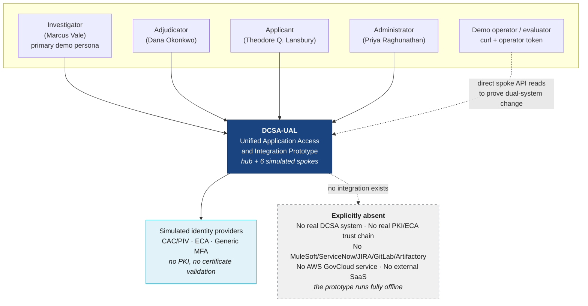
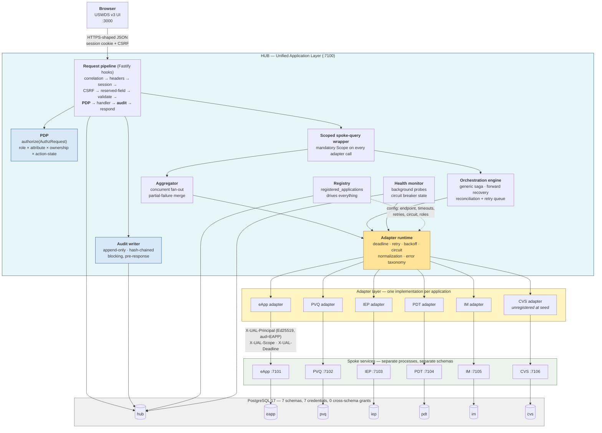

# Technical Architecture — DCSA Unified Application Access and Integration Prototype

**Project Acronym:** DCSA-UAL
**Document Type:** Technical Architecture (TechArch)
**Status:** Draft v1.0
**Date:** 2026-09-14
**Derived From:** `project_specs/PRD-DCSA-UAL.md`, `project_specs/FRD-DCSA-UAL.md` (chunks `00-header`, `F01`–`F19`, `Y0a`, `Y0b`, `Y1a`, `Y1b`, `Y2`, `Y3`), `.planning/PROJECT.md`

> **DEMO — SYNTHETIC DATA ONLY.** This document specifies a demonstration prototype. No real DCSA data, no real PII, no connection to any real government system. Authentication is simulated; no certificate is parsed or validated.

---

## 0.1 Purpose and Authority of This Document

The PRD says *what* to build and *why*. The FRD says *how it must behave*, field by field, message by message. This document says *how it is constructed*: the runtime topology, the technology selections with versions, the physical schema and its isolation guarantees, the adapter seam, the security decision points, the resilience machinery, the frontend architecture, and the single command that makes all of it run on an evaluator's laptop.

**This document is authoritative for:** technology and version selection, process and container topology, port assignments, physical schema and grants, module boundaries, the adapter TypeScript contract, middleware ordering, state management, build and run tooling, and test tooling.

**The FRD remains authoritative for:** behavior, user-facing copy, validation rules, error codes, acceptance criteria, and requirement IDs. Where this document appears to contradict the FRD, the FRD wins — except in the two places where a deviation is recorded explicitly as an Architecture Decision Record (§16, ADR-012 frame headers and ADR-013 web UI port). Those two deviations are deliberate, bounded, and justified by demo-environment constraints.

**Consumers:** implementation planners and engineers. Every section is written to be built from without a follow-up conversation.

---

## 0.2 The Architectural Mandate

One sentence, because everything else in this document derives from it:

> **The hub owns identity, navigation, aggregation, orchestration, authorization, and audit. Five separate spoke services own their own data in their own namespaces and are reachable only through a per-spoke adapter implementing one common interface. The adapter seam is the deliverable.**

Four non-negotiable structural properties follow, and each one is enforced by a mechanism rather than by convention:

| # | Property | Enforcement mechanism | Requirement |
|---|---|---|---|
| 1 | **No shared tables between spokes.** Seven PostgreSQL schemas, seven database roles, no cross-schema `GRANT`, no cross-schema foreign key. | Database grants + schema-introspection test asserting every FK's referenced table is in the same schema | `Y0b` checklist, `FR-F19-03` item 8 |
| 2 | **No direct cross-spoke access.** A spoke never calls another spoke and never calls the hub. Cross-system references are opaque strings resolved only by the hub. | Compose network policy + `FR-F19-03` item 8 traffic assertion + column inspection (no FK on `subject_ref`, `parent_case_ref`, `eapp_case_ref`) | `FR-F09-01`, `Y3 §3` |
| 3 | **No hard-coded application list in hub core.** Navigation, fan-out, search, health, and admin inventory all read `hub.registered_applications`. | CI grep for the literals `EAPP`, `IEP`, `PVQ`, `PDT`, `IM` in hub core source outside seed, tests, and adapter packages | `FR-F08b-02` rule 1 |
| 4 | **No path from hub to spoke except an adapter.** Hub core imports the `SpokeAdapter` interface, never an HTTP client aimed at a spoke. | Static check: zero `fetch`/`undici` call sites targeting a spoke base endpoint outside `packages/adapter-*` | `FR-F08a-01` AC-2 |

If a reviewer suspects any of these four is cosmetic, the demonstration loses its argument. They are therefore all mechanically verified in CI, not asserted in prose (§12).

---

## 0.3 System Context



**Offline by construction.** There is no outbound network dependency at runtime. Fonts, USWDS assets, icons, and images are vendored into the image at build time. This is a deliverability requirement, not a preference: a demo that needs a CDN fails in the room where it matters (`NFR-18`, `FR-F18-01`).

---

## 0.4 Container Diagram



**Read the diagram for what it prohibits, not only what it permits.** There is no arrow from any spoke to any other spoke. There is no arrow from a spoke to the hub. There is no arrow from the browser to a spoke. There is no arrow from `hub` schema to any spoke schema. Those absences are the architecture.

---

## 0.5 Deployment Topology and Port Map

Nine containers, one Docker Compose project, one network, one command.

| # | Container | Image / build | Host port | Internal port | Depends on | Purpose |
|---|---|---|---|---|---|---|
| 1 | `ual-db` | `postgres:17.2-alpine` | 7199 | 5432 | — | All seven schemas, seven roles |
| 2 | `ual-migrate` | built (`@ual/migrate`) | — | — | `ual-db` healthy | Applies DDL + grants, then exits 0 |
| 3 | `ual-seed` | built (`@ual/seed`) | — | — | `ual-migrate` exit 0 | Deterministic seed + validation, then exits 0 |
| 4 | `ual-eapp` | built (`@ual/spoke-eapp`) | 7101 | 7101 | `ual-seed` exit 0 | eApp service, `eapp` schema |
| 5 | `ual-pvq` | built (`@ual/spoke-pvq`) | 7102 | 7102 | `ual-seed` exit 0 | PVQ service, `pvq` schema |
| 6 | `ual-iep` | built (`@ual/spoke-iep`) | 7103 | 7103 | `ual-seed` exit 0 | IEP service, `iep` schema |
| 7 | `ual-pdt` | built (`@ual/spoke-pdt`) | 7104 | 7104 | `ual-seed` exit 0 | PDT service, `pdt` schema |
| 8 | `ual-im` | built (`@ual/spoke-im`) | 7105 | 7105 | `ual-seed` exit 0 | IM service, `im` schema |
| 9 | `ual-cvs` | built (`@ual/spoke-cvs`) | 7106 | 7106 | `ual-seed` exit 0 | **Sixth app: running, unregistered** |
| 10 | `ual-hub` | built (`@ual/hub`) | 7100 | 7100 | `ual-seed` exit 0 | Hub BFF; does **not** wait on spoke health |
| 11 | `ual-web` | built (`@ual/web`) | **3000** | 3000 | `ual-hub` healthy | Next.js UI, bound `0.0.0.0` |

**Rules that make the topology honest:**

1. **Spoke ports are published to the host.** An evaluator must be able to `curl http://localhost:7102/issues/ISS-2207` and see PVQ's own answer. That direct-read capability is how `SM-03` — "both systems actually changed" — is proved rather than asserted (`FR-F09-08`, `FR-F18-05` step 12). Spoke data endpoints still require a signed principal assertion or a short-lived operator token; publishing the port does not publish the data.
2. **The hub starts even when every spoke is down.** `ual-hub` depends only on the seed job. A spoke that fails to start registers as `DOWN` and the product enters exactly the degraded mode it was designed for (`FR-F18-01` rule 3, `FR-F08b-06` AC-2).
3. **Each spoke is independently stoppable.** `docker compose stop ual-im` is a real outage, not a simulation of one (`FR-F18-02`).
4. **One database container, seven credentials.** See §3 of the data-model chunk for why this is isolation rather than a shortcut.
5. **All ports come from one `.env` file.** A port clash is resolved without editing code (`FR-F18-01` rule 6).

### 0.5.1 Port deviation from `Y1b`

`Y1b` assigns the web UI port **7000**. This document assigns **3000**. The demo is presented through an embedded preview harness that expects a conventional development port, and the Next.js dev server must bind `0.0.0.0:3000` deterministically for that harness to reach it. Every other port in `Y1b` is adopted unchanged. Recorded as **ADR-013**.

### 0.5.2 Environment file (`.env`, checked in with demo-safe values)

```dotenv
# Ports — the only place ports are defined
UAL_WEB_PORT=3000
UAL_HUB_PORT=7100
UAL_EAPP_PORT=7101
UAL_PVQ_PORT=7102
UAL_IEP_PORT=7103
UAL_PDT_PORT=7104
UAL_IM_PORT=7105
UAL_CVS_PORT=7106
UAL_DB_PORT=7199

# Binding — must be 0.0.0.0 so the preview harness can reach the UI
UAL_BIND_HOST=0.0.0.0

# Deterministic demo values. Not secrets: this environment holds no real data.
UAL_SEED_CONSTANT=DCSA-UAL-2026-09-14
UAL_SEED_REFERENCE_DATE=2026-09-14
UAL_SESSION_COOKIE_SECRET=demo-only-session-secret-change-for-any-real-use
UAL_ASSERTION_KEY_SEED=demo-only-ed25519-seed-change-for-any-real-use
UAL_DEMO_OTP=482913           # deterministic generic-MFA code (FR-F00-04)

# Session policy
UAL_SESSION_IDLE_MINUTES=30
UAL_SESSION_ABSOLUTE_HOURS=8

# Postgres
POSTGRES_DB=ual
POSTGRES_USER=ual_owner
POSTGRES_PASSWORD=demo-only-password
```

---

## 0.6 Repository Layout

A single npm-workspaces monorepo. One `npm install` at the root resolves every package; one lockfile pins every transitive dependency.

```
dcsa-ual/
├─ .env                         # every port and demo constant (§5.2)
├─ compose.yaml                 # the nine containers
├─ run.sh                       # the single documented command (§13)
├─ package.json                 # npm workspaces root
├─ package-lock.json            # committed; the determinism guarantee
├─ tsconfig.base.json           # strict: true, noUncheckedIndexedAccess: true
├─ eslint.config.js             # flat config, incl. the no-spoke-name rule
├─ stylelint.config.cjs         # the no-hard-coded-visual-values rule (NFR-03)
├─ apps/
│  ├─ web/                      # @ual/web        — Next.js 15 UI          :3000
│  └─ hub/                      # @ual/hub        — Fastify BFF            :7100
├─ services/
│  ├─ eapp/  pvq/  iep/  pdt/  im/  cvs/          # six Fastify spokes  :7101–7106
├─ packages/
│  ├─ contracts/                # @ual/contracts  — TypeBox schemas: the single
│  │                            #   source of TS types, ajv validators, OpenAPI
│  ├─ adapter-contract/         # @ual/adapter-contract — SpokeAdapter interface
│  ├─ adapter-runtime/          # deadline, retry, backoff, circuit, error taxonomy
│  ├─ adapter-rest-json-v1/     # the one adapterType all six spokes use
│  ├─ policy/                   # PDP: authorize(), scope derivation, rule engine
│  ├─ audit/                    # append-only writer, hash chain, interceptor
│  ├─ orchestration/            # generic saga engine + retry worker
│  ├─ spoke-kit/                # shared spoke server: assertion verify, scope,
│  │                            #   idempotency, injection, /health, /describe
│  ├─ db/                       # pg pool factory, per-role credentials, SQL helpers
│  ├─ migrate/                  # numbered .sql runner
│  ├─ seed/                     # deterministic generator + validator
│  ├─ conformance/              # standalone adapter conformance suite
│  └─ theme/                    # USWDS settings + compiled stylesheet + tokens
├─ tests/
│  ├─ e2e/                      # Playwright: flagship, RBAC, degraded, registration
│  └─ a11y/                     # axe-core sweep over every route × every role
└─ docs/
   ├─ README.md                 # FR-F18-04
   ├─ DEMO-SCRIPTS.md           # FR-F18-05, FR-F18-06
   ├─ SEED-DATA.md              # FR-F17-09
   └─ ONBOARDING-A-NEW-APP.md   # FR-F12 / §17 extensibility walkthrough
```

**Why `packages/contracts` exists.** Request schemas, response schemas, TypeScript types, runtime validators, and the published OpenAPI document are all generated from one TypeBox declaration per endpoint. Hand-maintaining any two of those five guarantees they diverge, and `FR-F10-06` rule 1 forbids hand-maintained documentation for exactly that reason.

---

## 0.7 Chunk Map for This Document

| Chunk | Contents | Mandate item |
|---|---|---|
| `00-overview.md` | This chunk: mandate, context and container diagrams, topology, ports, repo layout | 1 |
| `01-components.md` | Hub component architecture, spoke service template, module boundaries | — |
| `02-tech-stack.md` | Every technology with version and rationale; the four hard constraints | 2 |
| `03-data-model-hub.md` | Complete hub DDL, grants, indexes | 3 |
| `04-data-model-spokes.md` | Complete per-spoke DDL, isolation proof | 3 |
| `05-adapter-seam.md` | `SpokeAdapter` TypeScript interface, PVQ implementation sketch, registry record | 4 |
| `06-api-hub-bff.md` | Hub BFF endpoints with TypeScript request/response interfaces | 5 |
| `07-api-spokes.md` | Spoke mock API surfaces and the common spoke contract | 5 |
| `08-security.md` | AuthN/AuthZ, PDP/PEP placement, SSO propagation, applicant data scoping, zero trust | 6, 14 |
| `09-audit.md` | Append-only store, structural write-on-mutation guarantee, hash chain | 7 |
| `10-resilience.md` | Probes, circuit breaker, timeouts, degraded contract, partial-failure aggregation, injection | 8 |
| `11-orchestration.md` | The distributed write: saga, forward recovery, reconciliation, partial-failure UX | 9 |
| `12-frontend.md` | Routing, state, USWDS tokens, accessibility architecture, uniform state pattern | 10 |
| `13-seeding.md` | Idempotent deterministic seed and validator | 11 |
| `14-testing.md` | Unit, integration, conformance, E2E, axe, RBAC negative paths | 12 |
| `15-deployment.md` | One command, ports, health endpoints, how an evaluator drives the demo | 13 |
| `16-adrs.md` | Architecture Decision Records ADR-001 … ADR-016 | 15 |
| `17-extensibility.md` | Onboarding the sixth application, step by step | 16 |

---
