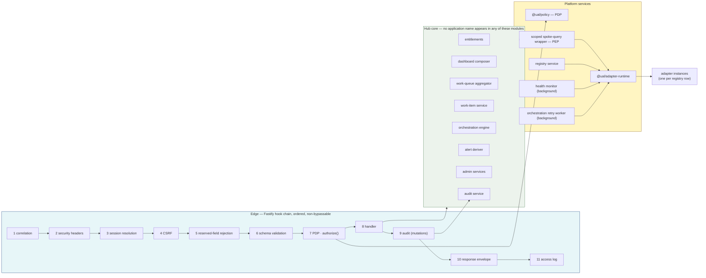

## 1. Component Architecture

This chunk decomposes the hub and the spokes into modules with stated responsibilities, stated dependencies, and — importantly — stated prohibitions. A module's prohibitions are what keep the architecture from eroding under schedule pressure.

---

### 1.1 Hub Component Map



---

### 1.2 Hub Modules

| Module | Package / path | Responsibility | Depends on | **Must not** |
|---|---|---|---|---|
| **Edge pipeline** | `apps/hub/src/pipeline/` | The eleven ordered hooks of `FR-F10-01`. Registered once as a Fastify plugin at the root scope so no route can opt out. | policy, audit, contracts | Allow a route to skip a hook; reorder hooks per route |
| **Session service** | `apps/hub/src/session/` | Issue, resolve, extend, terminate `hub.sessions`. Rebuilds the `Principal` from the database on **every** request. | db | Cache a principal across requests; store roles in the cookie |
| **PDP** | `packages/policy/` | `authorize(req: AuthzRequest): Decision`. The single allow/deny function. Loads the role matrix and attribute rules from `hub.role_permissions` / `hub.attribute_rules`. | db | Contain an `if (role === 'ADMINISTRATOR')` branch; be called from anywhere except the pipeline and the action-list computer |
| **Scoped spoke-query wrapper (PEP)** | `apps/hub/src/spoke-gateway/` | The **only** function in the hub that may invoke an adapter. Derives a mandatory `Scope` from the principal, attaches it, re-applies the ownership predicate to the result, and reports scope violations. | policy, adapter-runtime, registry | Issue an adapter call with an absent `Scope`; return unfiltered rows |
| **Registry service** | `apps/hub/src/registry/` | CRUD over `hub.registered_applications`, `registryVersion` bump, startup validation, adapter instantiation by `adapterType`. | db, adapter-rest-json-v1 | Hold a hard-coded application list; special-case `CVS` |
| **Work-queue aggregator** | `apps/hub/src/queue/` | Concurrent fan-out over registry rows visible to the active role; merge, normalize-validate, sort, filter, paginate; emit `sourceStatus[]`. | spoke-gateway, registry | Fail the whole request because one source failed |
| **Work-item service** | `apps/hub/src/work-item/` | Detail, server-computed `ActionDescriptor[]`, related-ref resolution, merged activity history. | spoke-gateway, policy, audit | Trust the spoke's `availableActions` as an authorization decision |
| **Orchestration engine** | `packages/orchestration/` | Generic saga executor driven by `hub.orchestration_definitions`. Reconciliation rows, forward recovery, retry enqueue. | spoke-gateway, audit, db | Reference `PVQ` or `EAPP` by name (`FR-F07b-07` AC-2) |
| **Audit service** | `packages/audit/` | Append-only writer, hash chain, closed action vocabulary, chain and integrity queries. | db | Expose an update or delete path |
| **Health monitor** | `apps/hub/src/health/` | Background probe loop per enabled registry row; circuit state machine; `application_health` upsert; issue rows on transition. | adapter-runtime, registry, db | Block a user request; be blocked by an open circuit |
| **Retry worker** | `packages/orchestration/worker.ts` | Drains `hub.orchestration_retry_queue` on the configured backoff schedule. | spoke-gateway, audit | Replay a mutation the user did not authorize |
| **Alert deriver** | `apps/hub/src/notifications/` | Computes alerts from aggregated spoke data at read time. Persists only read state. | queue | Store a derived alert (`Y0a` note 5) |
| **Admin services** | `apps/hub/src/admin/` | Applications, health, integration issues, users, announcements, failure injection, status, reset. | registry, health, db | Exempt an administrator from authorization or audit |
| **Adapter runtime** | `packages/adapter-runtime/` | Deadline enforcement, retry/backoff policy, circuit breaker, `AdapterError` taxonomy, integration-issue emission, structured adapter logs. | db (issues), registry (config) | Retry a mutating call after a timeout (`FR-F08a-05` rule 1) |

---

### 1.3 Two Structural Choke Points

The design concentrates its guarantees at exactly two places. Everything else is ordinary application code.

**Choke point 1 — the edge pipeline** is where *authorize* and *audit* happen. It is registered on the root Fastify instance, before any route plugin:

```ts
// apps/hub/src/server.ts — the only place these are wired
const app = Fastify({ genReqId: () => ulid(), logger: pinoConfig });

await app.register(correlationHook);        // 1
await app.register(securityHeadersHook);    // 2  (see ADR-012 on frame headers)
await app.register(sessionHook);            // 3
await app.register(csrfHook);               // 4
await app.register(reservedFieldHook);      // 5
// 6 schema validation is Fastify-native, driven by the TypeBox schema on each route
await app.register(authorizationHook);      // 7  → packages/policy
// 8 handler
await app.register(auditHook);              // 9  → packages/audit (onSend, mutations)
await app.register(envelopeHook);           // 10
await app.register(accessLogHook);          // 11

await app.register(routes, { prefix: '/api' });
```

Fastify's plugin encapsulation makes this enforceable: hooks registered at the root scope run for every route in every child plugin, and a child plugin cannot remove a parent hook. A route declared without an `action` string, request schema, or response schema fails the boot-time contract check and the process exits non-zero (`FR-F10-01` validation rule). Starting is not permitted with a route that could bypass the PDP.

**Choke point 2 — the scoped spoke-query wrapper** is where *data isolation* happens. It is the single call site for every adapter operation:

```ts
// apps/hub/src/spoke-gateway/gateway.ts
export async function callSpoke<Op extends AdapterOperation>(
  principal: Principal,
  applicationId: string,
  operation: Op,
  args: AdapterArgs<Op>,
  ctx: RequestContext,
): Promise<AdapterResult<Op>> {
  const scope = deriveScope(principal);                 // FR-F02-04 rule 1
  if (!scope) throw new InternalError('SCOPE_ABSENT');  // fail closed, never permissive
  const adapter = registry.instanceFor(applicationId);  // throws if disabled/unregistered
  const result = await adapterRuntime.invoke(adapter, operation, args, {
    principal, scope, correlationId: ctx.correlationId, requestId: ulid(),
    deadlineAt: ctx.deadlineFor(applicationId, operation),
    idempotencyKey: isMutating(operation) ? args.idempotencyKey : undefined,
  });
  return enforceScopeOnResult(scope, applicationId, result, ctx); // defense in depth
}
```

Hub core modules import `callSpoke`. They do not import adapters, and they do not import an HTTP client. An ESLint `no-restricted-imports` rule enforces this: `packages/adapter-*` may only be imported by `apps/hub/src/registry/` and `packages/adapter-runtime/`.

---

### 1.4 Spoke Service Template

Every spoke is the same Fastify application with a different domain module. The shared parts live in `@ual/spoke-kit`, so "a spoke behaves correctly" is one implementation verified once, not six implementations verified six times.

```
services/<spoke>/
├─ src/
│  ├─ server.ts            # 15 lines: create kit server, register domain routes
│  ├─ domain/              # the only spoke-specific code
│  │  ├─ repository.ts     # SQL against this spoke's schema, with the supplied scope
│  │  ├─ actions.ts        # state machine: which action is valid from which state
│  │  └─ mapping.ts        # native → API shapes; statusMap lives in describe()
│  ├─ describe.ts          # the capability declaration (FR-F08a-02)
│  └─ sql/                 # this spoke's queries
```

`@ual/spoke-kit` supplies, identically for all six services:

| Concern | Behavior | Requirement |
|---|---|---|
| Principal assertion verification | Ed25519 signature check, `aud === self`, `exp > now`. Reject → `401 PRINCIPAL_REJECTED`. | `FR-F01-02` rule 6 |
| Scope enforcement | `X-UAL-Scope` parsed and **required** on reads; absent → `400 SCOPE_REQUIRED`. The scope is converted into SQL predicates by the repository, not applied post-fetch. | `FR-F09-07` rule 2 |
| Deadline | `X-UAL-Deadline` bound to an `AbortController`; the request aborts at the deadline. | `FR-F08a-05` rule 7 |
| Idempotency | `X-UAL-Idempotency-Key` recorded in `<ns>.idempotency_records` with a request hash; replay returns the stored response; same key + different payload → `409 IDEMPOTENCY_KEY_REUSED`. 24-hour retention. | `FR-F09-07` rule 3 |
| `stateVersion` | Recomputed as a content hash of user-visible fields on every write. | `FR-F09-07` rule 4 |
| Own activity history | Every mutation inserts a row in this spoke's own `*_activity` table, independent of hub audit. | `FR-F09-07` rule 5 |
| `/health` | **No assertion required** — a spoke with a broken auth path must still be probeable. Reports injected state honestly. | `FR-F09-07` rule 6 |
| `/describe` | Static capability metadata, no assertion required. | `FR-F08a-02` |
| Failure injection | `/admin/injection` guarded by operator token; `NORMAL`/`UNAVAILABLE`/`SLOW`/`ERROR` with auto-expiry. | `FR-F16-11` |
| Correlation echo | `X-UAL-Correlation-Id` echoed on the response and stored in the activity row. | `Y3 §5` |
| Synthetic markers | `_synthetic: true` on every body; `syntheticMarker` on every record. | `FR-F17-08` |
| Error shape | `{ code, message, detail }` from the closed common set in `Y1b`. | `Y1b` |

**Prohibitions, enforced by the kit and by test:** a spoke has no outbound HTTP client at all. `@ual/spoke-kit` does not export one, the spoke packages do not depend on `undici` or any HTTP client, and `FR-F19-03` item 8 asserts zero spoke-to-spoke traffic during the test run. A spoke cannot call another spoke because it has nothing to call with.

---

### 1.5 Frontend Component Layers

| Layer | Path | Responsibility | Must not |
|---|---|---|---|
| Shell | `apps/web/app/(shell)/layout.tsx` | Demo banner, USWDS government banner, header, primary nav, breadcrumb, `<main>`, footer, skip link. Server-rendered. | Render conditionally on any flag |
| Route segments | `apps/web/app/(shell)/**/page.tsx` | One segment per `SCR-nn`. Server component fetches; client component interacts. | Invent a route not in the screen inventory |
| Page templates | `apps/web/components/templates/` | The four permitted layouts: `ListPage`, `DetailPage`, `FormPage`, `ConsolePage`. Each defines loading / empty / error / degraded presentations. | Let a screen hand-roll its own layout |
| USWDS primitives | `apps/web/components/uswds/` | Thin typed wrappers over USWDS markup — `Button`, `Table`, `Alert`, `SiteAlert`, `Pagination`, `Modal`, `ErrorSummary`, `Tag`, `Breadcrumb`. | Introduce a component USWDS already provides |
| Domain components | `apps/web/components/domain/` | `WorkItemTable`, `RelatedItemsPanel`, `ActionPanel`, `DualSystemResultTable`, `HealthTable`, `AuditChain`. Composed from USWDS primitives only. | Contain a visual literal |
| Data layer | `apps/web/lib/api/` | Typed client generated from `@ual/contracts`; TanStack Query hooks; polling for `registry-version` and `health/summary`. | Hold authorization logic |
| Session context | `apps/web/lib/session/` | `Principal` + `entitlements` from the server, refreshed on role switch and registry change. | Be treated as a security boundary |

**The one-sentence rule the frontend lives by:** the client renders what the server says it may see, and the server independently re-decides on every request. Hiding a control is a courtesy to the user, never a control (`FR-F02-06` rule 4).

---

### 1.6 Cross-Cutting Concerns and Where They Live

| Concern | Single implementation | Applied by |
|---|---|---|
| Correlation ID | `packages/contracts/correlation.ts` | Pipeline hook 1; propagated into every adapter header, audit row, issue row, error envelope |
| Authorization | `packages/policy` | Pipeline hook 7; plus action-list computation in the work-item service |
| Data scoping | `deriveScope()` + `enforceScopeOnResult()` | `spoke-gateway` only |
| Audit | `packages/audit` | Pipeline hook 9 (`onSend`, mutations) — see chunk 09 for why this is structural |
| Error envelope | `packages/contracts/errors.ts` + `Y2` catalog | Pipeline hook 10; validated against the catalog at boot |
| Resilience policy | `packages/adapter-runtime` | Every adapter invocation; configured per registry row |
| Validation | TypeBox schemas in `@ual/contracts` | Fastify (server) and react-hook-form (client) — the same schema object |
| Theming | `packages/theme/_uswds-theme.scss` | Compiled once; the only file containing a color value |

Seven of these eight have exactly one implementation site. That is the point: each guarantee this prototype makes is a single function that a test can call, not a discipline that a reviewer must trust.

---
