## 3. Data Model — Isolation Strategy and Hub Schema

---

### 3.1 Isolation Decision: Schema-per-Service with Role-per-Service

**Decision.** One PostgreSQL 17 instance. **Seven schemas** — `hub`, `eapp`, `pvq`, `iep`, `pdt`, `im`, `cvs` — and **seven database roles**, one per service. Each service connects with only its own role. No role holds any privilege on any other service's schema. No foreign key crosses a schema boundary anywhere in the system.

**Why schema-per-service rather than database-per-service.** Both enforce isolation equally in PostgreSQL, because the enforcement is the `GRANT`, not the container boundary. Seven databases would mean seven connection pools to seven `postgres` databases, seven migration targets, and a heavier startup — cost paid against constraint **C2** (one command, under ten minutes on a clean machine) for no additional guarantee. Seven schemas with seven roles gives identical enforcement, and the enforcement is *easier to demonstrate*: a reviewer can open one `psql` session and watch `SET ROLE pvq_service; SELECT * FROM eapp.cases;` fail with `permission denied for schema eapp`. That demonstration is the point.

**Why not database-per-service-in-its-own-container.** It would be more theatrical but no more true, and it would add five containers and roughly 400 MB of images to a demo whose deliverability is itself a scored criterion.

**What makes the isolation real rather than cosmetic** — five mechanisms, each independently verifiable:

| # | Mechanism | Verified by |
|---|---|---|
| 1 | Seven roles, each with `USAGE` on exactly one schema; explicit `REVOKE` of every other schema from every other role. | Runtime probe: each service credential attempts a read of all six foreign schemas; all six must fail (`FR-F19-03` item 8) |
| 2 | Zero cross-schema foreign keys. | `information_schema` introspection: for every FK, constrained table schema == referenced table schema (`Y0b` checklist) |
| 3 | Cross-system references are plain `VARCHAR` with no constraint: `subject_ref`, `parent_case_ref`, `eapp_case_ref`, `outstanding_issue_refs`, `pdt_designation_ref`, `im_assignment_ref`. | Column inspection — these columns appear in no `pg_constraint` row |
| 4 | Services hold no HTTP client, so a spoke cannot reach another spoke over the network either. | Package dependency inspection + traffic assertion during test |
| 5 | The hub holds **no** grant on any spoke schema. The hub reaches spoke data only through adapters over HTTP. | Grant inspection (`Y0b` checklist row 5) |

Mechanism 5 deserves emphasis, because it is the one most often quietly abandoned: the hub's own credential cannot read `eapp.cases`. The hub aggregates a work queue by making six concurrent HTTP calls, not by running one `UNION`. That is slower and it is correct, and if it were not true the hub-and-spoke claim would be decoration.

---

### 3.2 Roles, Schemas, and Grants (applied by migration `000_bootstrap.sql`)

```sql
-- ============================================================================
-- 000_bootstrap.sql — namespaces, roles, and the grants that ARE the isolation
-- Run once, as the database owner, before any table is created.
-- ============================================================================

CREATE SCHEMA IF NOT EXISTS hub;
CREATE SCHEMA IF NOT EXISTS eapp;
CREATE SCHEMA IF NOT EXISTS pvq;
CREATE SCHEMA IF NOT EXISTS iep;
CREATE SCHEMA IF NOT EXISTS pdt;
CREATE SCHEMA IF NOT EXISTS im;
CREATE SCHEMA IF NOT EXISTS cvs;

CREATE ROLE hub_service  LOGIN PASSWORD :'hub_pw'  NOINHERIT;
CREATE ROLE eapp_service LOGIN PASSWORD :'eapp_pw' NOINHERIT;
CREATE ROLE pvq_service  LOGIN PASSWORD :'pvq_pw'  NOINHERIT;
CREATE ROLE iep_service  LOGIN PASSWORD :'iep_pw'  NOINHERIT;
CREATE ROLE pdt_service  LOGIN PASSWORD :'pdt_pw'  NOINHERIT;
CREATE ROLE im_service   LOGIN PASSWORD :'im_pw'   NOINHERIT;
CREATE ROLE cvs_service  LOGIN PASSWORD :'cvs_pw'  NOINHERIT;

-- Nobody gets anything by default.
REVOKE ALL ON SCHEMA hub, eapp, pvq, iep, pdt, im, cvs FROM PUBLIC;
REVOKE ALL ON DATABASE ual FROM PUBLIC;
GRANT CONNECT ON DATABASE ual TO
  hub_service, eapp_service, pvq_service, iep_service, pdt_service, im_service, cvs_service;

-- Exactly one schema per role. This loop is the whole isolation model.
GRANT USAGE ON SCHEMA hub  TO hub_service;
GRANT USAGE ON SCHEMA eapp TO eapp_service;
GRANT USAGE ON SCHEMA pvq  TO pvq_service;
GRANT USAGE ON SCHEMA iep  TO iep_service;
GRANT USAGE ON SCHEMA pdt  TO pdt_service;
GRANT USAGE ON SCHEMA im   TO im_service;
GRANT USAGE ON SCHEMA cvs  TO cvs_service;

-- Table privileges follow, applied per schema after its tables exist:
--   GRANT SELECT, INSERT, UPDATE, DELETE ON ALL TABLES IN SCHEMA <ns> TO <ns>_service;
--   GRANT USAGE, SELECT ON ALL SEQUENCES IN SCHEMA <ns> TO <ns>_service;
-- with the single, deliberate exception of hub.audit_events (see 999_grants.sql).

-- Explicit denial, stated rather than implied, so a reviewer can read the intent:
REVOKE ALL ON SCHEMA hub  FROM eapp_service, pvq_service, iep_service,
                               pdt_service, im_service, cvs_service;
REVOKE ALL ON SCHEMA eapp FROM hub_service, pvq_service, iep_service,
                               pdt_service, im_service, cvs_service;
REVOKE ALL ON SCHEMA pvq  FROM hub_service, eapp_service, iep_service,
                               pdt_service, im_service, cvs_service;
REVOKE ALL ON SCHEMA iep  FROM hub_service, eapp_service, pvq_service,
                               pdt_service, im_service, cvs_service;
REVOKE ALL ON SCHEMA pdt  FROM hub_service, eapp_service, pvq_service,
                               iep_service, im_service, cvs_service;
REVOKE ALL ON SCHEMA im   FROM hub_service, eapp_service, pvq_service,
                               iep_service, pdt_service, cvs_service;
REVOKE ALL ON SCHEMA cvs  FROM hub_service, eapp_service, pvq_service,
                               iep_service, pdt_service, im_service;

-- Migration bookkeeping (owner-only).
CREATE TABLE hub.schema_migrations (
  filename    VARCHAR(160) PRIMARY KEY,
  checksum    VARCHAR(64)  NOT NULL,
  applied_at  TIMESTAMPTZ  NOT NULL DEFAULT now()
);
```

---

### 3.3 Hub Entity Relationship Overview

```mermaid
erDiagram
    users ||--o{ user_roles : holds
    users ||--o{ user_case_assignments : assigned
    users ||--o{ user_auth_methods : "signs in via"
    users ||--o{ sessions : opens
    roles ||--o{ user_roles : grants
    roles ||--o{ role_permissions : permits
    roles ||--o{ attribute_rules : narrows
    roles ||--o{ queue_default_views : defaults
    roles ||--o{ dashboard_compositions : composes
    permissions ||--o{ role_permissions : referenced
    sessions ||--o{ spoke_contexts : holds
    sessions ||--o{ application_registration_drafts : drafts
    registered_applications ||--|| application_health : "current state"
    registered_applications ||--o{ application_health_checks : history
    orchestration_definitions ||--o{ orchestration_transactions : instantiates
    orchestration_transactions ||--o{ orchestration_retry_queue : "forward recovery"
    users ||--o{ announcements : authors
    announcements ||--o{ announcement_dismissals : "dismissed per user"
    users ||--o{ alert_read_state : reads
    users ||--o{ user_view_preferences : prefers
    users ||--o{ work_item_counts_cache : "counted per app"
    users ||--o{ operator_tokens : issued
    audit_events }o--|| users : "actor snapshot"
    integration_issues }o--|| registered_applications : "denormalized name"
```



**Two deliberate non-relationships.** `audit_events` and `integration_issues` carry *denormalized* display names (`target_system_display_name`, `application_display_name`) rather than foreign keys to `registered_applications`, so history stays legible after an application is de-registered (`FR-F12-07` rule 6). And `user_case_assignments.native_case_id` has no foreign key to anything, because the case lives in another service's schema — the whole point.

---

### 3.4 Hub DDL — Identity, Session, and Authorization

```sql
-- ============================================================================
-- 010_hub_identity.sql
-- ============================================================================

CREATE TABLE hub.users (
  principal_id        VARCHAR(26)  PRIMARY KEY,                 -- ULID
  display_name        VARCHAR(120) NOT NULL,
  subject_ref         VARCHAR(32)  NULL,                        -- non-null only for APPLICANT
  organization        VARCHAR(64)  NOT NULL,
  clearance_tier      VARCHAR(4)   NOT NULL CHECK (clearance_tier IN ('T1','T3','T5')),
  assigned_region     VARCHAR(32)  NOT NULL,
  enabled             BOOLEAN      NOT NULL DEFAULT TRUE,
  synthetic_marker    VARCHAR(16)  NOT NULL DEFAULT 'DEMO-SYNTHETIC',
  created_at          TIMESTAMPTZ  NOT NULL DEFAULT now(),
  last_activity_at    TIMESTAMPTZ  NULL
);
CREATE INDEX ix_users_subject ON hub.users(subject_ref) WHERE subject_ref IS NOT NULL;

CREATE TABLE hub.roles (
  role_id     VARCHAR(16)  PRIMARY KEY,   -- INVESTIGATOR|ADJUDICATOR|APPLICANT|ADMINISTRATOR
  label       VARCHAR(64)  NOT NULL,
  description VARCHAR(500) NOT NULL
);

CREATE TABLE hub.user_roles (
  principal_id VARCHAR(26) NOT NULL REFERENCES hub.users(principal_id),
  role_id      VARCHAR(16) NOT NULL REFERENCES hub.roles(role_id),
  assigned_at  TIMESTAMPTZ NOT NULL DEFAULT now(),
  assigned_by  VARCHAR(26) NULL,
  PRIMARY KEY (principal_id, role_id)
);
CREATE INDEX ix_user_roles_role ON hub.user_roles(role_id);

-- ABAC input. native_case_id deliberately has NO foreign key: the case lives in
-- another service's schema and the hub must not be able to join to it.
CREATE TABLE hub.user_case_assignments (
  principal_id   VARCHAR(26) NOT NULL REFERENCES hub.users(principal_id),
  source_system  VARCHAR(16) NOT NULL,
  native_case_id VARCHAR(64) NOT NULL,
  assigned_at    TIMESTAMPTZ NOT NULL DEFAULT now(),
  PRIMARY KEY (principal_id, source_system, native_case_id)
);

CREATE TABLE hub.user_auth_methods (
  principal_id     VARCHAR(26)  NOT NULL REFERENCES hub.users(principal_id),
  method_id        VARCHAR(16)  NOT NULL CHECK (method_id IN ('CAC_PIV','ECA','GENERIC_MFA')),
  username         VARCHAR(128) NULL,                    -- GENERIC_MFA only
  cert_subject_cn  VARCHAR(160) NULL,                    -- synthetic; never parsed
  cert_subject_org VARCHAR(160) NULL,
  cert_issuer      VARCHAR(160) NULL,                    -- 'DEMO-DOD-CA-59 (synthetic)'
  cert_serial      VARCHAR(64)  NULL,                    -- '00:DEMO:...'
  cert_valid_from  DATE NULL,
  cert_valid_to    DATE NULL,
  PRIMARY KEY (principal_id, method_id),
  UNIQUE (method_id, username)
);

CREATE TABLE hub.auth_transactions (
  transaction_id     VARCHAR(26)  PRIMARY KEY,
  method_id          VARCHAR(16)  NOT NULL,
  state              VARCHAR(24)  NOT NULL CHECK (state IN
                       ('AWAITING_SELECTION','AWAITING_OTP','CONSUMED','LOCKED','EXPIRED')),
  bound_principal_id VARCHAR(26)  NULL,
  otp_hash           VARCHAR(128) NULL,
  attempt_count      SMALLINT     NOT NULL DEFAULT 0,
  attempted_username VARCHAR(128) NULL,
  created_at         TIMESTAMPTZ  NOT NULL DEFAULT now(),
  expires_at         TIMESTAMPTZ  NOT NULL
);
CREATE INDEX ix_auth_tx_expiry ON hub.auth_transactions(expires_at) WHERE state <> 'CONSUMED';

CREATE TABLE hub.sessions (
  session_id          VARCHAR(26)  PRIMARY KEY,
  principal_id        VARCHAR(26)  NOT NULL REFERENCES hub.users(principal_id),
  identity_method     VARCHAR(16)  NOT NULL,
  active_role         VARCHAR(16)  NOT NULL REFERENCES hub.roles(role_id),
  status              VARCHAR(16)  NOT NULL CHECK (status IN ('ACTIVE','TERMINATED','EXPIRED')),
  auth_event_count    SMALLINT     NOT NULL DEFAULT 1,   -- asserted == 1 by SM-02
  created_at          TIMESTAMPTZ  NOT NULL DEFAULT now(),
  last_activity_at    TIMESTAMPTZ  NOT NULL DEFAULT now(),
  idle_expires_at     TIMESTAMPTZ  NOT NULL,
  absolute_expires_at TIMESTAMPTZ  NOT NULL,
  user_agent_hash     VARCHAR(64)  NOT NULL,
  ip_hash             VARCHAR(64)  NOT NULL,
  csrf_token_hash     VARCHAR(64)  NOT NULL
);
CREATE INDEX ix_sessions_principal ON hub.sessions(principal_id, status);
CREATE INDEX ix_sessions_expiry    ON hub.sessions(idle_expires_at) WHERE status = 'ACTIVE';

CREATE TABLE hub.spoke_contexts (
  session_id     VARCHAR(26)  NOT NULL REFERENCES hub.sessions(session_id) ON DELETE CASCADE,
  application_id VARCHAR(16)  NOT NULL,
  context_handle VARCHAR(256) NOT NULL,
  established_at TIMESTAMPTZ  NOT NULL DEFAULT now(),
  last_used_at   TIMESTAMPTZ  NOT NULL DEFAULT now(),
  PRIMARY KEY (session_id, application_id)
);

-- ============================================================================
-- 020_hub_policy.sql — the authorization matrix held as DATA, not code branches
-- ============================================================================

CREATE TABLE hub.permissions (
  action        VARCHAR(48)  PRIMARY KEY,        -- e.g. 'WORK_ITEM.ACT'
  resource_type VARCHAR(24)  NOT NULL,
  description   VARCHAR(500) NOT NULL
);

CREATE TABLE hub.role_permissions (
  role_id VARCHAR(16) NOT NULL REFERENCES hub.roles(role_id),
  action  VARCHAR(48) NOT NULL REFERENCES hub.permissions(action),
  PRIMARY KEY (role_id, action)
);

CREATE TABLE hub.attribute_rules (
  rule_id                   VARCHAR(24)  PRIMARY KEY,   -- 'ATTR-INV-01'; surfaced in denials
  role_id                   VARCHAR(16)  NOT NULL REFERENCES hub.roles(role_id),
  resource_type             VARCHAR(24)  NOT NULL,
  applies_to_action_pattern VARCHAR(48)  NOT NULL,      -- 'WORK_ITEM.*'
  expression                TEXT         NOT NULL,      -- declarative predicate (see chunk 08)
  description               VARCHAR(500) NOT NULL,
  enabled                   BOOLEAN      NOT NULL DEFAULT TRUE
);
CREATE INDEX ix_attr_rules_role ON hub.attribute_rules(role_id, resource_type) WHERE enabled;
```

---

### 3.5 Hub DDL — Application Registry

```sql
-- ============================================================================
-- 030_hub_registry.sql — the table that makes a sixth application configuration
-- ============================================================================

CREATE TABLE hub.registered_applications (
  application_id             VARCHAR(16)  PRIMARY KEY
                               CHECK (application_id ~ '^[A-Z][A-Z0-9_]{1,15}$'),
  display_name               VARCHAR(60)  NOT NULL UNIQUE,
  description                VARCHAR(500) NULL,
  adapter_type               VARCHAR(32)  NOT NULL,          -- 'REST_JSON_V1'
  base_endpoint              VARCHAR(512) NOT NULL,
  health_endpoint            VARCHAR(512) NOT NULL,
  contract_version           VARCHAR(16)  NOT NULL,
  work_item_types            JSONB        NOT NULL,
  supported_actions          JSONB        NOT NULL,
  capabilities               JSONB        NOT NULL,
  visible_to_roles           JSONB        NOT NULL,
  relationship_types_emitted JSONB        NOT NULL DEFAULT '[]',
  icon_token                 VARCHAR(64)  NOT NULL,          -- token name, never a color/URL
  timeout_ms                 INTEGER      NOT NULL DEFAULT 5000
                               CHECK (timeout_ms BETWEEN 500 AND 30000),
  action_timeout_ms          INTEGER      NOT NULL DEFAULT 10000
                               CHECK (action_timeout_ms BETWEEN 1000 AND 30000),
  health_timeout_ms          INTEGER      NOT NULL DEFAULT 2000
                               CHECK (health_timeout_ms BETWEEN 500 AND 10000),
  max_retries                SMALLINT     NOT NULL DEFAULT 2
                               CHECK (max_retries BETWEEN 0 AND 5),
  backoff_initial_ms         INTEGER      NOT NULL DEFAULT 200
                               CHECK (backoff_initial_ms BETWEEN 50 AND 5000),
  backoff_multiplier         NUMERIC(3,1) NOT NULL DEFAULT 2.0
                               CHECK (backoff_multiplier BETWEEN 1.0 AND 4.0),
  backoff_jitter_pct         SMALLINT     NOT NULL DEFAULT 20
                               CHECK (backoff_jitter_pct BETWEEN 0 AND 50),
  circuit_failure_threshold  SMALLINT     NOT NULL DEFAULT 5
                               CHECK (circuit_failure_threshold BETWEEN 2 AND 50),
  circuit_open_ms            INTEGER      NOT NULL DEFAULT 30000
                               CHECK (circuit_open_ms BETWEEN 5000 AND 300000),
  circuit_half_open_probes   SMALLINT     NOT NULL DEFAULT 1
                               CHECK (circuit_half_open_probes BETWEEN 1 AND 5),
  health_probe_interval_sec  INTEGER      NOT NULL DEFAULT 30
                               CHECK (health_probe_interval_sec BETWEEN 10 AND 600),
  degraded_latency_ms        INTEGER      NOT NULL DEFAULT 1500,
  enabled                    BOOLEAN      NOT NULL DEFAULT TRUE,
  config_state               VARCHAR(16)  NOT NULL DEFAULT 'VALID'
                               CHECK (config_state IN ('VALID','INVALID','INCOMPATIBLE')),
  config_problem             VARCHAR(500) NULL,
  is_demo_sixth_app          BOOLEAN      NOT NULL DEFAULT FALSE,
  last_describe_at           TIMESTAMPTZ  NULL,
  last_describe_payload      JSONB        NULL,
  registered_at              TIMESTAMPTZ  NOT NULL DEFAULT now(),
  registered_by              VARCHAR(26)  NOT NULL REFERENCES hub.users(principal_id),
  updated_at                 TIMESTAMPTZ  NULL,
  updated_by                 VARCHAR(26)  NULL,
  CHECK (jsonb_typeof(visible_to_roles) = 'array' AND jsonb_array_length(visible_to_roles) >= 1)
);
CREATE INDEX ix_reg_apps_enabled ON hub.registered_applications(enabled, config_state);
CREATE INDEX ix_reg_apps_roles   ON hub.registered_applications USING GIN (visible_to_roles);

-- IDs are never reused: audit records and workItemIds refer to them forever.
CREATE TABLE hub.retired_application_ids (
  application_id VARCHAR(16) PRIMARY KEY,
  display_name   VARCHAR(60) NOT NULL,
  retired_at     TIMESTAMPTZ NOT NULL DEFAULT now(),
  retired_by     VARCHAR(26) NOT NULL
);

-- Single row by construction, so a client polls one value instead of diffing a list.
CREATE TABLE hub.registry_version (
  id         SMALLINT    PRIMARY KEY DEFAULT 1 CHECK (id = 1),
  version    BIGINT      NOT NULL,
  updated_at TIMESTAMPTZ NOT NULL DEFAULT now()
);

CREATE TABLE hub.application_registration_drafts (
  draft_id       VARCHAR(26) PRIMARY KEY,
  session_id     VARCHAR(26) NOT NULL REFERENCES hub.sessions(session_id) ON DELETE CASCADE,
  payload        JSONB       NOT NULL,
  test_result    JSONB       NULL,
  test_result_at TIMESTAMPTZ NULL,
  created_at     TIMESTAMPTZ NOT NULL DEFAULT now(),
  expires_at     TIMESTAMPTZ NOT NULL
);
```

---

### 3.6 Hub DDL — Health, Integration Issues, and Audit

```sql
-- ============================================================================
-- 040_hub_health.sql
-- ============================================================================

CREATE TABLE hub.application_health (
  application_id       VARCHAR(16) PRIMARY KEY
                         REFERENCES hub.registered_applications(application_id) ON DELETE CASCADE,
  status               VARCHAR(12) NOT NULL CHECK (status IN ('HEALTHY','DEGRADED','DOWN')),
  latency_ms           INTEGER     NULL,
  last_checked_at      TIMESTAMPTZ NULL,
  last_success_at      TIMESTAMPTZ NULL,
  consecutive_failures SMALLINT    NOT NULL DEFAULT 0,
  circuit_state        VARCHAR(12) NOT NULL DEFAULT 'CLOSED'
                         CHECK (circuit_state IN ('CLOSED','OPEN','HALF_OPEN')),
  circuit_opened_at    TIMESTAMPTZ NULL,
  injected_mode        VARCHAR(16) NULL CHECK (injected_mode IN ('UNAVAILABLE','SLOW','ERROR')),
  injected_params      JSONB       NULL,
  injected_until       TIMESTAMPTZ NULL
);

CREATE TABLE hub.application_health_checks (     -- rolling history, last 500 per application
  check_id       BIGINT       GENERATED ALWAYS AS IDENTITY PRIMARY KEY,
  application_id VARCHAR(16)  NOT NULL,
  checked_at     TIMESTAMPTZ  NOT NULL DEFAULT now(),
  status         VARCHAR(12)  NOT NULL,
  latency_ms     INTEGER      NULL,
  error_class    VARCHAR(40)  NULL,
  detail         VARCHAR(500) NULL
);
CREATE INDEX ix_health_checks_app_time ON hub.application_health_checks(application_id, checked_at DESC);

CREATE TABLE hub.integration_issues (            -- append-only operational log
  issue_id                 VARCHAR(26)   PRIMARY KEY,
  occurred_at              TIMESTAMPTZ   NOT NULL DEFAULT now(),
  application_id           VARCHAR(16)   NOT NULL,
  application_display_name VARCHAR(60)   NOT NULL,   -- denormalized on purpose
  operation                VARCHAR(40)   NOT NULL,
  error_class              VARCHAR(40)   NOT NULL,
  spoke_http_status        SMALLINT      NULL,
  response_excerpt         VARCHAR(1000) NULL,       -- escaped; administrator-only surface
  attempt                  SMALLINT      NOT NULL DEFAULT 1,
  circuit_state_at_failure VARCHAR(12)   NULL,
  principal_id             VARCHAR(26)   NULL,
  correlation_id           VARCHAR(26)   NOT NULL,
  adapter_request_id       VARCHAR(26)   NULL,
  orchestration_tx_id      VARCHAR(26)   NULL
);
CREATE INDEX ix_issues_time  ON hub.integration_issues(occurred_at DESC);
CREATE INDEX ix_issues_app   ON hub.integration_issues(application_id, occurred_at DESC);
CREATE INDEX ix_issues_corr  ON hub.integration_issues(correlation_id);
CREATE INDEX ix_issues_class ON hub.integration_issues(error_class, occurred_at DESC);

-- ============================================================================
-- 050_hub_audit.sql — append-only, hash-chained
-- ============================================================================

CREATE TABLE hub.audit_events (
  audit_id                    VARCHAR(26)  PRIMARY KEY,
  sequence_number             BIGINT       GENERATED ALWAYS AS IDENTITY UNIQUE,
  occurred_at                 TIMESTAMPTZ  NOT NULL DEFAULT now(),
  actor_principal_id          VARCHAR(26)  NULL,          -- null only for pre-auth failures
  actor_display_name          VARCHAR(120) NULL,
  actor_roles_at_action       JSONB        NULL,
  actor_active_role_at_action VARCHAR(16)  NULL,
  actor_attributes_at_action  JSONB        NULL,          -- snapshot: history is not rewritable
  action_type                 VARCHAR(48)  NOT NULL
                                REFERENCES hub.audit_action_types(action_type),
  target_system               VARCHAR(16)  NOT NULL,      -- 'HUB' or applicationId
  target_system_display_name  VARCHAR(60)  NOT NULL,      -- denormalized: survives de-registration
  target_resource_type        VARCHAR(24)  NULL,
  target_resource_id          VARCHAR(96)  NULL,
  outcome                     VARCHAR(10)  NOT NULL
                                CHECK (outcome IN ('SUCCESS','FAILURE','DENIED','PARTIAL')),
  reason_code                 VARCHAR(48)  NULL,
  policy_rule_id              VARCHAR(24)  NULL,
  before_summary              VARCHAR(500) NULL,
  after_summary               VARCHAR(500) NULL,
  correlation_id              VARCHAR(26)  NOT NULL,
  request_id                  VARCHAR(26)  NOT NULL,
  adapter_request_id          VARCHAR(26)  NULL,
  session_id                  VARCHAR(26)  NULL,
  identity_method             VARCHAR(16)  NULL,
  client_ip_hash              VARCHAR(64)  NULL,
  client_user_agent_hash      VARCHAR(64)  NULL,
  previous_record_hash        VARCHAR(64)  NOT NULL,
  record_hash                 VARCHAR(64)  NOT NULL
);
CREATE INDEX ix_audit_time   ON hub.audit_events(occurred_at DESC);
CREATE INDEX ix_audit_actor  ON hub.audit_events(actor_principal_id, occurred_at DESC);
CREATE INDEX ix_audit_corr   ON hub.audit_events(correlation_id, sequence_number);
CREATE INDEX ix_audit_target ON hub.audit_events(target_system, target_resource_id);
CREATE INDEX ix_audit_action ON hub.audit_events(action_type, occurred_at DESC);

CREATE TABLE hub.audit_action_types (            -- closed vocabulary, validated at boot
  action_type VARCHAR(48)  PRIMARY KEY,
  category    VARCHAR(24)  NOT NULL,
  description VARCHAR(500) NOT NULL,
  is_mutation BOOLEAN      NOT NULL
);
```

> **DDL notes.** (1) `hub.audit_action_types` is created **before** `hub.audit_events` in migration file order so the `action_type` foreign key resolves; it is presented second above only for readability. (2) Identity columns are used rather than `SERIAL` so that `sequence_number` cannot be overridden by an `INSERT` supplying its own value — `GENERATED ALWAYS` rejects that outright, which matters for a gap-free, hash-chained sequence.

---

### 3.7 Hub DDL — Orchestration, Notifications, and View State

```sql
-- ============================================================================
-- 060_hub_orchestration.sql — workflows are configuration, not code
-- ============================================================================

CREATE TABLE hub.orchestration_definitions (
  workflow_id        VARCHAR(48)  PRIMARY KEY,     -- 'RESOLVE_PVQ_ISSUE'
  display_name       VARCHAR(120) NOT NULL,
  legs               JSONB        NOT NULL,        -- [{applicationId,operation,payloadMapping,required,order}]
  preconditions      JSONB        NOT NULL,
  on_leg_failure     VARCHAR(20)  NOT NULL CHECK (on_leg_failure IN ('ABORT','FORWARD_RECOVER')),
  retry_schedule_sec JSONB        NOT NULL DEFAULT '[5,15,45,135]',
  enabled            BOOLEAN      NOT NULL DEFAULT TRUE
);

CREATE TABLE hub.orchestration_transactions (      -- the reconciliation record
  transaction_id  VARCHAR(26)  PRIMARY KEY,
  workflow_id     VARCHAR(48)  NOT NULL REFERENCES hub.orchestration_definitions(workflow_id),
  correlation_id  VARCHAR(26)  NOT NULL,
  principal_id    VARCHAR(26)  NOT NULL REFERENCES hub.users(principal_id),
  idempotency_key VARCHAR(26)  NOT NULL UNIQUE,    -- the exactly-once guarantee
  state           VARCHAR(24)  NOT NULL CHECK (state IN
                    ('IN_PROGRESS','COMPLETED','PARTIALLY_COMPLETED','FAILED',
                     'INDETERMINATE','NEEDS_ATTENTION','AUDIT_GAP')),
  legs            JSONB        NOT NULL,
  request_payload JSONB        NOT NULL,
  result_payload  JSONB        NULL,
  created_at      TIMESTAMPTZ  NOT NULL DEFAULT now(),
  completed_at    TIMESTAMPTZ  NULL
);
CREATE INDEX ix_orch_state ON hub.orchestration_transactions(state, created_at);
CREATE INDEX ix_orch_corr  ON hub.orchestration_transactions(correlation_id);
CREATE INDEX ix_orch_owner ON hub.orchestration_transactions(principal_id, created_at DESC);

CREATE TABLE hub.orchestration_retry_queue (       -- forward recovery; see chunk 11
  retry_id         VARCHAR(26) PRIMARY KEY,
  transaction_id   VARCHAR(26) NOT NULL REFERENCES hub.orchestration_transactions(transaction_id),
  application_id   VARCHAR(16) NOT NULL,
  operation        VARCHAR(40) NOT NULL,
  payload          JSONB       NOT NULL,
  idempotency_key  VARCHAR(26) NOT NULL,           -- same key as the original leg
  attempts         SMALLINT    NOT NULL DEFAULT 0,
  max_attempts     SMALLINT    NOT NULL DEFAULT 4,
  next_attempt_at  TIMESTAMPTZ NOT NULL,
  last_error_class VARCHAR(40) NULL,
  state            VARCHAR(16) NOT NULL DEFAULT 'PENDING'
                     CHECK (state IN ('PENDING','SUCCEEDED','EXHAUSTED'))
);
CREATE INDEX ix_retry_due ON hub.orchestration_retry_queue(state, next_attempt_at)
  WHERE state = 'PENDING';

CREATE TABLE hub.idempotency_records (             -- single-system action replay protection
  idempotency_key VARCHAR(26)  PRIMARY KEY,
  principal_id    VARCHAR(26)  NOT NULL,
  endpoint        VARCHAR(160) NOT NULL,
  request_hash    VARCHAR(64)  NOT NULL,
  response_status SMALLINT     NOT NULL,
  response_body   JSONB        NOT NULL,
  created_at      TIMESTAMPTZ  NOT NULL DEFAULT now(),
  expires_at      TIMESTAMPTZ  NOT NULL
);
CREATE INDEX ix_idem_expiry ON hub.idempotency_records(expires_at);

-- ============================================================================
-- 070_hub_notifications_viewstate.sql
-- ============================================================================

CREATE TABLE hub.announcements (
  announcement_id VARCHAR(26)   PRIMARY KEY,
  title           VARCHAR(120)  NOT NULL,
  body            VARCHAR(2000) NOT NULL,          -- plain text; escaped on render
  severity        VARCHAR(12)   NOT NULL CHECK (severity IN ('INFO','WARNING','EMERGENCY')),
  target_roles    JSONB         NOT NULL,
  dismissible     BOOLEAN       NOT NULL DEFAULT TRUE,
  action_href     VARCHAR(512)  NULL,
  action_label    VARCHAR(60)   NULL,
  effective_from  TIMESTAMPTZ   NOT NULL,
  expires_at      TIMESTAMPTZ   NOT NULL,
  created_at      TIMESTAMPTZ   NOT NULL DEFAULT now(),
  created_by      VARCHAR(26)   NOT NULL REFERENCES hub.users(principal_id),
  updated_at      TIMESTAMPTZ   NULL,
  updated_by      VARCHAR(26)   NULL,
  CHECK (effective_from < expires_at),
  CHECK (severity <> 'EMERGENCY' OR dismissible = FALSE),
  CHECK (jsonb_array_length(target_roles) >= 1)
);
CREATE INDEX ix_ann_window ON hub.announcements(effective_from, expires_at);

CREATE TABLE hub.announcement_dismissals (
  announcement_id VARCHAR(26) NOT NULL REFERENCES hub.announcements(announcement_id),
  principal_id    VARCHAR(26) NOT NULL REFERENCES hub.users(principal_id),
  dismissed_at    TIMESTAMPTZ NOT NULL DEFAULT now(),
  PRIMARY KEY (announcement_id, principal_id)
);

-- Alerts themselves are DERIVED at read time and never stored; only read state persists,
-- so a stored alert can never disagree with the queue it was derived from.
CREATE TABLE hub.alert_read_state (
  principal_id VARCHAR(26) NOT NULL REFERENCES hub.users(principal_id),
  alert_id     VARCHAR(64) NOT NULL,       -- deterministic hash of ruleId + workItemId
  read_at      TIMESTAMPTZ NOT NULL DEFAULT now(),
  PRIMARY KEY (principal_id, alert_id)
);

CREATE TABLE hub.queue_default_views (
  role_id    VARCHAR(16) PRIMARY KEY REFERENCES hub.roles(role_id),
  filters    JSONB       NOT NULL,
  sort_field VARCHAR(24) NOT NULL,
  sort_dir   VARCHAR(4)  NOT NULL CHECK (sort_dir IN ('asc','desc')),
  page_size  SMALLINT    NOT NULL DEFAULT 25
);

CREATE TABLE hub.user_view_preferences (
  principal_id VARCHAR(26) NOT NULL REFERENCES hub.users(principal_id),
  view_key     VARCHAR(32) NOT NULL,        -- 'WORK_QUEUE' | 'AUDIT' | ...
  filters      JSONB       NOT NULL,
  sort_field   VARCHAR(24) NOT NULL,
  sort_dir     VARCHAR(4)  NOT NULL,
  page_size    SMALLINT    NOT NULL,
  updated_at   TIMESTAMPTZ NOT NULL DEFAULT now(),
  PRIMARY KEY (principal_id, view_key)
);

CREATE TABLE hub.dashboard_compositions (    -- widget sets are configuration
  role_id     VARCHAR(16)  NOT NULL REFERENCES hub.roles(role_id),
  widget_id   VARCHAR(40)  NOT NULL,
  title       VARCHAR(80)  NOT NULL,
  data_source VARCHAR(40)  NOT NULL,
  href        VARCHAR(160) NOT NULL,
  sort_order  SMALLINT     NOT NULL,
  PRIMARY KEY (role_id, widget_id)
);

-- Lets the degraded warning say "12 items are not shown" rather than "some items".
CREATE TABLE hub.work_item_counts_cache (
  principal_id   VARCHAR(26) NOT NULL REFERENCES hub.users(principal_id),
  application_id VARCHAR(16) NOT NULL,
  item_count     INTEGER     NOT NULL,
  counted_at     TIMESTAMPTZ NOT NULL DEFAULT now(),
  PRIMARY KEY (principal_id, application_id)
);

CREATE TABLE hub.operator_tokens (           -- short-lived assertions for direct spoke reads
  token_id   VARCHAR(26) PRIMARY KEY,
  issued_to  VARCHAR(26) NOT NULL REFERENCES hub.users(principal_id),
  audience   VARCHAR(16) NOT NULL,
  issued_at  TIMESTAMPTZ NOT NULL DEFAULT now(),
  expires_at TIMESTAMPTZ NOT NULL,
  revoked_at TIMESTAMPTZ NULL
);
```

---

### 3.8 Final Grants — Where Immutability Actually Lives

```sql
-- ============================================================================
-- 999_grants.sql — applied last, after every table exists
-- ============================================================================

GRANT SELECT, INSERT, UPDATE, DELETE ON ALL TABLES    IN SCHEMA hub TO hub_service;
GRANT USAGE, SELECT                  ON ALL SEQUENCES IN SCHEMA hub TO hub_service;

-- The audit exception. This, not application discipline, is what makes the trail
-- append-only: there is no UPDATE or DELETE privilege to exercise, so no code path
-- and no future refactor can create one. (FR-F13-03 rule 2, NFR-07)
REVOKE ALL            ON hub.audit_events FROM hub_service;
GRANT  INSERT, SELECT ON hub.audit_events TO   hub_service;
GRANT  USAGE, SELECT  ON SEQUENCE hub.audit_events_sequence_number_seq TO hub_service;

-- Integration issues are append-only too, for the same reason at lower stakes.
REVOKE UPDATE, DELETE ON hub.integration_issues FROM hub_service;

-- Symmetric per-spoke grants, one schema per role, no exceptions.
GRANT SELECT, INSERT, UPDATE, DELETE ON ALL TABLES    IN SCHEMA eapp TO eapp_service;
GRANT USAGE, SELECT                  ON ALL SEQUENCES IN SCHEMA eapp TO eapp_service;
-- ... repeated verbatim for pvq, iep, pdt, im, cvs ...
```

A test asserts this directly: connect as `hub_service`, attempt `UPDATE hub.audit_events SET outcome='SUCCESS'`, and require `42501 permission denied`. That single failing statement is the strongest available evidence for the immutability claim, and it costs four lines.

---
