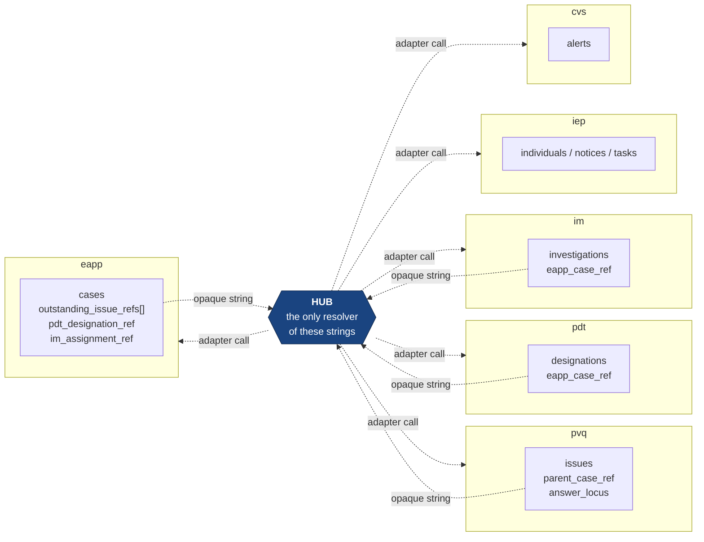

## 4. Data Model — Spoke Namespaces (Isolated)

Six namespaces: `eapp`, `pvq`, `iep`, `pdt`, `im`, `cvs`. Each is owned by exactly one service with exactly one credential. **No table is shared. No foreign key crosses a schema boundary anywhere in this document.**

Cross-system relationships exist only as opaque strings — `subject_ref`, `parent_case_ref`, `eapp_case_ref`, `outstanding_issue_refs`, `pdt_designation_ref`, `im_assignment_ref` — stored by the owning service and **resolved exclusively by the hub, through adapters**. A spoke stores such a string and returns it. It never dereferences it, because it has neither the grant nor an HTTP client with which to try.

---

### 4.1 Conventions Applied to Every Spoke

Every domain table carries these four columns unless explicitly noted:

```sql
  synthetic_marker VARCHAR(16) NOT NULL DEFAULT 'DEMO-SYNTHETIC',  -- FR-F17-08
  state_version    VARCHAR(32) NOT NULL,   -- content hash of user-visible fields
  created_at       TIMESTAMPTZ NOT NULL DEFAULT now(),
  updated_at       TIMESTAMPTZ NOT NULL DEFAULT now()
```

`state_version` is recomputed by `@ual/spoke-kit` on every write as `sha256(json(user_visible_fields)).slice(0,32)`. It backs optimistic concurrency (`FR-F02-05` rule 5) and is asserted by the conformance suite to change after a mutation and to remain stable otherwise.

Every spoke also carries two operational tables, created identically from a shared migration template:

```sql
-- <ns> ∈ {eapp, pvq, iep, pdt, im, cvs}

CREATE TABLE <ns>.idempotency_records (          -- FR-F09-07 rule 3
  idempotency_key VARCHAR(26)  PRIMARY KEY,
  request_hash    VARCHAR(64)  NOT NULL,
  response_status SMALLINT     NOT NULL,
  response_body   JSONB        NOT NULL,
  created_at      TIMESTAMPTZ  NOT NULL DEFAULT now(),
  expires_at      TIMESTAMPTZ  NOT NULL          -- created_at + 24h
);
CREATE INDEX ix_<ns>_idem_expiry ON <ns>.idempotency_records(expires_at);

CREATE TABLE <ns>.injection_state (              -- FR-F16-11, demo failure injection
  id             SMALLINT    PRIMARY KEY DEFAULT 1 CHECK (id = 1),
  mode           VARCHAR(16) NOT NULL DEFAULT 'NORMAL'
                   CHECK (mode IN ('NORMAL','UNAVAILABLE','SLOW','ERROR')),
  slow_ms        INTEGER     NULL CHECK (slow_ms BETWEEN 100 AND 30000),
  error_rate_pct SMALLINT    NULL CHECK (error_rate_pct BETWEEN 1 AND 100),
  expires_at     TIMESTAMPTZ NULL
);
INSERT INTO <ns>.injection_state (id, mode) VALUES (1, 'NORMAL');
```

Injection state living **inside the spoke's own schema** is deliberate: the failure is genuinely inside the service being demonstrated, not a hub-side mock that intercepts calls. A reviewer who inspects the spoke sees a service that is actually misbehaving.

---

### 4.2 Cross-Namespace Reference Map



`subject_ref` (`SUBJ-#####`) identifies the same synthetic person in all six namespaces. That coherence is a property of the **seed generator**, not of the schema — there is no shared `subjects` table and there cannot be one. `FR-F17-04` rule 5 requires the generator to emit a manifest of every cross-namespace reference, and seed validation asserts each one resolves in its target namespace. One reference is a deliberate orphan (`FR-F17-04` rule 6) so that `INTEGRATION_REFERENCE_MISMATCH` handling is demonstrable rather than theoretical.

**Relationship ownership.** PVQ owns the eApp↔PVQ relationship: it stores `parent_system`, `parent_case_ref`, `answer_locus`, `answer_section_label`, `answer_snapshot`, and `subject_ref`. eApp stores only a count and a list of opaque strings and knows nothing about issue content. The hub cross-checks `subject_ref` agreement between the two systems before rendering the relationship; a mismatch renders as unconfirmable with an issue logged, never as a silently dropped or silently displayed link (`Y3 §3`).

---

### 4.3 `eapp` — Electronic Application

```sql
-- ============================================================================
-- 110_eapp.sql   credential: eapp_service
-- ============================================================================

CREATE TABLE eapp.subjects (
  subject_ref      VARCHAR(32)  PRIMARY KEY,      -- 'SUBJ-00418'; opaque, no FK anywhere
  display_name     VARCHAR(120) NOT NULL,
  date_of_birth    DATE         NOT NULL,         -- fabricated
  synthetic_ssn    VARCHAR(11)  NOT NULL,         -- '900-00-####', never-issued range
  email            VARCHAR(160) NOT NULL,         -- '@example.invalid'
  phone            VARCHAR(20)  NOT NULL,         -- '555-01##'
  address_line     VARCHAR(160) NOT NULL,
  postal_code      VARCHAR(10)  NOT NULL,         -- '000##', invalid by construction
  synthetic_marker VARCHAR(16)  NOT NULL DEFAULT 'DEMO-SYNTHETIC'
);

CREATE TABLE eapp.cases (
  case_id                 VARCHAR(32)  PRIMARY KEY,    -- 'CASE-A-1042'
  subject_ref             VARCHAR(32)  NOT NULL REFERENCES eapp.subjects(subject_ref),
  case_state              VARCHAR(40)  NOT NULL CHECK (case_state IN
                            ('DRAFT','SUBMITTED','UNDER_REVIEW','INFORMATION_REQUESTED',
                             'REVIEW_COMPLETE_PENDING_ADJUDICATION','ADJUDICATED','CLOSED')),
  sensitivity_tier        VARCHAR(4)   NOT NULL CHECK (sensitivity_tier IN ('T1','T3','T5')),
  organization            VARCHAR(64)  NOT NULL,       -- ABAC input, returned to the hub
  region                  VARCHAR(32)  NOT NULL,       -- ABAC input
  assigned_principal_id   VARCHAR(26)  NULL,           -- hub principal id; opaque to eApp
  assigned_display_name   VARCHAR(120) NULL,
  priority                VARCHAR(12)  NOT NULL DEFAULT 'ROUTINE'
                            CHECK (priority IN ('ROUTINE','ELEVATED','URGENT')),
  submitted_at            TIMESTAMPTZ  NULL,
  due_date                DATE         NULL,
  outstanding_issue_count SMALLINT     NOT NULL DEFAULT 0 CHECK (outstanding_issue_count >= 0),
  outstanding_issue_refs  JSONB        NOT NULL DEFAULT '[]',   -- ["ISS-2207"] OPAQUE PVQ refs
  pdt_designation_ref     VARCHAR(32)  NULL,           -- opaque PDT ref, never dereferenced here
  im_assignment_ref       VARCHAR(32)  NULL,           -- opaque IM ref, never dereferenced here
  last_activity_at        TIMESTAMPTZ  NOT NULL DEFAULT now(),
  synthetic_marker        VARCHAR(16)  NOT NULL DEFAULT 'DEMO-SYNTHETIC',
  state_version           VARCHAR(32)  NOT NULL,
  created_at              TIMESTAMPTZ  NOT NULL DEFAULT now(),
  updated_at              TIMESTAMPTZ  NOT NULL DEFAULT now()
);
CREATE INDEX ix_eapp_cases_subject  ON eapp.cases(subject_ref);
CREATE INDEX ix_eapp_cases_assignee ON eapp.cases(assigned_principal_id);
CREATE INDEX ix_eapp_cases_org      ON eapp.cases(organization, region);
CREATE INDEX ix_eapp_cases_state    ON eapp.cases(case_state, due_date);

CREATE TABLE eapp.questionnaire_sections (
  section_id    VARCHAR(48)  PRIMARY KEY,         -- 'CASE-A-1042#SECTION_13A'
  case_id       VARCHAR(32)  NOT NULL REFERENCES eapp.cases(case_id) ON DELETE CASCADE,
  section_code  VARCHAR(24)  NOT NULL,            -- 'SECTION_13A' — the anchorable locus
  section_label VARCHAR(120) NOT NULL,            -- 'Section 13A — Employment history'
  sort_order    SMALLINT     NOT NULL,
  completed     BOOLEAN      NOT NULL DEFAULT TRUE,
  UNIQUE (case_id, section_code)
);

CREATE TABLE eapp.answers (
  answer_id     VARCHAR(48)   PRIMARY KEY,
  section_id    VARCHAR(48)   NOT NULL REFERENCES eapp.questionnaire_sections(section_id)
                                ON DELETE CASCADE,
  answer_path   VARCHAR(120)  NOT NULL,           -- 'employer[0].endDate' — PVQ's answer_locus target
  question_text VARCHAR(500)  NOT NULL,
  answer_text   VARCHAR(2000) NOT NULL,
  UNIQUE (section_id, answer_path)
);

CREATE TABLE eapp.case_activity (                 -- eApp's OWN history, independent of hub audit
  activity_id        VARCHAR(26)  PRIMARY KEY,
  case_id            VARCHAR(32)  NOT NULL REFERENCES eapp.cases(case_id) ON DELETE CASCADE,
  occurred_at        TIMESTAMPTZ  NOT NULL DEFAULT now(),
  actor_display_name VARCHAR(120) NOT NULL,
  actor_principal_id VARCHAR(26)  NULL,
  action             VARCHAR(48)  NOT NULL,
  summary            VARCHAR(500) NOT NULL,
  correlation_id     VARCHAR(26)  NULL             -- echoed from the hub; enables cross-referencing
);
CREATE INDEX ix_eapp_activity      ON eapp.case_activity(case_id, occurred_at DESC);
CREATE INDEX ix_eapp_activity_corr ON eapp.case_activity(correlation_id);
```

**The behavior that makes the flagship retry safe.** `CLEAR_OUTSTANDING_ISSUE(issue_ref)` removes `issue_ref` from `outstanding_issue_refs` if present and decrements the count; if the reference is **absent it is a no-op returning success**. That idempotency, combined with a stable idempotency key, is precisely why the orchestration engine can retry the eApp leg without risking a double decrement (`FR-F07b-03` rule 4). When the count transitions from non-zero to zero, `case_state` moves `UNDER_REVIEW → REVIEW_COMPLETE_PENDING_ADJUDICATION`.

---

### 4.4 `pvq` — Personnel Vetting Questionnaire

```sql
-- ============================================================================
-- 120_pvq.sql   credential: pvq_service
-- ============================================================================

CREATE TABLE pvq.questionnaires (
  questionnaire_id     VARCHAR(32)  PRIMARY KEY,
  subject_ref          VARCHAR(32)  NOT NULL,     -- same string as eapp.subjects — NO FK
  subject_display_name VARCHAR(120) NOT NULL,
  form_type            VARCHAR(40)  NOT NULL,
  submitted_at         TIMESTAMPTZ  NULL,
  status               VARCHAR(24)  NOT NULL,
  synthetic_marker     VARCHAR(16)  NOT NULL DEFAULT 'DEMO-SYNTHETIC',
  state_version        VARCHAR(32)  NOT NULL,
  created_at           TIMESTAMPTZ  NOT NULL DEFAULT now(),
  updated_at           TIMESTAMPTZ  NOT NULL DEFAULT now()
);
CREATE INDEX ix_pvq_q_subject ON pvq.questionnaires(subject_ref);

-- PVQ OWNS the eApp↔PVQ relationship. This table is the flagship workflow.
CREATE TABLE pvq.issues (
  issue_id                 VARCHAR(32)   PRIMARY KEY,     -- 'ISS-2207'
  questionnaire_id         VARCHAR(32)   NULL REFERENCES pvq.questionnaires(questionnaire_id),
  subject_ref              VARCHAR(32)   NOT NULL,        -- hub cross-checks against eApp's subject
  subject_display_name     VARCHAR(120)  NOT NULL,
  parent_system            VARCHAR(16)   NOT NULL DEFAULT 'EAPP',
  parent_case_ref          VARCHAR(32)   NOT NULL,        -- 'CASE-A-1042' — OPAQUE, never queried
  answer_locus             VARCHAR(160)  NOT NULL,        -- 'SECTION_13A.employer[0].endDate'
  answer_section_label     VARCHAR(120)  NOT NULL,        -- 'Section 13A — Employment history'
  answer_snapshot          VARCHAR(2000) NOT NULL,        -- the answer as it stood when raised
  title                    VARCHAR(160)  NOT NULL,
  description              VARCHAR(2000) NOT NULL,
  status                   VARCHAR(32)   NOT NULL CHECK (status IN
                             ('OPEN','IN_REVIEW','RESOLVED_SUBSTANTIATED','RESOLVED_UNSUBSTANTIATED',
                              'RESOLVED_WITH_CLARIFICATION','REFERRED')),
  priority                 VARCHAR(12)   NOT NULL DEFAULT 'ELEVATED'
                             CHECK (priority IN ('ROUTINE','ELEVATED','URGENT')),
  organization             VARCHAR(64)   NOT NULL,
  region                   VARCHAR(32)   NOT NULL,
  assigned_principal_id    VARCHAR(26)   NULL,
  assigned_display_name    VARCHAR(120)  NULL,
  raised_at                TIMESTAMPTZ   NOT NULL,
  due_date                 DATE          NULL,
  disposition              VARCHAR(32)   NULL CHECK (disposition IN
                             ('SUBSTANTIATED','UNSUBSTANTIATED','RESOLVED_WITH_CLARIFICATION',
                              'REFERRED_FOR_FURTHER_REVIEW')),
  resolution_narrative     VARCHAR(4000) NULL,
  resolved_by              VARCHAR(120)  NULL,
  resolved_by_principal_id VARCHAR(26)   NULL,
  resolved_at              TIMESTAMPTZ   NULL,
  last_activity_at         TIMESTAMPTZ   NOT NULL DEFAULT now(),
  synthetic_marker         VARCHAR(16)   NOT NULL DEFAULT 'DEMO-SYNTHETIC',
  state_version            VARCHAR(32)   NOT NULL,
  created_at               TIMESTAMPTZ   NOT NULL DEFAULT now(),
  updated_at               TIMESTAMPTZ   NOT NULL DEFAULT now(),
  -- A resolved issue must carry its disposition and its resolver.
  CHECK (status NOT LIKE 'RESOLVED%' OR (disposition IS NOT NULL AND resolved_at IS NOT NULL))
);
CREATE INDEX ix_pvq_issues_parent  ON pvq.issues(parent_system, parent_case_ref);
CREATE INDEX ix_pvq_issues_subject ON pvq.issues(subject_ref);
CREATE INDEX ix_pvq_issues_status  ON pvq.issues(status, due_date);
CREATE INDEX ix_pvq_issues_org     ON pvq.issues(organization, region);

CREATE TABLE pvq.issue_activity (
  activity_id        VARCHAR(26)  PRIMARY KEY,
  issue_id           VARCHAR(32)  NOT NULL REFERENCES pvq.issues(issue_id) ON DELETE CASCADE,
  occurred_at        TIMESTAMPTZ  NOT NULL DEFAULT now(),
  actor_display_name VARCHAR(120) NOT NULL,
  actor_principal_id VARCHAR(26)  NULL,
  action             VARCHAR(48)  NOT NULL,
  summary            VARCHAR(500) NOT NULL,
  correlation_id     VARCHAR(26)  NULL
);
CREATE INDEX ix_pvq_activity      ON pvq.issue_activity(issue_id, occurred_at DESC);
CREATE INDEX ix_pvq_activity_corr ON pvq.issue_activity(correlation_id);
```

**Behavior.** `RESOLVE_ISSUE` is permitted only from `OPEN` or `IN_REVIEW`; from any resolved state it returns `422 ACTION_REJECTED` with the user-safe message *"This issue has already been resolved."* It is idempotent on `X-UAL-Idempotency-Key`. `parent_case_ref` is stored and returned, and never dereferenced — PVQ does not know what an eApp case is.

---

### 4.5 `iep` — Individual Engagement Portal

```sql
-- ============================================================================
-- 130_iep.sql   credential: iep_service
-- ============================================================================

CREATE TABLE iep.individuals (
  subject_ref      VARCHAR(32)  PRIMARY KEY,      -- same string as eApp/PVQ — NO FK
  display_name     VARCHAR(120) NOT NULL,
  email            VARCHAR(160) NOT NULL,         -- '@example.invalid'
  synthetic_marker VARCHAR(16)  NOT NULL DEFAULT 'DEMO-SYNTHETIC'
);

CREATE TABLE iep.status_records (
  status_record_id  VARCHAR(32)  PRIMARY KEY,
  subject_ref       VARCHAR(32)  NOT NULL REFERENCES iep.individuals(subject_ref),
  stage             VARCHAR(32)  NOT NULL CHECK (stage IN
                      ('SUBMITTED','UNDER_REVIEW','INFORMATION_REQUESTED','COMPLETE')),
  stage_explanation VARCHAR(500) NOT NULL,        -- plain-language copy stored as DATA, not code
  updated_at        TIMESTAMPTZ  NOT NULL DEFAULT now(),
  state_version     VARCHAR(32)  NOT NULL,
  synthetic_marker  VARCHAR(16)  NOT NULL DEFAULT 'DEMO-SYNTHETIC'
);
CREATE INDEX ix_iep_status_subject ON iep.status_records(subject_ref);

CREATE TABLE iep.notices (
  notice_id        VARCHAR(32)   PRIMARY KEY,
  subject_ref      VARCHAR(32)   NOT NULL REFERENCES iep.individuals(subject_ref),
  title            VARCHAR(160)  NOT NULL,
  body             VARCHAR(4000) NOT NULL,
  severity         VARCHAR(12)   NOT NULL CHECK (severity IN ('INFO','ACTION_REQUIRED','URGENT')),
  issued_at        TIMESTAMPTZ   NOT NULL,
  read_at          TIMESTAMPTZ   NULL,            -- IEP owns read state for ITS notices
  state_version    VARCHAR(32)   NOT NULL,
  synthetic_marker VARCHAR(16)   NOT NULL DEFAULT 'DEMO-SYNTHETIC'
);
CREATE INDEX ix_iep_notices_subject ON iep.notices(subject_ref, issued_at DESC);

CREATE TABLE iep.tasks (
  task_id          VARCHAR(32)   PRIMARY KEY,
  subject_ref      VARCHAR(32)   NOT NULL REFERENCES iep.individuals(subject_ref),
  title            VARCHAR(160)  NOT NULL,
  description      VARCHAR(2000) NOT NULL,
  consequence_text VARCHAR(500)  NOT NULL,        -- "what happens if you don't act", plain language
  status           VARCHAR(16)   NOT NULL CHECK (status IN ('OPEN','COMPLETE')),
  due_date         DATE          NULL,
  response_schema  JSONB         NULL,            -- drives the completion form
  response_payload JSONB         NULL,
  completed_at     TIMESTAMPTZ   NULL,
  last_activity_at TIMESTAMPTZ   NOT NULL DEFAULT now(),
  state_version    VARCHAR(32)   NOT NULL,
  synthetic_marker VARCHAR(16)   NOT NULL DEFAULT 'DEMO-SYNTHETIC',
  CHECK (status <> 'COMPLETE' OR completed_at IS NOT NULL)
);
CREATE INDEX ix_iep_tasks_subject ON iep.tasks(subject_ref, status, due_date);

CREATE TABLE iep.iep_activity (
  activity_id        VARCHAR(26)  PRIMARY KEY,
  target_type        VARCHAR(16)  NOT NULL CHECK (target_type IN ('NOTICE','TASK','STATUS')),
  target_id          VARCHAR(32)  NOT NULL,
  occurred_at        TIMESTAMPTZ  NOT NULL DEFAULT now(),
  actor_display_name VARCHAR(120) NOT NULL,
  action             VARCHAR(48)  NOT NULL,
  summary            VARCHAR(500) NOT NULL,
  correlation_id     VARCHAR(26)  NULL
);
CREATE INDEX ix_iep_activity ON iep.iep_activity(target_type, target_id, occurred_at DESC);
```

**Scope note.** IEP accepts `mode: SUBJECT` only. A request arriving with `mode: ASSIGNEE_OR_UNIT` or `ORG` returns `400 SCOPE_REQUIRED` with detail *"This service serves individual-scoped requests only."* IEP is registered `visibleToRoles: ["APPLICANT"]`. This makes IEP the demonstration that `visibleToRoles` is a restriction rather than a grant.

---

### 4.6 `pdt` — Position Designation Tool

```sql
-- ============================================================================
-- 140_pdt.sql   credential: pdt_service
-- tier_rules is created FIRST: designations carries a FK to it.
-- ============================================================================

CREATE TABLE pdt.tier_rules (                     -- the rule is DATA so the UI can display it
  rule_id            VARCHAR(24)  PRIMARY KEY,
  sensitivity_level  VARCHAR(32)  NOT NULL,
  risk_level         VARCHAR(12)  NOT NULL,
  investigation_tier VARCHAR(4)   NOT NULL CHECK (investigation_tier IN ('T1','T3','T5')),
  rule_text          VARCHAR(500) NOT NULL,
  UNIQUE (sensitivity_level, risk_level)
);

CREATE TABLE pdt.positions (
  position_id      VARCHAR(32)  PRIMARY KEY,
  title            VARCHAR(160) NOT NULL,
  organization     VARCHAR(64)  NOT NULL,
  region           VARCHAR(32)  NOT NULL,
  synthetic_marker VARCHAR(16)  NOT NULL DEFAULT 'DEMO-SYNTHETIC'
);

CREATE TABLE pdt.designations (
  designation_id     VARCHAR(32)   PRIMARY KEY,   -- 'DSG-0431'
  position_id        VARCHAR(32)   NOT NULL REFERENCES pdt.positions(position_id),
  subject_ref        VARCHAR(32)   NULL,          -- opaque
  eapp_case_ref      VARCHAR(32)   NULL,          -- opaque eApp ref; PDT never queries eApp
  sensitivity_level  VARCHAR(32)   NOT NULL CHECK (sensitivity_level IN
                       ('NON_SENSITIVE','NONCRITICAL_SENSITIVE','CRITICAL_SENSITIVE','SPECIAL_SENSITIVE')),
  risk_level         VARCHAR(12)   NOT NULL CHECK (risk_level IN ('LOW','MODERATE','HIGH')),
  investigation_tier VARCHAR(4)    NOT NULL CHECK (investigation_tier IN ('T1','T3','T5')),
  tier_rule_id       VARCHAR(24)   NOT NULL REFERENCES pdt.tier_rules(rule_id),
  status             VARCHAR(20)   NOT NULL CHECK (status IN
                       ('DRAFT','PENDING_REVIEW','APPROVED','RETURNED')),
  organization       VARCHAR(64)   NOT NULL,
  region             VARCHAR(32)   NOT NULL,
  reviewed_by        VARCHAR(120)  NULL,
  reviewed_at        TIMESTAMPTZ   NULL,
  return_reason      VARCHAR(1000) NULL,
  last_activity_at   TIMESTAMPTZ   NOT NULL DEFAULT now(),
  -- DELIBERATE OMISSION: no due_date column and no priority column. PDT declares
  -- priorityNative:false and emits no dueDate, which exercises the hub's normalization
  -- rules and the "Priority not provided by PDT" / nulls-last sorting affordances.
  synthetic_marker   VARCHAR(16)   NOT NULL DEFAULT 'DEMO-SYNTHETIC',
  state_version      VARCHAR(32)   NOT NULL,
  created_at         TIMESTAMPTZ   NOT NULL DEFAULT now(),
  updated_at         TIMESTAMPTZ   NOT NULL DEFAULT now(),
  CHECK (status <> 'RETURNED' OR return_reason IS NOT NULL)
);
CREATE INDEX ix_pdt_desig_status  ON pdt.designations(status);
CREATE INDEX ix_pdt_desig_org     ON pdt.designations(organization, region);
CREATE INDEX ix_pdt_desig_case    ON pdt.designations(eapp_case_ref);

CREATE TABLE pdt.risk_factors (
  factor_id      VARCHAR(32)  PRIMARY KEY,
  designation_id VARCHAR(32)  NOT NULL REFERENCES pdt.designations(designation_id)
                                ON DELETE CASCADE,
  factor_code    VARCHAR(32)  NOT NULL,
  factor_label   VARCHAR(160) NOT NULL,
  weight         VARCHAR(12)  NOT NULL
);

CREATE TABLE pdt.designation_activity (
  activity_id        VARCHAR(26)  PRIMARY KEY,
  designation_id     VARCHAR(32)  NOT NULL REFERENCES pdt.designations(designation_id)
                                    ON DELETE CASCADE,
  occurred_at        TIMESTAMPTZ  NOT NULL DEFAULT now(),
  actor_display_name VARCHAR(120) NOT NULL,
  action             VARCHAR(48)  NOT NULL,
  summary            VARCHAR(500) NOT NULL,
  correlation_id     VARCHAR(26)  NULL
);
CREATE INDEX ix_pdt_activity ON pdt.designation_activity(designation_id, occurred_at DESC);
```

PDT is the schema that proves the normalization layer is real. A system that provides neither priority nor due dates must still produce sortable, filterable rows in a unified queue alongside four systems that do. If the hub had a hidden assumption that every source supplies both, PDT would break it — which is exactly why PDT is built this way.

---

### 4.7 `im` — Investigation Management

```sql
-- ============================================================================
-- 150_im.sql   credential: im_service
-- IM is the designated outage-demonstration spoke (FR-F09-06 rule 6).
-- ============================================================================

CREATE TABLE im.investigations (
  investigation_id     VARCHAR(32)  PRIMARY KEY,  -- 'INV-7741'
  subject_ref          VARCHAR(32)  NOT NULL,     -- opaque
  subject_display_name VARCHAR(120) NOT NULL,
  eapp_case_ref        VARCHAR(32)  NULL,         -- opaque
  title                VARCHAR(160) NOT NULL,
  status               VARCHAR(24)  NOT NULL CHECK (status IN
                         ('OPEN','IN_PROGRESS','PENDING_INFORMATION','COMPLETE','CLOSED')),
  priority             VARCHAR(12)  NOT NULL CHECK (priority IN ('ROUTINE','ELEVATED','URGENT')),
  sensitivity_tier     VARCHAR(4)   NOT NULL CHECK (sensitivity_tier IN ('T1','T3','T5')),
  organization         VARCHAR(64)  NOT NULL,
  region               VARCHAR(32)  NOT NULL,
  opened_at            TIMESTAMPTZ  NOT NULL,
  due_date             DATE         NULL,
  last_activity_at     TIMESTAMPTZ  NOT NULL DEFAULT now(),
  synthetic_marker     VARCHAR(16)  NOT NULL DEFAULT 'DEMO-SYNTHETIC',
  state_version        VARCHAR(32)  NOT NULL,
  created_at           TIMESTAMPTZ  NOT NULL DEFAULT now(),
  updated_at           TIMESTAMPTZ  NOT NULL DEFAULT now()
);
CREATE INDEX ix_im_inv_status  ON im.investigations(status, priority, due_date);
CREATE INDEX ix_im_inv_org     ON im.investigations(organization, region);
CREATE INDEX ix_im_inv_subject ON im.investigations(subject_ref);

CREATE TABLE im.assignments (
  assignment_id         VARCHAR(32)  PRIMARY KEY,
  investigation_id      VARCHAR(32)  NOT NULL REFERENCES im.investigations(investigation_id)
                                       ON DELETE CASCADE,
  assigned_principal_id VARCHAR(26)  NULL,        -- NULL = unassigned (a seeded edge state)
  assigned_native_user  VARCHAR(120) NULL,        -- set with NULL principal_id = unresolvable assignee
  assigned_display_name VARCHAR(120) NULL,
  assigned_at           TIMESTAMPTZ  NULL,
  accepted_at           TIMESTAMPTZ  NULL,
  due_date              DATE         NULL,
  state_version         VARCHAR(32)  NOT NULL
);
CREATE INDEX ix_im_assign_principal ON im.assignments(assigned_principal_id);
CREATE INDEX ix_im_assign_inv       ON im.assignments(investigation_id);

CREATE TABLE im.leads (
  lead_id          VARCHAR(32)   PRIMARY KEY,
  investigation_id VARCHAR(32)   NOT NULL REFERENCES im.investigations(investigation_id)
                                   ON DELETE CASCADE,
  title            VARCHAR(160)  NOT NULL,
  status           VARCHAR(20)   NOT NULL,
  due_date         DATE          NULL,
  notes            VARCHAR(4000) NULL,
  state_version    VARCHAR(32)   NOT NULL
);
CREATE INDEX ix_im_leads_inv ON im.leads(investigation_id);

CREATE TABLE im.investigator_workload (           -- derived; refreshed on assignment change
  principal_id  VARCHAR(26) PRIMARY KEY,
  open_count    INTEGER     NOT NULL DEFAULT 0,
  overdue_count INTEGER     NOT NULL DEFAULT 0,
  computed_at   TIMESTAMPTZ NOT NULL DEFAULT now()
);

CREATE TABLE im.im_activity (
  activity_id        VARCHAR(26)  PRIMARY KEY,
  investigation_id   VARCHAR(32)  NOT NULL REFERENCES im.investigations(investigation_id)
                                    ON DELETE CASCADE,
  occurred_at        TIMESTAMPTZ  NOT NULL DEFAULT now(),
  actor_display_name VARCHAR(120) NOT NULL,
  action             VARCHAR(48)  NOT NULL,
  summary            VARCHAR(500) NOT NULL,
  correlation_id     VARCHAR(26)  NULL
);
CREATE INDEX ix_im_activity ON im.im_activity(investigation_id, occurred_at DESC);
```

The `assigned_native_user IS NOT NULL AND assigned_principal_id IS NULL` combination is seeded deliberately: it produces an assignee the hub cannot resolve to a principal, so the UI must distinguish *"assigned to someone we can't resolve"* from *"unassigned."* Real integrations produce that state constantly; a prototype that cannot represent it is not modelling integration.

---

### 4.8 `cvs` — Continuous Vetting Service (the demo sixth application)

```sql
-- ============================================================================
-- 160_cvs.sql   credential: cvs_service
-- Data exists from first startup. NO hub.registered_applications row exists
-- until an administrator registers it live. Its invisibility is the demonstration.
-- ============================================================================

CREATE TABLE cvs.alerts (
  alert_id              VARCHAR(32)   PRIMARY KEY,   -- 'CVA-0091'
  subject_ref           VARCHAR(32)   NOT NULL,      -- opaque; coherent with other namespaces
  subject_display_name  VARCHAR(120)  NOT NULL,
  alert_type            VARCHAR(40)   NOT NULL,
  title                 VARCHAR(160)  NOT NULL,
  description           VARCHAR(2000) NOT NULL,
  status                VARCHAR(20)   NOT NULL CHECK (status IN
                          ('NEW','UNDER_REVIEW','CLEARED','ESCALATED')),
  priority              VARCHAR(12)   NOT NULL CHECK (priority IN ('ROUTINE','ELEVATED','URGENT')),
  organization          VARCHAR(64)   NOT NULL,
  region                VARCHAR(32)   NOT NULL,
  assigned_principal_id VARCHAR(26)   NULL,
  assigned_display_name VARCHAR(120)  NULL,
  raised_at             TIMESTAMPTZ   NOT NULL,
  due_date              DATE          NULL,
  clear_reason          VARCHAR(1000) NULL,
  last_activity_at      TIMESTAMPTZ   NOT NULL DEFAULT now(),
  synthetic_marker      VARCHAR(16)   NOT NULL DEFAULT 'DEMO-SYNTHETIC',
  state_version         VARCHAR(32)   NOT NULL,
  created_at            TIMESTAMPTZ   NOT NULL DEFAULT now(),
  updated_at            TIMESTAMPTZ   NOT NULL DEFAULT now(),
  CHECK (status <> 'CLEARED' OR clear_reason IS NOT NULL)
);
CREATE INDEX ix_cvs_alerts_status    ON cvs.alerts(status, priority);
CREATE INDEX ix_cvs_alerts_assignee  ON cvs.alerts(assigned_principal_id);
CREATE INDEX ix_cvs_alerts_org       ON cvs.alerts(organization, region);

CREATE TABLE cvs.alert_activity (
  activity_id        VARCHAR(26)  PRIMARY KEY,
  alert_id           VARCHAR(32)  NOT NULL REFERENCES cvs.alerts(alert_id) ON DELETE CASCADE,
  occurred_at        TIMESTAMPTZ  NOT NULL DEFAULT now(),
  actor_display_name VARCHAR(120) NOT NULL,
  action             VARCHAR(48)  NOT NULL,
  summary            VARCHAR(500) NOT NULL,
  correlation_id     VARCHAR(26)  NULL
);
CREATE INDEX ix_cvs_activity ON cvs.alert_activity(alert_id, occurred_at DESC);
```

**CVS is architecturally unremarkable, and that is the entire argument.** It is the same Fastify service built from the same `@ual/spoke-kit`, with the same eight-operation adapter, the same `/health`, the same `/describe`, and the same error taxonomy. Nothing anywhere in the hub mentions it. It is invisible to every user until an administrator inserts a row in `hub.registered_applications`, and visible to the right users within one 30-second `registryVersion` poll afterwards.

---

### 4.9 Isolation Verification Checklist

Each row is an automated assertion in `tests/integration/isolation.spec.ts`, executed in CI and re-runnable by an evaluator with `./run.sh test isolation`.

| # | Assertion | Method | Requirement |
|---|---|---|---|
| 1 | No cross-schema foreign key exists | `information_schema.table_constraints` join `key_column_usage`: for every FK, `constraint_schema == referenced schema` | `Y0b` checklist |
| 2 | No table name appears in two schemas holding shared data | Schema inventory diff over `information_schema.tables` | `Y0b` checklist |
| 3 | Each service credential can read only its own schema | For each of 7 roles × 6 foreign schemas, attempt a `SELECT`; require `42501` on all 42 | `FR-F19-03` item 8 |
| 4 | The hub holds no grant on any spoke schema | `has_schema_privilege('hub_service', <ns>, 'USAGE')` false for all six | `Y0b` checklist row 5 |
| 5 | No spoke calls another spoke | No HTTP client in any spoke package's dependency tree; zero spoke→spoke connections observed during the E2E run | `FR-F09-01` rule 4 |
| 6 | Cross-system references are unconstrained strings | Named columns appear in zero `pg_constraint` rows of type `'f'` | `Y0b` checklist row 6 |
| 7 | `hub.audit_events` denies UPDATE and DELETE | `UPDATE` as `hub_service` raises `42501` | `FR-F13-03` rule 2 |
| 8 | Every record carries a synthetic marker | `SELECT count(*) FROM <every domain table> WHERE synthetic_marker IS DISTINCT FROM 'DEMO-SYNTHETIC'` returns 0 | `FR-F17-08` AC-2 |

---
