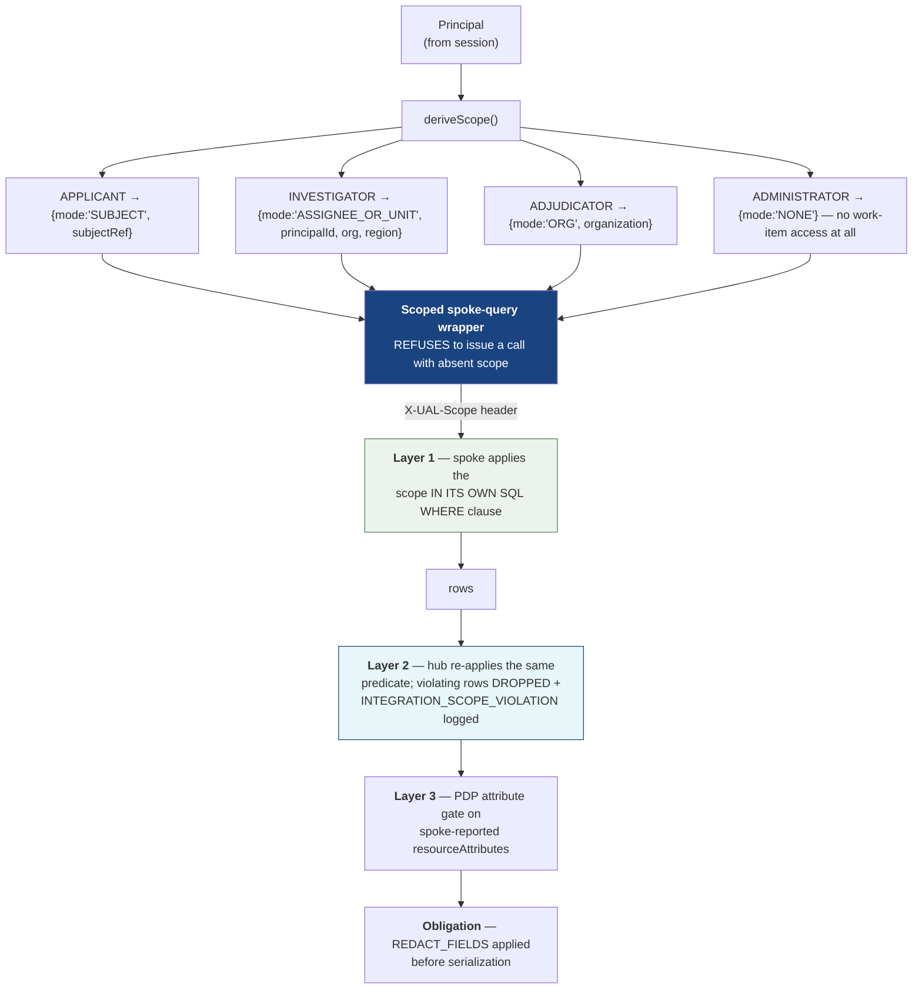

## 8. Security Architecture

The zero-trust posture is an evaluated dimension, so it has to be visible rather than merely present. This chunk states where each decision is made, what it consumes, and — for each claim — the mechanism that makes the claim structurally true rather than conventionally true.

---

### 8.1 Authentication: Three Simulated Identity Providers

Authentication is **simulated**. No certificate is parsed, no signature is checked, no credential is validated against any authority. Every authentication screen says so, and the words "verified," "validated," "authenticated against," and "trusted certificate" are prohibited in user-facing copy and asserted absent by a content scan (`FR-F00-08`, `Y2 §12`).

The three paths are genuinely separate providers, not one provider with three skins:

| Path | Identity pool | Selection mechanism | Distinctness |
|---|---|---|---|
| **CAC/PIV** | `user_auth_methods` where `method_id='CAC_PIV'` | A simulated certificate picker listing synthetic subjects, issuers (`DEMO-DOD-CA-59 (synthetic)`), serials (`00:DEMO:…`), and validity dates | Its own issuer namespace |
| **ECA** | `method_id='ECA'` | A separate external-CA flow with its own identity set and its own issuer namespace (`DEMO-ECA-VENDOR-07 (synthetic)`) | **Partially disjoint pool** — Ingrid L. Vasterling exists only here, which is why this is multi-IdP support and not a skin |
| **Generic MFA** | `method_id='GENERIC_MFA'` | Username, then a deterministic six-digit demo code shown on screen | Its own credential shape entirely |

```mermaid
sequenceDiagram
    participant B as Browser
    participant H as Hub
    participant DB as hub schema

    B->>H: GET /api/auth/methods
    H-->>B: 3 methods, each with simulationNotice

    B->>H: POST /api/auth/initiate {methodId:"CAC_PIV"}
    H->>DB: INSERT auth_transactions (AWAITING_SELECTION, 5 min TTL)
    H-->>B: transactionId + synthetic identities (fabricated cert detail)

    B->>H: POST /api/auth/complete {transactionId, identityId}
    H->>DB: consume transaction (single-use), load user + roles + attributes
    H->>DB: INSERT sessions (idle 30m, absolute 8h, authEventCount = 1)
    H->>DB: INSERT audit_events (AUTH_SUCCESS)
    H-->>B: Set-Cookie ual_session=<signed sessionId>; HttpOnly; Secure; SameSite=Lax
    Note over B,H: The cookie carries a signed sessionId and NOTHING else.<br/>No roles. No attributes. No entitlements. Editing it<br/>invalidates the session rather than escalating anything.
```

**Where the simulation is confined.** The simulated portion is exactly one boundary: which row of `hub.users` this session belongs to. Session issuance, principal propagation, authorization, and audit are all real mechanisms operating on a real session. Replacing the three simulated paths with real IdP integrations would change the code behind `/api/auth/*` and nothing else — a property worth stating because it is what makes the prototype's security architecture meaningful despite its fake front door (`Y3 §4`).

---

### 8.2 Session and SSO Propagation

**The hub session.** One row in `hub.sessions`, keyed by a signed `HttpOnly; Secure; SameSite=Lax` cookie whose value is the `sessionId` alone. The principal — roles, attributes, active role — is **rebuilt from the database on every request**. A stale in-memory copy must not outlive a request, because the moment it does, a role change stops taking effect and the audit snapshot stops being trustworthy.

Session validation on every request: signature valid, `sessionId` exists, `status='ACTIVE'`, `now < idle_expires_at`, `now < absolute_expires_at`, and `user_agent_hash` matches. A mismatch terminates the session rather than escalating anything.

**CSRF.** A separate readable cookie plus a required `X-CSRF-Token` header on every mutation. Missing or mismatched → `403 CSRF_REJECTED`, audited as `AUTHZ_DENIED`.

**SSO to the spokes** is the interesting part. The user authenticates once; five other services must then act on that user's behalf without ever seeing the browser.

```mermaid
sequenceDiagram
    participant B as Browser
    participant H as Hub (PEP + PDP)
    participant A as PVQ adapter
    participant S as PVQ service

    B->>H: GET /api/work-items/PVQ:ISS-2207  (session cookie)
    H->>H: resolve Principal from hub.sessions (DB, every request)
    H->>H: PDP.authorize(READ, ISSUE, PVQ:ISS-2207)
    H->>H: deriveScope(principal) → {mode:'ASSIGNEE_OR_UNIT', ...}
    H->>A: callSpoke(...) with ctx
    A->>A: mint Ed25519 assertion, aud='PVQ', exp=now+5m
    A->>S: GET /issues/ISS-2207<br/>X-UAL-Principal, X-UAL-Scope, X-UAL-Deadline, X-UAL-Correlation-Id
    S->>S: verify signature + aud==='PVQ' + exp; parse scope
    S->>S: SELECT ... WHERE (scope predicate) — applied IN THE QUERY
    S-->>A: issue + resourceAttributes (org, region, subjectRef, assignee)
    A-->>H: normalized WorkItem
    H->>H: re-apply ownership predicate (defense in depth)
    H->>H: PDP attribute gate against the SPOKE-REPORTED attributes
    H->>H: audit WORK_ITEM_VIEWED
    H-->>B: 200 detail
```

Five properties fall out of that sequence, each separately tested:

1. **Exactly one authentication event per session.** `authEventCount` is exposed at `GET /api/session` and asserted `=== 1` across a traversal touching all five spokes (`SM-02`).
2. **The browser never talks to a spoke.** All spoke data arrives through hub BFF endpoints. The UI contains no link, iframe, or redirect whose origin is a spoke, asserted by a link crawl.
3. **A spoke-side failure never becomes a login prompt.** The hub emits no 401 to the browser while the hub session remains valid; a spoke denial surfaces as `AUTHZ_DENIED_UPSTREAM` — a permission message, not a credential challenge.
4. **Assertions are audience-bound and short-lived.** Five minutes, minted fresh per call, `aud` equal to one application. Replaying a PVQ assertion at eApp fails.
5. **Logout is complete.** Every held `spoke_contexts` handle is revoked, the rows are deleted, and the session row moves to `TERMINATED`. Revocation failures are logged as integration issues and do not block termination.

---

### 8.3 The Policy Decision Point

There is exactly one `authorize()` function. No endpoint hand-rolls a check, and a route that fails to declare its required `action` prevents the process from starting.

```ts
// packages/policy/src/authorize.ts

export interface AuthzRequest {
  principal: Principal;                    // FROM THE SESSION. Never from body, query, or header.
  action: string;                          // 'WORK_ITEM.ACT', 'ADMIN.APP.REGISTER', …
  resourceType: 'WORK_ITEM'|'CASE'|'ISSUE'|'APPLICATION'|'ANNOUNCEMENT'
              | 'AUDIT_RECORD'|'USER'|'DASHBOARD'|'NAV';
  resourceRef: { sourceSystem: string; nativeId: string } | null;
  /** From the OWNING SPOKE's response. Never from the client. */
  resourceAttributes: {
    assigneeId: string | null; subjectRef: string | null;
    organization: string | null; region: string | null;
    sensitivityTier: 'T1'|'T3'|'T5' | null; statusCategory: StatusCategory | null;
  } | null;
  context: { correlationId: string; requestId: string; method: string;
             path: string; now: Date; sourceHealth: HealthStatus };
}

export interface Decision {
  effect: 'ALLOW' | 'DENY';
  reasonCode: string;
  ruleId: string | null;                   // 'ATTR-INV-03' — surfaced in the audit record
  obligations: Array<{ kind: 'REDACT_FIELDS'; fields: string[] }>;
}

/** TOTAL by construction: every path returns. There is no default-allow branch. */
export function authorize(req: AuthzRequest): Decision {
  // 1 SESSION GATE
  if (!req.principal || !isActiveSession(req.principal)) return deny('SESSION_INVALID');

  // activeRole must still be one of roles — re-checked HERE, not trusted from the session blob
  if (!req.principal.roles.includes(req.principal.activeRole)) return deny('ROLE_NOT_HELD');

  // 2 ROLE GATE — the matrix is DATA (hub.role_permissions), not code branches
  if (!roleMatrix.permits(req.principal.activeRole, req.action)) return deny('AUTHZ_DENIED');

  // 3 ATTRIBUTE GATE — conjunctive; first failing rule's id is returned and audited
  for (const rule of attributeRules.for(req.principal.activeRole, req.resourceType, req.action)) {
    // Fail CLOSED: a rule needing an attribute the spoke did not supply is a DENY,
    // never an implicit pass. A missing input is not a permission.
    const outcome = evaluate(rule, req.principal, req.resourceAttributes);
    if (outcome !== 'PASS') {
      return deny(outcome === 'MISSING_INPUT' ? 'INSUFFICIENT_RESOURCE_ATTRIBUTES'
                                              : 'AUTHZ_DENIED', rule.ruleId);
    }
  }

  // 4 OWNERSHIP GATE — resource-scoped decisions only
  if (req.resourceRef && !ownershipPredicate(req.principal).permits(req.resourceAttributes)) {
    return deny('AUTHZ_DENIED');
  }

  // 5 ACTION-STATE GATE — for *.ACT, re-verified against FRESHLY FETCHED state
  if (req.action.endsWith('.ACT') &&
      !serverComputedActions(req.principal, req.resourceRef!).some(a => a.enabled)) {
    return deny('ACTION_NOT_AVAILABLE');
  }

  return { effect: 'ALLOW', reasonCode: 'OK', ruleId: null,
           obligations: redactionsFor(req.principal, req.resourceType) };
}
```

**Decisions are computed fresh per request.** Caching a decision beyond the request is prohibited. Entitlements may be cached for rendering for at most 60 seconds, and are never load-bearing.

#### The role permission matrix

Held in `hub.role_permissions` as data, rendered read-only in the admin console so a reviewer can read the policy rather than infer it. Adding a permission is an `INSERT`, never a deployment.

| Action | Investigator | Adjudicator | Applicant | Administrator |
|---|:--:|:--:|:--:|:--:|
| `NAV.READ`, `DASHBOARD.READ` | ✓ | ✓ | ✓ | ✓ |
| `WORK_QUEUE.LIST`, `WORK_ITEM.READ` | ✓ | ✓ | ✓ | — |
| `WORK_ITEM.ACT` | ✓ | ✓ | ✓ (own tasks) | — |
| `CASE.READ` | ✓ | ✓ | ✓ (own) | — |
| `ISSUE.READ` | ✓ | ✓ | — | — |
| **`ISSUE.RESOLVE`** | **✓** | — | — | — |
| `ISSUE.REQUEST_CLARIFICATION` | ✓ | ✓ | — | — |
| `CASE.ADJUDICATE` | — | ✓ | — | — |
| `DESIGNATION.READ` | ✓ | ✓ | — | ✓ |
| `DESIGNATION.APPROVE` | — | ✓ | — | — |
| `NOTICE.READ`, `NOTICE.ACKNOWLEDGE` | — | — | ✓ | — |
| `AUDIT.READ_OWN` | ✓ | ✓ | ✓ | ✓ |
| `AUDIT.READ_ALL` | — | — | — | ✓ |
| `ADMIN.*` | — | — | — | ✓ |

**Administrators hold no mission work-item access.** Operating the platform and doing mission work are separate concerns, and conflating them would gut the least-privilege demonstration. An administrator who opens a work-item URL receives `AUTHZ_DENIED` — the same denial anyone else would get.

#### Attribute rules

Stored in `hub.attribute_rules` with a declarative expression and a stable `rule_id` that appears in the denial's audit record, so a reviewer can see *which rule* denied.

| Rule | Effect |
|---|---|
| `ATTR-INV-01` | Read a work item only if `assigneeId == principalId` **or** (`organization` matches **and** `region == assignedRegion`) — "assigned to me or my unit" |
| `ATTR-INV-02` | **Act** only if `assigneeId == principalId`. Unit visibility grants read, not write. |
| `ATTR-INV-03` | Read a case only if `sensitivityTier <= clearanceTier`, using an ordinal map (`T1 < T3 < T5`). String comparison is prohibited — `'T5' < 'T3'` is false lexically and would silently invert the rule. |
| `ATTR-ADJ-01` | Read on organization match regardless of assignee; act only on items routed to adjudication in `OPEN`/`IN_PROGRESS` |
| `ATTR-ADJ-02` | Clearance-tier rule, as `ATTR-INV-03` |
| `ATTR-APP-01` | Read only where `subjectRef == principal.attributes.subjectRef`. No organization or region rule applies. |
| `ATTR-APP-02` | Act only on `IEP_TASK` or `EAPP_APPLICANT_RESPONSE` items whose `subjectRef` matches |
| `ATTR-ADM-01` | No attribute narrowing on **platform** resources; full estate visibility for applications, health, issues, audit, users |
| `ATTR-ALL-01` | A disabled application's resources are unreadable by anyone except via the admin configuration view |

---

### 8.4 Applicant Data Scoping — Enforced at the Data Layer

This is the requirement most often satisfied by filtering a fetched list, which is not a control at all. Here it is enforced at three independent layers, and the first two are both query-level.



**Layer 1 — the spoke filters in its own query.** A spoke receiving `mode: 'SUBJECT'` emits `WHERE subject_ref = $1`. It does **not** return a full set for the hub to filter. A conformance test calls each spoke API directly with subject A's scope and asserts zero rows belonging to subject B (`FR-F02-04` AC-1) — proving the filter is in the spoke, not in the hub's post-processing.

**Layer 2 — the hub re-applies the same predicate.** Any row violating it is dropped and an `INTEGRATION_SCOPE_VIOLATION` issue is recorded naming the offending application. A spoke leaking out-of-scope rows is treated as an operational defect that gets surfaced to an administrator — not silently tolerated, and not silently trusted.

**Layer 3 — the PDP attribute gate** runs against the attributes the owning spoke reported, never against anything the client sent.

**`getWorkItem` on a specific ID follows the identical path.** The scope accompanies the get, and the post-check re-verifies `subjectRef`/assignment before the response is composed. There is no code path anywhere that fetches a resource and then decides — because the decision needs `resourceAttributes`, and `resourceAttributes` only exist after a scoped fetch.

**Redaction obligations.** Applicant reads carry `REDACT_FIELDS: ['investigatorNotes', 'issueNarrativeInternal', 'adjudicationRationale']`, applied by the hub before serialization. A schema assertion verifies applicant responses never contain those field names — omission, not empty strings.

**Fail-closed invariants:** a null `subjectRef` on an applicant session fails with `IDENTITY_NOT_PROVISIONED`; the wrapper refuses to issue an adapter call with an absent scope and raises `INTERNAL_ERROR` rather than defaulting to unscoped.

---

### 8.5 Client-Side Hiding Is Presentation Only

The UI renders navigation, controls, and action buttons from `GET /api/entitlements` and from server-computed `ActionDescriptor[]`. This exists so the interface never advertises something the user cannot do — a usability property, not a security one.

The distinction is made concrete by test, not by assertion. `FR-F19-02` exercises, for every role, every action in the matrix by **direct API call with the UI bypassed entirely**:

| Negative path | Expected |
|---|---|
| Applicant → Investigator-only endpoint | `403`, audited, byte-identical to a fabricated-ID request |
| Investigator → another unit's resource | `403`, `ATTR-INV-01` in the audit record |
| `T3` investigator → `T5` case | `403`, `ATTR-INV-03` in the audit record |
| Applicant → another subject's item by ID | `403`, indistinguishable in body and timing from a non-existent ID |
| **Administrator → any work item** | `403` — administrators are not privileged users of mission data |
| Body or query carrying `role` / `activeRole` / `principalId` | `400 VALIDATION_FAILED`, zero privilege effect |
| Mutation without CSRF token | `403 CSRF_REJECTED`, audited |
| Edited session cookie | `401 SESSION_INVALID` — never an escalation |
| Action absent from the server-computed list | `403` |
| Stale `stateVersion` | `409 STATE_CONFLICT` — never a silent overwrite |

If any of those succeeded, the demonstration's central security claim would be false, which is why they are generated from the matrix rather than written by hand: adding a permission without adding its negative test is not possible.

---

### 8.6 Denial Handling and Non-Enumeration

1. A non-existent resource and a forbidden resource return the **same status, same code, same message, and same response shape**. Response time is normalized to a 120 ms floor so timing cannot be used to enumerate.
2. Every denial writes one audit record: `action='AUTHZ_DENIED'`, `outcome='DENIED'`, with `policy_rule_id`, `target_resource_type`, `target_resource_id` (hashed when the resource does not exist), and the correlation ID.
3. A denied page navigation renders SCR-30 **inside the shell**, with the demo banner, a copyable correlation ID, and two working exits. Never a blank page, never a stack trace.
4. Denials inside an embedded context — a dashboard widget, a related-items panel — render an inline USWDS alert rather than replacing the page.
5. Denial responses never include resource titles, subject names, or existence hints.

---

### 8.7 Zero-Trust Alignment

| Zero-trust tenet | How it is realized here | Mechanism, not intention |
|---|---|---|
| **Authorize every request** | PDP invoked at pipeline step 7 for every endpoint | A route without `config.action` fails the boot check; route enumeration finds zero PDP-less endpoints |
| **Never trust client claims** | Principal built from the DB session on every request; reserved field names rejected outright | The cookie contains only a signed `sessionId`; `role`/`principalId` in a payload → `400` |
| **Verify explicitly, per resource** | Resource-level decisions using attributes from the owning spoke | `getWorkItem` re-verifies before composing the response; no fetch-then-decide path exists |
| **Least privilege per role** | Four distinct matrices; administrators hold zero mission access; `visibleToRoles` restricts and never grants | Matrix-generated tests cover all 4 roles × every action |
| **Assume breach / limit blast radius** | Seven credentials, one schema each; a compromised spoke credential reaches exactly one namespace | 42 cross-schema read attempts all fail `42501` |
| **Micro-segmentation** | Spokes have no outbound HTTP client; hub has no spoke-schema grant | Dependency inspection + grant inspection |
| **Short-lived credentials** | 5-minute audience-bound assertions minted per call; operator tokens minted per audience with a short TTL | `jose` enforces `exp` and `aud` |
| **Log everything security-relevant** | Auth events, denials, mutations, adapter failures, registry changes, audit reads | Blocking audit write; hash chain; INSERT-only grant |
| **No real PII** | Synthetic markers on every record; invalid-by-construction SSN/phone/ZIP/email | `synthetic_marker` check across every domain table returns zero violations |

---

### 8.8 Data Protection and Secrets

| Concern | Decision |
|---|---|
| Data at rest | Synthetic only. No encryption-at-rest configured, and the README says so explicitly — claiming a protection this build does not implement would be worse than not implementing it. |
| Data in transit | Plain HTTP on a private Compose network for the demo. `Secure` cookie attributes and `Strict-Transport-Security` are documented as the production delta. |
| Secrets | `.env` contains demo-only values, is committed deliberately, and every value is labelled `demo-only-…`. There is nothing to leak: no real credential exists anywhere in the system. |
| Assertion key | Ed25519 keypair derived deterministically from `UAL_ASSERTION_KEY_SEED` at startup, so all services agree without a key-distribution step. A real deployment would use a managed key; the seam is one factory function. |
| Log hygiene | `pino` `redact` paths strip `X-UAL-Principal`, `cookie`, `otp`, and action-form payloads. Narrative text goes to the audit `afterSummary`, which is the appropriate place, not to adapter logs. Verified by scan. |
| Stored hashes | `user_agent_hash`, `ip_hash`, `client_ip_hash`, `client_user_agent_hash` are SHA-256 with a per-environment salt. Raw IPs and user agents are never persisted. |
| Response sanitization | The only spoke-supplied text ever shown to a user is `plainMessage` on `ADAPTER_REJECTED`, capped at 200 characters, HTML-escaped, and stripped of identifier and stack patterns. |

---

### 8.9 The Demo Banner as an Architectural Invariant

The non-dismissible "Demo — Synthetic Data Only" banner is treated as a security control, because honesty about what a system contains is one.

- **Server-rendered into the document** at the top of the root layout, above the USWDS government banner, on **every** route including login, access-denied, not-found, and unexpected-error.
- **No close control. No `hidden` path. No CSS class toggled by state. No feature flag.** It carries `data-permanent="true"`.
- Not `aria-hidden`; inside the `banner` landmark; meets AA contrast in default and forced-colors modes.
- It is not the announcement component. An `EMERGENCY` announcement is non-dismissible but must not overlay it.
- **If banner rendering fails, the page fails.** A page without the banner is not served.
- CI loads every route for every role, plus error routes, plus a route with a modal open and an `EMERGENCY` announcement active, and fails if the banner text is absent, a close control exists, or computed style yields `display:none`, `visibility:hidden`, or zero height.

Complemented at the record level: `syntheticMarker: 'DEMO-SYNTHETIC'` on every row, `"_synthetic": true` on every spoke response, "Synthetic record — demo data" in every detail summary header, and `# DEMO — SYNTHETIC DATA ONLY` as the first line of every audit export.

---
