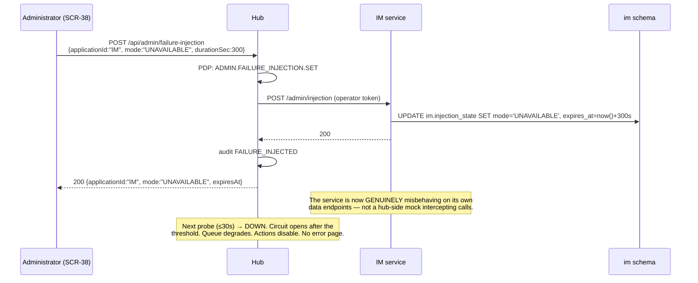

## 10. Resilience Architecture

The governing requirement is absolute: adapter failure degrades **visibly and gracefully**. Never a blank page, never an unhandled error, never a silent omission. The last of those three is the one most often violated — a queue that quietly renders four sources instead of five looks perfectly fine and is actively misleading.

---

### 10.1 Health Monitoring

A background monitor inside the hub process probes every **enabled** registry application on its configured interval (default 30 s).

```ts
// apps/hub/src/health/monitor.ts
export function startHealthMonitor(): void {
  setInterval(async () => {
    const apps = await registry.enabledApplications();
    // Concurrent across applications. A user request NEVER waits on a probe, and a
    // probe never waits on a user request.
    await Promise.allSettled(apps.map(async (app) => {
      const started = performance.now();
      try {
        // No retries by policy, short timeout, and — critically — BYPASSES the circuit
        // breaker. This is how recovery is detected while the circuit is open.
        const res = await adapterRuntime.invoke(
          registry.instanceFor(app.applicationId), 'healthCheck', {},
          { deadlineAt: iso(Date.now() + app.healthTimeoutMs), ...probeCtx() });
        await recordProbe(app, classify(res, performance.now() - started, app));
      } catch (err) {
        await recordProbe(app, { status: 'DOWN', errorClass: classOf(err) });
      }
    }));
  }, MIN_INTERVAL_MS);
}
```

**Definitions, stated precisely, because "degraded" means nothing if it is not defined:**

| State | Definition | UI consequence |
|---|---|---|
| `HEALTHY` | Probe succeeded within `healthTimeoutMs` **and** `latencyMs <= degradedLatencyMs` (1500) **and** the spoke self-reported `HEALTHY` | Normal operation; no notice |
| `DEGRADED` | Probe succeeded but latency exceeded the threshold, **or** the spoke self-reported `DEGRADED`, **or** the last 10 data calls show >20% errors while probes still pass | Data still loads; rows badged "Slow to respond"; a non-blocking notice names the system; actions stay enabled but warn |
| `DOWN` | Probe failed (timeout, refused, non-2xx, malformed) **or** the circuit is `OPEN` | Data omitted for that source; a named, quantified warning; actions targeting it disabled with a reason |

**Transitions are asymmetric on purpose.** `HEALTHY → DOWN` requires **two** consecutive failed probes; `DOWN → HEALTHY` requires **one** success. Cautious failure, fast recovery — a flapping banner is more damaging to a demo than a few extra seconds of stale-good state, and a false "back up" is cheaper to correct than a false alarm is to live with.

Probe results go to `hub.application_health_checks` (last 500 per application) and the current state upserts into `hub.application_health`. Probing starts immediately on registration or re-enable rather than waiting for the next interval — which is what makes CVS show `HEALTHY` seconds after being registered live. **If the monitor itself is not running, the console says so**; an absent monitor must never masquerade as all-healthy.

---

### 10.2 Timeout, Retry, and Circuit Policy

Every value is a per-application registry column. Nothing here is hard-coded per spoke, which is why tuning one application is an `UPDATE` rather than a deployment.

| Setting | Default | Bounds | Applies to |
|---|---|---|---|
| `timeoutMs` | 5 000 | 500–30 000 | list, get, summary, history |
| `actionTimeoutMs` | 10 000 | 1 000–30 000 | `performAction` |
| `healthTimeoutMs` | 2 000 | 500–10 000 | `healthCheck` |
| `maxRetries` | 2 | 0–5 | **idempotent operations only** |
| `backoffInitialMs` | 200 | 50–5 000 | retry spacing |
| `backoffMultiplier` | 2.0 | 1.0–4.0 | retry spacing |
| `backoffJitterPct` | 20 | 0–50 | retry spacing |
| `circuitFailureThreshold` | 5 | 2–50 | consecutive failures to open |
| `circuitOpenMs` | 30 000 | 5 000–300 000 | open duration before half-open |
| `circuitHalfOpenProbes` | 1 | 1–5 | probes admitted in half-open |

**The five rules that matter most:**

1. **Retries apply only to idempotent operations.** `listWorkItems`, `getWorkItem`, `getWorkItemSummary`, `getActivityHistory`, `describe` are retryable. `performAction` is retried **only** when the adapter can prove the request never reached the spoke — connection refused, DNS failure, TLS failure. **A timeout on `performAction` is never auto-retried.** It becomes `ADAPTER_INDETERMINATE` and the decision passes to the orchestration engine or to the user. Silently retrying a write whose outcome is unknown is how a system applies an action twice.
2. **Retries respect the absolute deadline.** Delay is `backoffInitialMs × multiplier^(attempt-1)` ± jitter, and a retry that cannot complete before `deadlineAt` is not attempted at all.
3. **Only worthwhile failures are retried.** `ADAPTER_UNREACHABLE`, read `ADAPTER_TIMEOUT`, and HTTP 502/503/504. Never 4xx, `ADAPTER_REJECTED`, `PRINCIPAL_REJECTED`, or `ADAPTER_CONTRACT_ERROR` — retrying those is guaranteed waste that spends the user's latency budget.
4. **The circuit protects the aggregate.** While `OPEN`, calls fail immediately with `ADAPTER_CIRCUIT_OPEN` without touching the spoke, so one slow spoke cannot stall the fan-out for the other five.
5. **The circuit never blocks `healthCheck()`.** Recovery is therefore always detectable and always automatic, with no operator action and no restart.

All timeouts are enforced hub-side as absolute deadlines, so an adapter that ignored its own deadline would still be cut off.

---

### 10.3 Partial-Failure Aggregation

This is the behavior that makes "one spoke down must not fail the whole queue" true rather than aspirational.

```ts
// apps/hub/src/queue/aggregate.ts

export async function aggregateWorkItems(
  principal: Principal, query: WorkItemsQuery, ctx: RequestContext,
): Promise<WorkItemsResponse> {
  const sources = await registry.visibleTo(principal.activeRole);   // enabled ∩ visibleToRoles

  // allSettled, never all: one rejection must not reject the batch.
  const settled = await Promise.allSettled(sources.map(async (src) => ({
    src,
    result: await callSpoke(principal, src.applicationId, 'listWorkItems',
                            { filters: pushDown(query), paging: { limit: src.maxPageSize } }, ctx),
  })));

  const items: WorkItem[] = [];
  const sourceStatus: SourceStatus[] = [];

  for (const [i, outcome] of settled.entries()) {
    const src = sources[i]!;
    if (outcome.status === 'fulfilled') {
      items.push(...outcome.value.result.items.map(it => stamp(it, health.of(src.applicationId))));
      sourceStatus.push(ok(src, outcome.value.result));
      // Remember the count, so the NEXT outage can say "12 items" instead of "some items".
      await countsCache.record(principal.principalId, src.applicationId,
                               outcome.value.result.items.length);
    } else {
      sourceStatus.push({
        applicationId: src.applicationId,
        label: src.displayName,
        status: 'DOWN',
        itemCount: null,
        latencyMs: null,
        omittedItemEstimate: await countsCache.lastKnown(principal.principalId, src.applicationId),
        message: degradedCopy(src.displayName,
                              await countsCache.lastKnown(principal.principalId, src.applicationId)),
      });
    }
  }

  // Filter, sort, and paginate over the MERGED set, hub-side. Per-source sorting
  // would produce an interleaving that is wrong the moment sources disagree.
  const filtered = applyFilters(items, query, principal);
  const sorted   = applySort(filtered, query);            // nulls last, in both directions
  const page     = paginate(sorted, query);

  return { ...page, appliedFilters: query, sourceStatus, correlationId: ctx.correlationId };
}
```

**The response-status contract:**

| Situation | HTTP | What the user sees |
|---|---|---|
| All sources succeeded | 200 | Full queue, no notice |
| ≥1 succeeded, ≥1 failed | **200** | Available items **plus** a named, quantified warning per failed source |
| All sources failed | **200** | The all-unavailable **empty state**, never a 500: *"We can't reach any connected systems right now. Your work will appear here automatically when they're back."* |
| Registry itself unreadable | 503 | `REGISTRY_UNAVAILABLE` |

There is no path from a spoke outage to an HTTP 5xx on the queue. That is the point.

---

### 10.4 The Degraded-Mode UX Contract

Applied uniformly by the four page templates, so a screen cannot invent its own version of degraded.

| Rule | Implementation |
|---|---|
| **Name the system** | Registry `displayName` substituted for `{System}` — never an internal identifier |
| **Quantify the gap** | From `work_item_counts_cache`: *"Investigation Management is unavailable — 12 items are not shown. The rest of your work is up to date."* |
| **Never guess a number** | With no prior count: *"…— some items are not shown."* An invented figure is worse than an honest vagueness |
| **List every affected system** | One alert naming and quantifying each — never a generic "some systems are unavailable" |
| **Contextual, not global** | The alert appears on the queue, dashboard, search, notifications, and related-items panels, so the user learns what is missing *here* |
| **Announce once** | `role="status"`, announced on first appearance, not re-announced on every 30-second poll |
| **Row-level badges** | Items from a `DEGRADED` source are badged "Slow to respond" |
| **Pre-emptively disable** | An action whose `targetSystems` includes a `DOWN` system returns `enabled: false` with a plain `disabledReason`. An **orchestrated** action is disabled if **any** target is down: *"eApp isn't responding right now, so this issue can't be resolved yet."* Half-performing a dual write we already know will fail is worse than declining it |
| **Degraded ≠ disabled** | A `DEGRADED` system does not disable actions; it warns: *"{System} is responding slowly. This may take longer than usual."* |
| **Recover politely** | On recovery the alert is replaced by a polite announcement with a refresh control — content is never silently reordered under the user's cursor |
| **Never conflate empty with broken** | *"You have no assigned work"* and *"We couldn't load your work"* are different statements. Conflating them tells a user they have nothing to do when the system is broken — the single most consequential empty-state error, and explicitly prohibited |

**Loading, empty, error, degraded** are defined once per page template (`ListPage`, `DetailPage`, `FormPage`, `ConsolePage`) so every screen inherits all four rather than re-litigating them. Loading regions carry `aria-busy="true"` with a visually hidden label, preserve layout dimensions to prevent content shift, and **transition to their error or degraded state at their timeout** — no spinner persists indefinitely.

**The global error boundary** catches any unhandled client condition and renders SCR-32 *inside the shell*, with the demo banner, a descriptive title, focus moved to the `<h1>`, `role="alert"`, a correlation ID, and two working exits. Server-side, any uncaught exception returns a 500 in the standard envelope; no framework default error page is ever served. Client-caught errors are reported to the server with their correlation ID so they appear in the integration log.

---

### 10.5 Failure Injection

Degradation must be reproducible on demand at 10:03 in front of a reviewer, not described.



| Mode | Behavior | Demonstrates |
|---|---|---|
| `UNAVAILABLE` | Connection refused or 503 on data endpoints; `/health` honestly reports `DOWN` | Degraded queue, disabled actions, circuit opening |
| `SLOW(slowMs)` | Artificial latency, 100–30 000 ms | Timeouts, `DEGRADED` state, per-widget loading states |
| `ERROR(errorRatePct)` | A proportion of calls return 500 | Retry behavior, error-rate-driven `DEGRADED` |
| `NORMAL` | Clears injection | Automatic recovery |

**`durationSec` auto-clears** (default 300, max 1800), so a forgotten injection cannot silently break a later demo — a failure mode worth designing against because it happens. Injection state is surfaced on SCR-24 and SCR-37 so no operator mistakes an injected outage for a real one, and is cleared by `reset`.

**Two genuinely different outage mechanisms are documented, and the demo script says which to use when:**

- **Stopping the container** (`./run.sh stop im`) is a real network-level outage — more convincing, because the process is gone and a reviewer can verify it.
- **Injection** is safer mid-demo, because it auto-clears and cannot leave the environment broken.

---

### 10.6 Automatic Recovery

```
t+0s    Spoke restarts / injection cleared
t+≤30s  Health monitor's next probe succeeds (probes bypass the open circuit)
        → circuit HALF_OPEN → probe success → CLOSED
        → hub.application_health.status = HEALTHY (one success is enough)
t+≤30s  Client's /api/health/summary poll observes the change
        → degraded alert replaced by a polite announcement with a refresh control
        → disabled actions re-enabled: "eApp is available again. You can now resolve this issue."
```

**No reload. No re-authentication. No administrator action.** That end-to-end automatic recovery is a named success metric, and it falls out of two decisions made earlier: the circuit never blocks health probes, and the client polls a cheap stored-state endpoint rather than triggering synchronous probes.

**In-flight requests that failed during the outage are not auto-replayed.** Replaying a failed mutation without the user's knowledge would be unsafe; reads may be refetched by the user's own refresh action. Partially completed orchestrations converge through their own retry queue, independently of health polling (chunk 11).

---

### 10.7 Integration Issue Recording

Every `AdapterError` except `ADAPTER_NOT_FOUND` and `ADAPTER_REJECTED` — both of which are normal business outcomes rather than integration failures — writes exactly one `hub.integration_issues` row. Health transitions, circuit transitions, scope violations, normalization errors, orchestration incompletions, and audit-write failures write rows with their own classes.

**Issue writing is best-effort and never blocks a user request**, with the single deliberate exception of audit writes, which are blocking. That asymmetry is intentional: an audit gap is a correctness problem, an unrecorded diagnostic is an inconvenience.

Issues correlate to audit records by `correlationId`, enabling an administrator to navigate audit chain → integration issue → application detail → health history for one identifier.

---

### 10.8 Resilience Test Matrix

| Scenario | Assertion | Requirement |
|---|---|---|
| Each of five spokes forced offline in turn | Queue and dashboard render partial results with a named, quantified warning; **no error page anywhere** | `FR-F19-04` rule 1 |
| Fault-injection crawl: every route × every role, one spoke down | HTTP 200 or a designed error screen; non-empty `<main>`; demo banner present; zero uncaught client errors | `FR-F19-04` rule 2 |
| All sources down | Queue returns 200 with the all-unavailable empty state, never a 500 | `FR-F19-04` rule 3 |
| Recovery | Warning clears and data returns within 30 s, no reload, no re-authentication | `FR-F19-04` rule 4 |
| Action pre-disabling | With a target system down the action is disabled with its reason; posting it anyway is refused server-side | `FR-F19-04` rule 5 |
| Global error boundary | An injected client exception renders SCR-32 inside the shell with working exits | `FR-F19-04` rule 6 |
| Slow spoke | Aggregate request returns within the configured timeout plus overhead | `FR-F08a-05` AC-1 |
| Circuit | 5 consecutive failures open it; data calls stop reaching the spoke; **health probing continues** | `FR-F08a-05` AC-2 |
| Circuit recovery | Restoring the spoke closes it automatically, without restart or user action | `FR-F08a-05` AC-3 |
| Mutating timeout | Never auto-retried; surfaces as `ADAPTER_INDETERMINATE` | `FR-F08a-05` AC-4 |
| Flap resistance | A single transient failure does not flip `HEALTHY → DOWN` | `FR-F16-03` AC-2 |
| Empty vs degraded | Verified distinct under a forced outage | `FR-F16-07` AC-2 |

---
