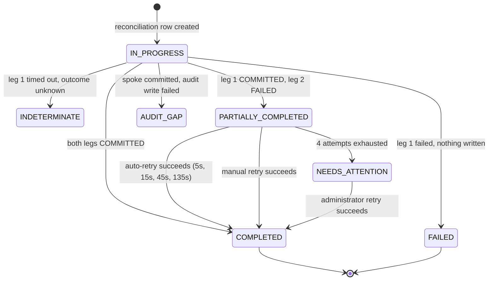

## 11. Orchestration Architecture — The Distributed Write

This is the hardest problem in the product and the one the flagship workflow depends on. One user action mutates **two independent systems that share no database and support no distributed transaction**. There is no two-phase commit available, and pretending otherwise would be the most consequential dishonesty in the build.

The chosen design is a **forward-recovery saga with explicit partial-completion disclosure and an idempotent retry path**. Nothing here is hand-waved.

---

### 11.1 Why Forward Recovery and Not Compensating Rollback

The obvious alternative — if the eApp leg fails, undo the PVQ resolution — is rejected, and the reason is domain-level rather than technical.

PVQ is the **system of record** for an investigative disposition. The investigator reviewed a flagged answer and recorded a finding. Reversing that record because a *downstream derived state* failed to update would:

1. **Fabricate a false history** in the system of record. PVQ's `issue_activity` would show a resolution followed by an un-resolution that the investigator never performed and does not know about.
2. **Require an audited mutation nobody authorized.** The compensating write is itself a state change that must be audited, attributed, and explained — attributed to whom, and explained as what?
3. **Discard correct work.** PVQ's record is *right*. eApp's is merely *stale*. Destroying the correct record to match the stale one inverts which system is authoritative.

So: **PVQ's resolution stands. eApp converges forward.** The user is told immediately and precisely what happened, the hub retries automatically, and if retries are exhausted a human is notified. The system never claims convergence it has not achieved, and never fakes it in the UI.

---

### 11.2 The Execution Sequence

```mermaid
sequenceDiagram
    participant U as Investigator
    participant H as Hub orchestration engine
    participant DB as hub schema
    participant P as PVQ
    participant E as eApp

    U->>H: POST /api/orchestration/resolve-pvq-issue

    rect rgb(231, 246, 248)
    Note over H: PRECONDITIONS — none may be skipped, reordered,<br/>or made conditional on configuration
    H->>H: 1 AUTHORIZE BOTH LEGS<br/>ISSUE.RESOLVE on PVQ:ISS-2207<br/>CASE.UPDATE_ISSUE_STATE on EAPP:CASE-A-1042<br/>authorized for one but not the other ⇒ DENY OUTRIGHT
    H->>H: 2 VALIDATE payload
    H->>P: 3 read issue — verify parentCaseRef, subjectRef, resolvable state
    H->>E: 3 read case — verify it lists this issue in outstandingIssueRefs
    H->>DB: 4 PRE-FLIGHT HEALTH on BOTH applications<br/>either DOWN or circuit OPEN ⇒ refuse BEFORE any write
    end

    H->>DB: 5 INSERT orchestration_transactions<br/>{legs:[PVQ PENDING, EAPP PENDING], state:IN_PROGRESS}
    Note over DB: This row exists BEFORE any spoke is written,<br/>so a crash mid-orchestration is discoverable.
    H->>DB: audit ORCHESTRATION_STARTED

    rect rgb(236, 243, 236)
    Note over H,P: LEG 1 — PVQ first: it owns the authoritative outcome.<br/>eApp's state is DERIVED from it.
    H->>P: performAction RESOLVE_ISSUE {disposition, narrative}
    P-->>H: APPLIED, post-write state
    H->>DB: leg PVQ = COMMITTED; audit ISSUE_RESOLVED (before → after)
    end

    rect rgb(255, 245, 194)
    Note over H,E: LEG 2 — eApp: the derived state
    H->>E: performAction CLEAR_OUTSTANDING_ISSUE {issueRef, disposition}
    E-->>H: APPLIED (idempotent on issueRef)
    H->>DB: leg EAPP = COMMITTED; audit CASE_ISSUE_CLEARED
    end

    H->>DB: 8 state = COMPLETED
    H->>P: RE-READ issue
    H->>E: RE-READ case
    H->>DB: audit ORCHESTRATION_COMPLETED
    H-->>U: 200 — per-system outcomes FROM THE FRESH READS
```

**Why the pre-flight health check earns its place (step 4).** Discovering eApp is unavailable *after* PVQ has committed converts a clean refusal into a partial completion that must be explained, retried, and possibly escalated. Checking first turns the common case of a known-down system into *"nothing was changed, try again when it's back."* Refusing up front is strictly better than discovering halfway.

**Why PVQ goes first (step 6).** Leg order is not arbitrary. The system of record for the outcome writes first; the derived state follows. If the order were reversed, a failure would leave eApp claiming an issue is cleared while PVQ still shows it open — a state in which the derived value contradicts the authority, which is worse than a lag.

**Budget (step 11).** Each leg carries its registry-configured timeout. The eApp leg does **not** inherit time already spent on the PVQ leg. The overall request budget is 15 seconds, after which the response returns the current known state rather than hanging.

**Single-leg workflows.** `REFERRED_FOR_FURTHER_REVIEW` does not clear the case's outstanding issue, so the transaction has one leg and completes after step 6. The engine handles this without a special case — leg count comes from the definition.

---

### 11.3 Failure Branches

#### Leg 1 fails — clean abort

Nothing was written, so nothing needs undoing.

- Transaction → `FAILED`, leg PVQ → `FAILED` with its error class. **No eApp call is attempted.**
- One audit record: `ORCHESTRATION_FAILED`, `outcome: FAILURE`, `targetSystem: PVQ`.
- The user sees an error on SCR-16 — **not** SCR-20, because there is no dual outcome to confirm — and the message states unambiguously that **nothing changed**, with "Try again."

| Scenario | HTTP | Code | Message |
|---|---|---|---|
| PVQ rejected the action | 422 | `UPSTREAM_REJECTED_ACTION` | "PVQ couldn't resolve this issue: {plain reason}. Nothing was changed." |
| PVQ unavailable | 503 | `UPSTREAM_UNAVAILABLE` | "PVQ isn't responding right now, so nothing was changed. Try again in a moment." |
| PVQ timeout, outcome unknown | 502 | `UPSTREAM_INDETERMINATE` | "We're not sure whether PVQ recorded your resolution. Refresh this issue to check its status before trying again — reference {correlationId}." |

The third row is the honest one. The transaction is marked `INDETERMINATE` rather than `FAILED`, because we genuinely do not know. Retry from this state is still safe, because idempotency holds at both the hub and the spoke.

#### Leg 2 fails — partial completion and forward recovery

The hard case, and the one the design exists for.



1. **No rollback of leg 1 is attempted** (§11.1).
2. Transaction → `PARTIALLY_COMPLETED`; leg PVQ `COMMITTED`, leg EAPP `FAILED` with error class and attempt count.
3. A compensation task is enqueued in `hub.orchestration_retry_queue` and retried automatically on **5 s, 15 s, 45 s, 135 s** — four attempts maximum.
4. **Automatic retry reuses the same idempotency key**, and eApp's `CLEAR_OUTSTANDING_ISSUE` is independently idempotent on `issueRef` — clearing an already-cleared reference is a no-op returning success. Two independent guarantees, so a retry after an indeterminate first attempt cannot double-decrement `outstandingIssueCount`.
5. **The user is told immediately and precisely.** SCR-20 renders in partial state. The response **never** reports overall success, and the word "success" does not appear anywhere in a partial confirmation — asserted by test.
6. A **manual retry** control is offered at `POST /api/orchestration/{txId}/retry`, authorized to the original principal and to administrators, idempotent, returning fresh per-system outcomes.
7. If retries exhaust: transaction → `NEEDS_ATTENTION`, one `integration_issues` row of class `ORCHESTRATION_INCOMPLETE`, surfaced in the administrator's integration issues list with a direct link to the transaction and its manual retry. Surfaced to a human, never silently abandoned.
8. **Until the eApp leg commits, the eApp case continues to display "1 outstanding issue" — which is correct, because that is genuinely eApp's state.** The UI never fakes convergence. SCR-15 additionally shows an advisory: *"A resolution was recorded in PVQ on {date} but hasn't been applied to this case yet. We're retrying automatically."*
9. Every retry attempt, successful or not, writes its own audit record sharing the original correlation ID, so the chain reads as one continuing narrative.

| Scenario | HTTP | Code | Message |
|---|---|---|---|
| eApp failed after PVQ committed | **207** | `ORCHESTRATION_PARTIAL` | "Partly completed. PVQ recorded your resolution. eApp hasn't been updated yet — we're retrying automatically. You can also retry now. Reference {correlationId}." |
| Manual retry failed again | 207 | `ORCHESTRATION_PARTIAL` | "eApp still isn't responding. PVQ's record is unchanged and correct. We'll keep retrying — reference {correlationId}." |
| Retries exhausted | 207 | `ORCHESTRATION_NEEDS_ATTENTION` | "eApp couldn't be updated after several attempts. PVQ's record is correct. An administrator has been notified — reference {correlationId}." |
| Retry on a completed transaction | 200 | — | "This was already completed. Both systems are up to date." |

---

### 11.4 The Reconciliation Record

```ts
// hub.orchestration_transactions — the row that makes a partial completion
// RECOVERABLE rather than LOST.
{
  transactionId:  "01JD7K2Q9X8V3MZ4R6TQ0000A",
  workflowId:     "RESOLVE_PVQ_ISSUE",
  correlationId:  "01JD7K2Q9X8V3MZ4R6T",       // shared with all 8 audit records
  principalId:    "01JD5B...",
  idempotencyKey: "01JD7K2Q9X8V3MZ4R6TQ0000B", // UNIQUE constraint = exactly-once
  state:          "PARTIALLY_COMPLETED",
  legs: [
    { system: "PVQ",  operation: "RESOLVE_ISSUE", state: "COMMITTED",
      stateBefore: "Open", stateAfter: "Resolved — Substantiated",
      errorClass: null, attempts: 1 },
    { system: "EAPP", operation: "CLEAR_OUTSTANDING_ISSUE", state: "FAILED",
      stateBefore: "1 outstanding issue", stateAfter: null,
      errorClass: "ADAPTER_UNREACHABLE", attempts: 3 }
  ],
  requestPayload: { /* the original request, so retry needs no user input */ },
  resultPayload:  { /* per-system outcomes as last observed */ },
  createdAt: "2026-09-14T15:05:00Z", completedAt: null
}
```

Three properties do the work:

- **The row exists before the first spoke write.** A hub crash mid-orchestration leaves a discoverable `IN_PROGRESS` row rather than an invisible half-write. A startup sweep moves stale `IN_PROGRESS` rows to `INDETERMINATE` and surfaces them.
- **`idempotencyKey` is `UNIQUE`.** A repeat submission returns the stored outcome without re-executing either leg — the database enforces exactly-once, not application logic.
- **`requestPayload` is retained**, so a manual retry days later needs nothing from the user.

---

### 11.5 The Confirmation View: Observed State, Not Asserted State

After finalization the hub **re-reads the issue from PVQ and the case from eApp through their adapters**, and SCR-20 displays those returned values — not the values the hub intended to write.

That distinction is the entire evidentiary value of the screen. "We sent two writes and neither threw" is an assertion. "We asked each system afterwards and here is what each one says" is a demonstration.

```
┌──────────────────────────────────────────────────────────────────────────┐
│ Demo — Synthetic Data Only                                               │
├──────────────────────────────────────────────────────────────────────────┤
│ Work Queue › eApp Case A-1042 › Related PVQ Issue ISS-2207 › Confirmation │
│                                                                          │
│ ✓ Resolution complete                                    [role="status"] │
│   Resolution complete. PVQ and eApp both updated.                        │
│                                                                          │
│ Results in each connected system                              <caption>  │
│ ┌──────────┬───────────────────────┬────────────────────────┬──────────┐ │
│ │ System   │ What we asked for     │ What it reports now    │ Outcome  │ │
│ ├──────────┼───────────────────────┼────────────────────────┼──────────┤ │
│ │ PVQ      │ Resolve as            │ Resolved —             │ ✓        │ │
│ │          │ Substantiated         │ Substantiated          │ Updated  │ │
│ │          │                       │ read back 15:05:02Z    │          │ │
│ ├──────────┼───────────────────────┼────────────────────────┼──────────┤ │
│ │ eApp     │ Clear outstanding     │ No outstanding issues  │ ✓        │ │
│ │          │ issue ISS-2207        │ Review complete —      │ Updated  │ │
│ │          │                       │ pending adjudication   │          │ │
│ │          │                       │ read back 15:05:02Z    │          │ │
│ └──────────┴───────────────────────┴────────────────────────┴──────────┘ │
│                                                                          │
│ [View the updated issue in PVQ] [Return to eApp Case A-1042]             │
│ [Back to work queue]            [View audit trail for this action]       │
└──────────────────────────────────────────────────────────────────────────┘
```

Construction rules: a real `<table>` with a `<caption>`, `scope` attributes, and text-plus-icon outcome indicators — never colour alone. The `<h1>` reflects the outcome ("Resolution complete" / "Partly completed" / "Not completed"), the summary alert receives focus on render and announces once, and **every leg is rendered including failed ones** — a leg is never omitted for tidiness. If a re-read itself fails, that row reads *"We couldn't confirm the current state in {System}."* with a "Check again" control: the view degrades honestly rather than dropping the row.

In partial state the heading is "Partly completed," one row shows `COMMITTED` and one shows `FAILED`, a "Retry eApp update" action is present, and the live-region announcement is *"Partly completed. PVQ updated. eApp not updated."*

---

### 11.6 The Engine Is Generic

The orchestration machinery contains **no reference to PVQ or eApp by name**, asserted by test. Workflows are configuration rows:

```jsonc
// hub.orchestration_definitions — the flagship is the FIRST INSTANCE, not a code path
{
  "workflowId": "RESOLVE_PVQ_ISSUE",
  "displayName": "Resolve questionnaire issue and clear the parent case",
  "legs": [
    { "order": 1, "applicationId": "PVQ",  "operation": "RESOLVE_ISSUE",
      "payloadMapping": { "disposition": "$.disposition", "narrative": "$.resolutionNarrative" },
      "required": true },
    { "order": 2, "applicationId": "EAPP", "operation": "CLEAR_OUTSTANDING_ISSUE",
      "payloadMapping": { "issueRef": "$.issueId.nativeId",
                          "resolvedDisposition": "$.disposition" },
      "required": true,
      "skipWhen": "$.disposition == 'REFERRED_FOR_FURTHER_REVIEW'" }
  ],
  "preconditions": [
    { "kind": "AUTHORIZE",          "action": "ISSUE.RESOLVE",           "target": "$.issueId" },
    { "kind": "AUTHORIZE",          "action": "CASE.UPDATE_ISSUE_STATE", "target": "$.parentCaseId" },
    { "kind": "VERIFY_RELATIONSHIP", "from": "$.issueId", "to": "$.parentCaseId",
      "assert": ["parentCaseRef", "subjectRef"] },
    { "kind": "HEALTH_GATE",        "applications": ["PVQ", "EAPP"] }
  ],
  "onLegFailure": "FORWARD_RECOVER",
  "retryScheduleSec": [5, 15, 45, 135],
  "enabled": true
}
```

A second workflow — say, a PDT designation change propagating an investigation tier into IM — is added as another row plus adapter operations both spokes already declare. Leg order, retry policy, and failure strategy come from the definition; the executor is generic; the same reconciliation rows, audit records, and SCR-20 confirmation shape are produced for any workflow without modification.

---

### 11.7 The Retry Worker

```ts
// packages/orchestration/src/worker.ts
setInterval(async () => {
  const due = await db.query(`
    SELECT * FROM hub.orchestration_retry_queue
    WHERE state = 'PENDING' AND next_attempt_at <= now()
    ORDER BY next_attempt_at
    FOR UPDATE SKIP LOCKED LIMIT 10`);      // safe if the hub is ever scaled out

  for (const task of due.rows) {
    const tx = await loadTransaction(task.transaction_id);
    try {
      await callSpoke(await principalOf(tx), task.application_id, 'performAction',
                      { ...task.payload, idempotencyKey: task.idempotency_key },  // SAME key
                      ctxFor(tx));                                                // SAME correlationId
      await markLegCommitted(tx, task.application_id);
      await audit.write(retryRecord(tx, 'SUCCESS'));
      if (allLegsCommitted(tx)) await setState(tx, 'COMPLETED');
    } catch (err) {
      const attempts = task.attempts + 1;
      await audit.write(retryRecord(tx, 'FAILURE', err));
      if (attempts >= task.max_attempts) {
        await setState(tx, 'NEEDS_ATTENTION');
        await integrationIssues.record({ errorClass: 'ORCHESTRATION_INCOMPLETE',
                                         orchestrationTxId: tx.transactionId, ...ctxFor(tx) });
      } else {
        await scheduleNext(task, attempts, tx.retryScheduleSec);   // 5s → 15s → 45s → 135s
      }
    }
  }
}, 5_000);
```

`FOR UPDATE SKIP LOCKED` means the queue is correct even if the hub is ever run with more than one instance. The same idempotency key and the same correlation ID are reused on every attempt, which is what keeps the audit chain coherent and the eApp write safe.

---

### 11.8 Post-Condition State Model

The demo script's assertion target, verified by the E2E test against **each system's own API** rather than through the hub.

| System | Post-condition after a successful `SUBSTANTIATED` resolution |
|---|---|
| **PVQ** | `status = RESOLVED_SUBSTANTIATED`; `disposition = SUBSTANTIATED`; `resolutionNarrative` = the submitted text; `resolvedBy` / `resolvedByPrincipalId` set; `resolvedAt` set; one new `pvq.issue_activity` row |
| **eApp** | `outstandingIssueRefs` no longer contains `ISS-2207`; `outstandingIssueCount` decremented by 1; if it reached 0, `caseState = REVIEW_COMPLETE_PENDING_ADJUDICATION`; one new `eapp.case_activity` row |
| **Hub** | `orchestration_transactions.state = COMPLETED` with both legs `COMMITTED`; **≥5 `audit_events` sharing one `correlationId`**; **zero `integration_issues` for that correlation ID** |

The partial-failure variant of the test injects eApp `UNAVAILABLE` after the PVQ leg and asserts: HTTP 207, the **absence of the word "success"** in both the response body and the rendered page, both per-system outcomes present and accurate, and automatic convergence to `COMPLETED` after eApp is restored — with no user action.

---
