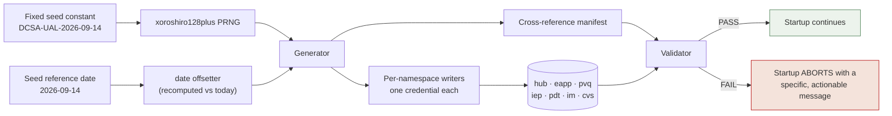

## 13. Synthetic Data Seeding Architecture

The seed is not test fixtures. It is the demonstration's stage, and the requirement is precise: **every UI precondition the demo exercises must have its rows seeded**, including the edge states. A designed empty state that cannot be reached is not demonstrable, and a flagship workflow whose preconditions were consumed on the previous run is a demo that fails in front of a reviewer.

---

### 13.1 Design Properties

| Property | How it is achieved |
|---|---|
| **Deterministic** | Every value derives from a fixed seed constant through `pure-rand`'s `xoroshiro128plus`. The same seed produces byte-identical data, verified by content hash across two fresh runs. |
| **Idempotent** | The seeder truncates and rebuilds within one transaction per namespace. Running it twice leaves the environment identical, never duplicated. |
| **Never stale** | Relative dates derive from a **seed reference date**, then are offset against the current date at seed time — so "overdue by 6 days" stays overdue whenever the demo runs, in 2026 or 2027. |
| **Referentially coherent without foreign keys** | `subject_ref` means the same synthetic person in all six namespaces. Coherence is a property of the generator, not the schema — there is no shared table and there cannot be one. |
| **Obviously synthetic** | Invalid-by-construction identifiers, `syntheticMarker` on every row, `_synthetic: true` on every response. |
| **Self-validating** | A validator runs immediately after seeding and **fails startup** on any missing precondition. A demo starting on broken data is worse than one that refuses to start. |

---

### 13.2 Pipeline



**Critically, the writers use each namespace's own credential.** The seeder does not connect as the database owner and write everywhere; it opens seven connections with seven roles. That means the isolation model is exercised by the very first thing that touches the database — if a grant were wrong, seeding would fail before any demo ever ran.

**CVS is seeded with data but no registry row.** `cvs.alerts` is populated from first startup; `hub.registered_applications` contains five rows. That asymmetry is the extensibility demonstration, and it is a seeding decision.

---

### 13.3 Volume

Calibrated so filtering, sorting, and pagination are meaningful without making the demo slow.

| Namespace | Entity | Count | Purpose |
|---|---|---|---|
| hub | identities | 14 | 5 investigators, 3 adjudicators, 4 applicants, 2 administrators; **one holds two roles** |
| hub | registered applications | **5** | eApp, IEP, PVQ, PDT, IM — **CVS deliberately absent** |
| hub | announcements | 4 | 2 active (different target roles), 1 scheduled, 1 expired |
| hub | audit events | ~120 | Pre-seeded so the viewer, filters, and pagination are populated on first load, including 2 complete correlated chains |
| eapp | subjects · cases · sections | 22 · 26 · 26×12 | All 7 case states; 6 assigned to the demo investigator |
| pvq | questionnaires · issues | 20 · 18 | 6 OPEN, 3 IN_REVIEW, 7 resolved (mixed dispositions), 2 REFERRED |
| iep | individuals · statuses · notices · tasks | 22 · 22 · 34 · 19 | All 4 stages; 11 open tasks of which 4 overdue |
| pdt | positions · designations | 24 · 24 | 5 PENDING_REVIEW, 15 APPROVED, 4 RETURNED |
| im | investigations · assignments · leads | 31 · 28 · 62 | All 5 statuses, all 3 priorities; 3 unassigned |
| cvs | alerts | 9 | Invisible until registered; 4 assignable to the demo investigator |

**Calibration rules:** the demo investigator's queue holds 28–34 items across at least four source systems — enough for real pagination at 25 per page, enough that filters visibly narrow, not so many that the page is slow. Every enumerated status, priority, and state value appears at least once, because **a filter that always returns nothing looks broken**. Volumes are upper-bounded so `GET /api/work-items` completes within two seconds.

---

### 13.4 The Flagship Preconditions

Named explicitly so a broken demo is diagnosable in seconds rather than debugged live.

| System | Required baseline |
|---|---|
| **eApp** | `CASE-A-1042`, subject `SUBJ-00418` (Theodore Q. Lansbury), `caseState = UNDER_REVIEW`, `outstandingIssueCount = 1`, `outstandingIssueRefs = ["ISS-2207"]`, assigned to Marcus Vale, due in 4 days, with a populated `SECTION_13A` containing at least two employer entries |
| **PVQ** | `ISS-2207`, `status = OPEN`, `parentSystem = EAPP`, `parentCaseRef = CASE-A-1042`, `subjectRef = SUBJ-00418`, `answerLocus = SECTION_13A.employer[0].endDate`, `answerSectionLabel = "Section 13A — Employment history"`, populated `answerSnapshot`, raised 3 days ago |
| **PDT** | A designation referencing `CASE-A-1042`, so the related-items panel shows more than one relationship type |
| **IM** | An assignment referencing `CASE-A-1042` assigned to Marcus, so the panel shows **three** relationship types — the cross-system story is not a single link |
| **Hub** | Marcus's default queue view surfaces `EAPP:CASE-A-1042` on page 1 without filtering; the `ALERT-NEW-PVQ-ISSUE` rule fires for `ISS-2207` so the dashboard on-ramp is populated |
| **Fallback** | A **second** open PVQ issue on a different case, so the demo can be repeated if `ISS-2207` was consumed mid-session |

The fallback exists because the single most likely demo-day failure is a rehearsal that consumed the primary item. Reset fixes it in under 30 seconds; the fallback fixes it in zero.

---

### 13.5 Edge-State Coverage

Every non-happy UI state has a seeded precondition. This table is the answer to "does the empty state actually render, or did someone design it and never see it?"

| Edge state | Seeded precondition | Demonstrates |
|---|---|---|
| Overdue items | 4 IM investigations + 4 IEP tasks past due | Overdue sort, `ALERT-OVERDUE`, non-colour indication |
| No assignee | 3 IM investigations with `assigned_principal_id = NULL` | `assignee=unassigned` filter, "Unassigned" rendering |
| **Unresolvable assignee** | 1 IM investigation with a native user but no hub mapping | "Assigned to someone we can't resolve" ≠ "unassigned" |
| No due date | 5 PDT designations (PDT has no due dates at all) | Nulls-last sorting in both directions, "No due date" |
| No native priority | All PDT items | "Priority not provided by PDT" affordance |
| **Zero-item applicant** | Bartholomew N. Quigley: no tasks, no notices, no case | **Every** applicant empty state |
| Action required | Renée Ashford: case `INFORMATION_REQUESTED` | `ALERT-ACTION-REQUIRED`, applicant action path |
| Already resolved | 7 resolved PVQ issues | "Already resolved" disabled state with reason |
| Referred issue | 2 PVQ issues `REFERRED` | Single-leg, non-clearing disposition path |
| Cross-org denial | Ingrid's `REGION-SW` cases vs Marcus's `REGION-NE` | `ATTR-INV-01` denial |
| Clearance-tier denial | 2 eApp cases at `T5`; Harlan is `T3` | `ATTR-INV-03` denial, with the rule ID in the audit record |
| Read-not-write | Harlan's items visible to Marcus as unit-mate | `ATTR-INV-02` disabled action with reason |
| Stalled / blocked | 3 IM with `lastActivityAt` > 14 days; 2 items `BLOCKED` | `ALERT-STALLED`, `ALERT-BLOCKED` |
| **Reference mismatch** | **1 PVQ issue referencing a non-existent eApp case** | `INTEGRATION_REFERENCE_MISMATCH` — a deliberate orphan, documented so it is not mistaken for a defect |
| Announcement states | 1 expired, 1 scheduled | Announcement state filtering |
| Truncation | `--profile=large` (400 IM items) | `truncated` disclosure |
| Degraded spoke | **Not seeded** — produced by failure injection | Degraded queue, disabled actions |

The deliberate orphan deserves note. Real integrations produce dangling references constantly. A prototype that only ever seeds coherent data cannot demonstrate what it does when data is incoherent — which is the thing an integration reviewer most wants to see.

---

### 13.6 Personas

| Persona | PER-ID | Roles | Auth methods | Attributes | Purpose |
|---|---|---|---|---|---|
| **Marcus Vale** | **PER-01** | INVESTIGATOR | CAC/PIV, Generic MFA | `DCSA-FIELD-OPS-EAST`, T5, `REGION-NE`, 6 assignments | **Primary flagship persona** |
| Harlan T. Boyce | — | INVESTIGATOR | CAC/PIV | same org/region, **T3**, 5 assignments | Read-not-write (`ATTR-INV-02`); T3/T5 denial (`ATTR-INV-03`) |
| Ingrid L. Vasterling | — | INVESTIGATOR | **ECA only** | `DCSA-FIELD-OPS-WEST`, T5, `REGION-SW` | ECA as a genuinely distinct IdP pool; cross-org denial |
| Dana Okonkwo | **PER-02** | ADJUDICATOR | CAC/PIV | `DCSA-FIELD-OPS-EAST`, T5, `REGION-NE` | Different action set on the *same* item |
| **Sofia K. Mendelbaum** | — | INVESTIGATOR + ADJUDICATOR | CAC/PIV, Generic MFA | `DCSA-FIELD-OPS-EAST`, T5, `REGION-NE` | **Role switching without re-authentication** |
| Theodore Q. Lansbury | — | APPLICANT | Generic MFA | `subjectRef SUBJ-00418` | Full applicant set; the flagship's subject |
| Renée Ashford | **PER-03** | APPLICANT | Generic MFA | `SUBJ-00622` | `INFORMATION_REQUESTED` — action-required path |
| Bartholomew N. Quigley | — | APPLICANT | ECA | `SUBJ-00907` | **Zero-item applicant**: all empty states |
| **Priya Raghunathan** | **PER-04** | ADMINISTRATOR | CAC/PIV | `DCSA-HQ`, T5, `NATIONAL` | Console, live registration, audit |

Rules: every role signs in via at least two methods across identities; the CAC/PIV and ECA pools are **partially disjoint** (Ingrid is ECA-only) so multi-IdP support is observable rather than asserted; **no identity holds both APPLICANT and a mission role**; names are fabricated and drawn from no real directory.

> **Normative persona binding (`FR-F17-02`).** The `PER-ID` column is the binding between these seeded identities and the four design personas in `PERSONAS-DCSA-UAL.md`. One name per human, in every document and on every screen. Seed validation fails startup if any of PER-01…PER-04 is missing or bound to more than one identity. **Dana Okonkwo (PER-02) holds ADJUDICATOR only** — the dual-role identity is Sofia K. Mendelbaum — because the action-set contrast on `PVQ:ISS-2207` is the product's clearest live RBAC demonstration and a dual-role PER-02 would destroy it. The flagship subject `SUBJ-00418` (Theodore Q. Lansbury) is a **non-persona** applicant; `SUBJ-00622` (Renée Ashford, PER-03) carries one eApp case and one IM assignment owned by Marcus Vale so the persona-relationship claim is literally true in the seed.

---

### 13.7 Obviously Synthetic Content

| Field | Construction | Why it is safe |
|---|---|---|
| SSN | `900-00-####` | The 900 area has never been issued |
| Phone | `555-01##` | Reserved fictional range |
| Email | `@example.invalid` | RFC 2606 reserved TLD — unroutable by definition |
| Postal code | `000##` | Never assigned |
| Names | Unusual fabricated composites | Drawn from no real directory |
| Dates of birth | Plausible but generated | No real person's identifying combination is reproducible |
| Narratives | Clearly fictitious | Free of anything resembling real case content |

Plus: `syntheticMarker: 'DEMO-SYNTHETIC'` on **every** record, `"_synthetic": true` on **every** API response, "Synthetic record — demo data" in every detail summary header, `# DEMO — SYNTHETIC DATA ONLY` as the first line of every export, and the non-dismissible banner on every screen.

Provenance is documented in `docs/SEED-DATA.md`: how the data was generated, what it is, and the explicit assertion that it derives from no real source.

---

### 13.8 Validation — Startup Fails on Bad Data

```ts
// packages/seed/src/validate.ts
export async function validateSeed(): Promise<ValidationReport> {
  const failures: string[] = [];

  // 1 Every cross-namespace reference resolves — except the ONE documented orphan
  for (const ref of await manifest.crossReferences()) {
    if (ref.id === DOCUMENTED_ORPHAN_ID) continue;
    if (!await resolvesInTargetNamespace(ref)) {
      failures.push(`PVQ issue ${ref.from} references eApp case ${ref.to}, which does not exist.`);
    }
  }

  // 2 Every flagship precondition — named specifically so the message is actionable
  const issue = await pvq.getIssue('ISS-2207');
  if (issue?.status !== 'OPEN') {
    failures.push('PVQ issue ISS-2207 is not in OPEN state. The flagship demo will not work.');
  }
  const kase = await eapp.getCase('CASE-A-1042');
  if (kase?.outstandingIssueCount !== 1 || !kase.outstandingIssueRefs.includes('ISS-2207')) {
    failures.push('eApp case CASE-A-1042 does not have exactly one outstanding issue (ISS-2207).');
  }
  if (issue?.subjectRef !== kase?.subjectRef) {
    failures.push('ISS-2207 and CASE-A-1042 disagree on subjectRef. Relationship verification will fail.');
  }
  if (await registry.exists('CVS')) {
    failures.push('CVS is already registered. The registration demo will not work. Run reset.');
  }

  // 3 Every persona has >=1 role and complete attributes
  // 4 Every filter facet returns >=1 row for each role (WARNING, not failure)
  // 5 Every edge state exists
  // 6 Every persona's screen-coverage matrix is satisfied

  if (failures.length) {
    throw new SeedValidationError(
      `Seed validation failed:\n  - ${failures.join('\n  - ')}\n` +
      `Run \`./run.sh reset\` to restore baseline.`);   // never a bare exit code
  }
  return { status: 'PASS', warnings };
}
```

The per-persona screen-coverage matrix is asserted by automated test, not by inspection:

| Persona | Screens that must be populated (or in their **designed** empty state) |
|---|---|
| Marcus (Investigator) | SCR-09, 13, 14, 15, 16, 17, 19, 21, 33 (own), 35 |
| Dana (Adjudicator) | SCR-10, 13, 14, 15, 17, 19, 21, 33 (own), 35 |
| Theodore (Applicant) | SCR-11, 13, 14, 15 (redacted), 18, 21, 33 (own) |
| **Bartholomew** (zero-item) | SCR-11, 13, 18, 21 — **all in designed empty states** |
| Priya (Administrator) | SCR-12, 22, 23, 24, 25, 26, 27, 29, 33, 34, 37, 38 |

Validation runs after every seed and in CI on every build. Corrupting a flagship precondition must cause startup to fail with the specific message naming it.

---

### 13.9 Reset

```bash
./run.sh reset
```

Restores the hub and all six namespaces to pristine baseline in **under 30 seconds**, runnable mid-demo without a restart:

1. Re-seeds all data from the fixed seed constant.
2. **De-registers CVS**, restoring the registration demo.
3. Clears failure injection everywhere.
4. Clears sessions, alert read state, announcement dismissals.
5. Clears orchestration transactions and retry queues.
6. **Rebuilds the audit baseline rather than deleting rows.** Reset is a full rebuild, which preserves the "no delete path exists" property — even reset is not a deletion path.
7. Writes a `DEMO_RESET_PERFORMED` record into the new baseline, so the reset itself is visible in the trail.
8. Runs the validator and refuses to report success if it fails.

It prints what was restored:

```
Baseline restored.
  ✓ 7 namespaces re-seeded (seed DCSA-UAL-2026-09-14)
  ✓ CVS de-registered — the sixth-application demo is ready
  ✓ Failure injection cleared on all 6 services
  ✓ All sessions terminated
  ✓ Seed validation PASSED (0 failures, 0 warnings)
Elapsed: 11.4s
```

Reset is also invocable from SCR-37 by an administrator with typed confirmation and the warning *"This restores all demo data to its starting state and signs out all users."* The flagship workflow runs identically three consecutive times with a reset between each — the property that makes the demo rehearsable and the test suite deterministic.

---
