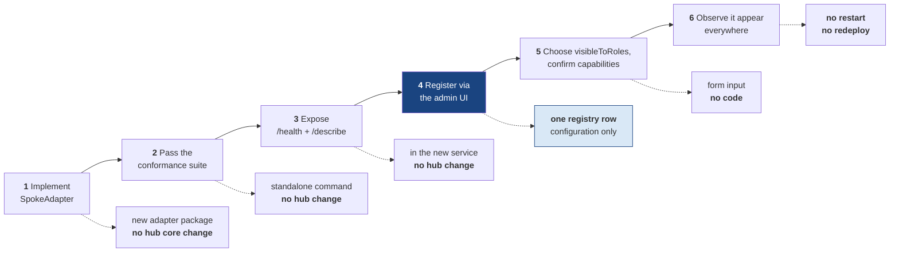

## 17. Extensibility Walkthrough — Onboarding the Sixth Application

The claim under test: **adding an application is a configuration change, not a code change.** This chunk proves it by enumerating every step, naming exactly what is written, and — more usefully — naming everything that is *not*.

---

### 17.1 The Complete Onboarding Path

For the six demo applications, step 1 collapses to zero work: they all use the existing `REST_JSON_V1` adapter type, differing only in their registry row. A genuinely different backend — SOAP, a file drop, a message queue — would add a second `adapterType` implementing the same eight-operation interface. The hub instantiates by type and knows nothing else about it.

---

### 17.2 Live Demo Script: Registering CVS in Under Five Minutes

**Precondition:** `./run.sh reset` — CVS is running on 7106 with nine seeded alerts and **no registry row**. It is invisible to every user. A second browser holds Marcus (Investigator) already signed in, so the "no re-authentication, no restart" claim is observable rather than asserted.

| Step | Action (as Priya, Administrator) | Expected observable state |
|---|---|---|
| 1 | Admin console → Connected Applications | **Five** applications listed: eApp, IEP, PVQ, PDT, IM |
| 2 | "Register an application" → SCR-28 | Five-step wizard: Identity → Connection → Capabilities → Access → Review |
| 3 | **Identity:** ID `CVS`, name "Continuous Vetting Service", description, icon token `icon-shield-check` | Inline validation on the ID pattern and display-name uniqueness |
| 4 | **Connection:** base `http://ual-cvs:7106`, health `/health`, adapter type `REST_JSON_V1`, default timeouts | "Test connection" is **required** before proceeding |
| 5 | Activate **Test connection** | Live call to `/health` and `/describe`: *"Connection test complete. Continuous Vetting Service is healthy, responded in 16 milliseconds."* Contract version 1.0 confirmed supported |
| 6 | **Capabilities** | **Pre-populated from `describe()`**: work-item type `CVS_ALERT`, its complete status map, three actions with their form schemas, capability flags. Shown for confirmation, not typed by hand |
| 7 | **Access:** tick Investigator and Adjudicator | **Nothing is pre-checked.** The form demands a deliberate choice rather than defaulting to broad visibility |
| 8 | **Review** → Register | `201`. `registryVersion` bumps. Audit record `APPLICATION_REGISTERED` naming the administrator, the application, and the configuration |
| 9 | Connected Applications | **Six** applications. CVS shows `HEALTHY` — probing began immediately on registration rather than waiting for the next interval |
| 10 | **Switch to Marcus's browser. Do not reload. Do not sign in again.** | Within one 30-second `registryVersion` poll, entitlements refetch and CVS appears in navigation and in the unified work queue |
| 11 | Open a CVS alert | Full detail page with source attribution, server-computed actions, and activity history — **rendered by the same `work/[workItemId]` route** every other application uses |
| 12 | Clear the alert with a reason | Action executes through the CVS adapter; audit record written; CVS's own `alert_activity` row created |
| 13 | Force CVS `UNAVAILABLE` from SCR-38 | The queue degrades with a named, quantified warning, exactly as it does for IM |
| 14 | Admin console → De-register CVS | Typed confirmation. CVS disappears from navigation, queue, search, health, and console. Audit records survive with the **denormalized** display name intact |

Total elapsed: roughly four minutes, of which most is reading the confirmation screens.

---

### 17.3 What Was Written, and What Was Not

**Written:** one row in `hub.registered_applications`.

**Not written, not edited, not restarted:**

| Not required | Why not — the mechanism that makes it unnecessary |
|---|---|
| A hub code change | Every registry-dependent behavior reads the table (chunk 5.4) |
| A hub schema migration | The registry row is data in an existing table |
| A hub restart or redeploy | `registryVersion` polling triggers an entitlements refetch client-side |
| A navigation code change | Navigation is `visibleToRoles` ∩ role matrix, computed per request |
| A work-queue fan-out change | Fan-out iterates enabled registry rows visible to the active role |
| A new route or page component | `work/[workItemId]` renders by `contentProfile` from the registry |
| A search integration | Search fan-out reads `capabilities.supportsSearch` |
| A health-monitoring change | The monitor iterates enabled rows |
| A status-normalization change | `statusMap` comes from `describe()` |
| A new permission | `supportedActions[].requiredPermission` must already exist in the matrix |
| An error-message change | `{System}` substitutes `displayName` at render time |
| An entry in any hard-coded list | **No such list exists**, and a CI grep proves it |
| A new audit action type | Spoke mutations use the existing closed vocabulary |
| A user re-authentication | The session is unaffected; entitlements refresh within it |

That table is the deliverable. It is also the thing that would regress first under schedule pressure, which is why item 12 is enforced by a build-failing grep rather than by intention.

---

### 17.4 Where Each Surface Gets Its Knowledge

| Surface | Reads | Consequence for a new application |
|---|---|---|
| Navigation | `visibleToRoles` ∩ role matrix | Appears for the chosen roles within one poll |
| Work-queue fan-out | `enabled = true AND activeRole ∈ visibleToRoles` | Items merge into the unified queue |
| Search fan-out | the above **AND** `capabilities.supportsSearch` | Included, or excluded with an explanation |
| Dashboard widgets | the same predicate | Contributes to counts and alerts |
| Source badges | `displayName`, `iconToken` | Correctly attributed everywhere |
| Detail rendering | `workItemTypes[].contentProfile` | Correct detail layout with no new route |
| Available actions | `supportedActions` ∩ role matrix ∩ spoke state | Correct server-computed action list |
| Resilience policy | per-row timeout/retry/circuit columns | Independently tunable without a deployment |
| Health monitoring | `healthEndpoint`, `healthProbeIntervalSec` | Probed from the moment of registration |
| Admin inventory | all rows, enabled and disabled | Visible and operable |
| Error copy | `displayName` → `{System}` | "Continuous Vetting Service isn't responding right now." |
| Related-item resolution | `RelatedRef.targetSystem` looked up in the registry | Relationships to the new system resolve; unknown targets are dropped with `INTEGRATION_UNKNOWN_TARGET` rather than rendered broken |
| Orchestration legs | `workflow definition → applicationId` | Usable as a leg in a new workflow definition |

---

### 17.5 Adding a Seventh Application with a Different Backend

The realistic future case: a legacy SOAP service, or one reachable only by a nightly file drop.

1. **Create `packages/adapter-soap-v1`** implementing `SpokeAdapter`. It translates the eight operations into whatever that system speaks. It may not call another adapter, read another spoke, or touch the hub database.
2. **Register the adapter type** by adding `'SOAP_V1'` to the adapter factory's type map — the **only** hub-side code change in the entire path, and it is one line in one map.
3. **Run the conformance suite** standalone: `./run.sh conformance --adapter=LEGACY --endpoint=...`. Ten assertions, pass or fail, with actionable messages.
4. **Register through the UI.** `adapterType: 'SOAP_V1'` is now selectable; everything downstream is identical to CVS.

Two accommodations the contract already anticipates:

- **A backend that cannot apply a supplied scope.** The adapter absorbs it by filtering post-fetch and reporting an `ADAPTER_SCOPE_VIOLATION`. Correctness is preserved; efficiency is not. The hub's second-layer predicate makes this safe.
- **A backend that cannot honour an idempotency key.** The adapter implements read-before-write, and the orchestration definition's per-leg strategy field selects it. The engine already reads strategy from configuration.

Neither accommodation touches hub core. That containment was the reason for putting normalization and resilience in the adapter layer rather than in the services.

---

### 17.6 Where the Onboarding Cost Actually Is

Honest accounting, because a claim of zero cost would be false and a reviewer would know it.

| Work | Cost | Hub change? |
|---|---|---|
| Adapter implementation (new backend kind) | 1–3 days | New package only |
| Adapter implementation (REST/JSON, like all six demo spokes) | ~0 — reuse `REST_JSON_V1` | None |
| Register the adapter type in the factory map | 1 line | **1 line** |
| Pass the conformance suite | Hours; the suite tells you exactly what is wrong | None |
| Expose `/health` and `/describe` | Hours, in the new service | None |
| Registration through the UI | ~4 minutes | None |
| Status map, actions, capabilities | Declared in `describe()`, confirmed in the form | None |
| Role visibility | Two checkboxes | None |
| Resilience tuning | Registry fields, adjustable later | None |

**The honest summary:** onboarding is bounded by *implementing the adapter for that system's protocol* — which is irreducible work, since someone must translate that system's shape into the common one. Everything after that is configuration. The prototype's contribution is that it makes the irreducible part small, testable in isolation, and gated by a suite that says precisely what is missing.

---

### 17.7 How the Claim Is Verified

| Assertion | Test |
|---|---|
| No hard-coded application list in hub core | CI grep for `EAPP`, `IEP`, `PVQ`, `PDT`, `IM` outside seed, tests, and adapter packages returns zero |
| Registration requires no restart | `registration.spec.ts`: register CVS; an already-signed-in investigator's queue contains CVS items within one poll, with no reload and no re-authentication |
| De-registration is clean | Remove the row; CVS vanishes from navigation, queue, search, health, and console with no errors and no orphaned UI |
| Audit survives de-registration | Audit records still render "Continuous Vetting Service" from the denormalized `target_system_display_name` |
| Conformance gates registration | A deliberately broken status map fails the live connection test with a specific, actionable message |
| Orchestration is generic | A second trivial workflow definition executes end to end and renders on SCR-20 with no code change |
| The engine names no spoke | Static analysis: the orchestration engine source contains no reference to PVQ or eApp |
| A new application needs no new route | CVS alert detail renders through the existing `work/[workItemId]` route |

---

### 17.8 If This List Grows, Extensibility Has Regressed

That sentence is the maintenance rule. `docs/ONBOARDING-A-NEW-APP.md` restates §17.1's six steps as the canonical onboarding checklist, and any pull request that would add a seventh step — a hub code change, a schema migration, a new route, a new entry in some list — is a design regression to be rejected rather than a feature to be merged.

The cheapest way to lose the architecture is one reasonable-looking special case at a time. The grep, the conformance gate, and this checklist exist to make each of those special cases visible at the moment it is proposed.

---

*End of TechArch-DCSA-UAL.*
